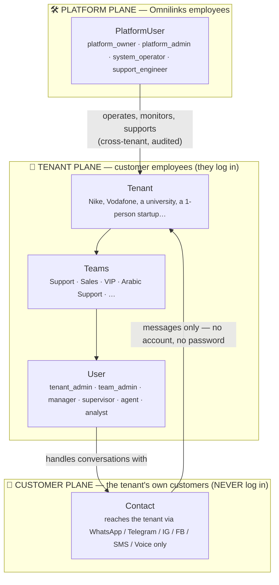
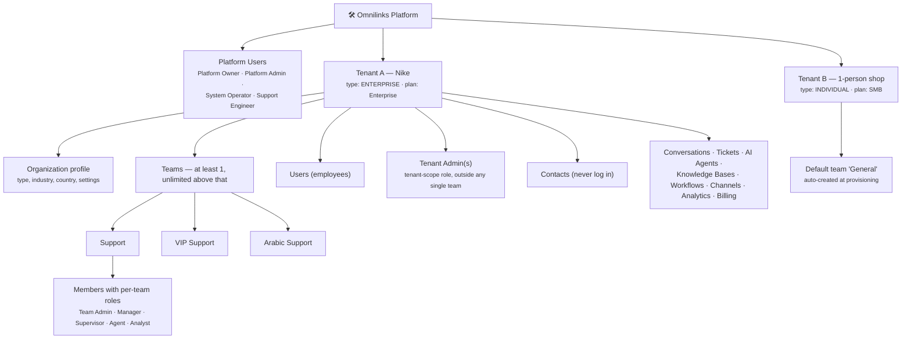
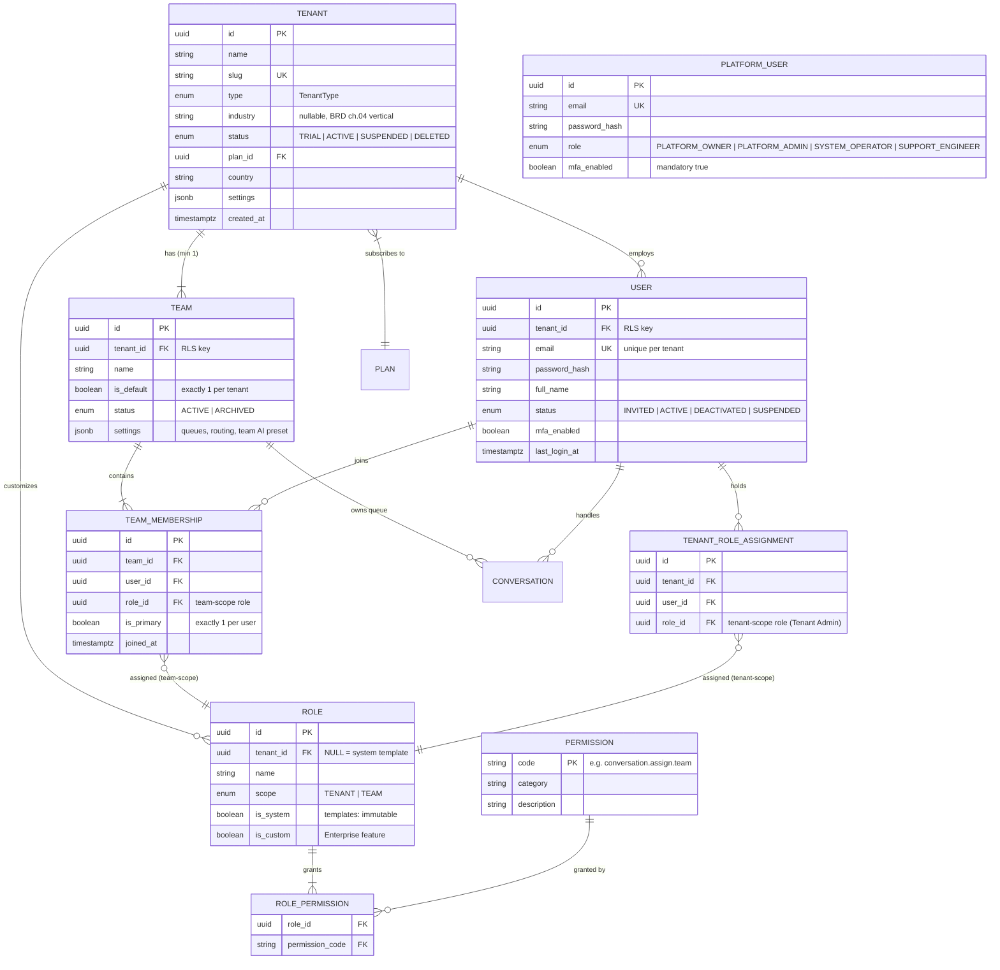
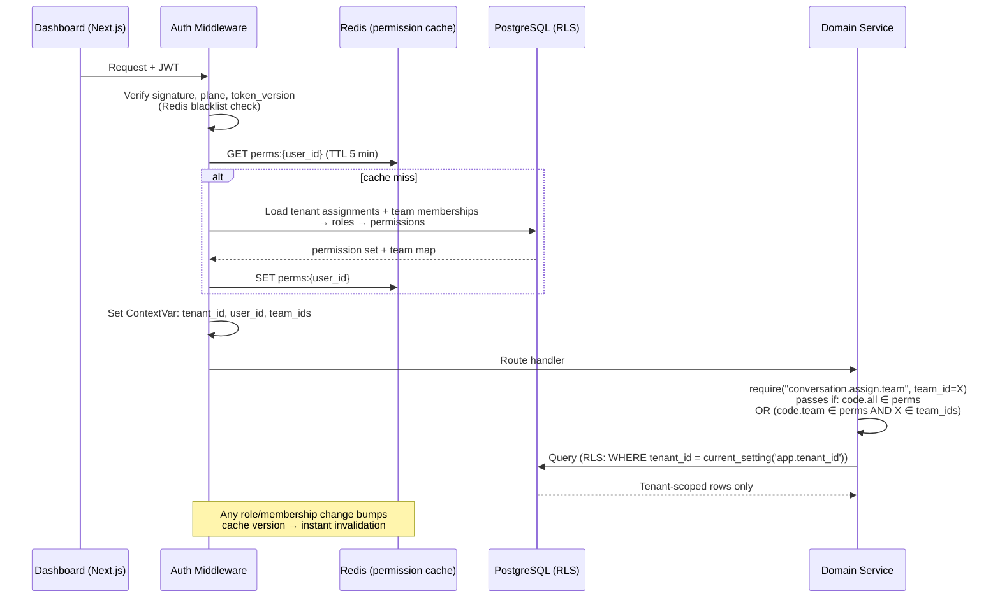

# SAD — Chapter 13: Tenancy, Teams & Access Control

**Document:** Software Architecture Document
**Section:** Tenancy, Teams & Access Control (RBAC)
**Version:** 0.1.0
**Last Updated:** 2026-07-17
**Status:** Draft — plugs into the SAD Document Map as chapter 13 (after 12-technology-decisions); feeds ch.06 (domain models) and ch.10 (security architecture)

---

## Purpose

Define the organizational and access-control architecture of Omnilinks: how tenants are structured, what a team is, who the actors are, and how permissions are modeled, enforced, and billed against. This chapter resolves three things that were previously scattered across the BRD, the Actor Map, and design discussions:

1. The **tenant → teams → users → roles** hierarchy (tenant ≠ team; a tenant has at least one team and may have hundreds).
2. The **tenant type** classification (`INDIVIDUAL` … `EDUCATION`) and what it actually controls — and, just as importantly, what it does *not* control.
3. A **permission-based RBAC** model with default role templates, replacing the BRD ch.07 placeholder line "RBAC (Admin/Agent/Viewer)" — see *Reconciliations* at the end.

---

## 1. The Three Planes

The single most important structural decision: there are **three completely different kinds of people**, living on three separate planes. They never share a table, a login flow, or a permission namespace.



| Plane | Entity | Authenticates? | Table | Notes |
|---|---|---|---|---|
| Platform | **PlatformUser** | ✅ Yes — separate admin console, mandatory MFA | `platform_users` | Omnilinks staff. Small fixed role set, **not** part of tenant RBAC |
| Tenant | **User** | ✅ Yes — tenant dashboard | `users` | Tenant employees. Access = union of role permissions (tenant-scope + per-team) |
| Customer | **Contact** | ❌ **Never** | `contacts` (conversations domain) | The tenant's end-customers. No credentials exist to leak or phish |

> **Terminology fix (resolves BRD ch.11 glossary open item):** the glossary already flags that "Customer" is used two ways. This chapter settles it: the paying organization is the **Tenant**, the tenant's end-user is a **Contact** (matching the existing `contacts` entity in the conversations domain), and "customer" without qualification should disappear from technical writing.

> **Why SYSTEM_OPERATOR is on the platform plane, not in a team:** this was decided in the Actor Map ("Platform employee (Omnilix) — multi-tenant infrastructure") and confirmed in design discussion. A System Operator touches infrastructure across *all* tenants (logs, restarts, queues). Putting that role inside a tenant team would either give a tenant employee cross-tenant power (unacceptable, ties to BRD ch.08 R-05) or create a fake "tenant-scoped system operator" that has nothing to operate. Nike employees are never System Operators.

---

## 2. Tenant Model & Tenant Types

### 2.1 The tenant type enum

```python
class TenantType(str, Enum):
    INDIVIDUAL       = "individual"        # one person, one team, solo workspace
    STARTUP          = "startup"           # small founding team
    SMALL_BUSINESS   = "small_business"
    MEDIUM_BUSINESS  = "medium_business"
    ENTERPRISE       = "enterprise"
    NONPROFIT        = "nonprofit"
    GOVERNMENT       = "government"
    EDUCATION        = "education"
```

### 2.2 Type ≠ Plan — two independent axes

Do **not** conflate tenant type with the subscription plan. They answer different questions:

| Axis | Question it answers | Examples | Controls |
|---|---|---|---|
| **TenantType** | *What kind of organization is this?* | `GOVERNMENT`, `NONPROFIT`, `STARTUP` | Provisioning defaults, team templates, compliance flags, discount eligibility, segmentation analytics |
| **Plan** (BRD ch.09) | *What are they paying for?* | Trial / SMB $65 / Mid-Market $500 / Enterprise $2,000+ | Hard limits: seats, channels, messages, AI Credits, KBs |

A nonprofit can be on the Mid-Market plan. A startup can buy Enterprise. Coupling type to plan would make both worse: billing would need 8 price ladders, and a type change (startup → small_business) would force a billing migration.

### 2.3 What each type implies

| TenantType | Suggested default plan | Default team template | Compliance / policy flags |
|---|---|---|---|
| `INDIVIDUAL` | Trial → SMB | 1 team ("General"), 1 user who is both TENANT_ADMIN and TEAM_ADMIN | Max 1 seat; upgrade path prompts conversion to `STARTUP`/`SMALL_BUSINESS` when inviting user #2 |
| `STARTUP` | SMB | "Support" | — |
| `SMALL_BUSINESS` | SMB | "Support", "Sales" | — |
| `MEDIUM_BUSINESS` | Mid-Market | "Support", "Sales", "Technical Support" | — |
| `ENTERPRISE` | Enterprise | "Support", "Sales", "VIP Support", "Technical Support" | SSO/SAML + audit logging + custom roles available (BRD ch.07 Enterprise tier, P1) |
| `NONPROFIT` | SMB / Mid-Market | "Support" | **Discount-eligibility flag** — BRD ch.09 has no discount policy yet (open item #4) |
| `GOVERNMENT` | Enterprise | "Support", "Citizen Services" | Mandatory immutable audit log; data-residency review per BRD ch.10; likely procurement/security questionnaire at onboarding |
| `EDUCATION` | SMB / Mid-Market | "Support", "Admissions" | Discount-eligibility flag; extra care defaults for minors' data (stricter PII redaction preset) |

> Type flags drive **defaults**, never hard restrictions (except `INDIVIDUAL`'s 1-seat rule). Templates are editable immediately after provisioning — a university is free to delete "Admissions" and create "Arabic Support".

> **Related but separate field:** BRD ch.04 segments tenants by *vertical* (SaaS, E-Commerce, Healthcare, BPO, Real Estate). That is an optional `tenants.industry` profile field used for analytics and onboarding presets — it coexists with `type` and is out of scope for this chapter beyond reserving the column.

---

## 3. Organizational Hierarchy



**Structural rules:**

| # | Rule | Enforcement |
|---|---|---|
| S1 | Every tenant has **at least one team** — a default team is created during provisioning and the last team can never be deleted | Service-layer invariant + DB guard |
| S2 | Every team has **at least one member holding `team.manage`** (default: Team Admin) — the last such member cannot be removed or demoted | Service-layer invariant |
| S3 | A user may belong to **many teams**, with a **different role in each** (Ahmed: Agent in Arabic Support, Supervisor in VIP Support) | `team_memberships` holds its own `role_id` |
| S4 | Not every role must exist in a team — a startup team can be 2 agents + 1 supervisor; flexible team shape is the default | No constraint beyond S2 |
| S5 | Tenant Admin is a **tenant-scope** role. It is not "a member of every team" — it simply holds tenant-wide permissions | `tenant_role_assignments`, not `team_memberships` |
| S6 | Platform users never appear in `users`, `teams`, or any tenant table — and tenant users never appear in `platform_users` | Separate tables, separate auth flows |
| S7 | Contacts have no credentials of any kind | No auth columns on `contacts` |

---

## 4. Domain Model



**Design notes on the model:**

- **`roles.tenant_id IS NULL` = system template.** Every tenant sees the same five built-in templates (Tenant Admin, Team Admin, Manager, Supervisor, Agent, Analyst). A row with `tenant_id` set and `is_custom = true` is a tenant-created custom role (Enterprise feature — see §8 Phasing).
- **Two assignment tables, deliberately.** `team_memberships` answers "what can this user do *in this team*?" and carries the per-membership role (rule S3). `tenant_role_assignments` answers "what can this user do *across the whole tenant*?" Effective permissions are the **union** of both — never an intersection, and platform scope never mixes in.
- **`team_memberships.is_primary`** gives the UI a home team for each user (default queue view, default analytics filter) without restricting membership.
- **`platform_users` is intentionally not RBAC.** Four fixed roles, a handful of accounts, one enum column. Building permission machinery there adds attack surface for zero flexibility gain. Platform actions are governed by audit logging and break-glass procedure instead (§7.4).
- **Contacts and conversations are out of scope here** — they live in the conversations domain; only the ownership edges (`team_id`, `assigned_user_id` on conversations) are shown because team-scoped visibility depends on them (§7.3).

---

## 5. Permission Catalog

Roles contain no logic — they are named bundles of permission codes. All authorization checks test **permissions**, never role names (`if user.can("conversation.assign.team")`, never `if user.role == "manager"`). This is what makes custom roles possible later without touching authorization code.

Scope suffixes: **`.team`** = only within teams the user belongs to · **`.all`** = across the whole tenant. Codes with no suffix are inherently tenant-wide or self-scoped.

### Tenant, billing & organization

| Code | Description |
|---|---|
| `tenant.view` | View tenant profile & settings |
| `tenant.manage` | Edit tenant profile, security settings, data-retention policy |
| `billing.view` | View subscription, usage meters, invoices |
| `billing.manage` | Change plan, payment method, purchase add-ons (Paymob tokenized charges, BRD ch.09) |
| `integration.view` / `integration.manage` | View / manage external integrations (CRM, ERP, webhooks) |
| `audit.view` | View the tenant audit log (who did what, when) |

### Teams

| Code | Description |
|---|---|
| `team.create` | Create new teams |
| `team.view.team` / `team.view.all` | View team structure & membership |
| `team.update.team` / `team.update.all` | Rename, configure, archive teams |
| `team.delete.team` / `team.delete.all` | Delete teams (blocked for default team & last-admin rule, §3) |
| `team.members.manage.team` / `team.members.manage.all` | Add / remove / move members, change their team roles |
| `team.settings.manage.team` / `team.settings.manage.all` | Queues, routing rules, schedules, team-level AI preset |

### Users & roles

| Code | Description |
|---|---|
| `user.view.team` / `user.view.all` | List users, view profiles & status |
| `user.invite` | Invite new users (consumes a seat, §9) |
| `user.update.team` / `user.update.all` | Edit profiles, activate / deactivate |
| `user.delete` | Permanently remove a user |
| `role.assign.team` / `role.assign.all` | Change role assignments |
| `role.manage` | Create / edit **custom roles** (Enterprise, §8) |

### Channels

| Code | Description |
|---|---|
| `channel.view` | View connected channels & health |
| `channel.configure` | Connect / disconnect / configure WhatsApp, Telegram, IG, FB, SMS, VoIP |

### Conversations & contacts

| Code | Description |
|---|---|
| `conversation.view.team` / `conversation.view.all` | Read conversations (team queue vs. everything) |
| `conversation.reply` | Send replies to contacts — **this is the billable-seat permission, §9** |
| `conversation.assign.team` / `conversation.assign.all` | Assign / reassign conversations |
| `conversation.transfer` | Transfer to another agent or team |
| `conversation.takeover` | Join or take over an active conversation (supervision) |
| `conversation.escalate` | Escalate to supervisor / higher tier |
| `conversation.close` | Close / resolve conversations |
| `conversation.note` | Internal notes (never visible to contacts) |
| `conversation.export` | Export conversation data |
| `contact.view.team` / `contact.view.all` | View contact profiles & history |
| `contact.manage` | Edit, tag, merge contacts |
| `contact.export` | Export contact data (PDPL-sensitive — logged) |

### AI, knowledge & automation

| Code | Description |
|---|---|
| `ai.reply.approve` | Review / approve / edit AI drafts in the 40–80% confidence queue (Actor Map) |
| `ai.configure.team` / `ai.configure.all` | AI personality, thresholds, model routing, guardrail presets |
| `ai.agent.manage` | Create / configure AI agents |
| `kb.view` | Search & read knowledge bases |
| `kb.manage.team` / `kb.manage.all` | Ingest, edit, retire KB content |
| `workflow.view` / `workflow.manage` | Automation rules — **V2 per BRD ch.07; permissions reserved now so templates don't change at V2** |

### Tickets & analytics

| Code | Description |
|---|---|
| `ticket.view.team` / `ticket.view.all` | View tickets |
| `ticket.create` / `ticket.update` | Create / update tickets |
| `analytics.view.team` / `analytics.view.all` | Dashboards: CSAT, FRT, resolution, AI & agent performance |
| `analytics.export` | Export reports / raw data |
| `analytics.financial.view` | Revenue, cost-per-conversation, AI-spend dashboards (restricted — agents never hold this) |

### Platform namespace (PlatformUsers only — never assignable to tenant roles)

| Code | Holder | Description |
|---|---|---|
| `platform.tenant.view` | Admin, System Operator, Support Engineer | List / inspect tenants |
| `platform.tenant.suspend` | Platform Admin | Suspend / reinstate tenants (abuse, non-payment) |
| `platform.infrastructure.manage` | System Operator | Services, queues, deployments, restarts |
| `platform.logs.view` | System Operator, Support Engineer | Cross-tenant infra logs (metadata, not message bodies) |
| `platform.support.access` | Support Engineer | **Break-glass** time-boxed access into a tenant workspace — every use logged and visible to the Tenant Admin (§7.4) |
| `platform.billing.manage` | Platform Admin | Plans, coupons, manual invoice adjustments |

---

## 6. Default Role Templates

Six system templates ship with every tenant. They are starting points, not laws — Enterprise tenants can clone and edit them into custom roles (§8). The matrix below is the authoritative grant list; ✅ = granted, — = denied.

### 6.1 Tenant Admin (scope: TENANT)

Owns the tenant account itself. **Holds every tenant-scope permission** including `tenant.manage`, `billing.manage`, all `.all` variants, `channel.configure`, `integration.manage`, `role.assign.all`, `user.delete`, `audit.view`. Explicitly does **not** hold any `platform.*` permission. Every tenant must have at least one Tenant Admin at all times (the last one cannot be demoted or deactivated — same family of invariant as rule S2).

### 6.2 Team-scope templates

| Permission | Team Admin | Manager | Supervisor | Agent | Analyst |
|---|:-:|:-:|:-:|:-:|:-:|
| **Team structure** ||||||
| `team.create` | ✅ | ✅ | — | — | — |
| `team.update.team` | ✅ | — | — | — | — |
| `team.delete.team` | ✅ | — | — | — | — |
| `team.settings.manage.team` (queues, routing, schedules) | ✅ | ✅ | — | — | — |
| **People** ||||||
| `user.invite` | ✅ | ✅ | — | — | — |
| `user.view.team` | ✅ | ✅ | ✅ | ✅ | — |
| `user.update.team` (activate / deactivate) | — | ✅ | — | — | — |
| `team.members.manage.team` (add/remove/move members) | ✅ | ✅ | — | — | — |
| `role.assign.team` | ✅ | ✅ | — | — | — |
| **Live operations** ||||||
| `conversation.view.team` | ✅ | ✅ | ✅ | ✅ (assigned queue) | ✅ (read-only) |
| `conversation.reply` | ✅ | ✅ | ✅ | ✅ | — |
| `conversation.assign.team` | ✅ | ✅ | ✅ | — | — |
| `conversation.transfer` | ✅ | ✅ | ✅ | ✅ | — |
| `conversation.takeover` (join / take over live chat) | ✅ | — | ✅ | — | — |
| `conversation.escalate` | ✅ | ✅ | ✅ | ✅ | — |
| `conversation.close` | ✅ | ✅ | ✅ | ✅ | — |
| `conversation.note` | ✅ | ✅ | ✅ | ✅ | — |
| `ai.reply.approve` (AI draft review queue) | ✅ | ✅ | ✅ | — | — |
| **Contacts & tickets** ||||||
| `contact.view.team` | ✅ | ✅ | ✅ | ✅ | ✅ |
| `contact.manage` | ✅ | ✅ | — | ✅ | — |
| `ticket.view.team` / `ticket.create` / `ticket.update` | ✅ | ✅ | ✅ | ✅ | view only |
| **AI & knowledge** ||||||
| `ai.configure.team` | ✅ | — | — | — | — |
| `ai.agent.manage` | ✅ | — | — | — | — |
| `kb.view` | ✅ | ✅ | ✅ | ✅ | ✅ |
| `kb.manage.team` | ✅ | — | — | — | — |
| `workflow.view` / `workflow.manage` (V2) | ✅ | ✅ (manage) | view | — | view |
| **Analytics** ||||||
| `analytics.view.team` | ✅ | ✅ | ✅ (ops dashboards) | ✅ (own stats) | ✅ |
| `analytics.view.all` | — | — | — | — | ✅ |
| `analytics.export` | ✅ | ✅ | — | — | ✅ |
| `analytics.financial.view` | — | — | — | — | — |
| **Explicitly never granted to any team-scope role** ||||||
| `tenant.manage`, `billing.*`, `integration.manage`, `user.delete`, `audit.view`, `*.all` people-management codes, all `platform.*` | — | — | — | — | — |

### 6.3 Why Team Admin and Manager are not the same role

The earlier design discussion flagged the overlap risk directly ("if both can create users, teams, and permissions — what's the difference?"). The resolution kept in this matrix:

- **Team Admin owns the team's *configuration*** — the team itself, its roles, its AI setup, its knowledge bases, its settings. "What does this team *look like*?"
- **Manager owns the team's *people and daily operation*** — inviting users, activating/deactivating, moving members, assigning work, schedules, queues. "What is this team *doing today*?"
- The hard line in the matrix: **structure/config → Team Admin; people-state → Manager** (`user.update.team` and `team.members.manage.team` sit with Manager; `team.update/delete`, `ai.configure`, `kb.manage` sit with Team Admin). Both can create teams and invite users, because in practice both legitimately need to — but because roles are permission bundles, a tenant that disagrees can simply edit the templates instead of filing a feature request.

### 6.4 Analyst — alongside the hierarchy, not inside it

The Analyst holds `analytics.view.all` + read access to conversations/contacts and **no write permissions on anything operational**. This matches the design intent (the person responsible for understanding tenant support data and AI effectiveness) and makes the template safe to hand to contractors and external BI consultants — the most common real-world use of an analytics-only seat.

### 6.5 Example team shapes (rule S4 — flexible by default)

| Tenant type | Plausible team shape |
|---|---|
| `INDIVIDUAL` | 1 user = Tenant Admin + Team Admin + Agent, all in the default team |
| `STARTUP` | "Support": 1 Team Admin (founder), 2 Agents, 1 Supervisor |
| `MEDIUM_BUSINESS` | "Support" (Sup + 8 Agents), "Sales" (Manager + 4 Agents), shared Analyst |
| `ENTERPRISE` | Dozens of teams incl. "VIP Support", "Arabic Support", "English Support"; Team Admins per team, Managers across regions, Analysts tenant-wide |
| `GOVERNMENT` | Teams per department; Tenant Admins limited to IT security office; mandatory `audit.view` usage |

---

## 7. Authentication & Authorization Flow

### 7.1 Token strategy

JWTs stay small — permissions are **resolved at request time**, not baked into the token (a tenant admin editing a role must take effect immediately, and the full permission set would not fit a header anyway).

```json
{
  "sub": "user_uuid",
  "plane": "tenant",
  "tenant_id": "tenant_uuid",
  "token_version": 3,
  "exp": 1752834000
}
```

`plane: "tenant" | "platform"` is the hard switch: a tenant token can never reach platform endpoints and vice versa — separate issuers, separate secrets, separate middleware stacks.

### 7.2 Request-time permission resolution



```python
# core/dependencies.py — sketch
def require(permission: str, team_id: UUID | None = None):
    """
    'conversation.assign.all'  -> anywhere in the tenant
    'conversation.assign.team' -> only if team_id ∈ caller's team map
    """
    def checker(ctx: RequestContext = Depends(get_request_context)):
        if permission in ctx.permissions:                 # exact or .all form
            return ctx
        base, _, scope = permission.rpartition(".")
        if scope == "team" and f"{base}.all" in ctx.permissions:
            return ctx
        if scope == "team" and permission in ctx.permissions \
           and team_id is not None and team_id in ctx.team_ids_for(base):
            return ctx
        raise HTTPException(403, "Insufficient permissions")
    return checker
```

### 7.3 Team-scoped data visibility

`.team` permissions are enforced in the repository layer, on top of RLS (defense in depth — RLS remains the ch.08 R-05 mitigation; team scoping is an additional application-layer filter):

```sql
-- Supervisor with conversation.view.team sees:
SELECT * FROM conversations
WHERE tenant_id = current_setting('app.tenant_id')          -- RLS policy (DB-enforced)
  AND (team_id = ANY(:member_team_ids)                       -- app-layer team filter
       OR assigned_user_id = :user_id);
```

Conversations carry both `team_id` (owning queue) and `assigned_user_id`, so routing rules assign incoming conversations to a team queue first, then to an agent inside it — matching the Actor Map escalation flow (AI → draft queue → human agent).

### 7.4 Platform access to tenant data (break-glass)

`platform.support.access` is the only path for Omnilinks staff into a tenant workspace, and it is deliberately heavy: time-boxed grant, reason code required, every action written to an **immutable audit stream the Tenant Admin can see** (`audit.view`), and message bodies stay encrypted unless the tenant explicitly grants content access. This is the operational answer to the PDPL confidentiality duties in BRD ch.10 and keeps System Operator infrastructure work (metadata, logs, queues) cleanly separated from tenant content.

---

## 8. Provisioning & Phasing

### 8.1 Tenant provisioning flow

```mermaid
flowchart LR
    S1["Signup<br/><small>email + company name</small>"] --> S2["Create Tenant<br/><small>type selected, status=TRIAL</small>"]
    S2 --> S3["Create default team 'General'<br/><small>is_default=true</small>"]
    S3 --> S4["Create first User<br/><small>status=INVITED</small>"]
    S4 --> S5["Assign TENANT Admin role<br/>+ Team Admin membership<br/>in default team"]
    S5 --> S6["Apply plan limits<br/><small>Trial = full SMB allocation, 14 days — BRD ch.09</small>"]
    S6 --> S7["Apply type-based defaults<br/><small>team template, compliance flags — §2.3</small>"]
    S7 --> S8["Onboarding: invite users,<br/>connect first channel"]
```



### 8.2 Phasing (reconciled with BRD ch.07 priorities)

| Phase | Ships | Notes |
|---|---|---|
| **MVP (P0)** | Full model in §4–§6 **with the 6 fixed system templates**; custom roles disabled (`role.manage` reserved) | Replaces BRD ch.07's placeholder "RBAC (Admin/Agent/Viewer)" — see §10 |
| **Enterprise tier (P1)** | `role.manage` + custom roles, SSO/SAML hooking into role assignment, `audit.view` UI | Bundles naturally with ch.07's Enterprise features line (SSO, audit logging, custom SLA tooling) |

Building custom roles later costs nothing extra — the authorization code already checks permissions only; a custom role is just new rows in `roles` + `role_permissions`.

---

## 9. Billing Tie-In: What a "Seat" Is

BRD ch.09 caps plans by "Agents" (SMB 5 / Mid-Market 25 / Enterprise unlimited) without defining the term. Definition: **a billable seat = an active user holding the `conversation.reply` permission in any team.** Analysts and view-only users don't consume agent seats; a supervisor who replies does. This makes seat counting derivable from the permission system (one query over role assignments) instead of a parallel bookkeeping system, and it maps exactly to the value metric — people who talk to contacts.

> Open item #3: whether Analyst-only seats are free or priced needs a ch.09 decision; the model supports either.

---

## 10. Reconciliations & Open Items

**Reconciliations (decisions recorded here that change existing documents):**

1. **BRD ch.07** listed in-scope RBAC as "Admin/Agent/Viewer roles (P0)". This chapter supersedes that placeholder with the six-template permission model above. ch.07's line item should be updated; the P0 priority stands.
2. **BRD ch.11 glossary** "Customer" ambiguity — resolved as Tenant / Contact / User (§1).
3. **Actor Map** — "Team Admin … full team control" is refined: full *team* control is split between Team Admin (configuration) and Manager (people/operations), with Tenant Admin above both (§6.3).
4. **SYSTEM_OPERATOR** confirmed as platform-plane, never a team role (§1) — the enum value exists only in `platform_users.role`.

**Open items carried forward:**

1. `NONPROFIT` / `EDUCATION` discount policy does not exist in BRD ch.09 — the type flags are ready; the pricing decision is not.
2. Analyst/view-only seat pricing (free vs. reduced rate) — ch.09 decision, model supports both.
3. `GOVERNMENT` tenants: confirm whether data-residency (BRD ch.10 target architecture) implies a separate deployment ring, which would also affect how PlatformUsers reach those tenants.
4. Should `role.assign.team` allow promoting someone to Team Admin, or should that remain Tenant Admin-only? Currently allowed for Team Admin — flagging as a privilege-escalation review point for ch.10 (security architecture).
5. Max teams per tenant: unlimited per design discussion, but a soft cap per plan (like KBs in ch.09) may be worth adding for abuse control.

---

## Version History

| Version | Date | Author | Changes |
|---------|------|--------|---------|
| 0.1.0 | 2026-07-17 | Architecture | Initial draft: three-plane model, 8 tenant types with type≠plan separation, team invariants (S1–S7), permission catalog (~60 codes), six default role templates, request-time permission resolution, break-glass platform access, provisioning flow, MVP/Enterprise phasing |

---

## Appendix A — SQLAlchemy 2.0 Model Sketch

```python
# domains/tenants/models.py — sketch, typed 2.0 style
class Tenant(Base):
    __tablename__ = "tenants"
    id: Mapped[UUID] = mapped_column(primary_key=True, default=uuid4)
    name: Mapped[str]
    slug: Mapped[str] = mapped_column(unique=True)
    type: Mapped[TenantType]                          # §2.1 enum
    industry: Mapped[str | None]                      # BRD ch.04 vertical, optional
    status: Mapped[TenantStatus] = mapped_column(default=TenantStatus.TRIAL)
    plan_id: Mapped[UUID] = mapped_column(ForeignKey("plans.id"))
    country: Mapped[str | None]
    settings: Mapped[dict] = mapped_column(JSONB, default=dict)
    created_at: Mapped[datetime] = mapped_column(default=utcnow)

    teams: Mapped[list["Team"]] = relationship(back_populates="tenant")
    users: Mapped[list["User"]] = relationship(back_populates="tenant")

class Team(Base):
    __tablename__ = "teams"
    id: Mapped[UUID] = mapped_column(primary_key=True, default=uuid4)
    tenant_id: Mapped[UUID] = mapped_column(ForeignKey("tenants.id"), index=True)  # RLS key
    name: Mapped[str]
    is_default: Mapped[bool] = mapped_column(default=False)   # exactly 1 per tenant (rule S1)
    status: Mapped[TeamStatus] = mapped_column(default=TeamStatus.ACTIVE)
    settings: Mapped[dict] = mapped_column(JSONB, default=dict)
    members: Mapped[list["TeamMembership"]] = relationship(back_populates="team")
    __table_args__ = (UniqueConstraint("tenant_id", "name"),)

class User(Base):
    __tablename__ = "users"
    id: Mapped[UUID] = mapped_column(primary_key=True, default=uuid4)
    tenant_id: Mapped[UUID] = mapped_column(ForeignKey("tenants.id"), index=True)  # RLS key
    email: Mapped[str]
    password_hash: Mapped[str]
    full_name: Mapped[str]
    status: Mapped[UserStatus] = mapped_column(default=UserStatus.INVITED)
    mfa_enabled: Mapped[bool] = mapped_column(default=False)
    memberships: Mapped[list["TeamMembership"]] = relationship(back_populates="user")
    tenant_roles: Mapped[list["TenantRoleAssignment"]] = relationship(back_populates="user")
    __table_args__ = (UniqueConstraint("tenant_id", "email"),)

class TeamMembership(Base):
    __tablename__ = "team_memberships"
    id: Mapped[UUID] = mapped_column(primary_key=True, default=uuid4)
    team_id: Mapped[UUID] = mapped_column(ForeignKey("teams.id"))
    user_id: Mapped[UUID] = mapped_column(ForeignKey("users.id"))
    role_id: Mapped[UUID] = mapped_column(ForeignKey("roles.id"))   # team-scope role (rule S3)
    is_primary: Mapped[bool] = mapped_column(default=False)
    joined_at: Mapped[datetime] = mapped_column(default=utcnow)
    __table_args__ = (UniqueConstraint("team_id", "user_id"),)

class Role(Base):
    __tablename__ = "roles"
    id: Mapped[UUID] = mapped_column(primary_key=True, default=uuid4)
    tenant_id: Mapped[UUID | None] = mapped_column(ForeignKey("tenants.id"))  # NULL = system template
    name: Mapped[str]
    scope: Mapped[RoleScope]                          # TENANT | TEAM
    is_system: Mapped[bool] = mapped_column(default=False)   # templates: immutable
    is_custom: Mapped[bool] = mapped_column(default=False)   # Enterprise (§8)
    permissions: Mapped[list["Permission"]] = relationship(secondary="role_permissions")
```

Platform users live in a separate module (`platform/` package, not `domains/tenants/`) with their own auth stack — deliberately not sharing the tenant session, blacklist, or permission cache.

## Appendix B — API Surface Sketch

Mounted under the existing `tenants/` and a new `teams/` + `access/` domain group (10 existing domains unchanged; this splits `tenants/` cleanly rather than adding an 11th monolith):

| Method & path | Permission | Purpose |
|---|---|---|
| `GET/PATCH /tenants/current` | `tenant.view` / `tenant.manage` | Tenant profile, type, settings |
| `GET /tenants/current/usage` | `billing.view` | Seats/messages/credits vs. plan |
| `GET/POST /teams` | `team.view.*` / `team.create` | List / create teams |
| `GET/PATCH/DELETE /teams/{id}` | `team.view.*` / `team.update.*` / `team.delete.*` | Team detail & lifecycle (S1/S2 guards) |
| `GET/POST /teams/{id}/members` | `team.members.manage.*` | Membership list, add member with role |
| `PATCH/DELETE /teams/{id}/members/{user_id}` | `team.members.manage.*` | Change member role / remove (S2 guard) |
| `GET/POST /users/invites` | `user.invite` | Invite flow (seat check, §9) |
| `PATCH /users/{id}` | `user.update.*` | Activate / deactivate / profile |
| `GET /roles` | any authenticated user | Templates + tenant's custom roles |
| `POST/PATCH /roles/custom` | `role.manage` (Enterprise) | Custom roles (§8) |
| `GET /permissions` | any authenticated user | Permission catalog (drives the role-editor UI) |
| `GET /audit` | `audit.view` | Tenant audit log incl. break-glass entries (§7.4) |

All responses are tenant-scoped by RLS; `.team` permissions additionally filter by the caller's team map (§7.3). Every mutating endpoint writes an audit entry.
