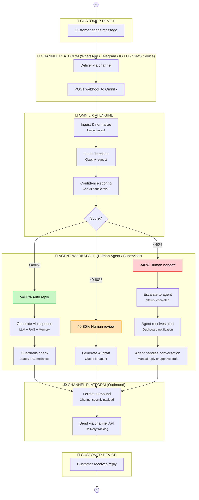

| Actor               | Type                        | Logs In? | Interacts With                                |
| ------------------- | --------------------------- | -------- | --------------------------------------------- |
| **Tenant Customer** | External end-user           | ❌ No     | WhatsApp, Telegram, IG, FB, SMS, Voice only   |
| **Team Admin**      | Tenant employee             | ✅ Yes    | Dashboard — full team control                 |
| **Manager**         | Tenant employee             | ✅ Yes    | Dashboard — operations + user management      |
| **Supervisor**      | Tenant employee             | ✅ Yes    | Dashboard — live operations monitoring        |
| **Human Agent**     | Tenant employee             | ✅ Yes    | Dashboard — handles conversations AI couldn't |
| **Analyst**         | Tenant employee             | ✅ Yes    | Dashboard — reads data, builds reports        |
| **System Operator** | Platform employee (Omnilix) | ✅ Yes    | Platform admin — multi-tenant infrastructure  |

