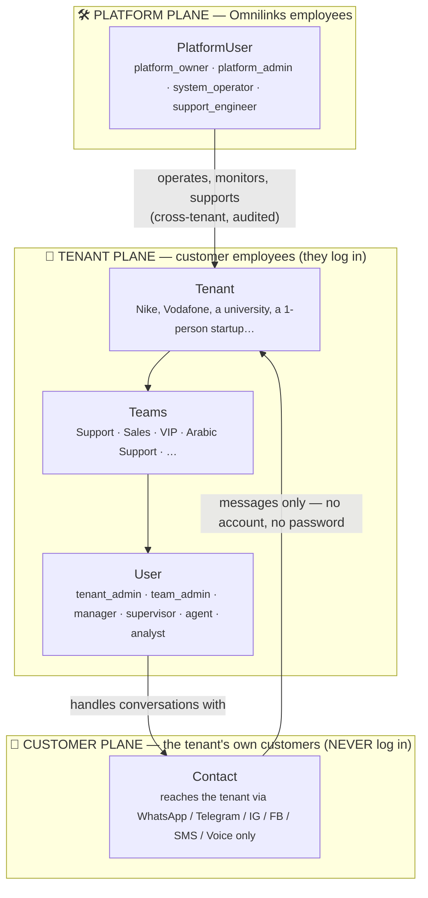
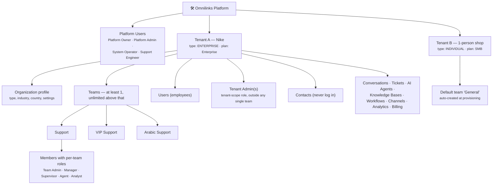

# OMILINKS
this is a redesigen of my project and fix the bugs that i wase make year and hluf ago with NXG teem in MedixAi acunt

# SAD — Chapter 13: Tenancy, Teams & Access Control

**Document:** Software Architecture Document
**Section:** Tenancy, Teams & Access Control (RBAC)
**Version:** 0.1.0
**Last Updated:** 2026-07-17
**Status:** Draft — plugs into the SAD Document Map as chapter 13 (after 12-technology-decisions); feeds ch.06 (domain models) and ch.10 (security architecture)

---

## Purpose

Define the organizational and access-control architecture of Omnilinks: how tenants are structured, what a team is, who the actors are, and how permissions are modeled, enforced, and billed against. This chapter resolves three things that were previously scattered across the BRD, the Actor Map, and design discussions:

1. The **tenant → teams → users → roles** hierarchy (tenant ≠ team; a tenant has at least one team and may have hundreds).
2. The **tenant type** classification (`INDIVIDUAL` … `EDUCATION`) and what it actually controls — and, just as importantly, what it does *not* control.
3. A **permission-based RBAC** model with default role templates, replacing the BRD ch.07 placeholder line "RBAC (Admin/Agent/Viewer)" — see *Reconciliations* at the end.

---

## 1. The Three Planes

The single most important structural decision: there are **three completely different kinds of people**, living on three separate planes. They never share a table, a login flow, or a permission namespace.



| Plane | Entity | Authenticates? | Table | Notes |
|---|---|---|---|---|
| Platform | **PlatformUser** | ✅ Yes — separate admin console, mandatory MFA | `platform_users` | Omnilinks staff. Small fixed role set, **not** part of tenant RBAC |
| Tenant | **User** | ✅ Yes — tenant dashboard | `users` | Tenant employees. Access = union of role permissions (tenant-scope + per-team) |
| Customer | **Contact** | ❌ **Never** | `contacts` (conversations domain) | The tenant's end-customers. No credentials exist to leak or phish |

> **Terminology fix (resolves BRD ch.11 glossary open item):** the glossary already flags that "Customer" is used two ways. This chapter settles it: the paying organization is the **Tenant**, the tenant's end-user is a **Contact** (matching the existing `contacts` entity in the conversations domain), and "customer" without qualification should disappear from technical writing.

> **Why SYSTEM_OPERATOR is on the platform plane, not in a team:** this was decided in the Actor Map ("Platform employee (Omnilix) — multi-tenant infrastructure") and confirmed in design discussion. A System Operator touches infrastructure across *all* tenants (logs, restarts, queues). Putting that role inside a tenant team would either give a tenant employee cross-tenant power (unacceptable, ties to BRD ch.08 R-05) or create a fake "tenant-scoped system operator" that has nothing to operate. Nike employees are never System Operators.

---

## 2. Tenant Model & Tenant Types

### 2.1 The tenant type enum

```python
class TenantType(str, Enum):
    INDIVIDUAL       = "individual"        # one person, one team, solo workspace
    STARTUP          = "startup"           # small founding team
    SMALL_BUSINESS   = "small_business"
    MEDIUM_BUSINESS  = "medium_business"
    ENTERPRISE       = "enterprise"
    NONPROFIT        = "nonprofit"
    GOVERNMENT       = "government"
    EDUCATION        = "education"
```

### 2.2 Type ≠ Plan — two independent axes

Do **not** conflate tenant type with the subscription plan. They answer different questions:

| Axis | Question it answers | Examples | Controls |
|---|---|---|---|
| **TenantType** | *What kind of organization is this?* | `GOVERNMENT`, `NONPROFIT`, `STARTUP` | Provisioning defaults, team templates, compliance flags, discount eligibility, segmentation analytics |
| **Plan** (BRD ch.09) | *What are they paying for?* | Trial / SMB $65 / Mid-Market $500 / Enterprise $2,000+ | Hard limits: seats, channels, messages, AI Credits, KBs |

A nonprofit can be on the Mid-Market plan. A startup can buy Enterprise. Coupling type to plan would make both worse: billing would need 8 price ladders, and a type change (startup → small_business) would force a billing migration.

### 2.3 What each type implies

| TenantType | Suggested default plan | Default team template | Compliance / policy flags |
|---|---|---|---|
| `INDIVIDUAL` | Trial → SMB | 1 team ("General"), 1 user who is both TENANT_ADMIN and TEAM_ADMIN | Max 1 seat; upgrade path prompts conversion to `STARTUP`/`SMALL_BUSINESS` when inviting user #2 |
| `STARTUP` | SMB | "Support" | — |
| `SMALL_BUSINESS` | SMB | "Support", "Sales" | — |
| `MEDIUM_BUSINESS` | Mid-Market | "Support", "Sales", "Technical Support" | — |
| `ENTERPRISE` | Enterprise | "Support", "Sales", "VIP Support", "Technical Support" | SSO/SAML + audit logging + custom roles available (BRD ch.07 Enterprise tier, P1) |
| `NONPROFIT` | SMB / Mid-Market | "Support" | **Discount-eligibility flag** — BRD ch.09 has no discount policy yet (open item #4) |
| `GOVERNMENT` | Enterprise | "Support", "Citizen Services" | Mandatory immutable audit log; data-residency review per BRD ch.10; likely procurement/security questionnaire at onboarding |
| `EDUCATION` | SMB / Mid-Market | "Support", "Admissions" | Discount-eligibility flag; extra care defaults for minors' data (stricter PII redaction preset) |

> Type flags drive **defaults**, never hard restrictions (except `INDIVIDUAL`'s 1-seat rule). Templates are editable immediately after provisioning — a university is free to delete "Admissions" and create "Arabic Support".

> **Related but separate field:** BRD ch.04 segments tenants by *vertical* (SaaS, E-Commerce, Healthcare, BPO, Real Estate). That is an optional `tenants.industry` profile field used for analytics and onboarding presets — it coexists with `type` and is out of scope for this chapter beyond reserving the column.

---

## 3. Organizational Hierarchy



**Structural rules:**

| # | Rule | Enforcement |
|---|---|---|
| S1 | Every tenant has **at least one team** — a default team is created during provisioning and the last team can never be deleted | Service-layer invariant + DB guard |
| S2 | Every team has **at least one member holding `team.manage`** (default: Team Admin) — the last such member cannot be removed or demoted | Service-layer invariant |
| S3 | A user may belong to **many teams**, with a **different role in each** (Ahmed: Agent in Arabic Support, Supervisor in VIP Support) | `team_memberships` holds its own `role_id` |
| S4 | Not every role must exist in a team — a startup team can be 2 agents + 1 supervisor; flexible team shape is the default | No constraint beyond S2 |
| S5 | Tenant Admin is a **tenant-scope** role. It is not "a member of every team" — it simply holds tenant-wide permissions | `tenant_role_assignments`, not `team_memberships` |
| S6 | Platform users never appear in `users`, `teams`, or any tenant table — and tenant users never appear in `platform_users` | Separate tables, separate auth flows |
| S7 | Contacts have no credentials of any kind | No auth columns on `contacts` |

---
