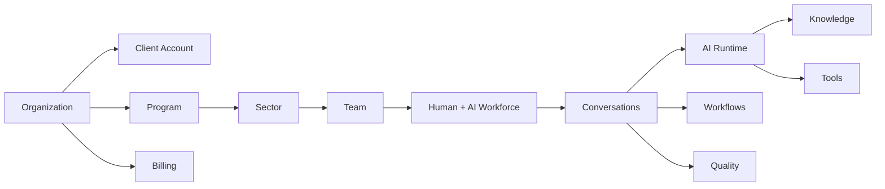

# OMNILINKS

OmniLinks is a multi-tenant Customer Operations Platform for direct businesses and BPO/service providers.

It combines customer conversations, human workforce, AI workforce, channels, knowledge/RAG, authorized business actions, workflows, quality, analytics, billing, and integrations.

## Architecture

OmniLinks starts as a **modular monolith with explicit domain boundaries**.


```mermaid
flowchart LR
  ORG[Organization] --> CA[Client Account]
  ORG --> P[Program]
  P --> S[Sector]
  S --> T[Team]
  T --> W[Human + AI Workforce]
  W --> C[Conversations]
  C --> AI[AI Runtime]
  AI --> K[Knowledge]
  AI --> TOOLS[Tools]
  C --> WF[Workflows]
  C --> Q[Quality]
  ORG --> BILL[Billing]
```

PostgreSQL is the transactional source of truth. Supporting infrastructure may include Redis, queues/event streams, object storage, and vector/search infrastructure.

Tenant isolation is enforced by server-side authorization and tenant-scoped data access, with PostgreSQL RLS available as defense in depth.

## Repository

```text
OMILINKS/
├── apps/
│   ├── web/
│   └── widget/
├── packages/
│   ├── backend/
│   ├── ui/
│   ├── math/
│   ├── eslint-config/
│   └── typescript-config/
├── docs/
├── package.json
├── pnpm-workspace.yaml
└── turbo.json
```

The codebase is implemented as vertical phases. Phase 0-2 establish the tenant and conversation/AI core; Phase 3 provides the Web Widget channel boundary with durable inbound-event deduplication; Phase 4 provides deterministic workforce routing, queues, capacity, presence, and assignment safety; Phase 5 provides a PostgreSQL-backed durable event and worker runtime with retries, leases, dead-letter replay, and queue routing; Phase 6 provides the AI control plane, model registry/failover, guardrails, durable AI traceability, cost attribution, and evaluation; Phase 7 provides the durable workflow engine (versioned definitions, idempotent triggers, WAIT/APPROVAL states, bounded retries; kernel steps only); Phase 8 provides the quality kernel (versioned scorecards, deterministic sampling, evidence-linked human review, AI-proposal fencing, remediations); the operator inbox in `apps/web` provides the authenticated console (inbox list, conversation detail, handoff visibility, idempotent human reply). Later domains remain target architecture until their implementation and tests land.

## Documentation

1. `docs/README.md`
2. `docs/requirements/functional-requirements.md`
3. `docs/requirements/acceptance-criteria.md`
4. `docs/architecture/HLD.md`
5. Relevant `docs/domain/*`
6. `docs/api/*` and `docs/events/*`
7. `docs/security/*`, `docs/ai/*`, `docs/data/*`
8. `docs/product/*` and `docs/engineering/*`

## Engineering Rules

- Routes/controllers stay thin.
- Domain modules own business rules.
- Provider SDKs stay behind adapters.
- Frontend state is never an authorization source.
- PostgreSQL owns transactional truth.
- Events are at-least-once and consumers are idempotent.
- Tenant scope is established before resource access.
- AI can only perform explicitly authorized actions.
- Payment state is verified server-side.
- A feature is not complete without tests, observability, documented contracts, and failure handling.

## Product Direction

The platform serves both companies operating their own customer operations and BPO/service organizations operating multiple client accounts, programs, sectors, teams, and workforce pools.

Automation providers such as n8n are integrations, not the source of truth for customer, conversation, authorization, or billing state.

## Local Development

```bash
pnpm install
docker compose up -d                                  # PostgreSQL
pnpm --filter @workspace/backend db:migrate           # apply migrations
pnpm --filter @workspace/backend db:seed              # idempotent demo tenant
pnpm dev
pnpm lint
pnpm typecheck
pnpm build
```

Reset the database with `docker compose down -v` followed by migrate + seed.
See `.env.example` for `DATABASE_URL`, `TEST_DATABASE_URL`, and ports.
