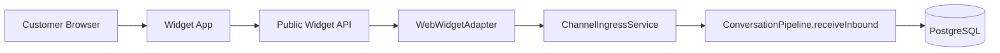

# OmniLinks Web Widget

The widget is the first active Phase 3 channel.

## Runtime model



The browser needs only a publishable widget key. The organization id is never accepted from the browser.

## Environment

Copy `.env.example` and set:

```text
NEXT_PUBLIC_OMNILINKS_API_URL=http://localhost:3000
NEXT_PUBLIC_OMNILINKS_WIDGET_KEY=wk_...
```

The key is created through the authenticated backend endpoint:

```http
POST /api/v1/channels
```

with:

```json
{
  "provider": "widget",
  "providerAccountId": "your-site",
  "displayName": "Website support",
  "allowedOrigins": ["http://localhost:3001"]
}
```

## What the widget currently does

It creates or resumes a customer conversation and sends a canonical inbound message to OmniLinks.

The HTTP response means:

```text
accepted = durably accepted by the channel ingress + conversation core
```

It does not mean that an AI answer or human reply has completed. Async workers and outbound delivery belong to later phases.
