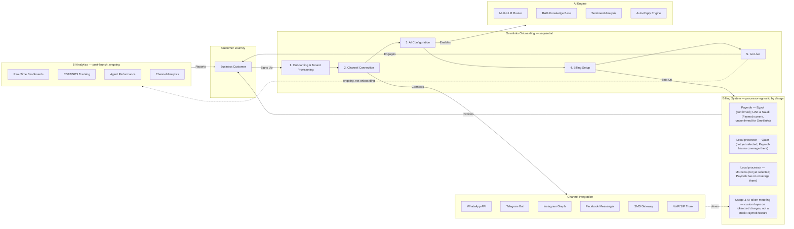

# 01 — Executive Summary

**Chapter:** 01 of 11
**Purpose:** Provide a high-level overview of the Omnilinks business case, vision, and expected outcomes.

---

## Vision Statement

> **Omnilinks** empowers businesses of all sizes to deliver seamless, intelligent, and personalized customer experiences across every communication channel — from a single unified inbox powered by AI.

---

## The Opportunity

Customer engagement is fragmented. Businesses manage WhatsApp, Telegram, Instagram, Facebook Messenger, SMS, and VoIP calls across separate tools, leading to:

- **4+ hours/day** lost switching between platforms
- **35%+** of messages going unanswered or delayed beyond SLA
- **No unified analytics** to measure customer satisfaction
- **High churn** due to slow, inconsistent responses

> **Note (unresolved):** the four figures above are not yet sourced. Before this chapter is circulated to stakeholders, attach a named source (e.g., a CX-industry report) or your own primary research, or relabel them explicitly as internal hypotheses to validate rather than established facts.

Omnilinks solves this by providing a **multi-tenant SaaS backend** that unifies all channels into one AI-powered inbox with intelligent routing, multi-LLM AI replies, RAG knowledge bases, usage-based billing, and business intelligence analytics.

---

## Business Flow Diagram

> **Open items carried forward:**
> - Confirm Omnilinks will actually use Paymob's hosted checkout / tokenization mode (not a custom card form) — this is what keeps PCI-DSS scope at SAQ-A rather than a full compliance program.
> - Confirm whether Paymob's existing UAE/Saudi coverage will be used as-is at expansion, or a different processor is preferred there too.
> - Select a processor for Qatar and for Morocco before those markets can go live — Paymob does not operate in either.
> - Usage-based billing (overages, AI-token consumption) is a custom build on top of Paymob's tokenized merchant-initiated charges, not an out-of-the-box subscription feature — scope this explicitly in chapter 09 and the SAD.
> - The SAD must treat "payment processor" as a pluggable interface, not a hardcoded Paymob integration, given the stated per-market processor strategy.

---

## Strategic Context

Omnilinks operates in the customer engagement software space. Market-size estimates vary considerably depending on how the category is scoped: Mordor Intelligence puts the broader **customer engagement solutions** market at roughly **$28 billion in 2026**, growing toward $46 billion by 2031, while narrower estimates for the **omnichannel platforms software** segment specifically are closer to **$4–10 billion** over the same period. By combining omnichannel aggregation, multi-LLM AI capabilities, and localized payment support, the platform is positioned to serve both global SaaS buyers and the digitizing MENA region — starting with Egypt.

> **Note (unresolved):** pick one figure and one named source for the pitch deck / investor-facing materials — a range this wide (4x) will read as evasive to anyone doing diligence. Confirm which scope (TAM/SAM/SOM) you actually mean.

### Key Differentiators

| Differentiator | Competitive Advantage |
|----------------|----------------------|
| **Multi-LLM AI** | Route queries to best-fit LLM (GPT-4, Claude, Gemini, open-source) |
| **RAG Knowledge Base** | Company-specific document ingestion for accurate, contextual replies |
| **Egyptian Payments** | First-mover advantage in Egypt via Paymob's local payment methods and tokenized billing |
| **Unified Inbox** | Single pane of glass for 6+ channels |
| **BI Analytics** | Built-in business intelligence without third-party tools |

---

## Strategic Alignment

Omnilinks aligns with three macro trends:

1. **Conversational Commerce** — Customers expect to transact via messaging apps
2. **AI Democratization** — Multi-LLM access makes enterprise AI affordable for SMBs
3. **MENA Digital Transformation** — Egypt, the Gulf, and North Africa are investing heavily in digital infrastructure

---

> **Next:** [Chapter 02 — Business Objectives](02-business-objectives.md)