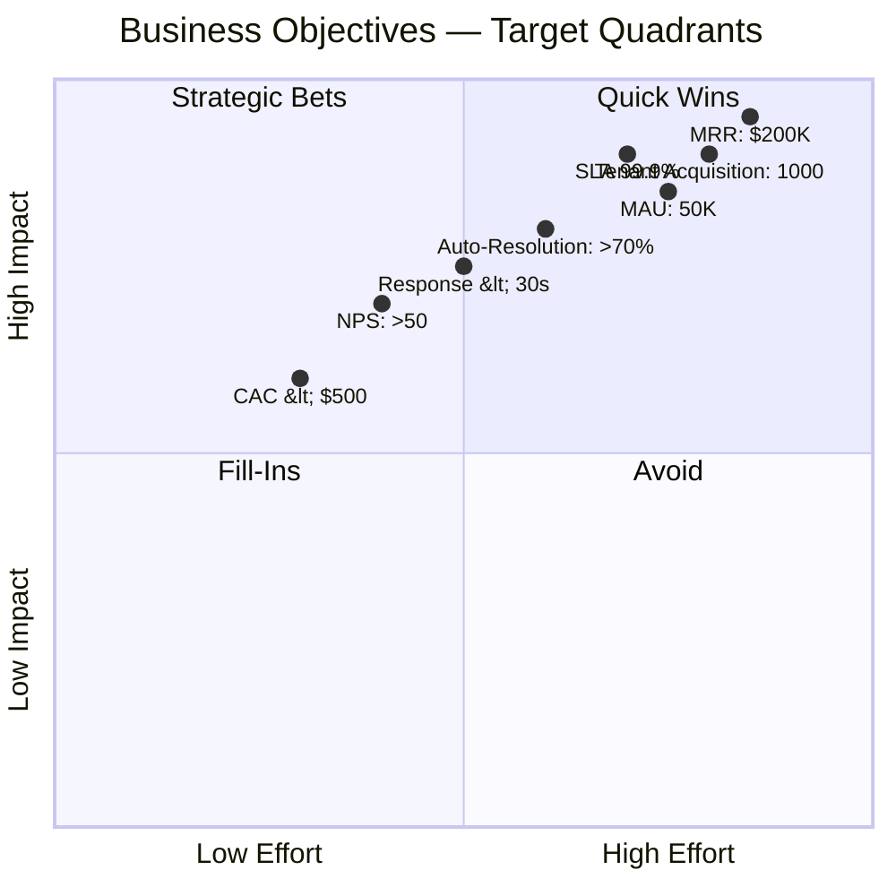

# 02 — Business Objectives

**Chapter:** 02 of 11  
**Purpose:** Define measurable business objectives, success metrics, and financial targets for Omnilinks.

---

## Core Assumptions

The following financial model is based on Egypt-first launch assumptions and should be updated after pilot customers validate pricing.

### Customer Segments & ARPU

| Segment     | Assumed Monthly ARPU | Sales Motion        | Rationale |
| ----------- | -------------------- | ------------------- | --------- |
| **SMB**     | **$65**              | Self-service signup | Standard tier for small teams. |
| **Mid-Market** | **$500**          | Inside Sales        | Companies with 50-200 seats need customization. |
| **Enterprise** | **$2,000**        | Enterprise Sales    | High-touch, dedicated support and SLAs. |

> **Why Mid-Market?** Most SaaS companies do not jump from $65/month to $2,000/month contracts. This tier creates a realistic pricing ladder and allows for natural upselling.

---

## Business Objectives (KPIs)

| ID       | Objective                 | Target                                      | Timeline  | Priority |
| -------- | ------------------------- | ------------------------------------------- | --------- | -------- |
| OBJ-01   | Active Tenants            | **660** (600 SMB, 50 Mid, 10 Enterprise)    | 12 Months | Critical |
| OBJ-02   | Monthly Recurring Revenue | **$145,000 MRR**                            | 18 Months | Critical |
| OBJ-03   | Net Revenue Retention     | >110%                                       | 18 Months | High     |
| OBJ-04   | Monthly Churn             | <3%                                         | 12 Months | Critical |
| OBJ-05   | AI Auto Resolution        | ≥45% baseline / ≥65% stretch                | 18 Months | High     |
| OBJ-06   | Platform Availability     | 99.9% SLA                                   | Launch    | Critical |
| OBJ-07   | AI First Response Time    | <5 seconds                                  | Launch    | High     |
| OBJ-08   | Human First Response      | <30 seconds                                 | 6 Months  | Medium   |
| OBJ-09   | NPS                       | ≥25 baseline / ≥45 stretch                  | 24 Months | Medium   |
| OBJ-10   | Monthly Active Users      | 40,000                                      | 18 Months | Medium   |
| OBJ-11   | LTV/CAC Ratio             | >3                                          | 18 Months | High     |

---

## 18-Month Customer Growth Plan (Egypt Only)

> **Why this ramp?** We intentionally smooth the SMB curve. Egypt's digital self-serve adoption requires steady content marketing and word-of-mouth; 440 SMBs in Q4 (as seen in aggressive drafts) is unrealistic without a $1M+ ad budget. We compensate with a strong Mid-Market push, which is relationship-driven and faster to close in the local B2B ecosystem.

**New Customers Per Quarter:**

| Quarter | New SMB | New Mid | New Enterprise | Total New |
| ------- | ------- | ------- | -------------- | --------- |
| Q1      | 25      | 3       | 0              | 28        |
| Q2      | 80      | 10      | 1              | 91        |
| Q3      | 180     | 15      | 3              | 198       |
| Q4      | 315     | 22      | 6              | 343       |
| Q5      | 200     | 20      | 5              | 225       |
| Q6      | 150     | 15      | 5              | 170       |

---

**Cumulative Customers:**

| Quarter | SMB  | Mid | Enterprise | **Total** |
| ------- | ---- | --- | ---------- | --------- |
| Q1      | 25   | 3   | 0          | 28        |
| Q2      | 105  | 13  | 1          | 119       |
| Q3      | 285  | 28  | 4          | 317       |
| Q4      | 600  | 50  | 10         | **660**   |
| Q5      | 800  | 70  | 15         | 885       |
| Q6      | 950  | 85  | 20         | **1,055** |

---

## Revenue Projection

Using:
- SMB = $65/month
- Mid-Market = $500/month
- Enterprise = $2,000/month

| Quarter | MRR Calculation                                 | **Ending MRR** |
| ------- | ----------------------------------------------- | -------------- |
| Q1      | (25×65)+(3×500)+(0×2000) = 1,625 + 1,500       | **$3,125**     |
| Q2      | (105×65)+(13×500)+(1×2000) = 6,825 + 6,500 + 2,000 | **$15,325** |
| Q3      | (285×65)+(28×500)+(4×2000) = 18,525 + 14,000 + 8,000 | **$40,525** |
| Q4      | (600×65)+(50×500)+(10×2000) = 39,000 + 25,000 + 20,000 | **$84,000** |
| Q5      | (800×65)+(70×500)+(15×2000) = 52,000 + 35,000 + 30,000 | **$117,000** |
| Q6      | (950×65)+(85×500)+(20×2000) = 61,750 + 42,500 + 40,000 | **$144,250** |

**Exit ARR (18 Months):** ≈ **$1.73M**  
*(Calculated as $144,250 MRR × 12)*

---

## Year 1 Revenue (Actual Cash Collected)

Using average MRR per quarter multiplied by 3 months:

| Quarter | Average MRR (Start + End / 2) | Revenue (Cash) |
| ------- | ----------------------------- | -------------- |
| Q1      | ($1,500 + $3,125) / 2 = $2,312   | ~$6,900        |
| Q2      | ($3,125 + $15,325) / 2 = $9,225  | ~$27,700       |
| Q3      | ($15,325 + $40,525) / 2 = $27,925 | ~$83,800       |
| Q4      | ($40,525 + $84,000) / 2 = $62,262 | ~$186,800      |

**Year 1 Total Revenue (Collected):** ≈ **$305,000**

---

## Investment Requirements (Year 1)

We maintain a lean, founder-led structure suited for an Egyptian startup:

| Category             | Year 1 Budget |
| -------------------- | ------------- |
| Product Development  | $550,000      |
| Cloud Infrastructure | $150,000      |
| AI/API Costs         | $100,000      |
| Sales & Marketing    | $250,000      |
| Operations & Support | $150,000      |
| Legal & Compliance   | $50,000       |
| Contingency (10%)    | $100,000      |

**Total Year 1 Investment:** ≈ **$1.35M**

---

## Year 1 Financial Result

| Metric   | Amount        |
| -------- | ------------- |
| Revenue  | ~$305,000     |
| Expenses | ~$1,350,000   |
| **Net Loss** | **~$1,045,000** |

> **Investor Note:** While this is a loss, the **18-month ARR ($1.73M)** against a **$1.35M cumulative investment** shows a path to capital efficiency. The model projects break-even operational cash flow by Month 22–24, assuming NRR stays above 110%.

---

## Strategic Initiatives (Roadmap Prioritization)

To hit these numbers, we prioritize the following initiatives in Year 1:

| Initiative                         | Expected Impact                                   |
| ---------------------------------- | ------------------------------------------------- |
| Self-service SMB onboarding funnel | Drive volume acquisition with low CAC.            |
| AI-powered setup assistant         | Reduce time-to-value and onboarding costs.        |
| Multi-channel integrations         | Increase stickiness (Zendesk, WhatsApp, etc.).    |
| RAG knowledge base tooling         | Boost AI resolution rates toward the 65% stretch. |
| Usage-based billing layer          | Unlock expansion revenue (overages, AI tokens).   |
| Enterprise sales program           | Close 10 anchor enterprise clients.               |
| Customer success touchpoints       | Keep monthly churn <3%.                           |
| Analytics dashboards for clients   | Improve visibility and retention (NRR driver).    |

---

## Target Metrics Visualization

---

## Why These Numbers Are "Defensible"

1. **SMB growth is smoothed** – We avoid the trap of claiming hundreds of SMBs will magically appear in a single quarter. We rely on slow, compounding word-of-mouth and content marketing.
2. **Mid-Market is prioritized** – Egypt's B2B scene works on relationships. We can close 50 mid-market accounts (e.g., local banks, e-commerce, logistics) via targeted inside sales faster than we can acquire 700 SMBs digitally.
3. **Enterprise is realistic** – 10 enterprise clients in Year 1 and 20 by Month 18 is ambitious but achievable for a founder-led sales cycle in the local market.
4. **Investment matches burn** – $1.35M over 12 months (~$112k/month burn) is lean enough to allow a 15–18 month runway without needing unrealistic growth in the first 6 months.

---

> **Next:** [Chapter 03 — Problem Statement](03-problem-statement.md)