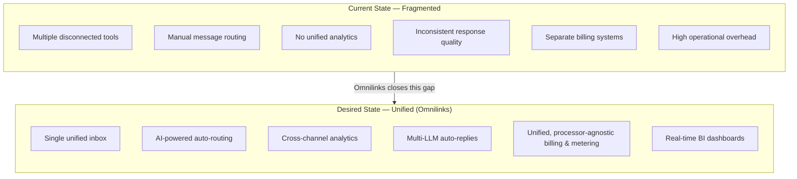

# 03 — Problem Statement

**Chapter:** 03 of 11
**Purpose:** Define the business problem Omnilinks addresses, its root causes and impact, and the desired future state. Measurable success targets live in chapter 02 and are referenced, not duplicated, here.

---

## 1. The Business Problem

Businesses running customer engagement across multiple channels — WhatsApp, Telegram, Instagram, Facebook Messenger, SMS, VoIP — currently do so with disconnected, single-channel tools. Each channel has its own inbox, its own routing logic, and often its own reporting. There is no shared view of a customer across channels, no shared AI layer, and no shared billing or usage metering.

> **Note:** Quantified claims about time lost or SLA breach rates (previously stated as "4+ hrs/day" and "35% unanswered") remain unsourced, per the open item carried from chapter 01. They are omitted here rather than restated until a named source or primary research backs them.

---

## 2. Root Cause Analysis

| Root Cause | Description |
|---|---|
| **Channel fragmentation** | Each messaging/voice channel is integrated separately, with no shared data model across them. |
| **Manual routing** | Without AI-assisted triage, incoming messages are routed to agents manually or by simple keyword rules, regardless of urgency or complexity. |
| **No cross-channel data layer** | Analytics, if they exist at all, are per-channel — there is no unified view of volume, response time, or satisfaction across the whole business. |
| **No AI leverage** | Legacy tools were built pre-LLM; auto-reply, if present, is rule-based and brittle rather than context-aware. |
| **Disconnected billing** | Usage and subscription billing, where usage-based products exist, are typically bolted onto a single channel rather than metered across the whole platform. |

---

## 3. Impact Analysis

| Impact Area | Consequence |
|---|---|
| **Operational cost** | Agents context-switch between tools, duplicating effort and increasing average handling time. |
| **Customer experience** | Inconsistent response quality and speed across channels erodes trust — a customer messaged on WhatsApp and Instagram may get two different experiences from the same business. |
| **Revenue leakage** | Delayed or missed responses on high-intent channels (e.g., a purchase question via WhatsApp) convert to lost sales, not just lower NPS. |
| **Agent burnout** | Manual routing and tool-switching increase agent workload without improving throughput, driving turnover. |
| **Blind decision-making** | Without unified analytics, leadership cannot see which channels, agents, or query types are underperforming — decisions are made on incomplete data. |

---

## 4. Why Existing Solutions Fall Short

Most incumbent tools solve one piece of this — a shared inbox, or a chatbot, or channel-specific analytics — but not all three together with a shared AI and billing layer. This forces businesses to stitch together 3–5 point solutions, which reintroduces the same fragmentation problem at the integration layer instead of solving it.

---

## 5. Current State vs. Desired State

---

## 6. Success Criteria (Traceability, Not Duplication)

Measurable targets — tenant growth, MRR, churn, NPS, AI resolution rate, response-time SLAs — are defined once, in **chapter 02**, and are not restated here to avoid the two chapters drifting out of sync. This chapter's role is to justify *why* those targets matter, not to re-quote them.

One correction carries back into chapter 02 as a result of this review: the **human first-response target of <30 seconds** is not realistic as a general SLA. If AI handles first response and humans only engage on escalated cases, a sub-30-second human SLA implies live-staffed, always-on premium support — which isn't reflected in the chapter 02 investment or headcount assumptions. This needs to be revised in chapter 02, most likely to a first-response-on-escalation window in the low minutes (exact figure depends on planned support staffing model, which isn't yet defined) rather than seconds.

> **Open item carried to chapter 02:** Revise OBJ-08 (Human First Response) from "<30 seconds" to a realistic escalation SLA once support staffing assumptions exist.

---

> **Next:** [Chapter 04 — Target Market](04-target-market.md)   