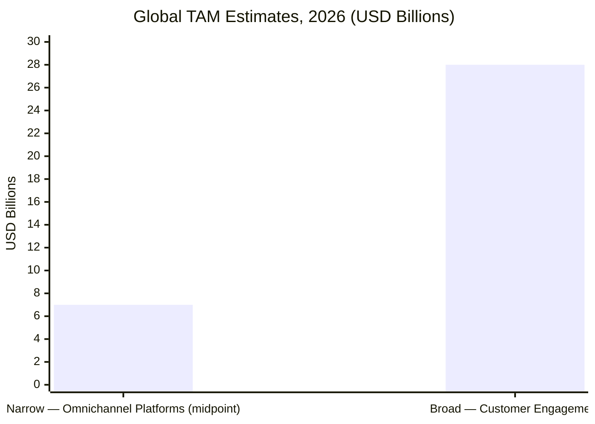
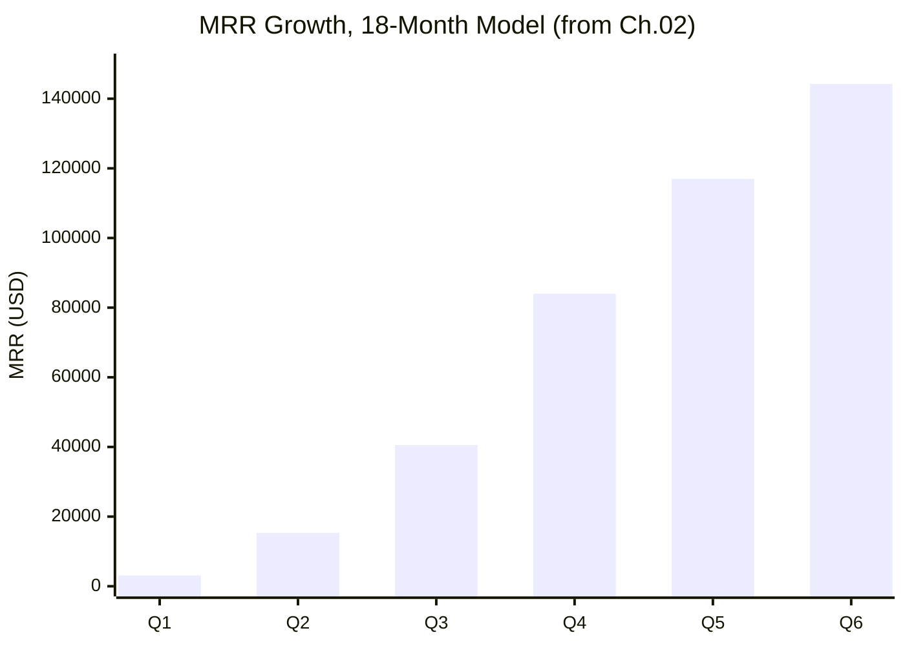
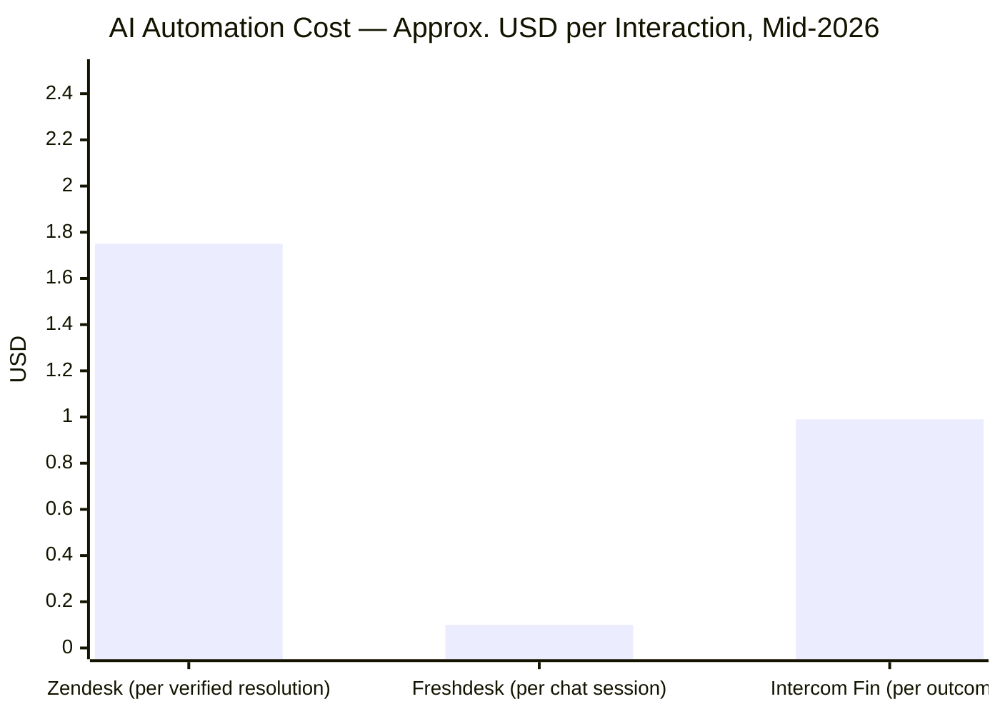
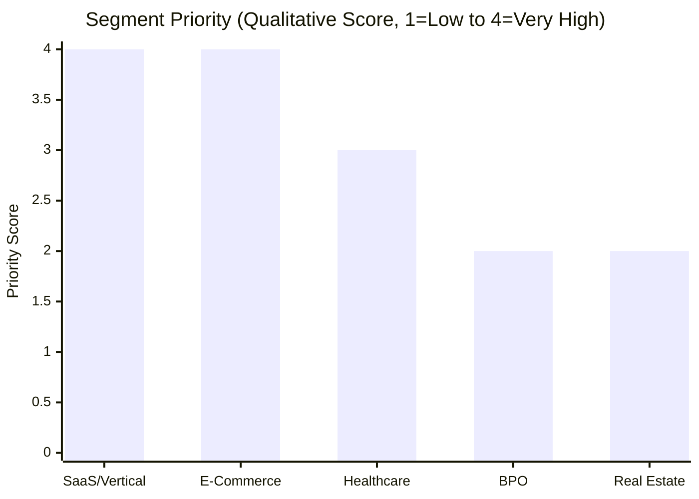

# 04 — Target Market

**Chapter:** 04 of 11
**Purpose:** Define addressable market segments, ideal customer profile, competitive positioning, and go-to-market priorities for Omnilinks' Egypt-first, phased-MENA launch.

---

## Market Sizing

> **Scope:** TAM/SAM/SOM below are scoped to MENA (Egypt, Qatar, UAE, Saudi Arabia, Morocco), matching the launch geography defined in the index diagram, chapter 01, and chapter 02's Egypt-only 18-month model.

### Total Addressable Market (TAM) — Global

Reusing chapter 01's sourced figures rather than introducing a new one:
- **Broad scope** (customer engagement solutions, Mordor Intelligence): ~$28B in 2026, growing toward $46B by 2031.
- **Narrow scope** (omnichannel platforms software — the closer category match): ~$4–10B over the same period.

> Narrow-scope bar uses the midpoint of the $4–10B range for a single visual comparison — the underlying range is still $4–10B, not a precise $7B. Chapter 01's open item — pick one figure, one named source, before this goes to investors — still applies.

### Serviceable Addressable Market (SAM) — MENA

**Pending regional market research.** An earlier draft of this chapter estimated MENA at 3–5% of the global narrow TAM (~$120M–$500M), but a number that's immediately followed by "this is unsourced" doesn't survive investor diligence — it just invites "where did 3–5% come from?" with no good answer. Rather than keep an invented figure with a disclaimer attached, this is left as an open item: **a named MENA-specific software market report is needed before SAM gets a number.**

### Serviceable Obtainable Market (SOM)

**Near-term (18 months): ≈ $1.73M**, taken directly from chapter 02's own bottom-up model (660→1,055 tenants, $144,250 MRR at month 18 × 12 as exit ARR). This is the only SOM figure in this BRD backed by an actual customer→pricing→MRR→ARR build, not a top-down percentage guess — that bottom-up method is the right one and should stay the standard for any future SOM figure in this document.

**3-year SOM: not yet defined.** No years 2–3 growth curve exists yet in chapter 02 to build it from.

> **Open item carried to chapter 02:** Extend the 18-month growth model to 36 months to support a real 3-year SOM.

---

## Geographic Phasing (from chapter 01 / index)

| Market | Status |
|---|---|
| Egypt | Confirmed, launch market |
| UAE | Phased expansion, entry timing TBD |
| Saudi Arabia | Phased expansion, entry timing TBD |
| Qatar | Phased expansion, payment processor TBD |
| Morocco | Phased expansion, payment processor TBD |

> **Open item — flagging, not resolving:** Morocco was named as a confirmed expansion market back in the index chapter (its regulatory law is already cited there) and carries its own linguistic profile — French is widely used in business, and Darija differs substantially from Gulf and Egyptian Arabic, which the product's AI/support layer is otherwise built around. Gulf markets without a Paymob-coverage gap, e.g. Bahrain, Kuwait, Oman, could plausibly deliver faster ROI with less localization work than Morocco. This is a real strategic question, but it's not a chapter 04 fix — swapping Morocco out cascades into the index diagram, chapter 01, and chapter 10 (regulatory), and touches payment-processor research already done assuming Morocco is in scope. Recommend deciding this explicitly rather than letting it default silently.

---

## Ideal Customer Profile (ICP)

> **Hypothesis to validate, not a researched conclusion.** The criteria below are a reasonable starting shape for a bottom-up sales motion, but none of the specific thresholds (employee count, conversation volume) are backed by pilot-customer data yet — they need testing against Omnilinks' actual first cohort, not treated as fixed qualification criteria.

| Criterion | Hypothesis |
|---|---|
| Company size | 50–500 employees |
| Monthly conversation volume | 5,000–100,000 across channels |
| Current channel usage | Already active on WhatsApp Business (or equivalent) |
| Support team size | 5+ agents, or evaluating a first dedicated support hire |
| Growth stage | Scaling quickly enough that manual multi-tool routing is becoming a visible bottleneck |
| Language need | Requires Arabic (Egyptian, Gulf, or MSA) support alongside English |

---

## Competitive Landscape

Positioning verified against current (mid-2026) vendor pricing and product data rather than stated from memory, since this segment moves fast.

| Competitor | Model | Where Omnilinks can differentiate |
|---|---|---|
| **Zendesk** | Seat-based Suite pricing ($19–$169+/agent/month) plus AI billed separately per automated resolution (~$1.50–$2/resolution). Acquired Forethought (AI agent platform) in March 2026 to build out its "Advanced AI" tier. | Zendesk's AI cost is compounding and unpredictable — seats + per-resolution fees stack fast at volume. A flatter, usage-metered model (as Omnilinks' chapter 02/09 billing is already designed around) is a clearer pitch to a cost-conscious MENA SMB/mid-market buyer. |
| **Freshdesk (Freshworks)** | Core ticketing $19–$89/agent/month; AI (Freddy) is a separate paid layer — Copilot at ~$29/agent/month, AI Agent billed per session (~$0.49/session email, ~$0.10/session chat). Full omnichannel requires the separate, additionally-priced "Freshdesk Omni" product. | Freshdesk splits ticketing, omnichannel, and AI into separate priced products — a genuinely unified inbox-plus-AI-plus-billing platform is a simpler sale than assembling three Freshworks SKUs. |
| **Intercom (Fin)** | Per-resolution AI pricing (~$0.99/outcome), historically the cheapest of the major players per-resolution. **Being acquired by Salesforce for ~$3.6B, announced June 15, 2026**, expected to close around Q4 of Salesforce's FY2027 — folding into Salesforce Agentforce. | An acquisition in progress creates real near-term uncertainty for MENA buyers about roadmap, pricing, and support continuity — a stability/local-focus pitch is credible right now in a way it might not be in a year. |
| **WATI** | WhatsApp-first, purpose-built for South Asia/MENA/Africa/LatAm SMBs; simpler and cheaper than the above, but single-channel by design. | WATI covers WhatsApp well but not the full 6-channel spread (Telegram, Instagram, Facebook, SMS, VoIP) Omnilinks targets — differentiation is breadth, not undercutting on WhatsApp alone. |
| **SleekFlow / Respond.io** | Included in an earlier draft as MENA competitors — **this is a scope error worth correcting.** Both are APAC-focused (Southeast Asia social commerce: Singapore, Hong Kong, Malaysia, Philippines), not meaningfully positioned in MENA. | Not a direct MENA competitive threat today; low priority for positioning work. |

> **Not apples-to-apples — read directionally only.** Each vendor defines its billing unit differently: Zendesk's "verified resolution" requires a 72-hour no-reopen confirmation window, Freshdesk's "session" is a 24-hour chat window regardless of resolution, and Intercom's "outcome" has its own definition. The chart shows list-price order of magnitude, not equivalent units — don't use this for cost modeling without checking each vendor's current definition.

> **Note:** Vendor pricing changes quickly in this category (Zendesk alone changed its AI billing model twice in the past year). Re-verify before this table goes into investor material — treat it as directionally accurate as of July 2026, not a locked reference.

---

## Beachhead Strategy

An earlier draft targeted E-Commerce, Healthcare, Real Estate, and BPO simultaneously in phase 1. Spreading a first sales motion across four verticals at once is a real risk — it dilutes messaging, sales collateral, and early customer-success bandwidth. A sequenced beachhead is the more defensible plan:

| Phase | Verticals | Rationale |
|---|---|---|
| Year 1 | SaaS/vertical software, E-Commerce | Both are WhatsApp-native buying behaviors in Egypt, both have existing pain from tools like the ones above, and SaaS buyers in particular are already comfortable evaluating a category like this. |
| Year 2 | Healthcare, BPO/Customer Support | Higher compliance and integration complexity (see chapter 10) — better tackled once the platform has reference customers. |
| Year 3 | Real Estate, further verticals | Longer sales cycles, lower urgency; can follow once the core platform is proven. |

> This sequencing is a proposal, not a decision already reflected in chapter 02's growth model — chapter 02's tenant ramp doesn't currently distinguish vertical mix by quarter. If this beachhead order is adopted, chapter 02's ramp assumptions should be revisited to reflect it.

---

## Segment Priority (Qualitative, Replacing Invented Account Counts)

An earlier draft assigned specific account counts (8,000 / 5,000 / 4,000 / 1,500) to each vertical with no supporting research — precise-looking numbers with no real backing are worse than an honest "unknown" for an investor audience. Replaced with a qualitative priority ranking instead:

| Vertical | Priority | Basis |
|---|---|---|
| SaaS / Vertical Software | Very High | Beachhead segment; existing category awareness (Zendesk/Freshdesk/Intercom users already evaluating alternatives) |
| E-Commerce | Very High | Beachhead segment; high WhatsApp-native conversation volume |
| Healthcare | High | Large potential ARPU; deferred to Year 2 pending compliance readiness |
| BPO / Customer Support | Medium | High willingness to pay; deferred to Year 2, needs reference customers first |
| Real Estate | Medium | Longer sales cycle; Year 3 |

> This chart visualizes the qualitative ranking above, not a quantitative market-size measure — the y-axis is a priority score, not account counts or revenue.

---

## Segment Deep Dive

### SaaS / Vertical Software (New — Year 1 Beachhead)

| Attribute | Detail |
|---|---|
| Pain Point | Already paying for Zendesk/Freshdesk/Intercom-class tools and hitting the per-resolution AI cost escalation documented above |
| Use Case | Tier-1 support automation, replacing or supplementing an existing high-cost helpdesk |
| Willingness to Pay | $65–$2,000/month, spanning SMB through Enterprise tiers depending on company size |
| Key Channels | WhatsApp, email-adjacent (via integration), in-app |

### E-Commerce (Year 1 Beachhead)

| Attribute | Detail |
|---|---|
| Pain Point | High volume of order inquiries across WhatsApp, Instagram, Facebook |
| Use Case | Order tracking, returns, product recommendations |
| Willingness to Pay | $65–$500/month — SMB and Mid-Market tiers |
| Key Channels | WhatsApp, Instagram, Facebook Messenger |

### Healthcare (Year 2)

Split from the earlier single bucket — a clinic and a hospital group are not the same buyer.

| Sub-segment | Willingness to Pay | Notes |
|---|---|---|
| Independent clinics | $65–$500/month | SMB/Mid-Market tier; simpler compliance footprint |
| Hospital groups / multi-site networks | $500–$2,000+/month | Enterprise tier; higher compliance and integration needs (see chapter 10 per-market PDPL requirements) |

| Attribute | Detail |
|---|---|
| Pain Point | Appointment scheduling across channels, compliance requirements |
| Use Case | Appointment booking, prescription refills, patient follow-ups |
| Key Channels | WhatsApp, SMS, VoIP |

### BPO / Customer Support (Year 2)

| Attribute | Detail |
|---|---|
| Pain Point | High agent turnover, inconsistent quality |
| Use Case | Tier-1 support automation, agent assist, quality monitoring |
| Willingness to Pay | $500–$5,000/month — Enterprise tier and above |
| Key Channels | All channels |

### Real Estate (Year 3)

| Attribute | Detail |
|---|---|
| Pain Point | Lead response time exceeding 24 hours across multiple channels |
| Use Case | Property inquiries, tour scheduling, document sharing |
| Willingness to Pay | $65–$1,000/month |
| Key Channels | WhatsApp, Telegram, VoIP |

> **Note on WTP alignment:** ranges are drafted to bracket the SMB/$65, Mid-Market/$500, Enterprise/$2,000 tiers from chapter 02, directionally only — not validated against real willingness to pay in any of these verticals.

---

## Open Items Carried Forward

1. SAM needs a named regional source before it gets a number at all.
2. 3-year SOM requires chapter 02's growth model extended past 18 months.
3. Morocco's place in the phase 1–2 rollout vs. Gulf alternatives (Bahrain/Kuwait/Oman) — a real strategic decision, not resolved here.
4. ICP thresholds are hypotheses pending validation against real pilot customers.
5. If the beachhead sequencing above is adopted, chapter 02's tenant ramp needs to reflect vertical mix by quarter, not just SMB/Mid/Enterprise counts.
6. Competitor pricing table needs re-verification before investor use — this category's pricing model shifts every few months.

---

> **Next:** [Chapter 05 — Stakeholders](05-stakeholders.md)