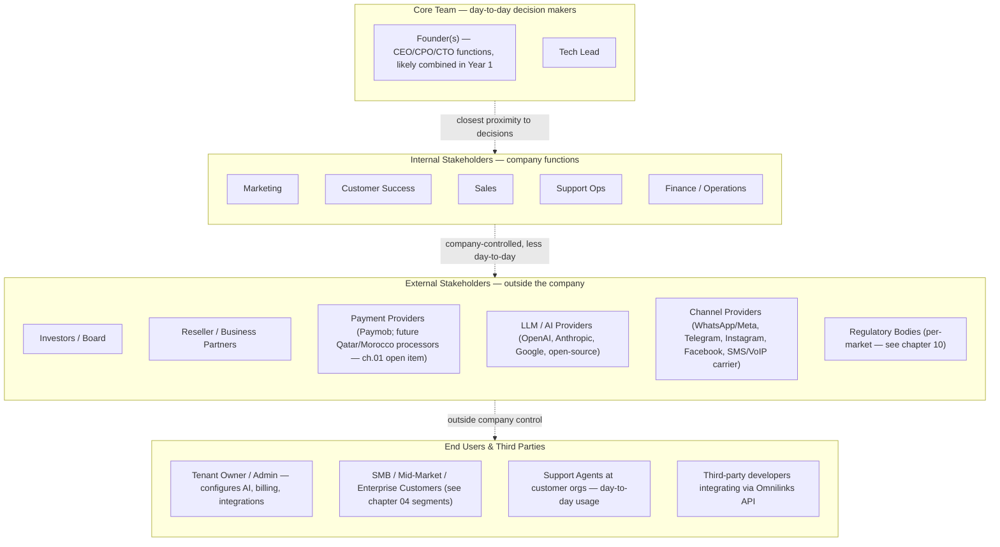

# 05 — Stakeholders

**Chapter:** 05 of 11
**Purpose:** Identify key stakeholders, their influence, interest, and engagement strategy.

---

## Stakeholder Map

> **Note on structure:** this map lists stakeholder *roles*, not necessarily distinct full-time hires. Chapter 02 defines Omnilinks as a lean, founder-led operation in Year 1 — several roles below are likely the same person wearing multiple hats early on. Proximity in this diagram reflects closeness to day-to-day product decisions, not relative importance — customer and provider dependencies further out can still carry very high influence, as the matrix below shows.

> Dotted lines indicate relative proximity to daily decisions, not a process flow, and not a ranking of importance — see the influence/interest matrix below for actual weighting, which does not track proximity 1:1 (e.g., customers and channel providers sit in outer rings but carry very high influence).

---

## Stakeholder Influence-Interest Matrix

| Stakeholder | Influence | Interest | Engagement Strategy |
|-------------|-----------|----------|-------------------|
| Founder(s) (CEO/CPO/CTO functions) | Very High | Very High | Daily, by definition of being the core decision-making team |
| Tech Lead | High | Very High | Daily standups, sprint reviews |
| Marketing | Medium | High | Weekly campaign/pipeline syncs |
| Sales | Medium | High | Weekly pipeline reviews |
| Customer Success | Medium | High | Monthly NPS & churn reviews |
| Support Ops | Medium | High | Weekly ticket/SLA reviews |
| Finance / Operations | Medium | High | Weekly billing/invoice review, monthly investor-reporting prep |
| Investors / Board | Very High | High | Quarterly board updates |
| Reseller / Business Partners | Medium | Medium | Quarterly partner business reviews |
| Payment Providers | High | Low | Integration status checks at each market entry (ch.01 billing open items) |
| LLM / AI Providers | High | Low | Monitor pricing/capability changes; multi-LLM router (ch.01) exists partly to reduce single-provider dependency |
| Channel Providers (WhatsApp/Meta, etc.) | **Very High** | Low | Monitor API/policy changes closely — a platform policy change here can break core functionality without warning |
| Regulatory Bodies | High | Low | Compliance audits per market at entry (ch.10) |
| Tenant Owner / Admin | **Medium** | Very High | Beta program, feedback loops, admin-specific onboarding docs |
| SMB / Mid-Market / Enterprise Customers | **Medium** | Very High | Beta program, feedback loops, NPS surveys — early customers meaningfully shape roadmap (e.g., a common integration request from the first ~20 accounts typically gets built) |
| Support Agents at customer orgs | Low | High | In-product feedback channels, onboarding docs |
| Third-party API Developers | Low | Medium | API docs, developer changelog, support channel |

> **Changes from the prior draft, and why:** Customer influence raised from Low to Medium — early-stage products are shaped disproportionately by first-cohort customer requests, and rating that as "Low" understated real product-roadmap risk. Investor interest raised from Medium to High — investors track MRR, growth, and burn continuously, not just at quarterly touchpoints, even without day-to-day involvement. Channel Providers rated Very High influence, not just High — Omnilinks' core function depends entirely on WhatsApp/Meta and equivalent APIs; a policy or access change there is closer to an existential risk than a typical vendor relationship.

---

## Communication Plan

| Stakeholder | Primary Channel | Frequency |
|---|---|---|
| Founder(s) | Direct/in-person | Daily |
| Tech Lead / Engineering | Sprint review | Weekly |
| Sales | Pipeline review | Weekly |
| Customer Success | Account health review | Weekly |
| Finance / Operations | Billing/invoice review | Weekly |
| Marketing | Campaign sync | Weekly |
| Investors / Board | Board meeting + written update | Quarterly (update), Monthly (metrics snapshot) |
| Reseller / Business Partners | Business review | Quarterly |
| Payment / LLM / Channel Providers | Status/dependency check | At each market entry, or on provider-announced change |
| Regulatory Bodies | Compliance audit | At market entry, then per local requirement (ch.10) |
| Customers (all tiers) | Feedback sessions, NPS survey | Monthly |
| Support Agents (customer-side) | In-product feedback | Continuous |
| Third-party API Developers | Changelog, dev support channel | On release |

---

> **Next:** [Chapter 06 — Success Metrics](06-success-metrics.md)