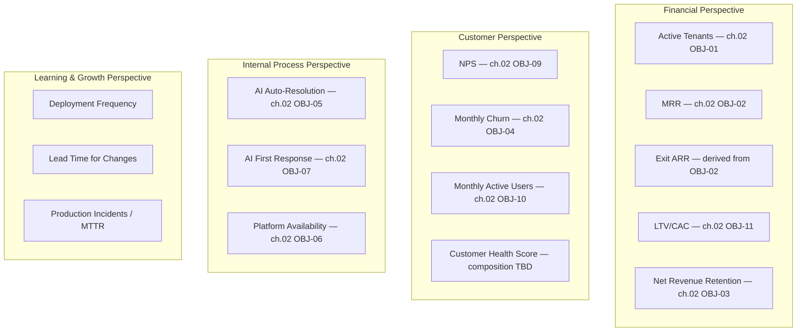

# 06 — Success Metrics

**Chapter:** 06 of 11
**Purpose:** Define how each KPI is measured, calculated, sourced, owned, and reviewed. **Target values live in chapter 02 and are referenced here by OBJ-ID, not restated** — this chapter answers *how we measure*, not *what the number is*, to avoid the three-way drift risk that already happened once between chapters 02 and 03.

---

## Balanced Scorecard (Categories & Ownership, Not Values)

> Gross Margin, CAC Payback, Human First Response SLA, and Knowledge Base Accuracy are intentionally **not** in this scorecard — they're still undefined or under revision (see Open Items below), and a scorecard should hold approved metrics, not open debates.

---

## Metric Definitions

| KPI | Formula | Data Source | Owner | Target |
|---|---|---|---|---|
| Active Tenants | Count of tenants with active subscription status | Billing service | Finance/Operations | ch.02 OBJ-01 |
| MRR | Σ active monthly subscription value, excluding one-time setup fees | Billing service (per-processor reconciliation — ch.01/09) | Finance/Operations | ch.02 OBJ-02 |
| Exit ARR | Latest month's MRR × 12 | Derived from MRR | Finance/Operations | Derived, not a separate target |
| Net Revenue Retention | (Starting MRR + Expansion − Contraction − Churn) ÷ Starting MRR | Billing service | Finance/Operations | ch.02 OBJ-03 |
| LTV/CAC | (ARPU × Gross Margin % × Avg. Customer Lifetime) ÷ CAC | Billing + Sales spend | Finance/Operations | ch.02 OBJ-11 — **note: this formula depends on Gross Margin %, which is itself an open item; LTV/CAC can't be fully calculated until that's resolved in ch.09** |
| NPS | %Promoters − %Detractors | Quarterly survey | Customer Success | ch.02 OBJ-09 |
| Monthly Churn | Lost tenants ÷ starting tenants, that month | Billing/CRM | Customer Success | ch.02 OBJ-04 |
| Monthly Active Users | Unique authenticated users in a trailing 30-day window | Product analytics | Founder(s)/Product | ch.02 OBJ-10 |
| Customer Health Score | Composite of NPS, usage frequency, support ticket volume — **weighting not yet defined** | TBD | Customer Success | Not yet defined |
| AI Auto-Resolution | Auto-closed conversations ÷ total conversations | AI engine logs | AI/ML function | ch.02 OBJ-05 |
| AI First Response | Median time from message received to first AI reply | Platform telemetry | Tech Lead | ch.02 OBJ-07 |
| Platform Availability | Uptime % | Monitoring | Tech Lead | ch.02 OBJ-06 |
| Deployment Frequency | Count of production deploys per week | CI/CD pipeline | Tech Lead | Weekly *(illustrative starting target, no baseline yet)* |
| Lead Time for Changes | Time from commit to production deploy | CI/CD + Git | Tech Lead | <3 days *(illustrative)* |
| Production Incidents / MTTR | Count of incidents; mean time to recovery | Incident tracker | Tech Lead | <2/month, <1hr MTTR *(illustrative)* |

---

## Open Items (Not in the Approved Scorecard)

| Item | Status |
|---|---|
| Gross Margin target | Not yet defined — needs real infra/AI cost basis (ch.09) |
| CAC Payback target | Not yet defined (ch.09) |
| Human First Response SLA | Currently 30s in chapter 02; flagged unrealistic in chapter 03 review; revision pending |
| Knowledge Base Accuracy | No measurement method or target date defined (ch.03) |
| Customer Health Score composition | Weighting of NPS/usage/tickets not yet defined |
| DORA-style engineering targets | Illustrative starting points only — no baseline data behind them yet |

---

## KPI Review Cadence

| Perspective | Reviewed By | Frequency |
|---|---|---|
| Financial | Founder(s), Finance/Operations | Weekly dashboard → Monthly review → Quarterly board |
| Customer | Founder(s), Customer Success | Monthly |
| Internal Process | Tech Lead, Support Ops | Weekly |
| Learning & Growth | Tech Lead | Weekly, once real baselines exist |
| Full scorecard | All internal stakeholders (ch.05) | Monthly, consolidated |

---

## Executive Dashboard (Structure Only — Values Live Elsewhere)

| Section | Metrics Shown |
|---|---|
| Financial | MRR, Exit ARR, Burn rate *(not yet defined — ch.09 investment tracking)*, Runway *(derived once burn rate exists)* |
| Customer | NPS, Customer Health Score, Monthly Churn |
| Operations | AI Auto-Resolution, AI First Response, Platform Availability |
| Growth | New tenants (from ch.02 quarterly ramp), NRR, Pipeline *(not yet defined — needs ch.09/Sales process)* |

---

> **Next:** [Chapter 07 — Scope](07-scope.md)