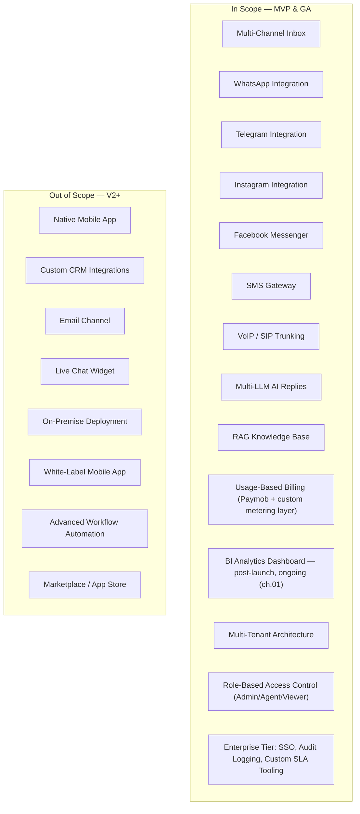

# 07 — Scope

**Chapter:** 07 of 11
**Purpose:** Define what is in-scope and out-of-scope for the Omnilinks platform launch.

---

## Scope Overview

> Diagram note: subgraph membership alone shows which items are in/out of scope — no separate edges are drawn from the subgraph boxes to their own members, which was a rendering artifact in the prior draft (same bug already fixed in chapter 06's scorecard diagram).

---

## In-Scope Detail

| Feature | Description | Priority |
|---------|-------------|----------|
| Multi-Channel Inbox | Unified view of all incoming messages | P0 |
| WhatsApp Integration | WhatsApp Business API | P0 |
| Telegram Integration | Telegram Bot API | P0 |
| Instagram Integration | Instagram Graph API | P0 |
| Facebook Messenger | Facebook Graph API | P0 |
| SMS Gateway | Twilio-class or local SMS carrier | P0 |
| VoIP / SIP Trunking | WebRTC-based calling | **P0 — see open item below** |
| Multi-LLM AI Replies | GPT-4, Claude, Gemini, open-source, routed per chapter 01's multi-LLM router | P0 |
| RAG Knowledge Base | Document ingestion & retrieval | P0 |
| Usage-Based Billing | Paymob (Egypt/UAE/Saudi) with pluggable processor interface (ch.01); custom metering layer for usage overages & AI-token consumption, built on tokenized merchant-initiated charges — not a stock subscription feature | P0 |
| BI Analytics | Real-time dashboards & reports — post-launch/ongoing per chapter 01's onboarding flow, not part of initial onboarding | P1 |
| Multi-Tenant Architecture | Tenant isolation & provisioning | P0 |
| Role-Based Access Control | Admin, Agent, Viewer roles | P0 |
| Enterprise Tier Features | SSO/SAML, audit logging, custom SLA tooling — needed to actually deliver on chapter 04's stated Enterprise differentiator ("high-touch, dedicated support and SLAs") | P1 |

> **Open item — VoIP priority conflict:** this draft originally marked VoIP as P1 (lower priority, implicitly deferrable), but chapter 03's OKR explicitly requires all 6 channels — including VoIP — live *at launch*. Marked P0 here to match that OKR. If VoIP genuinely needs more lead time than the other five channels, that's a real scheduling risk worth surfacing to chapter 03/08 (Risk Analysis) rather than quietly shipping without it and letting the OKR go unmet.

> **New in-scope item — Enterprise Tier Features:** added because chapter 04 promises "dedicated support and SLAs" as the Enterprise tier's differentiator, and chapter 02 commits to 10 Enterprise clients by month 12, but nothing in the prior scope draft actually delivered on that promise. RBAC alone (Admin/Agent/Viewer) doesn't cover SSO, audit logs, or custom SLA tooling that Enterprise buyers typically expect at this price point.

---

## Out-of-Scope Detail

| Feature | Rationale | Future Consideration |
|---------|-----------|---------------------|
| Native Mobile App | Web-first MVP; mobile responsive | V2 |
| Custom CRM Integrations | Too many permutations for MVP | V2 |
| Email Channel | Lower priority than messaging | V2 |
| Live Chat Widget | Website widget is a separate product | V2 |
| On-Premise Deployment | Cloud-only for MVP | Enterprise V2 — **verify against ch.10 data-residency rules per market before assuming this holds for all five confirmed/planned markets** |
| White-Label Mobile App | Requires native development | V3 |
| Advanced Workflow Automation | Complex state machine | V2 |
| Marketplace / App Store | Ecosystem play for V3 | V3 |

---

## Open Items Carried Forward

1. VoIP re-classified P0 to match chapter 03's launch OKR — if that's not achievable, the OKR (not this chapter) needs to change.
2. Enterprise Tier Features added as new scope to match chapter 04's stated differentiator; needs real requirements gathering (which specific SLA terms, which audit/compliance standard) before it's build-ready.
3. On-premise-deferred assumption needs a check against chapter 10's per-market data-residency requirements — "cloud-only" may not be uniformly fine across Egypt/UAE/Saudi/Qatar/Morocco.

---

> **Next:** [Chapter 08 — Risk Analysis](08-risk-analysis.md)