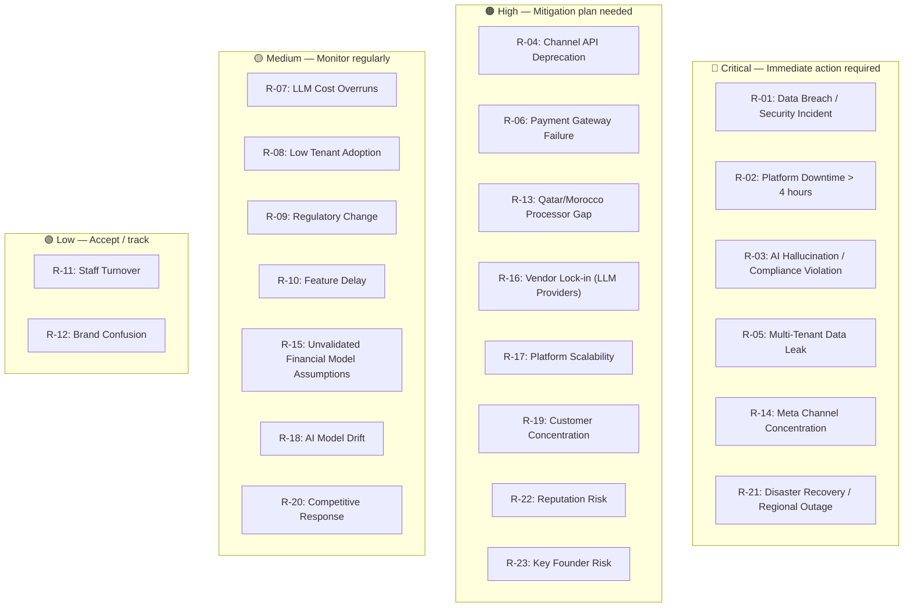

# 08 — Risk Analysis

**Chapter:** 08 of 11
**Purpose:** Identify, assess, and mitigate key risks to the Omnilinks platform.

---

## Scoring Note (Scale Revised This Pass)

Scoring formula, revised to a standard scale: **Probability (Low=1, Medium=2, High=3) × Impact (Low=1, Medium=2, High=3, Critical=4)**. This replaces the previous 2/3/4-start probability scale — the earlier scale was reverse-engineered to match a prior draft's numbers, but a scale starting at 2 is unintuitive. **All scores below changed as a result of this switch — not because of new arithmetic errors, but because the scale itself moved.**

---

## Risk Heatmap & Domains

Bucket placement is by impact severity, not raw score.

---

## Risk Matrix

| ID | Risk | Domain | Prob. | Impact | Score | Residual (Est., After Mitigation) |
|----|------|--------|-------|--------|-------|-----|
| R-01 | Data breach / security incident | Security | Medium | Critical | 8 | ~4 |
| R-02 | Platform downtime > 4 hours | Platform | Low | Critical | 4 | ~2 |
| R-03 | AI hallucination / compliance violation | AI | Medium | Critical | 8 | ~4 |
| R-04 | Channel API deprecation | Platform | Medium | High | 6 | ~3 |
| R-05 | Multi-tenant data leak | Security | Low | Critical | 4 | ~2 |
| R-06 | Payment gateway failure | Financial | Medium | High | 6 | ~3 (only after a real secondary processor is integrated — see mitigation note) |
| R-07 | LLM cost overruns | AI | High | Medium | 6 | ~3 |
| R-08 | Low tenant adoption | Business | Medium | High | 6 | ~4 |
| R-09 | Regulatory change | Regulatory | Medium | Medium | 4 | ~2 |
| R-10 | Feature delay | Operational | Medium | Medium | 4 | ~2 |
| R-11 | Staff turnover | Operational | Low | Medium | 2 | ~1 |
| R-12 | Brand confusion | Market | Low | Low | 1 | ~1 |
| R-13 | Qatar/Morocco processor not selected — launch-blocking (ch.01) | Financial | High | High | 9 | ~3, once resolved |
| R-14 | Meta channel concentration (WhatsApp/Instagram/FB Messenger = 3 of 6 channels) | Platform | Medium | Critical | 8 | ~4 |
| R-15 | Unvalidated financial model assumptions (SAM, gross margin, CAC payback, ch.02 SLA) | Business | High | Medium | 6 | ~2, once ch.02/09 pass closes these |
| **R-16** | **Vendor lock-in — LLM provider price/licensing changes (OpenAI, Anthropic, Google)** | AI | Medium | High | 6 | ~3 |
| **R-17** | **Platform scalability — DB/queue/vector-DB/RAG-latency bottlenecks as tenants scale (100→500→5,000)** | Platform | Medium | High | 6 | ~3 |
| **R-18** | **AI model drift — provider model updates changing behavior/prompt performance over time, distinct from hallucination** | AI | Medium | Medium | 4 | ~2 |
| **R-19** | **Customer concentration — a small number of Enterprise accounts (ch.04: 10 by month 12) could represent an outsized share of MRR** | Business | Medium | High | 6 | ~3 |
| **R-20** | **Competitive response — Zendesk/Freshdesk/Intercom(Salesforce) shipping comparable AI features faster (ch.04 competitor table)** | Market | High | Medium | 6 | ~4 |
| **R-21** | **Disaster recovery — regional cloud outage, backup failure, distinct from ordinary downtime** | Platform | Low | Critical | 4 | ~2 |
| **R-22** | **Reputation risk — a public AI failure or security incident compounds beyond the direct operational impact** | Business | Medium | High | 6 | ~3 |
| **R-23** | **Key founder risk — chapter 05's lean, founder-led structure means Founder(s) combine CEO/CPO/CTO functions; losing a founder in Year 1 is a single point of failure** | Operational | High | High | 9 | ~4 |

---

## Mitigation Detail (New & Revised Risks)

| Risk ID | Mitigation | Status |
|---|---|---|
| R-06 | **Revised:** only Paymob is actually integrated today (Egypt/UAE/Saudi). "Multiple gateway fallback" is a roadmap item, not a current control — a real secondary processor needs to be integrated before this mitigation is true, particularly ahead of Qatar/Morocco entry (ties directly to R-13). | Planned, not implemented |
| R-16 | Provider-abstraction layer for LLM calls (already implied by chapter 01's multi-LLM router); standardized prompt interface so switching providers doesn't require a rewrite | Partially implemented (router exists per ch.01); abstraction discipline needs enforcing |
| R-17 | Load-test at each 10x tenant milestone; design DB/queue/vector-DB layers for horizontal scaling from day one rather than retrofitting | Planned |
| R-18 | Version-pin LLM models where providers allow it; maintain a regression eval set to catch behavior changes on provider-side updates | Planned |
| R-19 | Track revenue concentration by top-N accounts monthly; avoid over-indexing Year 1 sales effort on a handful of large Enterprise logos without a broader base | Planned |
| R-20 | Monitor competitor AI feature releases quarterly (ch.04 competitor table needs re-verification anyway); maintain the pricing-model differentiation (usage-metered vs. seat+per-resolution) as the core defensible wedge | Ongoing |
| R-21 | Documented DR runbook; regular backup-restore drills; multi-AZ at minimum, multi-region evaluated once tenant count justifies the cost | Planned |
| R-22 | Incident communication plan drafted before it's needed, not during a live incident | Planned |
| R-23 | Documentation and cross-training (ties to R-11's existing mitigation) specifically covering founder-held knowledge; consider key-person insurance once external investment is raised | Planned |

---

## Mitigation Ownership

| Risk ID | Owner (per ch.05 roles) | Review Cadence |
|---------|--------------------------|----------------|
| R-01 | Founder(s)/Tech Lead — no dedicated Security function in ch.05 yet; controls (logging, alerts, vulnerability scanning) should run continuously regardless — quarterly cadence below refers to formal risk review, not control monitoring | Continuous controls; quarterly formal review |
| R-02 | Tech Lead | Monthly |
| R-03 | Founder(s)/Tech Lead — AI/ML function gap flagged previously | Weekly |
| R-04 | Tech Lead | Monthly |
| R-05 | Founder(s)/Tech Lead (Security gap) | Quarterly |
| R-06 | Tech Lead, Finance/Operations | Monthly |
| R-07 | Founder(s)/Tech Lead | Weekly |
| R-08 | Marketing | Monthly |
| R-09 | Founder(s) — no dedicated Legal function in ch.05 | Quarterly |
| R-10 | Founder(s) | Sprint-by-sprint |
| R-11 | Founder(s) | Quarterly |
| R-12 | Marketing | Monthly |
| R-13 | Finance/Operations, Founder(s) | Monthly until resolved |
| R-14 | Tech Lead | Monthly |
| R-15 | Finance/Operations, Founder(s) | Monthly until resolved, then quarterly |
| R-16 | Tech Lead | Quarterly |
| R-17 | Tech Lead | At each tenant-count milestone |
| R-18 | Founder(s)/Tech Lead | Monthly |
| R-19 | Finance/Operations, Sales | Monthly |
| R-20 | Founder(s), Marketing | Quarterly |
| R-21 | Tech Lead | Quarterly, plus annual DR drill |
| R-22 | Founder(s), Marketing | Reviewed once, kept ready |
| R-23 | Founder(s) | Quarterly |

---

## Open Items Carried Forward

1. Chapter 05's stakeholder map still needs an AI/ML function and a Security function added — now assigned ownership across R-01, R-03, R-05, R-07, R-18 without formally existing.
2. R-06's mitigation is not yet true; needs a real secondary processor integrated, which also resolves R-13.
3. R-13 and R-15 remain duplicates of open items tracked elsewhere — this register makes the aggregate exposure visible, it doesn't resolve them.
4. Residual scores in this table are directional estimates, not measured post-mitigation outcomes — useful for prioritization, not yet validated.

---

> **Next:** [Chapter 09 — Monetization](09-monetization.md)