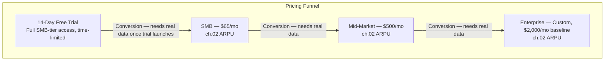

# 09 — Monetization

**Chapter:** 09 of 11
**Purpose:** Define pricing tiers, overage rates, and the revenue model for Omnilinks.

---

## Reconciliation With Chapter 02, and What's Still Open

The prior revision fixed a hard inconsistency: an earlier draft's five-tier ladder ($29/$99/$299/Custom) didn't match chapter 02's $65/$500/$2,000 ARPU assumptions at all. That's now fixed — pricing matches chapter 02 exactly.

**But matching chapter 02 isn't the same as justifying the price.** Chapter 02 itself already labels these ARPU figures as assumptions "to be updated after pilot customers validate pricing" — so reconciling chapter 09 to chapter 02 closes a consistency bug, it doesn't close the deeper question of whether $65/$500/$2,000 are the *right* numbers. That question is still genuinely open and can only be resolved with real pilot-customer data, not by matching two chapters to each other.

**Partial, real justification available now:** chapter 04's competitor research (Zendesk $19–$169+/agent/month plus separate per-resolution AI fees; Freshdesk $19–$89/agent/month plus a separate AI add-on) gives some directional support. Omnilinks' $65/mo SMB price is a **flat, all-inclusive** rate rather than a per-seat-plus-AI-addon stack — for a small team of 3-5 agents actively using AI features, competitor pricing (seats × per-agent cost + AI fees) plausibly exceeds $65 fairly quickly. That's a real positioning argument, not proof of the right price point — it supports "$65 is plausibly competitive for a small team," not "$65 is optimal."

---

## Pricing Funnel

> **Changed from a permanent Free tier to a 14-day trial.** A forever-free tier on an AI-inference-heavy product is a real, uncapped cost exposure (ties to R-07 LLM Cost Overruns and R-16 Vendor Lock-in in chapter 08) with no natural end point. It also cleanly resolves the open item from the prior draft — whether Free-tier signups counted toward chapter 02's "Active Tenants" target. A time-limited trial clearly doesn't count; a permanent free tier was ambiguous.

---

## Pricing Tiers

| Tier | Price | Agents | Channels | Messages/mo | AI Credits/mo | Knowledge Bases |
|-----|-------|--------|----------|----------|------------|-----------------|
| 14-Day Trial | $0 for 14 days | Full SMB allocation | Full SMB allocation | Full SMB allocation | Full SMB allocation | Full SMB allocation |
| SMB | $65/mo (ch.02 ARPU) | 5 | 3 | 10,000 | 2,500 | 5 |
| Mid-Market | $500/mo (ch.02 ARPU) | 25 | 6 (all channels) | 100,000 | 25,000 | 25 |
| Enterprise | Custom, $2,000/mo baseline (ch.02 ARPU) | Unlimited | Unlimited | Custom | Custom | Unlimited |

**Annual billing option:** 15–20% discount for annual commitment, standard SaaS practice — improves cash collection timing, retention, and effective CAC payback. Exact discount percentage is a placeholder pending a real cash-flow/retention tradeoff analysis, not yet modeled.

> **What an "AI Credit" actually is (previously undefined):** 1 AI Credit = 1 AI-generated response to a customer message. This is the clearest, most measurable unit — not tokens (too invisible to customers) and not full conversations (too variable in length). Multi-turn AI-handled conversations consume one credit per AI response within that conversation, not one credit per conversation.

---

## Overage Rates (Usage-Based Billing)

| Resource | SMB | Mid-Market | Enterprise |
|----------|---------|---------------|------------|
| Extra Agent | $10/mo | $8/mo | Custom |
| Extra Channel | $15/mo | $12/mo | Custom |
| Extra Messages (per 1K) | $2 | $1.50 | Custom |
| Extra AI Credits (per 100) | $5 | $4 | Custom |
| Extra Knowledge Base | $10/mo | $8/mo | Custom |

> **Open item:** these rates are still cost-plus guesses, not validated against either actual infrastructure cost or customer value. "$15 for an extra channel" in particular doesn't obviously reflect $15 of marginal cost or $15 of customer value — it needs revisiting once there's real cost-to-serve data. AI Credit overage pricing specifically can't be confirmed profitable until Gross Margin % (open since chapter 03) is resolved — see Unit Economics below.

---

## Enterprise-Specific Revenue Streams

Beyond subscription and usage, Enterprise accounts (chapter 04's highest-ARPU segment, chapter 07's SSO/audit/custom-SLA scope) typically generate revenue the base pricing model above doesn't capture:

| Stream | Notes |
|---|---|
| Professional Services / Implementation | Custom onboarding, integration work beyond self-serve setup |
| Migration Services | Importing data/config from an incumbent (Zendesk, Freshdesk, etc. — ch.04) |
| Premium Support / Dedicated SLA | Ties to ch.07's Enterprise scope item |
| Training | Admin/agent onboarding for larger teams |
| Dedicated Infrastructure | For accounts needing isolated compute/data residency (ties to ch.07's on-premise open item) |
| Custom AI Fine-tuning | Future — not in current MVP scope (ch.07) |

None of these have rate cards yet — they're flagged as a real gap, not priced here, since Enterprise deals are custom by nature and pricing these prematurely would just be more invented numbers.

---

## Add-Ons (Expansion Revenue)

A base-plan-plus-add-ons model, common in SaaS, not yet modeled here beyond the concept:

- Voice/VoIP usage pack
- Extra AI capacity pack
- Extra storage pack
- Analytics/BI pack (ties to chapter 01's "post-launch, ongoing" Analytics placement)

Rate cards TBD — flagged as a future expansion-revenue lever, not priced yet.

---

## Unit Economics (Framework, Not Validated Numbers)

This is where chapter 03/06/08's long-standing "Gross Margin: not yet defined" open item needs to actually get resolved — but resolving it means real cost data, not another placeholder number. The table below is the structure to fill in, not filled-in numbers:

| Item | SMB | Mid-Market | Enterprise |
|---|---|---|---|
| Monthly Revenue | $65 | $500 | $2,000+ |
| Infrastructure cost | **TBD** | **TBD** | **TBD** |
| AI/LLM cost | **TBD** — depends on actual usage against the 2,500/25,000/custom AI Credit allocations above | **TBD** | **TBD** |
| Storage cost | **TBD** | **TBD** | **TBD** |
| Support cost | **TBD** | **TBD** | **TBD** |
| Gross Margin % | **Not yet defined** | **Not yet defined** | **Not yet defined** |

CAC/LTV/Payback framework — same treatment:

| Metric | SMB | Mid-Market | Enterprise |
|---|---|---|---|
| CAC | **TBD** | **TBD** | **TBD** |
| LTV | **TBD** — depends on Gross Margin % above | **TBD** | **TBD** |
| CAC Payback | **TBD** (industry SaaS benchmark context only: 12–18 months is typical, not an Omnilinks-specific target) | **TBD** | **TBD** |

> **This table cannot be filled in responsibly without real infrastructure/AI cost measurement.** Chapter 02's $100,000 Year 1 AI/API budget is a top-down guess, not built from a per-tenant cost model — closing that gap is a prerequisite for LTV/CAC (chapter 02 OBJ-11) actually meaning anything.

---

## Future / Diversified Revenue Streams

| Revenue Stream | Priority | Notes |
|---|---|---|
| Platform Subscription | Core | Live in this chapter |
| Usage-Based AI Billing | Core | Live, pending margin validation above |
| Additional Seats/Channels | Core | Live |
| Professional Services (Enterprise) | High | Not yet priced |
| Marketplace Revenue Share | Future | Ties to chapter 07's "Marketplace/App Store — V3" out-of-scope item; typical model is a 20–30% revenue share, not yet decided for Omnilinks |
| White-Label Licensing | Future | Not yet scoped anywhere in this BRD |
| Custom AI Fine-Tuning | Future | Not in current MVP scope |

---

## Open Items Carried Forward

1. $65/$500/$2,000 ARPU remains an assumption per chapter 02's own wording — needs real pilot-customer validation, not just cross-chapter consistency.
2. Overage rates are cost-plus guesses, not validated against real cost-to-serve or customer value.
3. Unit Economics table needs real infrastructure/AI cost measurement before Gross Margin %, CAC, or LTV mean anything — this is now the single most-referenced open item in the BRD (chapters 03, 06, 08, and twice in this chapter).
4. Enterprise revenue streams (professional services, migration, training, dedicated infra) have no rate cards yet.
5. Chapter 06 should add Gross Revenue Retention alongside the existing Net Revenue Retention metric — a real SaaS metric currently missing there.
6. Annual billing discount percentage (15–20% suggested) isn't yet modeled against cash-flow/retention tradeoffs.

---

> **Next:** [Chapter 10 — Regulatory](10-regulatory.md)