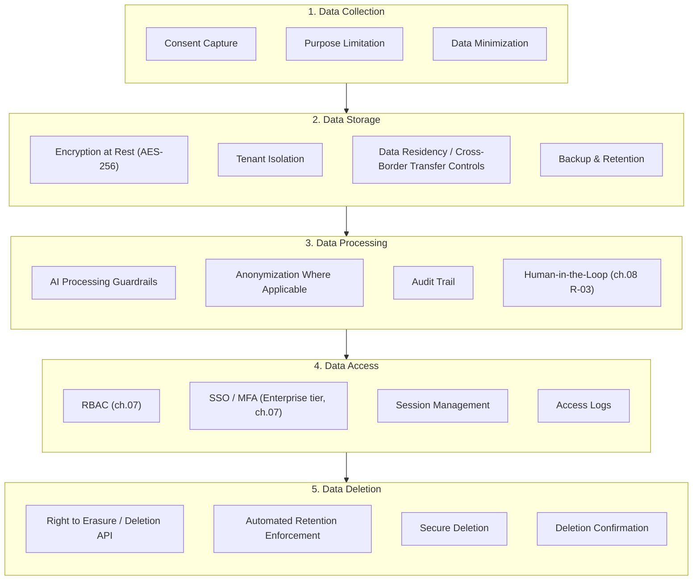
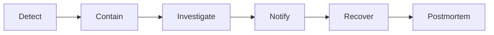
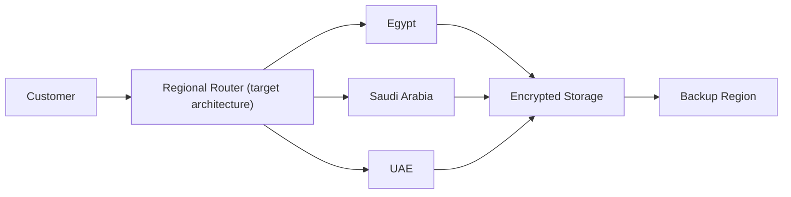

# 10 — Regulatory

**Chapter:** 10 of 11
**Purpose:** Define compliance requirements and the regulatory framework for Omnilinks, scoped to its actual confirmed and planned markets.

> **This chapter is general regulatory orientation, not legal advice.** Omnilinks should engage local counsel in each market before finalizing compliance architecture — especially given how fast enforcement postures are moving (see Saudi Arabia below).

---

## Major Correction From the Prior Draft

An earlier draft of this chapter listed **GDPR (EU), CCPA (California), and NDPR (Nigeria)** as the compliance framework — none of which are relevant to Omnilinks' actual markets. This is a direct regression: the index chapter's own version history explicitly documents that version 1.1 already "replaced undifferentiated 'MENA' and unsupported NDPR/GDPR/CCPA entries with confirmed scope: Egypt (launch) plus Qatar, UAE, Saudi Arabia, Morocco." The prior draft of this chapter reverted to the pre-1.1 state and, worse, never actually named the five regulations the index chapter already committed to: Egypt PDPL (Law 151/2020), UAE PDPL, Saudi PDPL, Qatar Law No. 13/2016, Morocco Law 09-08. Rebuilt below to match.

---

## Regulatory Framework — Confirmed & Planned Markets Only

| Market | Regulation | Status | Key Notes |
|---|---|---|---|
| Egypt | PDPL (Law 151/2020) | Confirmed, baseline (launch market) | Consent-based processing, data subject rights, cross-border transfer restrictions requiring adequacy or contractual safeguards. |
| Saudi Arabia | PDPL (Royal Decree M/19, 2021; amended M/148, 2023) | Required at Saudi entry | **Actively enforced as of 2026** — SDAIA issued 48 enforcement decisions in the past year. No cross-border adequacy list published; transfers require SDAIA-approved SCCs or BCRs plus a risk assessment. Mandatory controller registration on SDAIA's National Data Governance Platform. 72-hour breach notification. Fines up to SAR 5M (~$1.3M), with criminal liability possible for intentional sensitive-data violations. **Does not mandate full physical data localization** — cross-border cloud hosting is permitted with the right contractual safeguards, contrary to a "cloud vs. on-prem" binary assumption. |
| UAE | Federal Decree-Law No. 45 of 2021 (PDPL) | Required at UAE entry | Note: UAE also has separate free-zone data protection regimes (DIFC Data Protection Law, ADGM Data Protection Regulations) that may apply instead of or alongside federal PDPL depending on where Omnilinks is licensed to operate — this distinction needs local counsel input before entry. |
| Qatar | Law No. 13 of 2016 (Personal Data Privacy Protection Law) | Required at Qatar entry | Qatar Financial Centre (QFC) has a separate data protection regime for QFC-licensed entities — same free-zone-vs-mainland nuance as UAE, needs verification against however Omnilinks is structured there. |
| Morocco | Law 09-08 | Required at Morocco entry | Enforced by the CNDP; requires prior declaration/authorization for certain processing activities, including cross-border transfers. |

> **General characteristics above, not verified market-by-market with the same depth as Saudi Arabia (which was checked directly).** UAE, Qatar, and Morocco entries should get the same verification pass before this chapter is investor-facing.

---

## Payment Compliance (PCI-DSS) — Corrected Scope

The prior draft treated PCI-DSS as a full compliance program ("Cardholder Data Protection, Access Control, Network Security, Regular Monitoring" — "Planned"). That overstates the actual scope established back in chapter 01: **using Paymob's hosted checkout/tokenization keeps Omnilinks at SAQ-A self-attestation**, not a full PCI-DSS program, *provided* Omnilinks doesn't handle raw card fields directly. That confirmation with Paymob is still an open item from chapter 01 — this chapter shouldn't imply a full program is underway until that's settled.

| Item | Status |
|---|---|
| PCI-DSS scope | **SAQ-A (self-attestation), contingent on confirmed hosted-checkout/tokenization mode — not yet confirmed with Paymob (ch.01 open item)** |
| Full PCI-DSS program | Not applicable under the current architecture assumption; would only become relevant if Omnilinks ever handles raw card data directly |

---

## SOC 2 — Realistic Timing, Not "In Progress"

The prior draft listed SOC 2 Type II as "In Progress." Given chapter 05's lean, founder-led Year 1 structure and chapter 02's $1.35M total Year 1 budget, a full SOC 2 Type II audit (typically $20K–$100K+ and 6–12 months of evidence collection against mature security processes) is unlikely to be realistic pre-launch. Chapter 08's R-01 mitigation already describes this more accurately as "a path toward SOC 2," not an active audit.

| Item | Status |
|---|---|
| SOC 2 Type II | **Future — not a Year 1 commitment.** Realistic trigger point is likely tied to Enterprise sales requiring it as a deal condition (chapter 04's Enterprise segment), not a fixed calendar date. |

---

## Data Lifecycle Controls

(Renamed from the prior draft's duplicate "Compliance Framework" heading to avoid confusion with the regulatory framework above — these are platform-level controls that apply across all five markets, not a second regulatory list.)

---

## Scope Note

The recommendations below turn regulatory *awareness* into actual platform *controls* — a genuinely valuable shift. But building out the full version of every item (ISO 27001 certification program, complete SSDLC pipeline, HSM, PAM/ABAC/SCIM) would make this chapter a standalone enterprise Security & Compliance Architecture document, which is arguably a separate deliverable for whenever Omnilinks has a dedicated Security function (still an open gap per chapter 08). What follows is scoped to what's realistic to commit to now, with heavier items marked as roadmap references rather than current or near-term work.

---

## Compliance Traceability Matrix

| Regulation | Requirement | Omnilinks Control | Status |
|---|---|---|---|
| Egypt PDPL | Consent | Consent capture at onboarding (Data Lifecycle Layer 1) | Planned |
| Egypt PDPL | Right to erasure | Deletion API (Data Lifecycle Layer 5) | Planned |
| Saudi PDPL | Cross-border transfer | SDAIA-approved SCCs/BCRs + risk assessment (see Saudi entry above) | Not yet built — real engineering/legal scope, not just documentation |
| Saudi PDPL | 72-hour breach notification | Incident Response lifecycle below | Planned |
| UAE PDPL | Audit | Audit logs (Data Lifecycle Layer 3/4) | Planned |
| PCI-DSS (SAQ-A) | Cardholder data protection | Paymob hosted checkout/tokenization | Contingent on ch.01's open confirmation with Paymob |
| All markets | Access control | RBAC (ch.07); SSO/MFA at Enterprise tier (ch.07) | RBAC planned for MVP; SSO/MFA Enterprise-tier only |

---

## Data Classification

| Data Type | Example | Classification | Encryption | Retention |
|---|---|---|---|---|
| Customer messages | WhatsApp/Telegram/etc. chat content | Confidential | At rest + in transit | Per-tenant configurable, default TBD |
| AI embeddings | Vector DB entries | Confidential | At rest | Tied to source document retention |
| Billing/invoice data | Payment records | Restricted | At rest + in transit | Per regulatory minimum (varies by market) |
| Authentication data | Password hashes, session tokens | Restricted | At rest | Session-based / rotation policy |
| Analytics | Aggregated, de-identified metrics | Internal | Standard | Indefinite (aggregated, not personal data) |
| Audit logs | Access/security events | Internal | At rest | Minimum per applicable regulation (e.g., supports Saudi's 72hr notification capability) |

---

## AI Governance

Directly tied to risks already identified in chapter 08 (R-03 hallucination, R-18 model drift, R-16 vendor lock-in) rather than a new framework invented separately:

| Control | Status |
|---|---|
| Prompt/response logging | Planned — needed for R-03 human-in-the-loop review and dispute resolution |
| AI output moderation/content filtering | Planned (ch.08 R-03 mitigation) |
| Model version tracking | Planned — needed to diagnose R-18 model drift when a provider updates a model |
| AI risk classification (which use cases require human review) | Not yet defined — recommend defining before launch, not after an incident |
| Prompt injection / jailbreak protection | Future — not yet scoped as engineering work anywhere in this BRD |

### AI Data Governance — Questions Needing Real Decisions

These are the questions enterprise buyers will actually ask, and this BRD doesn't yet answer them:

| Question | Current Answer |
|---|---|
| Are customer prompts/messages used to train third-party foundation models? | **Not yet decided.** Major LLM API providers (OpenAI, Anthropic, Google) generally do not train on API-tier data by default, but this varies by provider and contract tier and needs explicit confirmation and contractual guarantee, not an assumption. |
| Can customers opt out of AI processing for specific data? | Not yet defined |
| How long are prompts/AI interaction logs retained? | Not yet defined |
| Are prompts anonymized before logging? | Not yet defined |
| Which model processes which tenant's data (given the multi-LLM router, ch.01)? | Not yet defined — worth documenting per-provider data handling terms, since routing to different providers may mean different data-handling guarantees per request |

---

## Identity & Access Management — Roadmap

| Capability | Timing |
|---|---|
| RBAC | MVP (ch.07) |
| SSO / MFA | Enterprise tier (ch.07) |
| ABAC, SCIM, Just-in-Time Access, Privileged Access Management | Future roadmap — not committed for MVP or Year 1 |

---

## Security Framework Alignment (Reference, Not Current Certification)

| Framework | Purpose | Relevance Timing |
|---|---|---|
| OWASP ASVS / API Top 10 / LLM Top 10 | Secure application, API, and AI design | Should inform engineering practice now; not a certification |
| CIS Benchmarks | Infrastructure hardening | Ongoing engineering reference |
| NIST CSF | Security governance | Reference framework, not a program Omnilinks is pursuing yet |
| ISO 27001 | ISMS certification | Long-term, likely tied to larger Enterprise/international deals |
| SOC 2 Type II | Customer trust | Future — see note above, not Year 1 |

---

## Incident Response Lifecycle

**Notification timelines are real regulatory deadlines, not arbitrary:** Saudi Arabia's PDPL requires breach notification to SDAIA within **72 hours** (verified above). Other markets' timelines need the same direct verification given to Saudi before this chapter is finalized. Internal responsibility mapping (who does what in each phase) should reference chapter 05's stakeholder roles — but as chapter 08 already flagged, there's no dedicated Security function yet to formally own "Contain" and "Investigate."

---

## Data Residency — Target Architecture (Not Yet Built)

> This is a target diagram, not current infrastructure — chapter 07's MVP scope is cloud-only without a defined multi-region routing strategy. Saudi Arabia's verified rules above don't require full in-country hosting, so this may end up being a lighter build (transfer-mechanism compliance) than the diagram implies — worth resolving before committing engineering time to build actual regional clusters.

---

## Key Management

| Practice | Timing |
|---|---|
| Envelope encryption via cloud provider KMS | MVP — standard practice, low incremental cost |
| Key rotation policy | MVP |
| Per-tenant encryption keys | Future / Enterprise roadmap |
| HSM (Hardware Security Module) | Future — likely only justified at larger scale or specific Enterprise/regulatory demand |

---

## Privacy by Design Principles

- Data minimization (already reflected in Data Lifecycle Layer 1)
- Purpose limitation
- Storage limitation (ties to retention policies in Data Classification above)
- Default-secure settings (encryption/access controls on by default, not opt-in)
- Privacy impact assessment before launching in each new market — not yet a defined process anywhere in this BRD

---

## Customer-Facing Compliance Features

| Feature | Timing |
|---|---|
| Consent management | MVP |
| Data export | MVP |
| Right-to-erasure | MVP |
| Audit logs (customer-visible) | MVP |
| Retention policy configuration | MVP |
| Legal hold, DLP, access reports | Future / Enterprise roadmap |

---

## Shared Responsibility Model

| Responsibility | Omnilinks | Customer |
|---|---|---|
| Infrastructure security | ✅ | |
| Platform authentication | ✅ | |
| Tenant user permissions | | ✅ |
| Knowledge base content accuracy | | ✅ |
| AI prompt quality/appropriateness | | ✅ |
| Data retention policy (platform capability vs. configuration) | ✅ Platform capability | ✅ Configuration choice |
| API credential security | | ✅ |

---

## Compliance Roadmap (Phased by Market Entry)

Ties directly to chapter 04's phased entry order (still an open item — entry sequence isn't finalized):

| Phase | Compliance Target |
|---|---|
| MVP / Egypt launch | Egypt PDPL, PCI SAQ-A (contingent on Paymob confirmation) |
| Saudi entry | Saudi PDPL — cross-border transfer mechanism (SCCs/BCRs), SDAIA registration |
| UAE entry | UAE PDPL (federal or free-zone, per entity structure) |
| Qatar / Morocco entry | Qatar Law 13/2016, Morocco Law 09-08 — both still need the same verification depth as Saudi |
| Enterprise sales maturity | SOC 2 Type II |
| Long-term | ISO 27001, if justified by deal flow |

---

## Open Items Carried Forward

1. UAE, Qatar, and Morocco regulatory entries need the same direct verification pass given to Saudi Arabia above — not yet done to the same standard.
2. Free-zone vs. mainland regulatory distinction (UAE's DIFC/ADGM, Qatar's QFC) needs resolving once Omnilinks' legal entity structure in those markets is decided — not addressed anywhere else in this BRD yet.
3. PCI-DSS SAQ-A scope remains contingent on confirming Paymob's hosted-checkout/tokenization mode (open since chapter 01).
4. SOC 2 realistically ties to Enterprise sales requirements, not a fixed Year 1 date — chapter 02's investment budget doesn't currently allocate for it.
5. Chapter 07's "cloud-only, no on-premise" assumption is **likely still workable for Saudi Arabia specifically** (no full localization mandate), provided SDAIA-approved cross-border transfer mechanisms (SCCs/BCRs) and controller registration are built — this is real engineering/legal scope not yet reflected in chapter 07, not just a documentation checkbox.
6. Entry order/timing across Qatar/UAE/Saudi/Morocco (open since the index chapter) should factor in regulatory readiness — e.g., Saudi Arabia's active enforcement posture arguably needs more compliance lead time than a market with less mature enforcement.
7. AI Data Governance questions (training data use, prompt retention, anonymization) need real decisions and per-provider contractual confirmation — not yet answered anywhere in this BRD, despite being likely early questions from Enterprise buyers (ch.04 ICP).
8. Data residency target architecture may be lighter-weight than a full regional-cluster build, given Saudi's rules don't mandate full localization — worth confirming before committing real engineering time.
9. Heavier security-architecture items (ISO 27001, full IAM stack, SSDLC pipeline) are captured here as roadmap references only — a full build-out likely warrants its own Security & Compliance Architecture document once a dedicated Security function exists (ch.08 gap).

---

> **Next:** [Chapter 11 — Glossary](11-glossary.md)