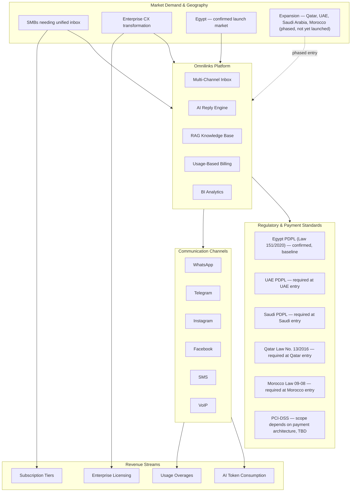

# Omnilinks — Business Requirements Document (BRD)

**Version:** 1.1
**Date:** July 2026
**Status:** Draft
**Author:** Product Strategy Team

---

## Document Purpose

This Business Requirements Document (BRD) defines the business context, objectives, scope, and success criteria for the **Omnilinks** omnichannel customer engagement platform. It serves as the authoritative reference for all stakeholders — executive sponsors, product managers, engineering leads, and operations teams — to align on what the business needs and why.

---

## Business Context Overview

The following diagram illustrates the high-level business ecosystem surrounding Omnilinks: market demand and target geographies, how the platform's core capabilities connect to the channels it operates on, how channel activity drives revenue, and the regulatory/payment obligations that follow from the confirmed and planned markets.

> **Open items carried into later chapters (not yet resolved):**
> - Entry order and timing across Qatar / UAE / Saudi Arabia / Morocco — chapter 4.
> - Whether Morocco (different dialect, currency, and timezone band from the Gulf markets) is staged separately from the Gulf three, or launched together — chapter 4 and chapter 9.
> - Payment architecture (processor-routed vs. in-house card handling), which determines actual PCI-DSS scope — chapter 9, informs SAD.
> - Whether Usage Overages and AI Token Consumption are overlapping or mutually exclusive billing events — chapter 9.

---

## Table of Contents

### BRD Chapters

| # | Chapter | Description |
|---|---------|-------------|
| 01 | [Executive Summary](01-executive-summary.md) | High-level overview of the business case, vision, and expected outcomes |
| 02 | [Business Objectives](02-business-objectives.md) | Quantified strategic goals and target KPIs |
| 03 | [Problem Statement](03-problem-statement.md) | Current pain points and desired future state |
| 04 | [Target Market](04-target-market.md) | Addressable market segments and sizing, including Egypt launch and phased Qatar/UAE/Saudi/Morocco expansion |
| 05 | [Stakeholders](05-stakeholders.md) | Key stakeholders and their influence/interest |
| 06 | [Success Metrics](06-success-metrics.md) | Balanced scorecard of KPIs and success criteria |
| 07 | [Scope](07-scope.md) | In-scope and out-of-scope features |
| 08 | [Risk Analysis](08-risk-analysis.md) | Risk matrix with probability and impact |
| 09 | [Monetization](09-monetization.md) | Pricing tiers, overage rates, and revenue model |
| 10 | [Regulatory](10-regulatory.md) | Compliance requirements per confirmed and planned market |
| 11 | [Glossary](11-glossary.md) | Key terms and definitions |

---

## Document Conventions

| Convention | Meaning |
|------------|---------|
| **Bold** | Key terms or emphasis |
| `Code` | Technical references or API endpoints |
| > | Important callouts or warnings |
| KPI | Key Performance Indicator |
| TAM/SAM/SOM | Total/Serviceable/Obtainable Market |
| MENA | Middle East & North Africa — used here to mean the confirmed target set: Egypt, Qatar, UAE, Saudi Arabia, Morocco, not the full geographic bloc |

---

## Version History

| Version | Date | Author | Changes |
|---------|------|--------|---------|
| 1.0 | July 2026 | Product Strategy Team | Initial draft for stakeholder review |
| 1.1 | July 2026 | Product Strategy Team | Corrected diagram/caption mismatch; connected Channels to Revenue; replaced undifferentiated "MENA" and unsupported NDPR/GDPR/CCPA entries with confirmed scope: Egypt (launch) plus Qatar, UAE, Saudi Arabia, Morocco (phased expansion); reclassified PCI-DSS as a payment standard rather than government regulation, pending payment-architecture decision |

---

> **Next:** Read the [Executive Summary](01-executive-summary.md) for a high-level overview of the business case.