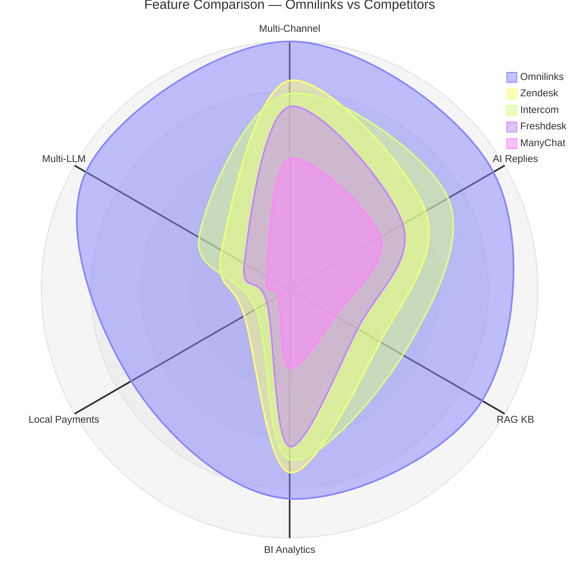
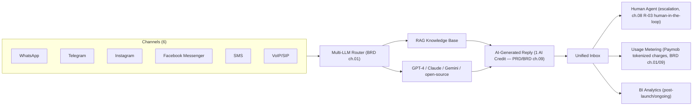

# 01 — Product Overview

**Chapter:** 01 of 09 *(Table of Contents below only lists 8 chapters — flagging this mismatch; if there's a 9th chapter, e.g. a Glossary paralleling the BRD's structure, it's missing from the TOC below)*
**Purpose:** Provide a comprehensive overview of the Omnilinks product, its features, and market positioning.

---

## Feature Comparison Radar

> **Syntax fix:** the prior draft used `radarChart` with `x-axis`/array syntax, which is actually `xychart-beta` syntax misapplied to a radar chart — mermaid's real radar syntax is `radar-beta` with `axis`/`curve`. Corrected below. Scores themselves remain illustrative/subjective (a 1–100 self-assessment scale), except Starting Price data, which is now verified.

> **"Local Payments" lowered from 95 to 70 for Omnilinks.** Paymob (chapter 01 of the BRD) only covers 3 of Omnilinks' 5 confirmed markets — Egypt, UAE, Saudi Arabia. Qatar and Morocco still have no selected processor. A 95/100 score overstated a capability that's genuinely unresolved in 40% of confirmed markets.

---

## Key Differentiators

| Differentiator | Omnilinks | Zendesk | Intercom | Freshdesk | ManyChat |
|----------------|-----------|---------|----------|-----------|----------|
| Multi-Channel Inbox | ✅ 6 channels | ✅ | ✅ | ✅ | ❌ |
| Multi-LLM AI | ✅ | ❌ | ❌ | ❌ | ❌ |
| RAG Knowledge Base | ✅ | ❌ | ❌ | ❌ | ❌ |
| MENA Payments (Paymob) | ✅ Egypt/UAE/Saudi confirmed; Qatar/Morocco pending | ❌ | ❌ | ❌ | ❌ |
| BI Analytics | ✅ Built-in, post-launch (BRD ch.01) | ✅ Add-on | ✅ Add-on | ✅ Add-on | ❌ |
| Free Tier | ❌ 14-day trial only (BRD ch.09 — removed permanent free tier due to uncapped AI-inference cost risk, ch.08 R-07/R-16) | ❌ | ❌ | ✅ | ✅ |
| Starting Price | **$65/mo** (BRD ch.02 SMB ARPU) | $19/mo (lowest tier; Suite plans run $55–$115+/agent/mo) | $29/seat/mo (Essential) + $0.99/AI resolution | $19/mo (core ticketing; Omni/omnichannel product starts higher, ~$29/mo) | Not verified — flagging rather than guessing |

> **Corrected from the prior draft, which listed Omnilinks at $29/mo and marked Free Tier as ✅.** Both directly contradicted decisions already made elsewhere in this document set: chapter 09 of the BRD reconciled Omnilinks' SMB price to $65/mo (matching chapter 02's ARPU model) specifically *because* an earlier $29 draft didn't match the revenue model, and chapter 09 separately replaced a permanent Free tier with a 14-day trial because of real AI-cost exposure. Reintroducing both numbers here would silently undo two decisions already made for good reasons.

> **On "Starting Price" as a comparison point:** Omnilinks' $65/mo is a flat, all-inclusive rate; the competitors above are per-agent/per-seat, and several (Freshdesk, Intercom) split ticketing/omnichannel/AI into separately-priced add-ons. A team of 3–5 agents actively using AI features on Freshdesk or Intercom plausibly exceeds $65/mo quickly once seats and AI add-ons stack — this is a real positioning argument (already noted in the BRD's chapter 09), not proof that $65 is the "cheaper" option in every case.

---

## Value Proposition Canvas

| Customer Jobs | Pains (Current State — BRD ch.03) | Gains Sought |
|---|---|---|
| Respond to customers across whichever channel they chose | Manual tool-switching, inconsistent response quality across channels | One inbox, consistent AI-assisted quality everywhere |
| Scale support without linearly scaling headcount | Manual routing doesn't scale; agent burnout drives turnover | AI auto-resolution (BRD ch.02 OBJ-05: 45% baseline/65% stretch) handles routine volume |
| Understand what's actually happening across channels | No unified analytics; decisions made on incomplete data | Real-time BI dashboards (post-launch/ongoing, BRD ch.01) |
| Accept payments and bill customers in-region | Global tools often lack MENA-specific payment rails | Paymob integration for Egypt/UAE/Saudi (Qatar/Morocco pending) |

| Product Pain Relievers | Product Gain Creators |
|---|---|
| Multi-LLM router removes single-provider AI lock-in (ties to ch.08 R-16) | RAG knowledge base gives contextually accurate, company-specific answers |
| Unified inbox removes tool-switching entirely | Usage-based billing scales cost with actual usage, not flat overprovisioning |
| Per-tenant isolation removes cross-customer data risk (BRD ch.07) | Beachhead-first go-to-market (SaaS + E-Commerce, BRD ch.04) means faster time-to-value for early-adopter verticals |

---

## Product Architecture Overview

> This is the conceptual data-flow architecture already implied across multiple BRD chapters (01, 07, 09) — consolidated here as a single diagram for the first time, not a new technical decision.

---

## Why Now

Three macro trends already named in the BRD's chapter 01 strategic context, restated here at product level:

1. **Conversational commerce** — customers increasingly expect to transact inside messaging apps, not via a separate web form or phone call.
2. **AI democratization** — multi-LLM access makes an enterprise-grade AI reply engine affordable for SMB budgets, not just large incumbents.
3. **MENA digital transformation** — Egypt, the Gulf, and North Africa are actively investing in digital infrastructure, and existing tools (Zendesk, Freshdesk, Intercom) have no MENA-specific payment or Arabic-first positioning.

---

## Why Omnilinks Wins (Per Competitor)

Using the verified pricing data above, not restated assumptions:

- **vs. Zendesk:** Zendesk's entry price ($19/mo) looks cheap, but Suite tiers with real AI/routing capability run $55–$115+/agent/month, and AI is billed separately per resolution on top. Omnilinks' flat $65/mo is simpler to budget against for a small team once AI usage is factored in.
- **vs. Intercom:** Intercom's $29/seat/month plus $0.99/resolution scales *with* customer volume, which is good at low volume and expensive at high volume (chapter 04's research found 1,000 sessions at 65% resolution costs ~$644/month on Intercom alone). Intercom is also mid-acquisition by Salesforce (announced June 2026) — real near-term roadmap uncertainty for a MENA buyer evaluating vendor stability.
- **vs. Freshdesk:** Freshdesk splits ticketing, omnichannel (Freshdesk Omni), and AI (Freddy Copilot) into separately-priced products — the advertised $19/mo doesn't include what a real omnichannel-plus-AI setup actually costs. Omnilinks is one product, one price.
- **vs. ManyChat:** Different category — marketing/broadcast automation, not a support inbox with RAG-grounded, ticket-level AI resolution. Not a close comparison despite appearing in some competitive sets.

---

## Core Use Cases (Mapped to Chapter 04's Beachhead Segments)

| Segment | Phase | Example Use Case |
|---|---|---|
| SaaS / Vertical Software | Year 1 beachhead | A 30-person SaaS company currently paying for Zendesk Suite + a separate AI add-on consolidates to one Omnilinks subscription, reducing both tool count and per-resolution AI cost volatility |
| E-Commerce | Year 1 beachhead | An online retailer handles order-status and return questions across WhatsApp and Instagram from one inbox, with RAG pulling answers from their actual product/return policy docs |
| Healthcare (clinics/hospital groups) | Year 2 | Appointment scheduling and follow-ups across WhatsApp/SMS, with the compliance posture chapter 10 already scoped per market |
| BPO / Customer Support | Year 2 | Tier-1 automation reduces routine ticket volume reaching human agents, addressed via chapter 02's Auto-Resolution target |
| Real Estate | Year 3 | Property inquiries and tour scheduling routed across WhatsApp/Telegram/VoIP |

---

## Product Principles

- **AI-assisted, not AI-only** — human-in-the-loop remains part of the design (BRD ch.08 R-03), not a fully autonomous support replacement.
- **MENA-first, not MENA-only** — payment and language support are built around Egypt/Gulf/Morocco realities first, without assuming those constraints generalize globally.
- **Usage-aligned pricing** — cost scales with actual AI/message usage (ch.09's metering layer) rather than flat overprovisioning.
- **Provider-agnostic where it matters** — multi-LLM routing and a pluggable payment-processor interface (BRD ch.01) exist specifically to avoid single-vendor lock-in risk (ch.08 R-16).

---

### PRD Chapters

| # | Chapter | Description |
|---|---------|-------------|
| 01 | [Product Overview](01-product-overview.md) | Detailed product description and feature comparison |
| 02 | [User Personas](02-user-personas.md) | Four detailed personas with empathy maps |
| 03 | [User Stories](03-user-stories.md) | User stories organized by epic |
| 04 | [Feature Specifications](04-feature-specifications.md) | Detailed specs with flow diagrams |
| 05 | [Acceptance Criteria](05-acceptance-criteria.md) | Gherkin-style acceptance criteria |
| 06 | [Non-Functional Requirements](06-non-functional-requirements.md) | Performance, scalability, security requirements |
| 07 | [Release Criteria](07-release-criteria.md) | Alpha/Beta/GA checklists |
| 08 | [Prioritization](08-prioritization.md) | RICE scores and prioritization matrix |

> **Open item:** header says "01 of 09" but only 8 chapters are listed. Worth confirming whether a 9th chapter (e.g., Glossary) is missing from this table, or whether "09" should be "08."

---

## Version History

| Version | Date | Author | Changes |
|---------|------|--------|---------|
| 1.0 | July 2026 | Product Management Team | Initial draft for stakeholder review |

---

> **Next:** [Chapter 02 — User Personas](02-user-personas.md)