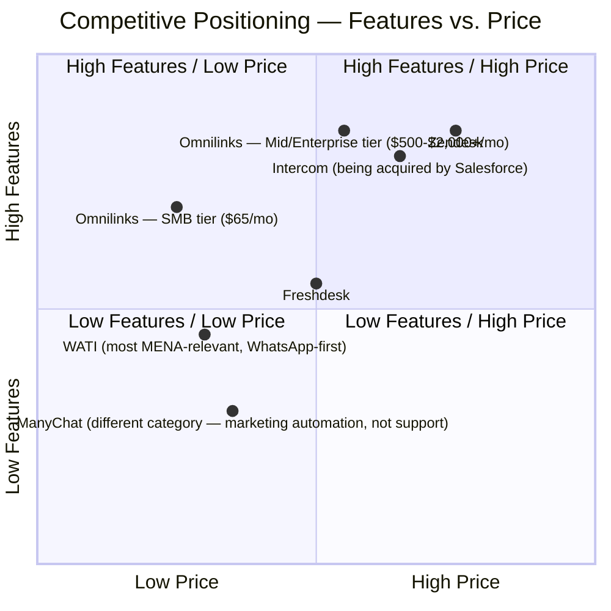

# Omnilinks — Product Requirements Document (PRD)

**Version:** 1.0
**Date:** July 2026
**Status:** Draft
**Author:** Product Management Team

---

## Product Vision

> **Omnilinks** is the unified AI-powered inbox that connects every customer conversation channel into one intelligent platform — enabling businesses to respond faster, smarter, and more personally at scale.

---

## Product Overview

Omnilinks is a multi-tenant SaaS backend that aggregates WhatsApp, Telegram, Instagram, Facebook Messenger, SMS, and VoIP into a single unified inbox. It features:

- **Multi-LLM AI Reply Engine** — Route conversations to the best-fit language model
- **RAG Knowledge Base** — Ingest company documents for accurate, contextual responses
- **Usage-Based Billing** — Paymob (Egypt, UAE, Saudi Arabia confirmed; Qatar/Morocco processor TBD per BRD ch.01), with a custom usage-metering layer built on tokenized merchant-initiated charges for overages and AI-token consumption — not a stock subscription feature
- **BI Analytics** — Real-time dashboards for business intelligence, positioned as post-launch/ongoing (BRD ch.01)

---

## Competitive Landscape

> **Revised using the BRD's actual competitor research (ch.04)** rather than a separate, unverified set. The prior draft omitted WATI — the competitor chapter 04 identified as most directly relevant to Omnilinks' actual MENA/WhatsApp-first market — while including Tidio and ManyChat, whose category fit is questionable (Tidio is a live-chat-widget product; chapter 07 explicitly scopes "Live Chat Widget" as *out of scope* for Omnilinks). Also using mermaid's actual `quadrantChart` type, consistent with how chapter 02 already plotted a 2x2 grid, rather than reinventing it with generic subgraph boxes.

> **Note on "Low Price" positioning:** an earlier draft placed a single "Omnilinks" point at High Features/Low Price across the board. That's only really defensible at the $65 SMB entry tier — Mid-Market ($500/mo) and Enterprise ($2,000+/mo) aren't obviously low-price compared to competitors, so Omnilinks is plotted here as two points, not one, to avoid overclaiming the pricing story across all three tiers.

---

## Acronyms

Expanded to include core business/product metrics and the correct regulatory acronym — the prior draft was missing several terms (MRR, NPS, MAU, ARPU, NRR, LTV, PDPL, MENA) that are central to both this PRD and the BRD, and included CCPA without flagging it as inapplicable to Omnilinks' actual markets.

| Acronym | Full Form |
|---------|-----------|
| API | Application Programming Interface |
| ARPU | Average Revenue Per (Tenant/Account) |
| ARR | Annual Recurring Revenue |
| BPO | Business Process Outsourcing |
| CAC | Customer Acquisition Cost |
| CAGR | Compound Annual Growth Rate |
| CCPA | California Consumer Privacy Act — **not applicable to Omnilinks' confirmed markets** (Egypt, Qatar, UAE, Saudi Arabia, Morocco) |
| CRM | Customer Relationship Management |
| CX | Customer Experience |
| DPO | Data Protection Officer |
| DPR | Data Protection Representative |
| DR | Disaster Recovery |
| EGP | Egyptian Pound |
| KPI | Key Performance Indicator |
| LLM | Large Language Model |
| LTV | Customer Lifetime Value |
| MAU | Monthly Active Users |
| MENA | Middle East and North Africa — **in this document set, scoped specifically to Egypt, Qatar, UAE, Saudi Arabia, and Morocco**, not the full geographic bloc (per BRD index chapter) |
| MFA | Multi-Factor Authentication |
| MRR | Monthly Recurring Revenue |
| NPS | Net Promoter Score |
| NRR | Net Revenue Retention |
| PCI-DSS | Payment Card Industry Data Security Standard |
| PDPL | Personal Data Protection Law — **a generic acronym shared by three distinct national laws** relevant here: Egypt's, Saudi Arabia's, and the UAE's (see BRD ch.10) |
| RAG | Retrieval-Augmented Generation |
| RBAC | Role-Based Access Control |
| ROI | Return on Investment |
| SAM | Serviceable Addressable Market |
| SAQ-A | Self-Assessment Questionnaire A — PCI-DSS's lightest compliance tier, applicable given Paymob's hosted/tokenized checkout |
| SIP | Session Initiation Protocol |
| SLA | Service Level Agreement |
| SMB | Small and Medium Business |
| SOC 2 | Service Organization Control 2 |
| SOM | Serviceable Obtainable Market |
| SSO | Single Sign-On |
| TAM | Total Addressable Market |
| VoIP | Voice over Internet Protocol |

---

> **Next:** [Chapter 01 — Product Overview](01-product-overview.md)