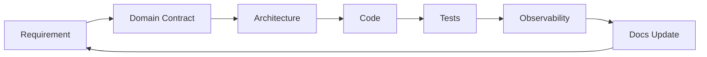

# OMILINKS Documentation Index

> Status: **Target / normative engineering design**.

## Purpose

This documentation set is the operating specification for OMILINKS. It is designed for engineers, reviewers, coding agents and future maintainers.

## Reading Order

1. Requirements define what must exist.
2. Architecture defines boundaries and interaction patterns.
3. Domain contracts define invariants and state.
4. API/events define machine-facing contracts.
5. Integrations define external dependencies and failures.
6. AI/security/data define high-risk controls.
7. Product defines UX expectations.
8. Engineering defines implementation and release discipline.

## Implementation Loop

## Current vs Target

The repository is still an implementation scaffold. A specification describes intended behavior; it is not evidence that the corresponding subsystem already exists in code.

## Directory Map

- `requirements/` product and quality requirements
- `architecture/` system, deployment, network and event architecture
- `domain/` business models and invariants
- `api/` HTTP contracts
- `events/` asynchronous contracts
- `integrations/` external providers
- `ai/` agent runtime and AI governance
- `security/` security controls
- `data/` storage, retention, backup and migration
- `product/` UX and design system
- `engineering/` coding, Git, PR, testing and release policy
