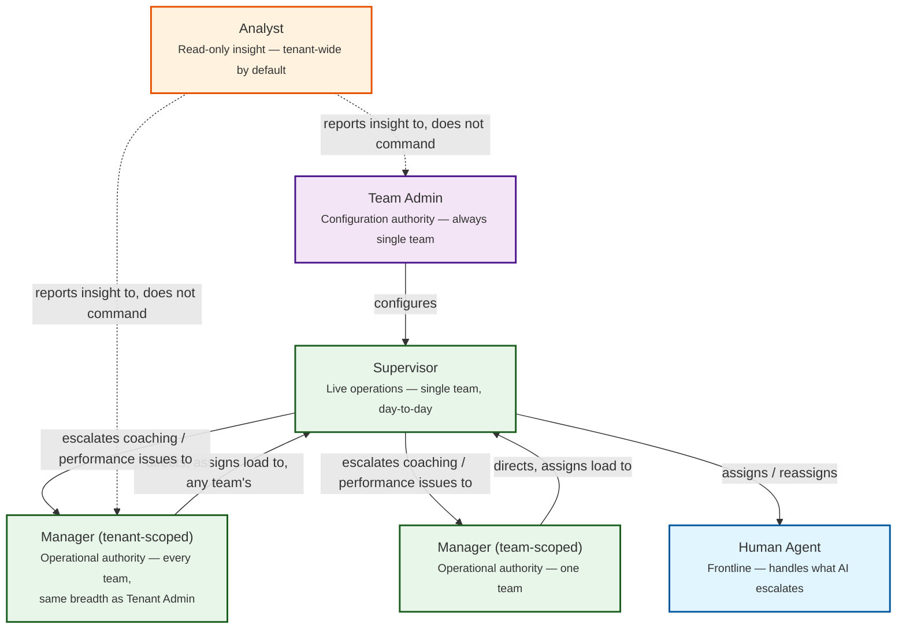

# SAD — Chapter 14: Role Reconciliation (Team Admin vs. Manager)

**Document:** Software Architecture Document
**Section:** Role Reconciliation Addendum
**Version:** 0.1.0
**Status:** Draft — resolves an open question left in ch.13, and is a prerequisite for ch.24 (Domain Model), ch.25 (ERD), and every RBAC-touching diagram from here on

---

## 1. The Problem

Chapter 13 defined `Team Admin`, `Manager`, `Supervisor`, `Human Agent`, and `Analyst` as team-level default role templates. In discussion, both **Team Admin** and **Manager** were described as able to create teams, create users, and assign permissions — which makes them functionally identical and breaks the permission model (two roles with one job is a modeling smell, not a feature).

This chapter resolves the overlap with a single axis of separation: **configuration authority vs. operational authority**, and a second axis: **single-team scope vs. cross-team scope**.

---

## 2. The Resolution

| Axis | Team Admin | Manager |
|---|---|---|
| **Authority type** | Configuration — owns how the team is *set up* | Operational — owns how the team (or the tenant) *runs day to day* |
| **Scope** | **Always single-team.** A Team Admin is never assigned at tenant level — that's what Tenant Admin is for. | **Variable, assigned per-instance:** a `team` Manager (one specific team), or a `tenant` Manager (every team in the tenant, same breadth as Tenant Admin). Not a fixed "cross-team" middle tier — the tenant admin decides at assignment time which it is. |
| **Can create/delete the team itself** | ✅ Yes | ❌ No, regardless of scope |
| **Can configure AI, channels, queues, integrations for the team** | ✅ Yes | ❌ No, regardless of scope |
| **Can invite a brand-new user into the tenant** | ✅ Yes (into their team) | ❌ No — Manager assigns *existing* tenant users into/out of teams, but user creation is a Team Admin or Tenant Admin action |
| **Can activate/deactivate/move existing users between teams** | ✅ Within their own team | ✅ Yes — within whichever scope they hold (their one team, or all teams if tenant-scoped) |
| **Can assign conversations, manage schedules, approve escalations** | ⚠️ Can, but this is not their primary job | ✅ Yes — this is the primary job, at whatever scope they hold |
| **Can change team-level permission templates** | ✅ Yes | ❌ No — Manager assigns existing roles to users, but does not redefine what a role can do |
| **Can view KPIs / operational dashboards** | ✅ Yes (their team) | ✅ Yes (their team, or every team, matching their scope) |

**In one line:** Team Admin owns the *shape* of one team, always. Manager owns *throughput*, and can be pointed at one team or at the whole tenant — the same way you might have one Tenant Admin but several Managers, some running a single team, one running operations tenant-wide. Manager is never a second Team Admin, no matter which scope it holds, because it never touches configuration.

**Why this isn't "just give them Tenant Admin instead":** a tenant-wide Manager and Tenant Admin still differ in *authority type*, not just scope. A tenant-wide Manager can reassign conversations, rebalance load, and approve escalations across every team — but still cannot create/delete a team, touch billing, or reconfigure integrations. Scope answers "how much of the tenant," authority type answers "what kind of power" — they're independent, and collapsing them would recreate the original Team-Admin/Manager overlap at the tenant level instead of the team level.

---

## 3. Why This Split, Not Another One

- It matches what Ahmed described for **Human Agent** and **Analyst** without any changes — those two were already unambiguous.
- It gives Manager a reason to exist that Team Admin doesn't already cover: **most tenants will have more teams than Team Admins want to configure individually**, and a cross-team operational role (assign load across Arabic Support *and* VIP Support, for instance) is a real, common enterprise need that a single-team-scoped Team Admin structurally cannot fill.
- It keeps `team.manage` (ch.13, rule S2 — every team needs at least one member holding this) cleanly mapped to Team Admin only, so the existing "last Team Admin cannot be removed" invariant does not need to also apply to Manager.

---

## 4. Updated Role Definitions (Supersedes the Informal List Discussed Earlier)

| Role | Permission Domain | Scope Options |
|---|---|---|
| Team Admin | `team.*` (create, delete, configure, permission templates) | Single team, always — no tenant-wide variant exists |
| Manager | `operations.*` (assign, schedule, approve, move users) | **Assigned per-instance:** `team` (one team) or `tenant` (every team) — a tenant's Manager headcount can mix both |
| Supervisor | `queue.*`, `conversation.reassign`, `ai_response.approve` | Single team |
| Human Agent | `conversation.reply`, `ticket.create`, `kb.search` | Single team |
| Analyst | `analytics.read`, `report.export` | Tenant-wide by default (read-only reduces the blast radius) |

`SYSTEM_OPERATOR` remains excluded from this table entirely — it stays on the Platform Plane per ch.13 §1, unchanged.

---

## 5. Permission Model Confirmation

Per-role capability tables above are **default templates**, not hardcoded logic — this matches ch.13's stated design principle and the earlier recommendation to ship permission-based RBAC (roles are named bundles of permissions, editable per tenant, not roles hardcoded in application logic). An Enterprise tenant remains free to create a custom role (e.g., "QA Reviewer": `conversation.read` + `conversation.flag`, no `conversation.reply`) without touching this default set.

---

## 6. Impact on Downstream Chapters

| Chapter | Impact |
|---|---|
| ch.13 (Tenancy, Teams & Access Control) | This chapter is the authoritative tie-breaker for the Team Admin/Manager ambiguity left open there — ch.13's role list stands, this chapter defines what separates the two |
| ch.24 (Domain Model) | A tenant-scoped Manager is a `TenantRoleAssignment` (like Tenant Admin), not a `TeamMembership` — it should **not** live in `team_memberships` at all, since it isn't bound to any single team row. A team-scoped Manager stays a `TeamMembership`. Both need updating from the original `single_team`/`cross_team` split to this table-placement distinction. |
| ch.25 (ERD) | Same correction — `TENANT_ROLE_ASSIGNMENT.tenant_role` enum needs `manager` added alongside `tenant_admin`, for the tenant-scoped case; `TEAM_MEMBERSHIP.team_role` keeps `manager` for the team-scoped case. A Manager row exists in exactly one of the two tables, never both. |
| ch.31 (Security Architecture) | Permission enforcement must check *which table* the Manager assignment came from, not a scope flag on one table — a tenant-scoped Manager's `tenant_id` context should authorize actions against any team under that tenant; a team-scoped Manager's authorization stays bound to their one `team_id`. |

---

> **Next:** [Chapter 15 — Vision Diagram](15-vision-diagram.md)
