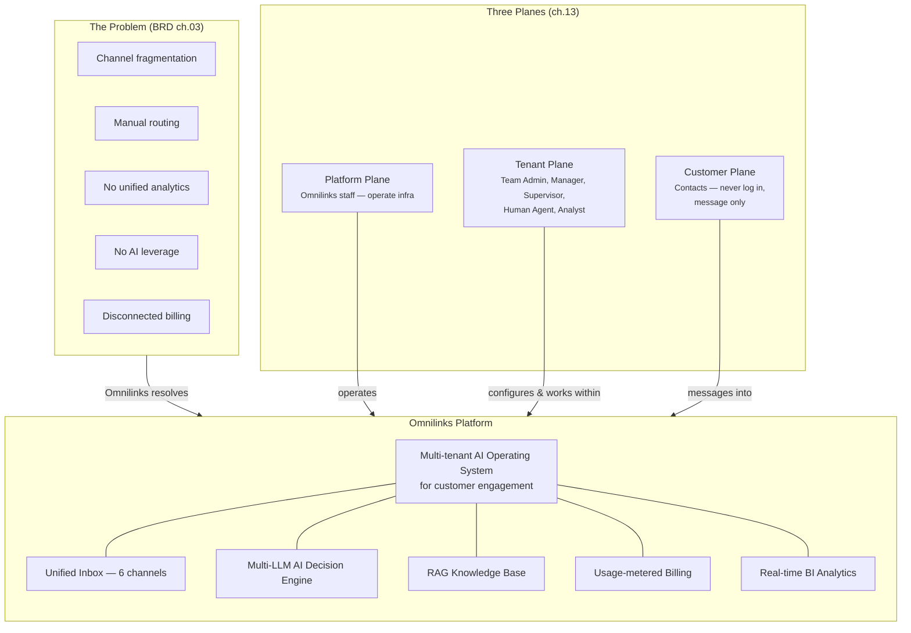

# SAD — Chapter 15: Vision Diagram

**Document:** Software Architecture Document
**Section:** Vision Diagram
**Version:** 0.1.0
**Status:** Draft

---

## Purpose

One diagram that answers "what is Omnilinks, and who uses it" without any implementation detail — the entry point for a new stakeholder reading the SAD for the first time. Everything here is already established elsewhere (BRD ch.01/03, SAD ch.13); this chapter's job is to compress it into a single picture, not introduce anything new.

---

## Vision Diagram

---

## What This Diagram Deliberately Leaves Out

| Excluded | Where it actually lives |
|---|---|
| Channel adapter detail, provider abstractions | ch.26 (C4 Container), ch.27 (C4 Component) |
| Role permission detail | ch.13, ch.14 |
| AI decision internals | ch.19 (AI Decision Flow), ch.29 (AI Architecture) |
| Pricing / tenant type detail | BRD ch.09, SAD ch.13 §2 |
| Infrastructure / deployment | ch.30 (Deployment) |

This chapter is intentionally shallow — a vision diagram that tries to show everything stops being a vision diagram.

---

> **Next:** [Chapter 16 — Stakeholder Map](16-stakeholder-map.md)
