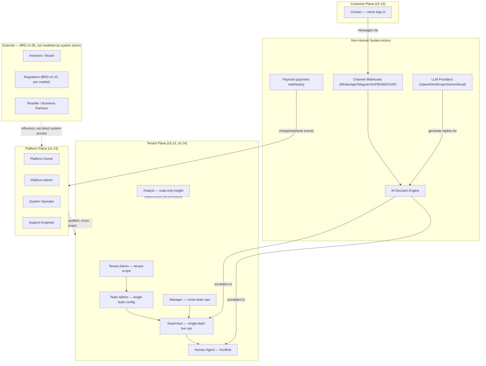

# SAD — Chapter 16: Stakeholder Map

**Document:** Software Architecture Document
**Section:** Stakeholder Map
**Version:** 0.1.0
**Status:** Draft

---

## Purpose

BRD ch.05 already defines the full stakeholder influence/interest matrix (Founders, Investors, Payment/LLM/Channel Providers, Regulators, Customers, etc.) — that is not repeated here. This chapter maps **only the actors who actually interact with the system**, at the level SAD ch.13's Three Planes model already establishes, so engineering has one diagram to check against when deciding who can call what.

---

## System-Interaction Stakeholder Map

---

## Actor → System Boundary Table

| Actor | Authenticates | Primary System Touchpoint |
|---|---|---|
| Platform Owner / Admin | ✅ Platform console | Tenant provisioning, billing overrides, global config |
| System Operator | ✅ Platform console, mandatory MFA | Infra: queues, logs, restarts — cross-tenant, audited |
| Support Engineer | ✅ Platform console | Tenant-facing platform support (not tenant dashboard) |
| Tenant Admin | ✅ Tenant dashboard | Tenant-wide config, billing, integrations |
| Team Admin | ✅ Tenant dashboard | Single-team configuration (ch.14) |
| Manager | ✅ Tenant dashboard | Cross-team operations (ch.14) |
| Supervisor | ✅ Tenant dashboard | Live queue, escalation approval |
| Human Agent | ✅ Tenant dashboard | Conversation handling |
| Analyst | ✅ Tenant dashboard | Read-only dashboards, exports |
| Contact | ❌ Never | Channel messaging only |

---

> **Next:** [Chapter 17 — User Journey](17-user-journey.md)
