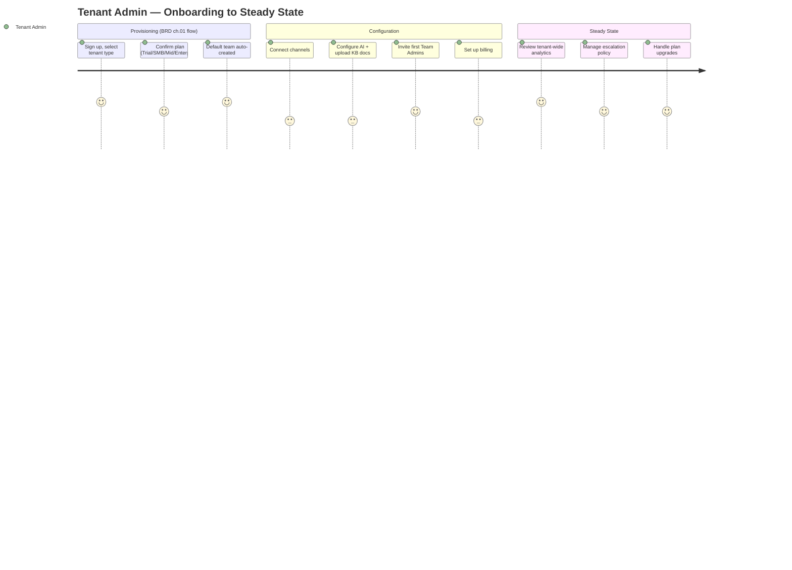
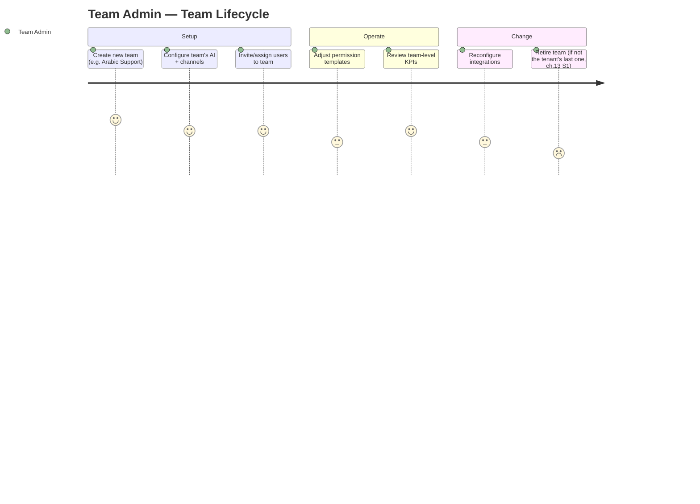
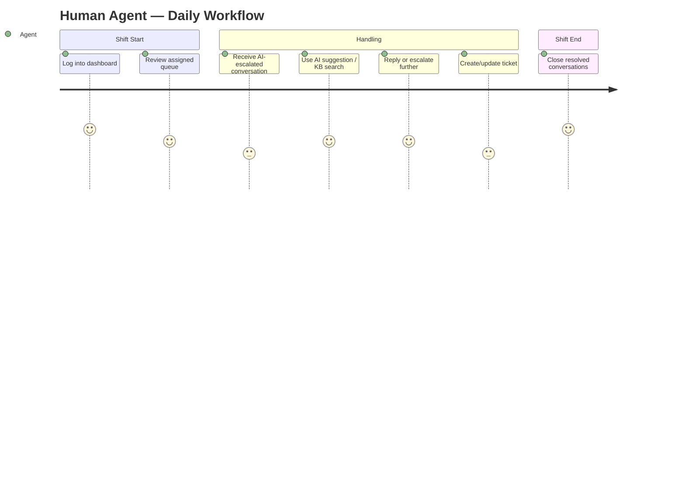
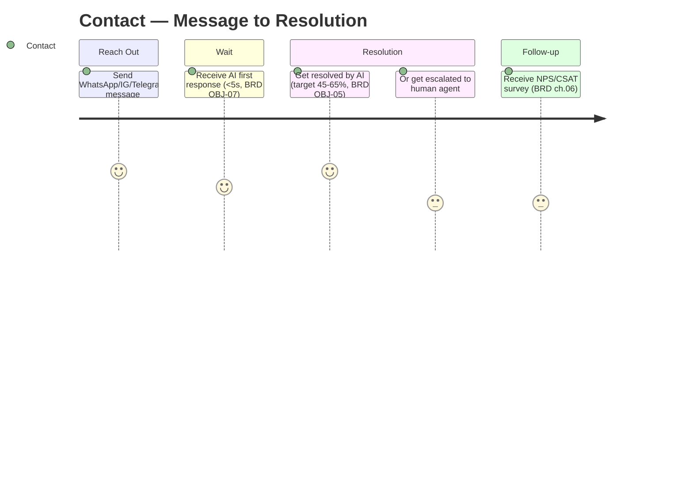

# SAD — Chapter 17: User Journey

**Document:** Software Architecture Document
**Section:** User Journey (per actor)
**Version:** 0.1.0
**Status:** Draft

---

## Purpose

How each actor type (ch.16) actually experiences the platform over time — distinct from the Customer Message Journey (ch.18), which is a single-message technical flow. This chapter is journey-per-actor across their whole relationship with the platform, not one conversation.

---

## Tenant Admin Journey

## Team Admin Journey

## Human Agent Journey

## Contact (Tenant's Customer) Journey

---

## Cross-Journey Note

Every journey above terminates or escalates into the technical flow already fully detailed in `tenant_cstomer_jurny.md` (60+ steps, ingestion → AI orchestration → delivery) — this chapter stays at the human-experience level; ch.18 is the system-level version of the Contact journey specifically.

---

> **Next:** [Chapter 18 — Customer Message Journey](18-customer-message-journey.md)
