# SAD — Chapter 18: Customer Message Journey

**Document:** Software Architecture Document
**Section:** Customer Message Journey
**Version:** 0.1.0
**Status:** Draft — summary layer over the existing detailed flow (`tenant_cstomer_jurny.md`)

---

## Purpose

The full 13-lane, 60+ step swimlane (channel → edge → ingestion → security/compliance → identity → AI orchestrator → RAG/memory/tools → LLM → automation → conversation service → agent workspace → channel adapter → analytics/billing) already exists and should not be re-derived or duplicated here. This chapter is the **summary view** a stakeholder reads before dropping into that full diagram.

---

## Summary Flow

```mermaid
flowchart LR
    A["Customer sends message"] --> B["Channel platform delivers + webhook"]
    B --> C["Edge: WAF, rate limit, TLS"]
    C --> D["Ingestion: verify signature,<br/>normalize, dedup"]
    D --> E["Security/Compliance:<br/>PII scan, policy check, audit log"]
    E --> F["Identity: resolve/create Contact,<br/>link Customer 360 if known"]
    F --> G["AI Orchestrator:<br/>intent, rules, confidence"]
    G --> H["RAG + Memory + Tools<br/>(parallel)"]
    H --> I["LLM Provider<br/>(primary + fallback)"]
    I --> J["Automation rules +<br/>Guardrails"]
    J --> K{"Confidence score"}
    K -->|">=80%"| L["Auto-reply"]
    K -->|"40-80%"| M["Human review queue"]
    K -->|"<40%"| N["Human handoff"]
    L --> O["Channel adapter: format + send"]
    M --> O
    N --> O
    O --> P["Customer receives reply"]
    O --> Q["Analytics + Billing:<br/>usage, cost, audit"]
```

---

## Where Each Stage Is Detailed Elsewhere

| Stage | Full detail |
|---|---|
| Edge / Ingestion / Security / Identity (steps 1–26) | `tenant_cstomer_jurny.md`, lanes 1–5 |
| AI Orchestrator + RAG/Memory/Tools + LLM (steps 27–37) | `tenant_cstomer_jurny.md`, lanes 6–8; expanded further in ch.19 (AI Decision Flow), ch.29 (AI Architecture) |
| Automation + Confidence routing (steps 38–43) | `tenant_cstomer_jurny.md`, lanes 9–10 |
| Agent workspace + SLA (steps 44–47) | `tenant_cstomer_jurny.md`, lane 11; also ch.20 (Human Escalation Flow) |
| Channel adapter delivery (steps 48–54) | `tenant_cstomer_jurny.md`, lane 12 |
| Analytics/Billing (steps 56–61) | `tenant_cstomer_jurny.md`, lane 13; BRD ch.09 for AI Credit definition |

---

## One Correction Worth Flagging

The existing detailed journey's compliance step (lane 4, step 18) lists **"GDPR / Egypt DPL / CCPA"** as the compliance check. Per BRD ch.11 glossary, both GDPR and CCPA are explicitly **out of scope** — Omnilinks' confirmed markets are Egypt, Qatar, UAE, Saudi Arabia, and Morocco, none of which fall under GDPR or CCPA jurisdiction. This should read **"Egypt PDPL / Saudi PDPL / UAE PDPL / Qatar Law No. 13 / Morocco Law 09-08 (BRD ch.10, per active market)"** instead. Flagging here rather than silently editing the source file, since `tenant_cstomer_jurny.md` is an existing artifact outside this new chapter set — the correction should be applied at the source the next time that file is revised.

---

> **Next:** [Chapter 19 — AI Decision Flow](19-ai-decision-flow.md)
