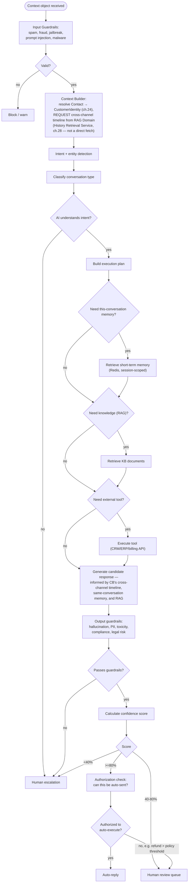
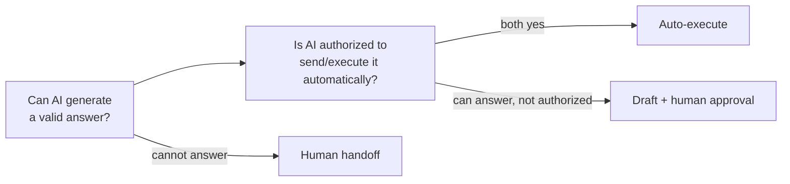

# SAD — Chapter 19: AI Decision Flow

**Document:** Software Architecture Document
**Section:** AI Decision Flow
**Version:** 0.1.0
**Status:** Draft — formalizes the AI Decision Engine design already agreed in discussion

---

## Purpose

The AI layer makes **multiple discrete decisions**, not one text-generation call. This chapter is the authoritative decision flow; ch.29 (AI Architecture) covers the runtime components that implement each decision.

---

## Decision Flow

> **Why the cross-channel timeline fetch isn't a conditional "Need memory?" branch:** unlike RAG or tool use, which only fire when the specific query needs them, resolving *who this is* and *what they last talked to us about* is cheap (one indexed lookup by `customer_identity_id`, ch.25) and almost always relevant for framing tone and avoiding repeat questions — so it happens unconditionally in Context Builder, not as an optional step later. This also matches the existing `tenant_cstomer_jurny.md` flow, where Identity resolution (lane 5) already happens before AI Orchestration (lane 6), not inside it.

---

## Failure & Fallback Handling

The flow above shows only the success path. `tenant_cstomer_jurny.md` already establishes real error handling elsewhere in the platform (circuit breaker → fallback LLM → human handoff on step 36a–36c; retry-with-backoff on delivery; fail states for invalid signature, rate limits, duplicates) — this chapter's decision flow needs to match that same rigor, not quietly assume every step succeeds.

```mermaid
flowchart TB
    subgraph RetrievalFail["Retrieval Failures — RAG Domain (ch.28)"]
        RCall["History or Vector Retrieval requested"] --> RD{"Responds within timeout?"}
        RD -->|"yes"| RCont["Continue with retrieved context"]
        RD -->|"no / error"| RDeg["FAIL OPEN: proceed without that context,<br/>flag conversation context_incomplete=true"]
        RDeg --> RCont
    end

    subgraph LLMFail["LLM Provider Failure"]
        MCall["Model Router calls primary LLM"] --> MD{"Success?"}
        MD -->|"yes"| MCont["Continue to Output Guardrails"]
        MD -->|"no"| MCB["Circuit breaker: retry via<br/>fallback provider (ch.01-architecture-overview,<br/>tenant_cstomer_jurny.md step 36a)"]
        MCB --> MD2{"Fallback success?"}
        MD2 -->|"yes"| MCont
        MD2 -->|"no"| MFail["FAIL CLOSED: route to human<br/>(tenant_cstomer_jurny.md step 36c)"]
    end

    subgraph ToolFail["Tool Execution Failure"]
        TCall["Tool Router calls external API<br/>(CRM/ERP/Billing)"] --> TD{"Success after<br/>retry w/ backoff?"}
        TD -->|"yes"| TCont["Continue with tool result"]
        TD -->|"no"| TFail["FAIL CLOSED: escalate —<br/>AI cannot invent the answer"]
    end

    subgraph SafetyFail["Guardrail / Policy Service Unavailable"]
        GCall["Output Guardrails or<br/>Policy/Authorization Engine invoked"] --> GD{"Service itself<br/>reachable?"}
        GD -->|"yes"| GCont["Normal pass/fail evaluation"]
        GD -->|"no — service down"| GFail["FAIL CLOSED: treat as if guardrail failed,<br/>escalate — never fail open on a safety check"]
    end
```

### The Governing Principle: Fail Open vs. Fail Closed

Not every failure should be handled the same way — the flow above deliberately treats two categories differently:

| Failure Type | Behavior | Why |
|---|---|---|
| **Retrieval** (History Retrieval Service, Vector Retrieval Service) | **Fail open** — proceed without that context, flag `context_incomplete=true` | Missing personalization or KB grounding is a worse *experience*, but not a safety issue. Blocking the whole conversation because the cross-channel timeline lookup timed out would trade a real availability problem for a manufactured one. |
| **LLM Provider** | **Fail closed after exhausting fallback** — try the circuit-breaker fallback provider first (this is not a safety gate, it's a genuine retry), then route to human only if that also fails | Matches the existing pattern in `tenant_cstomer_jurny.md` exactly — not a new decision, just made explicit here |
| **Tool Execution** | **Fail closed** — escalate, do not let the AI guess at what the tool would have returned | Directly stated in the earlier design discussion: "AI cannot invent this." A failed billing-API call must never become a fabricated answer. |
| **Guardrails / Policy Engine** | **Fail closed, always** — if the safety check itself can't run, treat that exactly like a failed safety check | This is the one category with zero tolerance for fail-open. Output Guardrails and the Policy/Authorization Engine (ch.28) are the last line of defense against R-03 (Hallucination/Compliance Violation, BRD ch.08, rated Critical) — a service outage must never silently downgrade to "skip the check and send anyway." |

> **Can I produce a valid response?** and **Am I authorized to send/execute it automatically?** are kept as separate gates, not one. A technically correct refund reply can still require human sign-off if it exceeds a tenant's configured policy threshold — confidence alone does not imply authorization.

---

## Decision Matrix

| Decision | Owning Component (ch.29) |
|---|---|
| Is the message valid? | Input Guardrails |
| Who is speaking, and what's their cross-channel history? | Context Builder resolves identity; **retrieval itself is owned by RAG Domain's History Retrieval Service (ch.28)**, not Context Builder directly |
| What does the customer want? | Intent Classifier |
| What entities exist? | Entity Extractor |
| Need this-conversation memory? | Memory Manager (short-term, Redis-backed — distinct from the cross-channel timeline, which RAG Domain always serves on request via Context Builder, not conditionally) |
| Need RAG? | Vector Retrieval Service (RAG Domain, ch.28) |
| Need external tools? | Tool Router |
| Need a workflow? | Workflow Engine |
| Which model? | Model Router (multi-LLM, BRD ch.01) |
| Is the answer safe? | Output Guardrails |
| Can AI answer? | Confidence Engine |
| Is AI authorized to send it? | Policy/Authorization Engine — **new component, not previously named in ch.29's domain list; needs adding** |
| Is a human needed? | Escalation Manager |

> **Open item:** the Policy/Authorization Engine (the "can I execute" gate) is a distinct responsibility from the Confidence Engine and isn't currently named as its own service anywhere in the SAD's domain structure (index.md's `domains/ai/`). Recommend either a submodule inside the AI domain or a dedicated policy service — resolving this belongs in ch.27 (C4 Component), not here.

---

## The Same Mechanism Serves the Human Agent, Not Just the AI

Context Builder's cross-channel history request (served by RAG Domain's History Retrieval Service, ch.28) isn't AI-exclusive — when a conversation escalates (ch.20) or is assigned directly to a Human Agent, the same `ConversationSummary` timeline should render as a **Customer Timeline panel** in the agent's dashboard, next to the current conversation. An agent opening a WhatsApp escalation should see "Instagram, 2 days ago — asked about delayed order #1234" without needing the AI to have already surfaced it in the chat. This is a UI requirement flowing from the same backend mechanism, not a separate one — flagged here so it doesn't get built as AI-only and then re-discovered as a gap for the agent workspace later.

---

## Confidence Thresholds (Cross-Reference, Not a New Decision)

Thresholds shown here (≥80% auto, 40–80% review, <40% handoff) match the existing Actor Map and `tenant_cstomer_jurny.md` flows exactly — restated for completeness, not redefined.

---

## Open Items Carried Forward

1. Retrieval timeout values (how long Context Builder/Intent Classifier wait before treating History or Vector Retrieval as failed) aren't specified — needed before "fail open" can actually be implemented rather than just designed.
2. Circuit breaker threshold for LLM provider failover (how many failures, over what window, before switching to fallback) isn't specified anywhere — same gap already implicit in `tenant_cstomer_jurny.md` but never given a number.
3. Tool Router retry policy (`retry w/ backoff`) needs the same numbers `tenant_cstomer_jurny.md` already gives its own delivery retry path (3x, exponential backoff) — worth confirming whether tool calls should reuse that exact policy or need their own.
4. `context_incomplete=true` is introduced here as a flag but has no defined consumer yet — should this surface to the Human Agent UI (ch.20's escalation path) as a visible warning, or only affect AI confidence scoring internally? Not decided.

---

> **Next:** [Chapter 20 — Human Escalation Flow](20-human-escalation-flow.md)