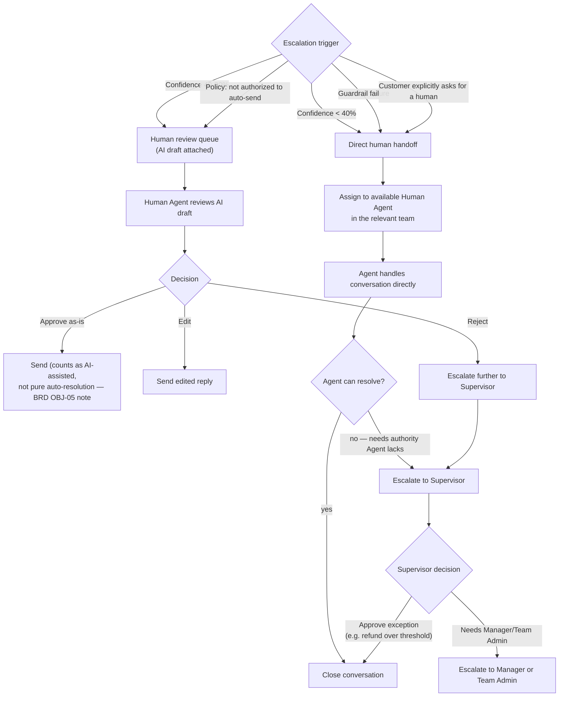
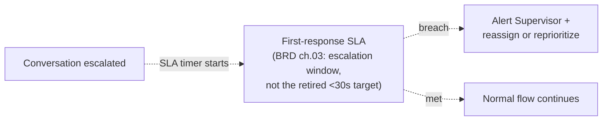

# SAD — Chapter 20: Human Escalation Flow

**Document:** Software Architecture Document
**Section:** Human Escalation Flow
**Version:** 0.1.0
**Status:** Draft

---

## Purpose

Ch.19 defines *when* AI decides a human is needed. This chapter defines what happens *after* that decision — routing, SLA, and role responsibilities, using the roles reconciled in ch.14.

---

## Escalation Paths

---

## SLA Timer (Interruptible Region)

> The SLA figure itself is intentionally not restated as a number here — BRD ch.03 already flagged the original "<30 seconds" human-response target as unrealistic and left the real figure open pending a defined support-staffing model. This diagram shows the *mechanism* (timer + breach alert), not a number that isn't decided yet.

---

## Role Responsibility at Each Stage

| Stage | Responsible Role (ch.14) |
|---|---|
| Receive assigned/escalated conversation | Human Agent |
| Approve/reject AI draft in review queue | Human Agent (first pass), Supervisor (on reject) |
| Approve policy exceptions (e.g., over-threshold refund) | Supervisor |
| Cross-team load rebalancing during an SLA breach spike | Manager |
| Structural fix (e.g., team is chronically understaffed) | Team Admin / Tenant Admin |

---

## Open Items Carried Forward

1. The real escalation-SLA number (replacing the retired <30s target) still depends on a support-staffing model not yet defined (BRD ch.03/06 open item) — this chapter's timer mechanism is ready regardless of what the number ends up being.
2. Whether an approved-as-is AI draft counts toward BRD OBJ-05's Auto-Resolution rate is worth an explicit decision — arguably it shouldn't, since a human still reviewed it. Flagging for ch.06 (BRD) reconciliation, not resolved here.

---

> **Next:** [Chapter 21 — Business Process (BPMN)](21-business-process-bpmn.md)
