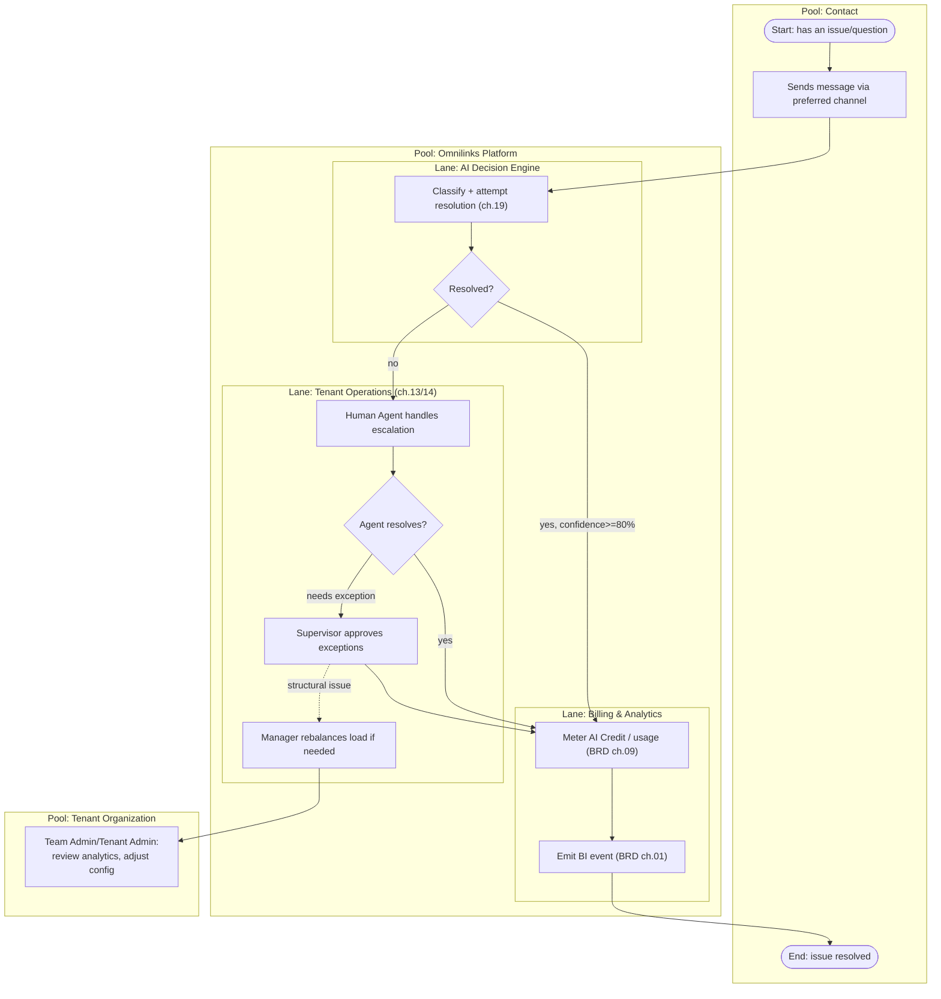

# SAD — Chapter 21: Business Process (BPMN)

**Document:** Software Architecture Document
**Section:** End-to-End Business Process
**Version:** 0.1.0
**Status:** Draft

---

## Purpose

A BPMN-style pool/lane view of the full support process across organizational boundaries (Contact, Tenant org, Omnilinks platform) — complementary to ch.18's technical message journey, at the business-process level instead of the system level. Mermaid has no native BPMN renderer, so this uses swimlane `flowchart` conventions consistent with the style already established in `tenant_cstomer_jurny.md`.

---

## End-to-End Process

---

## Process Ownership Table

| Sub-process | Owner | Cross-reference |
|---|---|---|
| Message intake & classification | AI Decision Engine | ch.19 |
| Escalation & exception handling | Human Agent → Supervisor → Manager | ch.20, ch.14 |
| Usage metering | Billing Domain | BRD ch.09, SAD index.md domain structure |
| Analytics emission | Analytics Domain | BRD ch.01 (post-launch/ongoing) |
| Config/strategy feedback loop | Team Admin / Tenant Admin | ch.13, ch.16 |

---

## Note on BPMN Fidelity

This diagram uses swimlanes to approximate BPMN pools/lanes since Mermaid does not support native BPMN notation (no gateways-as-diamonds-with-BPMN-semantics, no proper message-flow dashed lines between pools). If a truly BPMN-compliant diagram is required for external stakeholder or compliance documentation, it should be produced in a dedicated BPMN tool (e.g., Camunda Modeler, bpmn.io) using this chapter's process boundaries as the source of truth — not attempted a second way in Mermaid.

---

> **Next:** [Chapter 22 — Use Case Diagram](22-use-case-diagram.md)
