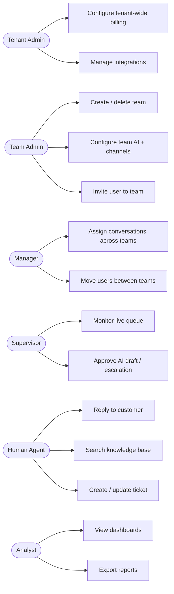
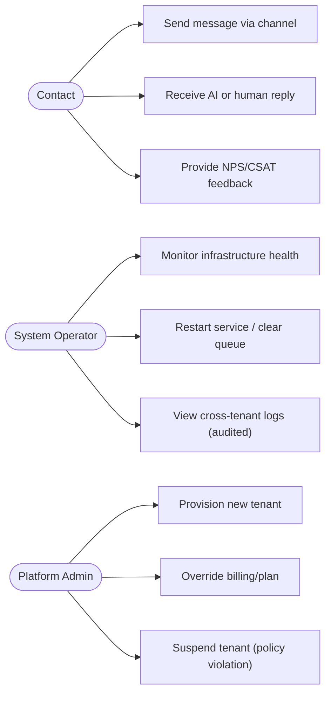

# SAD — Chapter 22: Use Case Diagram

**Document:** Software Architecture Document
**Section:** Use Case Diagram
**Version:** 0.1.0
**Status:** Draft

---

## Purpose

Functional capabilities per actor, at the use-case level — narrower than ch.16's stakeholder map, broader than any single sequence diagram (ch.23). Mermaid has no native UML use-case notation, so this is expressed as a `flowchart` with actor nodes connected to capability nodes, grouped by domain — a widely accepted Mermaid substitute for use-case diagrams.

---

## Tenant-Side Use Cases

## Customer & Platform Use Cases

---

## Use Case ↔ Permission Cross-Reference

| Use Case | Requires Permission (ch.14) |
|---|---|
| UC3 Create/delete team | `team.*` (Team Admin only) |
| UC6 Assign conversations across teams | `operations.*` (Manager) |
| UC9 Approve AI draft | `ai_response.approve` (Supervisor) |
| UC10 Reply to customer | `conversation.reply` (Human Agent) |
| UC14 Export reports | `analytics.read` + `report.export` (Analyst) |
| UC20 View cross-tenant logs | Platform-plane only — never available to any tenant-plane role (ch.13 rule S6) |

---

> **Next:** [Chapter 23 — Sequence Diagrams](23-sequence-diagrams.md)
