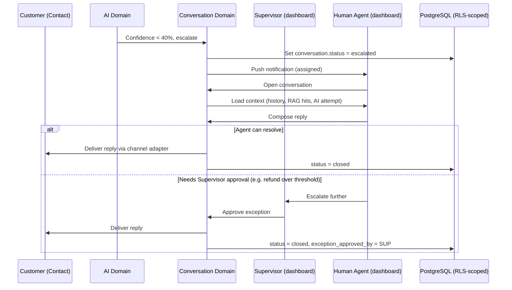
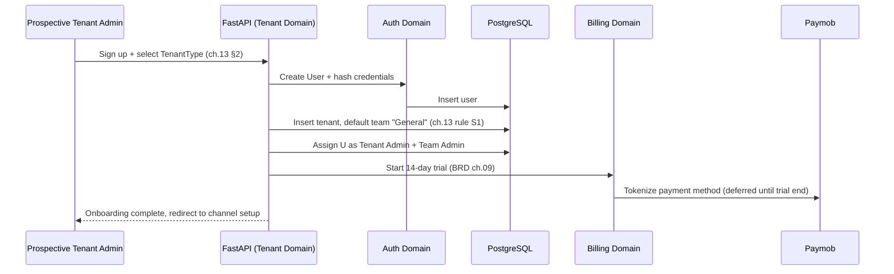
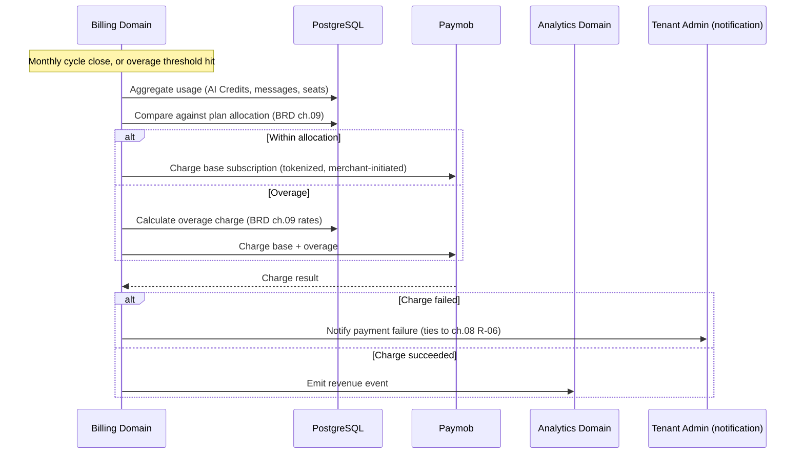

# SAD — Chapter 23: Sequence Diagrams

**Document:** Software Architecture Document
**Section:** Sequence Diagrams for Key Scenarios
**Version:** 0.1.0
**Status:** Draft

---

## Purpose

Step-by-step interaction diagrams for scenarios not already covered. The AI-auto-reply happy path is already fully diagrammed in ch.01-architecture-overview.md ("Request Flow — Concrete Example") — not repeated here. This chapter covers three scenarios that aren't shown anywhere else yet: **human escalation**, **tenant provisioning**, and **a billing charge**.

---

## Scenario 1: Human Escalation Path

---

## Scenario 2: New Tenant Provisioning

---

## Scenario 3: Usage-Based Billing Charge

---

## Cross-Reference

| Scenario | Complements |
|---|---|
| Human Escalation | ch.20 (flow-level), this chapter (call-level) |
| Tenant Provisioning | ch.13 (structural rules), BRD ch.01 (onboarding flow) |
| Billing Charge | BRD ch.09 (rates), ch.08 R-06/R-13 (payment provider risk) |

---

> **Next:** [Chapter 24 — Domain Model](24-domain-model.md)
