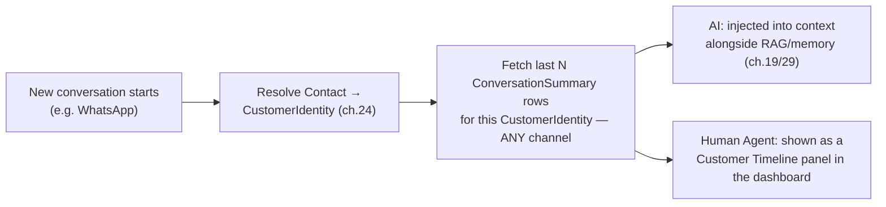

# SAD — Chapter 24: Domain Model

**Document:** Software Architecture Document
**Section:** Domain Model
**Version:** 0.1.0
**Status:** Draft — first formal entity/relationship model; several entities are flagged rather than asserted, per BRD ch.11 glossary's explicit note that entity decisions belong here, not in the glossary

---

## Purpose

Business entities and their relationships, incorporating ch.13's three-plane model and ch.14's Team Admin/Manager scope resolution. Entities BRD ch.11 explicitly declined to pre-decide (Ticket, a distinct AI Agent object, Workspace, Organization) are included here **as proposals**, since this is the right document to decide them in — but each is marked as a decision this chapter is making, not one already settled elsewhere.

---

## Core Domain Model

```mermaid
classDiagram
    class PlatformUser {
        +UUID id
        +string email
        +PlatformRole role
        +bool mfa_enabled
    }

    class Tenant {
        +UUID id
        +string name
        +TenantType type
        +string industry
        +PlanTier plan
        +datetime created_at
    }

    class Team {
        +UUID id
        +UUID tenant_id
        +string name
        +bool is_default
    }

    class User {
        +UUID id
        +UUID tenant_id
        +string email
        +bool is_tenant_admin
        +string locale
        note: "presence (online/away/offline) is NOT\na column here — see UX section below,\nit's Redis-backed ephemeral state"
    }

    class NotificationPreference {
        <<new — UX addition>>
        +UUID id
        +UUID user_id
        +bool email_enabled
        +bool push_enabled
        +bool in_app_enabled
        +time quiet_hours_start
        +time quiet_hours_end
    }

    class TeamMembership {
        +UUID user_id
        +UUID team_id
        +TeamRole role
        +int max_concurrent_conversations
        note: "role includes team-scoped Manager (ch.14).\ncapacity field is new — see UX section below"
    }

    class TenantRoleAssignment {
        +UUID user_id
        +UUID tenant_id
        +TenantRole role
        note: "role includes Tenant Admin AND\ntenant-scoped Manager (ch.14)"
    }

    class CustomerIdentity {
        <<new — UX addition, resolves cross-channel fragmentation>>
        +UUID id
        +UUID tenant_id
        +string display_name
        +string preferred_language
        +string timezone
        +ConsentStatus consent_status
        +datetime created_at
    }

    class Contact {
        +UUID id
        +UUID tenant_id
        +UUID customer_identity_id
        +ChannelType channel_type
        +string channel_identity
        +datetime last_seen_at
        note: "now ONE ROW PER CHANNEL for a person,\nlinked upward to CustomerIdentity —\nsee UX section for why this changed"
    }

    class Conversation {
        +UUID id
        +UUID tenant_id
        +UUID team_id
        +UUID contact_id
        +ConversationStatus status
        +float confidence_score
    }

    class Message {
        +UUID id
        +UUID conversation_id
        +MessageSender sender
        +string content
        +int ai_credits_consumed
    }

    class InternalNote {
        <<new — UX addition, closes a gap vs. existing flows>>
        +UUID id
        +UUID conversation_id
        +UUID author_user_id
        +string content
        +datetime created_at
    }

    class Ticket {
        <<proposed — not previously decided, BRD ch.11>>
        +UUID id
        +UUID conversation_id
        +TicketStatus status
        +UUID assigned_agent_id
    }

    class KnowledgeBase {
        +UUID id
        +UUID tenant_id
        +UUID team_id
    }

    class CannedResponse {
        <<new — UX addition, agent efficiency>>
        +UUID id
        +UUID team_id
        +string title
        +string content
        +int usage_count
    }

    class AIReplyAttempt {
        <<replaces a distinct "AI Agent" entity — see note below>>
        +UUID id
        +UUID conversation_id
        +string llm_provider
        +float confidence
        +bool guardrail_passed
    }

    class CSATResponse {
        <<new — UX addition, decoupled from Conversation lifecycle>>
        +UUID id
        +UUID conversation_id
        +UUID customer_identity_id
        +int score
        +string comment
        +datetime captured_at
    }

    class ConversationSummary {
        <<new — UX addition, enables cross-channel continuity>>
        +UUID id
        +UUID conversation_id
        +UUID customer_identity_id
        +ChannelType channel_type
        +string summary_text
        +string[] topic_tags
        +datetime conversation_ended_at
    }

    class Plan {
        +UUID id
        +PlanTier tier
        +int seat_limit
        +int ai_credit_allocation
    }

    Tenant "1" --> "1..*" Team
    Tenant "1" --> "0..*" User
    Tenant "1" --> "0..*" CustomerIdentity
    Tenant "1" --> "1" Plan
    Team "1" --> "0..*" TeamMembership
    Team "1" --> "0..*" CannedResponse
    User "1" --> "0..*" TeamMembership
    User "1" --> "0..*" TenantRoleAssignment
    User "1" --> "1" NotificationPreference
    User "1" --> "0..*" InternalNote : authors
    CustomerIdentity "1" --> "1..*" Contact : has one per channel
    CustomerIdentity "1" --> "0..*" ConversationSummary : "cross-channel timeline"
    Team "1" --> "0..*" Conversation
    Contact "1" --> "0..*" Conversation
    Conversation "1" --> "1..*" Message
    Conversation "1" --> "0..*" InternalNote
    Conversation "0..1" --> "0..1" Ticket
    Conversation "1" --> "0..*" AIReplyAttempt
    Conversation "0..1" --> "0..1" CSATResponse
    Conversation "1" --> "0..1" ConversationSummary
    Team "1" --> "0..*" KnowledgeBase
    PlatformUser "1" --> "0..*" Tenant : operates, audited
```

---

## UX-Driven Additions

The original model was correct but experience-blind — it would work, but it would produce a mediocre product for both sides of the platform. Each addition below is justified against a concrete, specific experience failure it prevents, not added for completeness.

### For the Contact (tenant's customer)

| Problem It Fixes | Addition |
|---|---|
| **The single biggest gap:** a real person who messages via WhatsApp, then later via Instagram, becomes **two unrelated Contact rows** under the old model. The AI has no memory of their WhatsApp history when they show up on Instagram, RAG/memory (ch.29) can't personalize, and a Human Agent sees "new customer" for someone who messaged yesterday. This directly undermines BRD ch.03's own stated goal — "a customer messaged on WhatsApp and Instagram may get two different experiences from the same business" was named as a *problem Omnilinks solves*, but the old data model would have quietly reproduced it. | `CustomerIdentity` — one row per real person, `Contact` becomes one row per *channel* they've used, linked upward. Cross-channel history, memory, and RAG context now resolve through `CustomerIdentity`, not through a single fragile `Contact` row. |
| Feedback tied only to one conversation's lifecycle means a customer's satisfaction trend over time (are they getting happier or more frustrated across months of contact?) isn't queryable without reconstructing it from scratch | `CSATResponse` as its own entity, keyed to `CustomerIdentity` as well as the triggering `Conversation` — supports both "how did this one conversation go" and "how is this customer's relationship with us trending," which BRD OBJ-09 (NPS) and the Customer Health Score (BRD ch.06, currently undefined composition) will eventually need |
| Consent and language preference living nowhere means every conversation re-asks or re-guesses — annoying at best, a PDPL compliance gap at worst (BRD ch.10, per-market consent rules) | `CustomerIdentity.preferred_language`, `.timezone`, `.consent_status` — set once, respected everywhere |

### Cross-Channel Continuity (the specific gap just raised)

`CustomerIdentity` on its own only solves *who is this*. It doesn't yet solve *what happened last time, on whatever channel that was* — which is the actual experience Ahmed is asking for: a customer writes in on WhatsApp, and the AI or Human Agent already knows their last contact was on Instagram two days ago, about a delayed order.

Pulling full message history across every past conversation to answer that would be slow (bad for BRD OBJ-07's <5s AI first-response target) and would flood the AI's context window with noise. The right mechanism is a **short, structured summary generated once per conversation**, not raw transcripts:

| Piece | Role |
|---|---|
| `ConversationSummary` | One row per finished (or long-running) `Conversation` — a short AI-generated summary (1–3 sentences) plus topic tags, keyed to `customer_identity_id` **and** `channel_type` so it's retrievable "across every channel this person has used," not just the current one |
| Generation trigger | Written by the AI Domain at conversation close (or periodically, for conversations that run long) — this is a natural extra step in the existing close-out flow, not a new standalone process |
| Retrieval trigger | Pulled at the *start* of context-building for any new conversation, filtered to the same `customer_identity_id`, ordered by recency, independent of which channel the new conversation is on |

This is what turns "two different experiences from the same business" (the exact failure BRD ch.03 names) into "the AI/agent already knows you asked about your order on Instagram two days ago" — without either side re-reading a full transcript.

| Problem It Fixes | Addition |
|---|---|
| Nothing in the old model helps an assignment algorithm avoid dumping conversations on an already-overloaded Agent — a real driver of the burnout BRD ch.03 names as a root-cause impact | `TeamMembership.max_concurrent_conversations` — assignment logic (ch.19/20) can check this before routing, not just round-robin blindly |
| "Add Internal Notes" is already a named Human Agent capability in the existing flows (`tenant_cstomer_jurny.md`, earlier design discussion) but had no entity to actually store it in | `InternalNote` — closes a real gap between documented behavior and an implementable model |
| Every agent re-typing the same answers to common questions is a direct tax on AI First Response / Human First Response targets (BRD OBJ-07/OBJ-08) and a daily frustration point | `CannedResponse`, team-scoped so different teams (Arabic Support vs. VIP Support) can maintain their own set |
| Notification behavior (email vs. push vs. in-app, quiet hours) with nowhere to live means it defaults to "everything, always" — a fast path to alert fatigue and the churn/turnover risk already named in BRD ch.08 R-11 | `NotificationPreference`, one per `User` |
| Presence (online/away/offline) changes constantly — modeling it as a Postgres column on `User` would mean a write on every status flip, which is the wrong tool for something this ephemeral | **Deliberately not added as a column.** Flagged as Redis-backed ephemeral state instead (see Open Items) — same reasoning ch.29 already applied to short-term conversation memory |

---

| Entity | Decision | Rationale |
|---|---|---|
| **Ticket** | Included as a proposed entity, optionally linked 0..1 to a Conversation | Both `Actor_Map.md` and `tenant_cstomer_jurny.md` already reference "create/update tickets" as a real Human Agent action — an entity needs to exist for that to be implementable. Marked `<<proposed>>` since BRD ch.11 explicitly deferred this decision here. |
| **Distinct "AI Agent" object** | **Not created.** Replaced with `AIReplyAttempt`, a record of one AI attempt at a reply (provider used, confidence, guardrail result) | BRD ch.11 declined a distinct AI Agent entity as premature. `AIReplyAttempt` satisfies the actual need (auditing what the AI tried, which ch.19's guardrail/confidence flow requires) without introducing a standalone "agent" concept that nothing else in the BRD/PRD has asked for. |
| **Workspace / Organization** | **Not created.** `Tenant` already serves this role (BRD ch.11 glossary explicitly settled "Tenant" as the term) | Introducing a separate Organization entity distinct from Tenant would duplicate BRD ch.11's resolution of the "Customer" ambiguity — one entity, one name. |
| **Manager's table placement** | A Manager assignment lives in **either** `TeamMembership` (team-scoped) **or** `TenantRoleAssignment` (tenant-scoped, alongside Tenant Admin) — never both, and never as a scope flag bolted onto one table | Corrects an earlier draft of this chapter that modeled Manager reach as a `scope` field on `TeamMembership`; ch.14's clarification that a tenant-scoped Manager has the same *breadth* as Tenant Admin (just different authority type) means it belongs in the same table as Tenant Admin, not in the team table with a flag |
| **CustomerIdentity vs. Contact** | Split into two entities — `CustomerIdentity` (one real person) and `Contact` (one channel identity for that person) | The prior single-entity `Contact` model fragmented the same real customer across channels, directly undermining the unified-experience promise BRD ch.03 makes. This is the highest-priority correction in this revision. |
| **Presence** | Explicitly excluded from the relational model | Presence is high-frequency, ephemeral state — a Postgres column would mean a DB write on every online/away/offline flip. Belongs in Redis, matching the precedent ch.29 already set for short-term conversation memory. |
| **ConversationSummary** | New entity — one short AI-generated summary per conversation, keyed to `CustomerIdentity` and tagged with `channel_type`, retrievable across every channel a person has used | Directly answers the cross-channel continuity gap: without this, `CustomerIdentity` proves *who* someone is but not *what already happened* — and pulling full transcripts on every new conversation would be too slow (BRD OBJ-07) and too noisy for the AI's context window |

---

## Relationship to ch.13's Three Planes

- `PlatformUser` never references `Tenant` internal tables directly except through the audited operate-relationship shown above (ch.13 rule S6).
- `Contact` has no auth fields at all (ch.13 rule S7) — reflected by its complete absence from any authentication-related class.
- `User` and `TeamMembership`/`TenantRoleAssignment` are the only classes with role/permission fields — matching ch.13's "permissions live with tenant employees only" model.

---

## Open Items Carried Forward

1. `Ticket` needs full lifecycle states (open/pending/resolved/reopened?) defined in ch.25 (ERD) — this chapter only established that the entity should exist.
2. Confirm `AIReplyAttempt` naming doesn't collide with anything already in the codebase (per SAD index.md's note that `backend/domains/ai/` already exists) — if the actual code uses a different name for this concept, reconcile there, not here.
3. **New — `CustomerIdentity` merge logic:** when a real person contacts via a second channel for the first time, something has to decide whether to link the new `Contact` row to an existing `CustomerIdentity` or create a new one. Options include phone-number matching, explicit customer-provided linking ("is this the same you who messaged on WhatsApp?"), or agent-manual merge. This is a real product decision, not a modeling detail — flagging for ch.19 (AI Decision Flow) or a dedicated future chapter, not resolved here.
4. **New:** ch.25 (ERD) needs the same `CustomerIdentity`/`Contact` split, plus `InternalNote`, `CannedResponse`, `CSATResponse`, and `NotificationPreference` added at the database level — this chapter's diagram is now ahead of ch.25's; they need reconciling.
5. **Resolved by this revision:** ch.29 (AI Architecture)'s "long-term memory store, not yet specified" open item — `ConversationSummary`, stored in PostgreSQL and keyed to `CustomerIdentity`, is now the concrete answer: durable, structured, cross-channel, and cheap to query. Ch.29 needs updating to reflect this rather than continuing to list it as undecided.
6. **New:** `TeamMembership.max_concurrent_conversations` needs a default and a policy for what happens when every agent on a team is at capacity simultaneously (queue, overflow to another team, or force-assign past capacity) — ties into ch.20's escalation flow, not resolved here.
7. **New:** `ConversationSummary` generation quality is now the thing the cross-channel experience actually depends on — a bad or generic summary ("customer asked a question") is worse than useless for an agent deciding how to open a conversation. Needs a prompt/quality bar defined when ch.29's AI Architecture chapter is next revised.
8. **New:** How many `ConversationSummary` rows to surface (last 3? last 30 days? all-time?) and whether older ones should be compacted/re-summarized into a single rolling summary over time — both open, and both have direct AI-token-cost implications (ties to BRD ch.09's unresolved Gross Margin work).

---

> **Next:** [Chapter 25 — ERD](25-erd.md)