# SAD — Chapter 25: Entity Relationship Diagram (ERD)

**Document:** Software Architecture Document
**Section:** ERD
**Version:** 0.1.0
**Status:** Draft — database-level translation of ch.24's Domain Model

---

## Purpose

Ch.24 defined business entities and relationships conceptually. This chapter adds cardinality, keys, and the fields Row-Level Security (ch.01-architecture-overview, matching BRD ch.08 R-05) actually depends on — every tenant-scoped table carries `tenant_id` for RLS policy enforcement, shown explicitly below rather than implied.

---

## ERD

```mermaid
erDiagram
    TENANT ||--o{ TEAM : has
    TENANT ||--o{ USER : employs
    TENANT ||--o{ CUSTOMER_IDENTITY : "has as customers"
    TENANT ||--|| PLAN : subscribes_to
    TENANT {
        uuid id PK
        string name
        enum type
        string industry
        uuid plan_id FK
    }

    TEAM ||--o{ TEAM_MEMBERSHIP : contains
    TEAM ||--o{ CONVERSATION : owns
    TEAM ||--o{ KNOWLEDGE_BASE : owns
    TEAM ||--o{ CANNED_RESPONSE : owns
    TEAM {
        uuid id PK
        uuid tenant_id FK
        string name
        bool is_default
    }

    USER ||--o{ TEAM_MEMBERSHIP : holds
    USER ||--o{ TENANT_ROLE_ASSIGNMENT : holds
    USER ||--|| NOTIFICATION_PREFERENCE : has
    USER ||--o{ INTERNAL_NOTE : authors
    USER {
        uuid id PK
        uuid tenant_id FK
        string email
        string password_hash
        string locale
    }

    NOTIFICATION_PREFERENCE {
        uuid id PK
        uuid user_id FK
        bool email_enabled
        bool push_enabled
        bool in_app_enabled
        time quiet_hours_start
        time quiet_hours_end
    }

    TEAM_MEMBERSHIP {
        uuid user_id FK
        uuid team_id FK
        enum team_role "team_admin | manager | supervisor | agent | analyst — manager here means THIS TEAM ONLY, ch.14"
        int max_concurrent_conversations "ch.24 UX addition — fair assignment"
    }

    TENANT_ROLE_ASSIGNMENT {
        uuid user_id FK
        uuid tenant_id FK
        enum tenant_role "tenant_admin | manager — manager here means EVERY TEAM in the tenant, ch.14"
    }

    CUSTOMER_IDENTITY ||--o{ CONTACT : "has one per channel"
    CUSTOMER_IDENTITY ||--o{ CSAT_RESPONSE : "gives feedback"
    CUSTOMER_IDENTITY ||--o{ CONVERSATION_SUMMARY : "cross-channel timeline"
    CUSTOMER_IDENTITY {
        uuid id PK
        uuid tenant_id FK
        string display_name
        string preferred_language
        string timezone
        enum consent_status
        datetime created_at
    }

    CONVERSATION_SUMMARY {
        uuid id PK
        uuid conversation_id FK
        uuid customer_identity_id FK
        string channel_type
        text summary_text
        string_array topic_tags
        datetime conversation_ended_at
    }

    CONTACT ||--o{ CONVERSATION : initiates
    CONTACT {
        uuid id PK
        uuid tenant_id FK
        uuid customer_identity_id FK
        string channel_type
        string channel_identity
        datetime last_seen_at
    }

    CANNED_RESPONSE {
        uuid id PK
        uuid team_id FK
        string title
        text content
        int usage_count
    }

    CONVERSATION ||--o{ MESSAGE : contains
    CONVERSATION ||--o{ AI_REPLY_ATTEMPT : has
    CONVERSATION ||--o{ INTERNAL_NOTE : has
    CONVERSATION ||--o| TICKET : "may create"
    CONVERSATION ||--o| CSAT_RESPONSE : "may receive"
    CONVERSATION ||--o| CONVERSATION_SUMMARY : "generates at close"
    CONVERSATION {
        uuid id PK
        uuid tenant_id FK
        uuid team_id FK
        uuid contact_id FK
        enum status
        float confidence_score
    }

    INTERNAL_NOTE {
        uuid id PK
        uuid conversation_id FK
        uuid author_user_id FK
        text content
        datetime created_at
    }

    CSAT_RESPONSE {
        uuid id PK
        uuid conversation_id FK
        uuid customer_identity_id FK
        int score
        text comment
        datetime captured_at
    }

    MESSAGE {
        uuid id PK
        uuid conversation_id FK
        enum sender
        text content
        int ai_credits_consumed
        datetime sent_at
    }

    AI_REPLY_ATTEMPT {
        uuid id PK
        uuid conversation_id FK
        string llm_provider
        float confidence
        bool guardrail_passed
    }

    TICKET {
        uuid id PK
        uuid conversation_id FK
        uuid tenant_id FK
        enum status
        uuid assigned_agent_id FK
    }

    KNOWLEDGE_BASE ||--o{ KB_DOCUMENT : contains
    KNOWLEDGE_BASE {
        uuid id PK
        uuid tenant_id FK
        uuid team_id FK
        string name
    }

    KB_DOCUMENT {
        uuid id PK
        uuid knowledge_base_id FK
        string source_uri
        vector embedding "768-dim, Qdrant-backed"
    }

    PLAN {
        uuid id PK
        enum tier
        int seat_limit
        int channel_limit
        int message_limit
        int ai_credit_allocation
    }

    PLATFORM_USER {
        uuid id PK
        string email
        enum platform_role
        bool mfa_enabled
    }
```

---

## Row-Level Security Fields

Every table above except `PLAN`, `PLATFORM_USER`, `KB_DOCUMENT` (inherits tenant scope through `KNOWLEDGE_BASE`), and `NOTIFICATION_PREFERENCE`/`INTERNAL_NOTE`/`CANNED_RESPONSE` (inherit tenant scope through `USER`/`CONVERSATION`/`TEAM` respectively — all single-tenant parents) carries `tenant_id` directly — this is what the RLS policy in ch.01-architecture-overview (`WHERE tenant_id = current_setting('app.tenant_id')`) actually filters on. `CSAT_RESPONSE` is a deliberate exception worth calling out: it denormalizes `customer_identity_id` directly (see below) even though it could be reached via `conversation_id`, for the same reason `TICKET.tenant_id` was already denormalized — so a query joining straight to `CSAT_RESPONSE` for cross-conversation trend analysis doesn't need to join through `CONVERSATION` first. Any new table added later that omits a path to `tenant_id` — direct or through a single-tenant parent — should be treated as a Critical-severity review flag against BRD ch.08 R-05, not a minor oversight.

---

## Notes & Deviations from ch.24

| Item | Note |
|---|---|
| `KB_DOCUMENT.embedding` | Vector type shown conceptually; actual storage is in Qdrant (per SAD index.md), not a native Postgres column — represented here for completeness of the conceptual ERD only |
| `TICKET.tenant_id` | Denormalized onto Ticket directly (in addition to being reachable via `conversation_id`) specifically so RLS can enforce isolation even if a query joins Ticket without joining Conversation |
| `CONTACT` uniqueness — **revised** | `(tenant_id, channel_type, channel_identity)` remains unique per channel identity, but this no longer represents "one customer" — it represents one channel identity *belonging to* a `CUSTOMER_IDENTITY`. The customer-level uniqueness question (is this WhatsApp number and this Instagram handle the same person?) is a matching/merge problem, not a constraint — see ch.24 open item #3. |
| Manager mutual exclusivity | A given `(user_id, tenant_id)` pair should not simultaneously hold a `manager` row in `TENANT_ROLE_ASSIGNMENT` **and** a `manager` row in `TEAM_MEMBERSHIP` for a team under that same tenant — that would be redundant (tenant-scoped already covers every team). Worth an application-layer check or a DB constraint/trigger, not just a convention. |
| `CSAT_RESPONSE.customer_identity_id` | Denormalized from `CONVERSATION → CONTACT → CUSTOMER_IDENTITY` specifically so satisfaction-trend queries across a customer's whole history don't require a three-table join every time (ch.24 UX rationale) |
| `CONVERSATION_SUMMARY.customer_identity_id` + `.channel_type` | Both denormalized deliberately — the entire point of this table is "fetch every summary for this person, across every channel, fast," which requires filtering by `customer_identity_id` without joining through `Contact` or `Conversation` each time. `channel_type` is duplicated from `Contact` so a UI can show a channel icon next to each timeline entry without an extra join. |
| `TEAM_MEMBERSHIP.max_concurrent_conversations` | No default specified yet — needs one before assignment logic can rely on it; see ch.24 open item #6 |

---

## Open Items Carried Forward

1. `TICKET` lifecycle states need enumerating (open/pending/resolved/reopened, etc.) — currently just `enum status` with no defined values.
2. Confirm whether `AI_REPLY_ATTEMPT` should be retained indefinitely or pruned/archived after N days — has cost and compliance implications (BRD ch.10 data lifecycle).
3. **New:** `CUSTOMER_IDENTITY`/`CONTACT` merge logic (ch.24 open item #3) needs to land somewhere concrete — likely a `merge_history` table or audit trail if merges can be undone, not yet modeled.
4. **New:** `CSAT_RESPONSE.score` needs a defined scale — BRD ch.11 glossary already flags CSAT's measurement scale as undefined platform-wide; this table shouldn't invent one in isolation.
5. **New:** `TEAM_MEMBERSHIP.max_concurrent_conversations` needs a sensible default value before assignment logic can depend on it being non-null.
6. **New:** `CONVERSATION_SUMMARY.topic_tags` needs a defined taxonomy (or confirmation it's freeform) — if it's meant to power filtering/search on the Customer Timeline UI, freeform tags from an LLM will drift and fragment over time without some normalization step.
7. **New:** Retention policy for `CONVERSATION_SUMMARY` isn't defined — unlike `AI_REPLY_ATTEMPT` (open item #2, which is auditing/debugging data with a plausible expiry), summaries are customer-facing-experience data that arguably should persist as long as the `CustomerIdentity` does. Worth an explicit decision rather than defaulting to whatever `AI_REPLY_ATTEMPT` ends up with.

---

> **Next:** [Chapter 26 — C4 Context Diagram](26-c4-context.md)