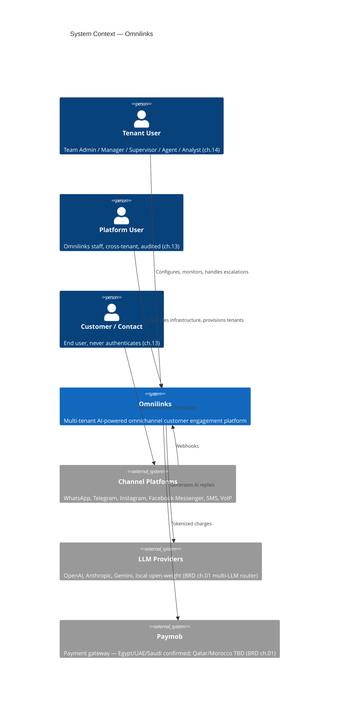

# SAD — Chapter 26: C4 Context Diagram

**Document:** Software Architecture Document
**Section:** C4 Context Diagram
**Version:** 0.1.0
**Status:** Draft — this is the proper Context-only split the SAD index.md already asked for ("chapters 03/04 should be split from the combined view, not duplicate it")

---

## Purpose

Pure Context level: people and external systems, no containers, no internal structure. The existing SAD `index.md` combines Context and Container in one diagram — that combined view stays as the at-a-glance index diagram; this chapter is the dedicated, containers-stripped-out version.

---

## C4 Context Diagram

---

## What Moved Out (Now Container-Level, ch.27)

| Removed from this view | Now lives in |
|---|---|
| Next.js Frontend, FastAPI Backend | ch.27 (C4 Container) |
| PostgreSQL, Redis, Qdrant | ch.27 (C4 Container) |
| Individual domain services (Auth, AI, RAG, Billing, etc.) | ch.28 (C4 Component) |

---

> **Next:** [Chapter 27 — C4 Container Diagram](27-c4-container.md)
