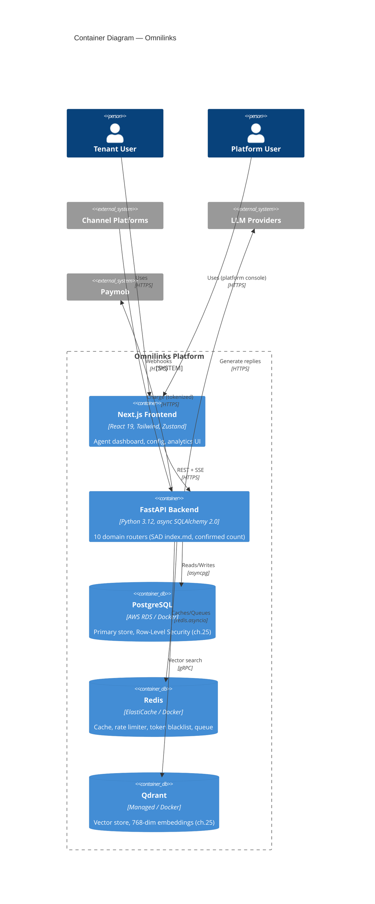

# SAD — Chapter 27: C4 Container Diagram

**Document:** Software Architecture Document
**Section:** C4 Container Diagram
**Version:** 0.1.0
**Status:** Draft — Container-only split, per SAD index.md's open item

---

## Purpose

High-level containers/services within the Omnilinks system boundary — one level down from ch.26's Context diagram, one level up from ch.28's Component diagram.

---

## C4 Container Diagram

---

## Container Responsibilities

| Container | Responsibility | Cross-reference |
|---|---|---|
| Next.js Frontend | Agent dashboard, tenant config UI, platform console | ch.01-architecture-overview Layer 1 |
| FastAPI Backend | All 10 domains (ch.28 breaks these down) | SAD index.md domain structure |
| PostgreSQL | Tenant-isolated persistence via RLS | ch.25 ERD |
| Redis | Cache, rate limiting, token blacklist, queue backing | ch.01-architecture-overview Layer 4 |
| Qdrant | RAG embedding storage/search | ch.25, BRD ch.11 (Vector Database) |

This matches the existing combined diagram in SAD `index.md` exactly in content — this chapter's only change is presentation (containers isolated from context-level actors/external systems), not new decisions.

---

> **Next:** [Chapter 28 — C4 Component Diagram](28-c4-component.md)
