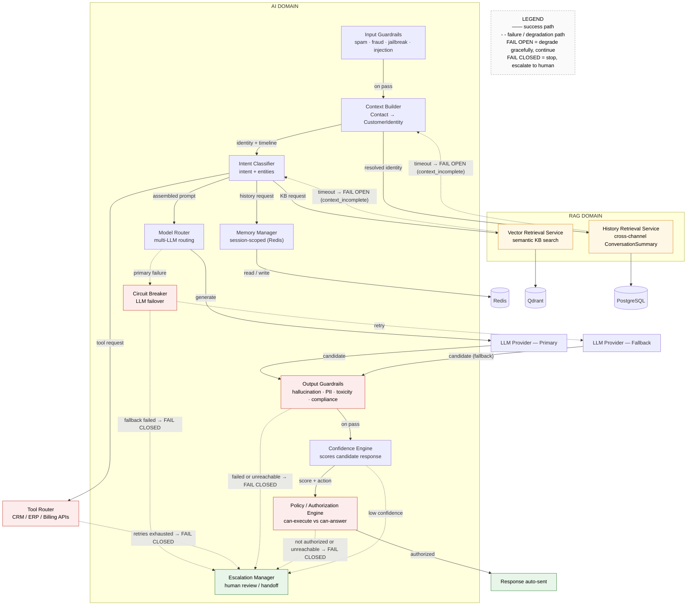

# SAD — Chapter 28: C4 Component Diagram

**Document:** Software Architecture Document
**Section:** C4 Component Diagram — AI Domain
**Version:** 0.1.0
**Status:** Draft

---

## 1. Purpose

This chapter presents the component-level decomposition of the **AI Domain**, one level of abstraction below the Container diagram in Chapter 27. The AI Domain is documented at this depth because it is the most architecturally complex of the ten platform domains and directly implements the decision flow defined in Chapter 19. The remaining domains (Auth, Channel, Conversation, Billing, and others) are comparatively straightforward CRUD-plus-webhook services and are adequately covered by the domain structure described in SAD `index.md`; separate component breakdowns for those domains are therefore out of scope for this revision.

---

## 2. AI Domain — Component Diagram

*Figure 28-1 — Component view: AI Domain and RAG Domain (corrected retrieval boundary). Solid edges: success path; dashed edges: failure/degradation path. Amber components fail open, red components fail closed, green nodes are terminal outcomes.*

**Summary of changes in this revision.** The previous version of this diagram depicted only success paths: every relationship implicitly assumed that the operation it described would succeed. This revision aligns the diagram with the error-handling discipline already established elsewhere in the platform (see `tenant_cstomer_jurny.md`), including circuit breaking, retry with backoff, and explicit failure states. Two elements were added — the **Circuit Breaker** component (LLM failover) and the fallback LLM provider as a distinct external system. Every component that can fail now carries an explicit failure path (dashed edge), labeled FAIL OPEN or FAIL CLOSED in accordance with the governing principle defined in Chapter 19: **retrieval degrades gracefully; safety checks never do.**

---

## 3. Component Responsibility Matrix

The table below maps each component to the decision it owns, aligned exactly with the Chapter 19 decision matrix.

| Component | Decision It Owns | Failure Behavior |
|---|---|---|
| Input Guardrails | Is the message valid? | Fail closed — block, consistent with the existing spam/fraud path in `tenant_cstomer_jurny.md` |
| Context Builder | Who is speaking? — resolves `CustomerIdentity`, then *requests* (does not itself fetch) the cross-channel history from the RAG Domain | Not applicable — orchestrator; does not perform the fallible operation itself |
| Intent Classifier | What does the customer want? — intent detection and entity extraction | Not applicable — orchestrator role for retrieval and tool calls |
| Memory Manager | Same-conversation memory retrieval (Redis-backed, session-scoped only; cross-channel history is explicitly out of scope — see History Retrieval Service) | Not yet specified — Redis unavailability is not covered by Chapter 19's fail-open/fail-closed principle; see Section 4 |
| Vector Retrieval Service (RAG Domain) | Knowledge-base context retrieval via semantic/vector search | **Fail open** — degrade, proceed without KB context, set `context_incomplete` |
| **History Retrieval Service (RAG Domain)** | **New — cross-channel `ConversationSummary` retrieval by `customer_identity_id` (Chapters 24–25). Placed in the RAG Domain rather than the AI Domain because it is a retrieval operation, differing from vector search only in the backing store.** | **Fail open** — degrade, proceed without the cross-channel timeline, set `context_incomplete` |
| Tool Router | External tool/API execution | Fail closed after retry with backoff is exhausted — escalate; a tool result must never be fabricated |
| Model Router | Which LLM to use | Delegates to the Circuit Breaker on primary-provider failure |
| **Circuit Breaker** | **New — detects primary LLM failure and retries via the fallback provider before failing closed to a human (Chapter 19)** | Fail closed to the Escalation Manager if the fallback provider also fails |
| Output Guardrails | Is the answer safe to consider? | **Fail closed, unconditionally** — an unreachable guardrail service is treated identically to a failed check |
| Confidence Engine | Can the AI answer, and with what confidence? | Not applicable — a low or failed score already routes correctly by design |
| Policy / Authorization Engine | Is the AI authorized to auto-send or execute this specific action? — formally placed as a component for the first time in this revision (Chapter 19 previously flagged its absence) | **Fail closed, unconditionally** — same rationale as Output Guardrails |
| Escalation Manager | Is a human needed, and who? | Not applicable — this component *is* the fail-closed destination for all of the above |

**Naming consideration.** With the RAG Domain now owning structured retrieval in addition to vector retrieval, the name "RAG" (Retrieval-**Augmented Generation**) remains accurate for the domain's *purpose*, but "Retrieval Domain" would more accurately describe what it now *contains*, since half of its components are no longer RAG-specific in the classical (embeddings + vector search) sense. No rename is performed in this revision: renaming the domain affects `backend/domains/rag/` in the codebase and must not be changed silently through a single diagram. The question is recorded here as an open naming decision rather than left implicit.

---

## 4. Open Items Carried Forward

1. The **Policy/Authorization Engine** is newly placed in this diagram and requires a corresponding entry under `backend/domains/ai/` if the diagram reflects live code. This relates to the standing open item in Chapter 01 (Architecture Overview) regarding whether the documentation describes live code.
2. The other nine domains (Auth, Channel, Conversation, Billing, Voice, Analytics, Automation, Tenant, and the non-retrieval parts of RAG) do not yet have their own component diagrams. This is recorded as a documentation gap should the same level of detail be required for them; it is intentionally not addressed in this revision in order to keep focus on the domain with the greatest architectural complexity.
3. **(Added in this revision)** The **History Retrieval Service** requires a corresponding implementation under `backend/domains/rag/` if the diagram reflects live code, per the same open item as #1. If the current codebase has the Context Builder (or an equivalent) querying PostgreSQL directly for conversation history, that is precisely the anti-pattern this correction addresses, and the code should be moved — not merely the diagram.
4. **(Added in this revision)** The **Circuit Breaker** requires an implementation under `backend/domains/ai/` (or as shared infrastructure used by the Model Router) if the diagram reflects live code. It was previously only implied conceptually by the "multi-LLM router" in BRD Chapter 01 and had never been placed as a discrete component before this revision.
5. **(Added in this revision)** The Memory Manager's failure behavior (Redis unavailable) is not yet covered by Chapter 19's fail-open/fail-closed principle. Loss of same-conversation memory is arguably closer to fail open (degrade and proceed without recent turns) than fail closed, but this has not been formally decided; only the Retrieval, LLM, Tool, and Guardrail paths have been specified.
6. **(Added in this revision)** The Circuit Breaker failure threshold — the number of consecutive failures within a given time window before switching providers — has no defined value. This is the same gap already flagged in Chapter 19.

---

> **Next:** [Chapter 29 — AI Architecture](29-ai-architecture.md)
