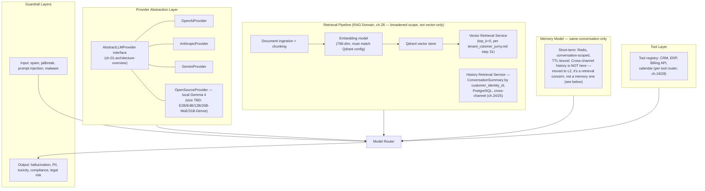

# SAD — Chapter 29: AI Architecture

**Document:** Software Architecture Document
**Section:** AI Runtime Architecture
**Version:** 0.1.0
**Status:** Draft

---

## Purpose

Where ch.28 shows the AI Domain's internal call graph, this chapter documents the **runtime architecture** underneath it: the provider abstraction, retrieval pipeline configuration (vector + structured), memory model, and guardrail layers — the "how it's built," not "what calls what."

---

## AI Runtime Layers

> **Correction from the prior draft:** cross-channel history (`ConversationSummary`) was originally placed under "Memory Model" alongside short-term Redis memory. That was the same inconsistency ch.28 caught at the component level — grouping it with "memory" implied it worked like session-scoped conversational memory, when it's actually a retrieval operation against a durable store, architecturally closer to vector KB search than to a Redis TTL cache. It now sits in the Retrieval Pipeline (L2) as a second retrieval path alongside vector search, matching ch.28's `History Retrieval Service` placement inside RAG Domain. L3 (Memory Model) is now exclusively same-conversation, Redis-backed, TTL-bound state — nothing durable or cross-channel belongs there.

---

## Key Architectural Choices & Open Items

| Choice | Status | Cross-reference |
|---|---|---|
| 4 concrete LLM providers | Implemented per SAD index.md's domain structure | SAD `index.md` "Still-open item — AI provider count" (6 claimed vs. 4 named) — **unresolved, carried here too** |
| Embedding dimension = 768 | Set, but must be verified against whichever embedding model is actually used | SAD `01-architecture-overview.md` open item #5 |
| Local model variant (Gemma 4) | **Not yet specified** — E2B/E4B/12B/26B-MoE/31B-Dense have materially different VRAM/hosting needs | SAD `index.md` open item #5 |
| Cross-channel history retrieval | **Resolved, and re-homed.** `ConversationSummary` (PostgreSQL, keyed to `CustomerIdentity`) via RAG Domain's History Retrieval Service — sits in the Retrieval Pipeline (L2) alongside vector search, not in Memory Model (L3). Originally misplaced under "long-term memory" in an earlier draft of this chapter; corrected here to match ch.28's component-level fix. | ch.24/25 (entity), ch.28 (component ownership), this revision (layer placement) |
| Guardrail provider (in-house vs. third-party moderation API) | **Not yet specified** | New open item, first raised here |

---

## Cost & Vendor-Lock Considerations (Ties to BRD ch.08)

- The provider abstraction layer exists specifically to mitigate **R-16 (Vendor Lock-in)** — switching providers should not require touching call sites outside `L1`.
- Guardrail and confidence-scoring logic living inside Omnilinks (not delegated to a single LLM vendor's built-in moderation) keeps **R-18 (AI Model Drift)** contained — a provider-side model update changes `P1`–`P4`'s behavior, not the guardrail/confidence logic evaluating their output.
- Local model hosting (`P4`) is a partial hedge against **R-07 (LLM Cost Overruns)** at high volume, but its actual cost/VRAM profile can't be assessed until the Gemma 4 variant is chosen (see open item above).

---

## Open Items Carried Forward

1. AI provider count reconciliation (6 vs. 4) — still open across three prior documents, repeated here for visibility.
2. Gemma 4 variant selection — blocks any real infra sizing or cost estimate for the local-inference path.
3. Guardrail implementation (built vs. bought) — undefined.
4. **New:** `ConversationSummary` quality directly determines whether cross-channel continuity actually feels good or feels wrong (a bad summary is worse than none) — needs a defined generation prompt/quality bar, not just "an LLM summarizes it."
5. **New:** how far back the cross-channel timeline reaches (recency window, row count cap, or rolling compaction of older summaries) isn't decided — affects both AI context-window cost and query latency at scale.
6. **New:** same open naming question as ch.28 — "RAG Pipeline" now contains a non-RAG (structured, non-vector) retrieval path. Not renamed here; flagged consistently across both chapters so it gets decided once, not drifted on independently.

---

> **Next:** [Chapter 30 — Deployment Diagram](30-deployment-diagram.md)