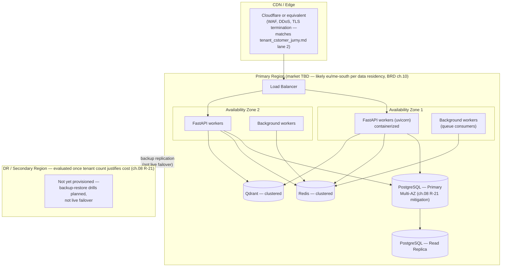

# SAD — Chapter 30: Deployment Diagram

**Document:** Software Architecture Document
**Section:** Deployment Architecture
**Version:** 0.1.0
**Status:** Draft — proposed target state; no cloud provider has been confirmed anywhere in the BRD/PRD/SAD, so this chapter is explicit about what's assumed vs. decided

---

## Purpose

Physical/cloud deployment topology. **Nothing in the document set so far names a specific cloud provider** — SAD `index.md`'s container diagram says "AWS RDS / Docker" and "ElastiCache / Docker" as alternatives, not a confirmed choice. This chapter proposes a topology using that same AWS-or-Docker ambiguity made explicit, rather than silently picking one.

---

## Proposed Deployment Topology

---

## What's Confirmed vs. Assumed

| Element | Status |
|---|---|
| Async Python (FastAPI/uvicorn) app tier | Confirmed (SAD `01-architecture-overview.md`) |
| PostgreSQL, Redis, Qdrant as the three stores | Confirmed |
| Specific cloud provider (AWS vs. GCP vs. Azure vs. self-hosted) | **Not confirmed anywhere** — "AWS RDS / Docker" in `index.md` is presented as an either/or, not a decision |
| Primary region / data residency | **Not confirmed** — depends on BRD ch.10's per-market data-residency requirements across Egypt/UAE/Saudi/Qatar/Morocco, which themselves aren't fully resolved |
| Multi-AZ | Proposed here as the baseline, matching ch.08 R-21's stated mitigation ("multi-AZ at minimum") |
| Multi-region / DR failover | Explicitly **not yet justified by cost** per ch.08 R-21 — shown as backup-only, not live failover |

---

## Open Items Carried Forward

1. Cloud provider selection is a real, unmade decision blocking any concrete deployment work — this diagram is provider-agnostic on purpose until that's resolved.
2. Primary region choice depends on BRD ch.10's per-market data-residency conclusions, which are themselves incomplete (ch.07's open item #3 on-premise-vs-cloud check).
3. DR region timing ("once tenant count justifies the cost") has no numeric trigger defined — worth a concrete tenant-count or MRR threshold rather than a vague qualifier.

---

> **Next:** [Chapter 31 — Security Architecture](31-security-architecture.md)
