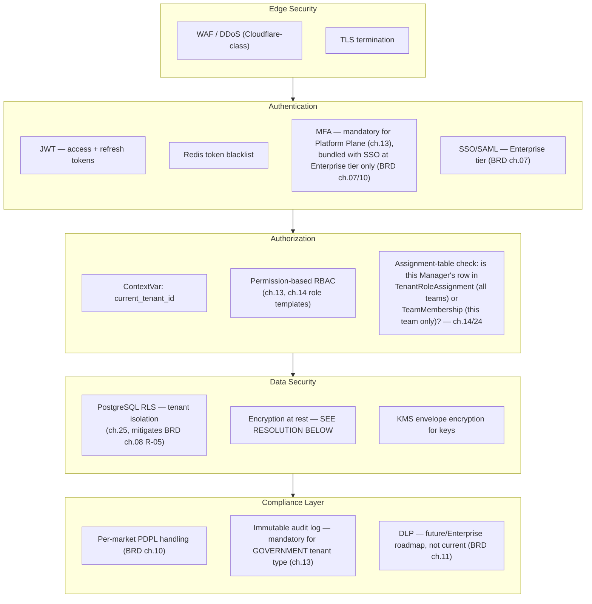
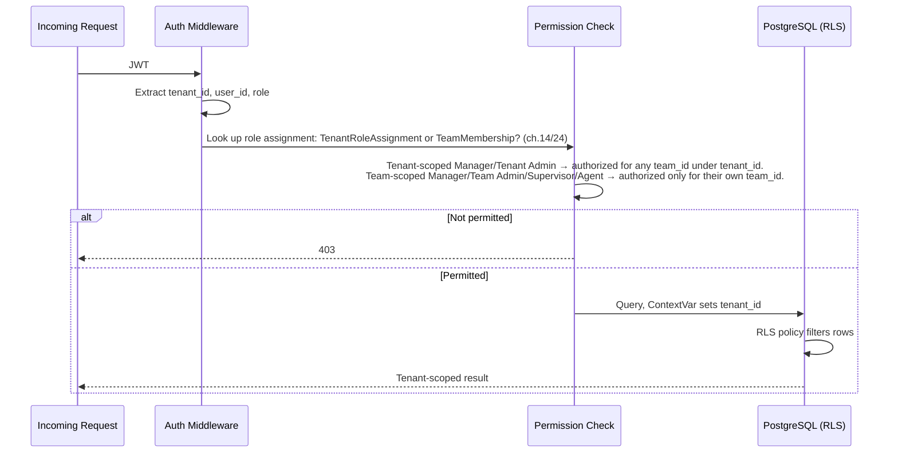

# SAD — Chapter 31: Security Architecture

**Document:** Software Architecture Document
**Section:** Security Architecture
**Version:** 0.1.0
**Status:** Draft — this is the chapter SAD `index.md`'s Document Map specifically flagged as needing to resolve the Fernet/AES-256 mismatch; addressed below rather than deferred again

---

## Purpose

Authentication, authorization, and tenant isolation as one coherent security model — drawing together JWT auth (SAD `01-architecture-overview.md`), RLS isolation (ch.25), permission-based RBAC (ch.13/ch.14), and the still-open encryption mismatch.

---

## Security Onion

---

## Resolving the Fernet / AES-256 Mismatch

SAD `index.md` flagged this as a still-open item: `core/security.py` reportedly uses Fernet, which is AES-**128**-CBC + HMAC, not AES-256 — while BRD ch.08 and ch.10 both committed to AES-256 at rest, and this backs a **Critical**-rated risk (R-01/R-05).

**Decision proposed here:** treat this as a genuine mismatch requiring a code change, not a documentation change. Fernet's AES-128 is not equivalent to a stated AES-256 commitment, and weakening the BRD's already-published commitment to match weaker code is the wrong direction for a Critical-risk control. Recommended resolution:

| Option | Verdict |
|---|---|
| Downgrade BRD ch.08/ch.10 commitment to match Fernet (AES-128) | **Not recommended** — silently weakens a Critical-risk mitigation already communicated to stakeholders |
| Replace Fernet with a genuine AES-256-GCM implementation via KMS-managed keys | **Recommended** — matches the stated commitment, and KMS envelope encryption is already listed as MVP-standard, low-incremental-cost (BRD ch.11) |

This chapter records the recommendation; the actual code change is an engineering task outside this document's scope, and should be tracked as a concrete ticket against `core/security.py`, not left as a standing "open item" indefinitely.

---

## Authorization Enforcement Point

---

## Open Items Carried Forward

1. Fernet → AES-256-GCM migration needs to become an actual engineering ticket, not remain a cross-document flag (this is the fourth document in the set to mention it: SAD index.md, `01-architecture-overview.md`, BRD ch.08/10, now here).
2. DLP, HSM remain explicitly future/Enterprise-roadmap per BRD ch.11 — not part of MVP security posture, restated here for completeness.
3. SOC 2 timing remains undefined (BRD ch.11: "not a Year 1 commitment... not a fixed date") — this chapter's security posture should be re-reviewed once/if a SOC 2 timeline is set.

---

> **Next:** [Chapter 32 — Network Diagram](32-network-diagram.md)
