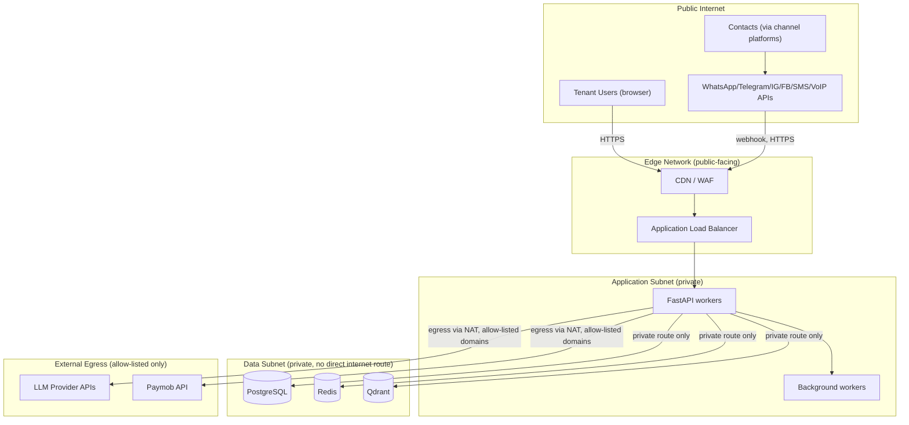

# SAD — Chapter 32: Network Diagram

**Document:** Software Architecture Document
**Section:** Network Architecture
**Version:** 0.1.0
**Status:** Draft

---

## Purpose

Network-level view: what's public, what's private, and where traffic crosses a trust boundary. Complements ch.30 (Deployment, physical topology) and ch.31 (Security, authN/authZ) with the network-segmentation layer specifically.

---

## Network Segmentation

---

## Trust Boundary Table

| Boundary | Enforcement |
|---|---|
| Public Internet → Edge | WAF, DDoS protection, TLS termination |
| Edge → Application Subnet | Load balancer only; no direct public route to API workers |
| Application Subnet → Data Subnet | Private networking only (VPC/security groups); no public IP on PG/Redis/Qdrant |
| Application Subnet → External Egress | NAT gateway with allow-listed domains only (LLM providers, Paymob) — prevents arbitrary outbound calls from a compromised worker |

---

## Channel Webhook Ingress — Specific Note

Each channel (WhatsApp, Telegram, Instagram, Facebook, SMS, VoIP) delivers via inbound webhook, verified by HMAC signature at the ingestion layer (`tenant_cstomer_jurny.md`, lane 3, step 10) **before** any request reaches application logic. An invalid signature is rejected at that layer, not passed through for the application to reject — reducing the attack surface that reaches actual business logic.

---

## Open Items Carried Forward

1. This diagram assumes a VPC-style private subnet model — needs confirming once the cloud provider (ch.30 open item) is actually chosen, since exact primitives differ (VPC/Security Groups on AWS vs. VNet/NSGs on Azure vs. VPC/firewall rules on GCP).
2. NAT egress allow-list needs an explicit, maintained domain list (LLM provider endpoints, Paymob endpoints) rather than a broad allow-all — worth an engineering ticket alongside ch.31's Fernet migration ticket.

---

> **Next:** [Chapter 33 — Monitoring Architecture](33-monitoring-architecture.md)
