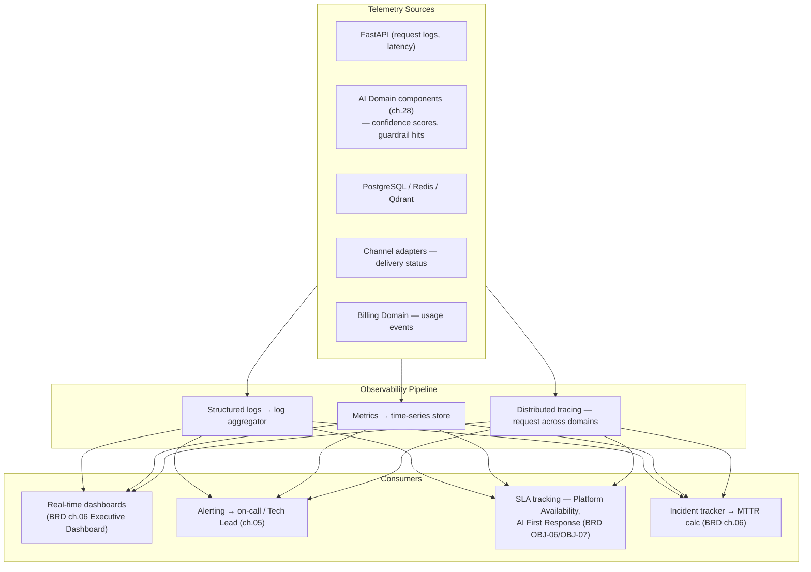

# SAD — Chapter 33: Monitoring Architecture

**Document:** Software Architecture Document
**Section:** Monitoring, Logging & Tracing
**Version:** 0.1.0
**Status:** Draft

---

## Purpose

How the platform observes itself — feeding both engineering (incident response, ch.08 R-02/R-21) and the BRD's own scorecard (ch.06: Platform Availability, AI First Response, DORA metrics).

---

## Monitoring Architecture

---

## Metric-to-Owner Mapping (Matches BRD ch.06 Exactly, Not Restated Values)

| Metric | Source | Owner (BRD ch.06) |
|---|---|---|
| Platform Availability | Uptime monitoring | Tech Lead |
| AI First Response | Platform telemetry (median latency) | Tech Lead |
| AI Auto-Resolution | AI engine logs | AI/ML function (ch.08 flagged this function doesn't formally exist in ch.05 yet) |
| Deployment Frequency / Lead Time / MTTR | CI/CD + incident tracker | Tech Lead (illustrative targets only, BRD ch.06) |

---

## Security-Relevant Monitoring (Ties to ch.31)

| Event | Monitored For |
|---|---|
| Invalid webhook signature | Security event → SOC alert (`tenant_cstomer_jurny.md` step 11a) |
| Repeated 403 from Permission Check (ch.31) | Potential privilege-escalation attempt pattern |
| Guardrail rejection rate spike | Possible prompt-injection campaign or model drift (ch.08 R-03/R-18) |

---

## Open Items Carried Forward

1. No specific tracing/logging/metrics vendor has been named anywhere in the document set (e.g., OpenTelemetry, Datadog, Grafana/Prometheus) — this chapter is intentionally tool-agnostic pending that decision.
2. The AI/ML function gap already flagged in BRD ch.08 (owns R-03/R-07/R-18 without formally existing in ch.05's stakeholder map) directly affects who actually watches the AI-specific monitoring surfaces above — same open item, restated here since it's directly relevant.

---

> **Next:** [Chapter 34 — Disaster Recovery](34-disaster-recovery.md)
