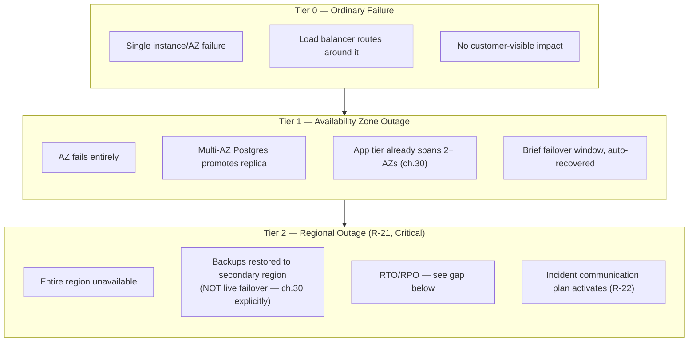

# SAD — Chapter 34: Disaster Recovery

**Document:** Software Architecture Document
**Section:** Disaster Recovery
**Version:** 0.1.0
**Status:** Draft — operationalizes BRD ch.08's R-21 mitigation ("documented DR runbook; regular backup-restore drills; multi-AZ at minimum")

---

## Purpose

Backup and failover strategy, distinguishing ordinary downtime (R-02) from a genuine regional/disaster event (R-21) — the two are different risks with different responses, per BRD ch.08's own separation of them.

---

## DR Tiering

---

## Backup Strategy

| Data Store | Backup Method | Frequency |
|---|---|---|
| PostgreSQL | Automated snapshots + point-in-time recovery (WAL) | Continuous WAL, daily snapshot |
| Redis | Not typically durable-critical (cache/session/queue) — acceptable to lose on regional failure, rebuilds from source-of-truth (Postgres) | N/A |
| Qdrant | Periodic snapshot; can be rebuilt from source documents + re-embedding if lost | Daily, or rebuild-on-demand |

---

## RTO/RPO — Explicit Gap

**Neither Recovery Time Objective (RTO) nor Recovery Point Objective (RPO) has been defined anywhere in the BRD, PRD, or SAD.** BRD ch.08 R-21's mitigation ("documented DR runbook, regular drills, multi-AZ at minimum") describes a *process*, not a target number. This chapter flags that gap explicitly rather than inventing a number:

| Item | Status |
|---|---|
| RTO (how fast must service be restored after a Tier 2 event) | **Undefined** — needs a business decision, likely tied to BRD ch.02 OBJ-06's 99.9% SLA math (99.9% monthly uptime allows ~43 minutes of downtime/month total, which constrains what RTO is even achievable within SLA) |
| RPO (how much data loss is acceptable) | **Undefined** — depends on WAL shipping frequency to the secondary region, itself undecided pending cloud provider/region choice (ch.30) |

---

## DR Drill Cadence

Per BRD ch.08's mitigation ownership table: **Tech Lead, quarterly formal review + annual DR drill.** This chapter adds the concrete drill scope:

1. Restore latest PostgreSQL snapshot to an isolated environment — verify data integrity.
2. Simulate AZ failure — confirm automatic failover meets Tier 1 expectations without RTO/RPO numbers yet defined (test the mechanism, not a target it can't be measured against yet).
3. Document actual restore time achieved — this becomes the basis for eventually setting a realistic RTO, rather than picking one before any drill has happened.

---

## Open Items Carried Forward

1. RTO/RPO targets remain undefined — first drill's actual results should inform them, not the reverse.
2. Secondary region choice is blocked on ch.30's cloud provider decision.
3. This is the last of the 20 requested diagrams/chapters — recommend a short reconciliation pass (like BRD ch.09's "reconciliation" sections) checking ch.14 through ch.34 against each other now that all exist, the same way the BRD caught drift between its own chapters 02/03/06.

---

> **End of the 20-diagram set (ch.15–ch.34), plus ch.14's prerequisite role reconciliation.**
