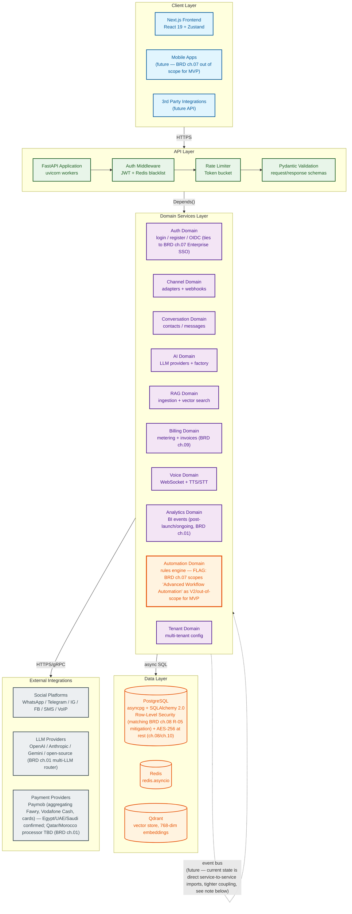
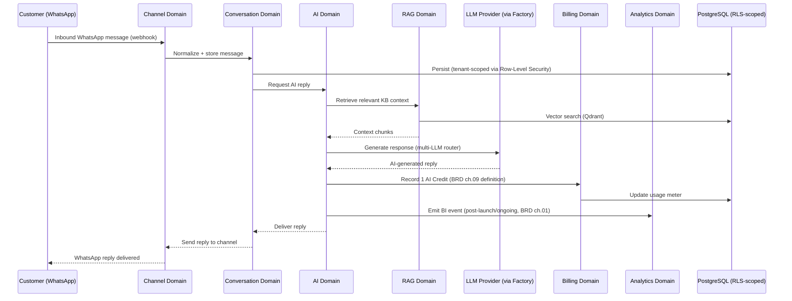
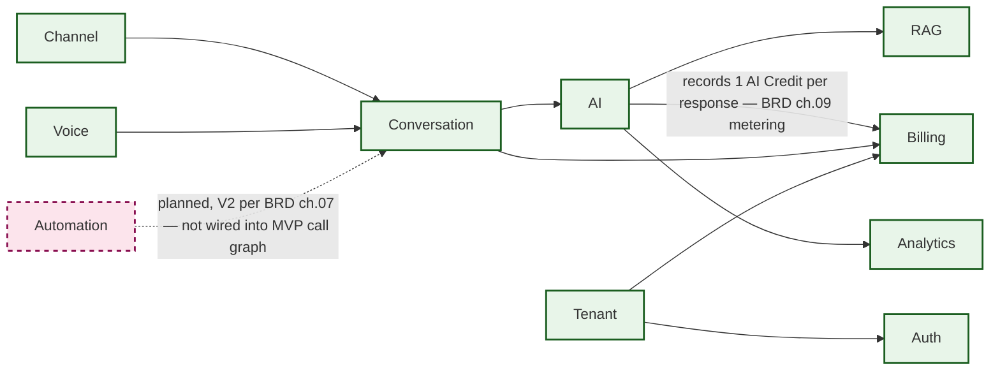
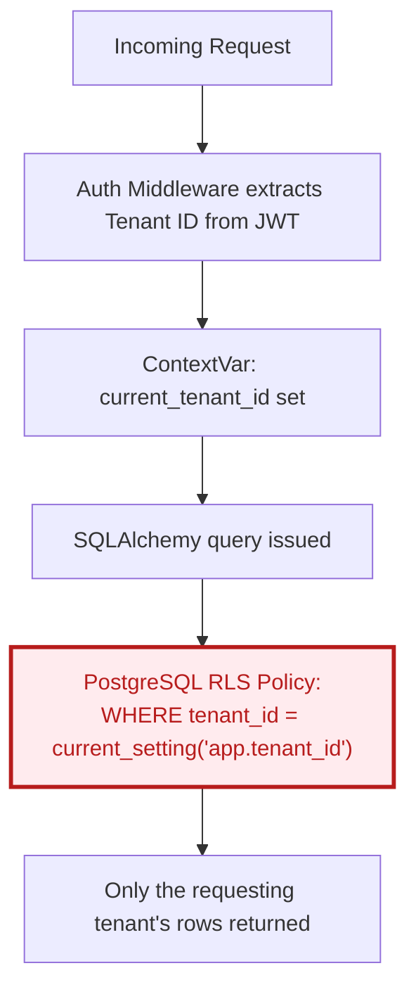
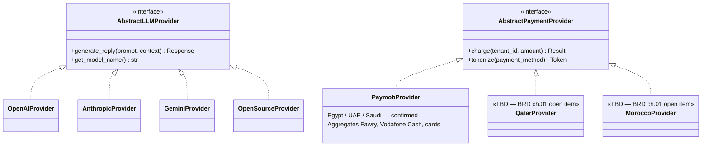

# SAD — Architecture Overview

**Document:** Software Architecture Document
**Section:** Architecture Overview
**Status:** Draft — under active reconciliation against BRD/PRD

> **Flag before anything else:** this document cites specific file paths and line numbers (`backend/main.py:91-98`, etc.), suggesting it may describe already-implemented code rather than a planned architecture. If so, the payment-provider and product-name issues below need auditing in the actual codebase, not just this document. Confirm which is the case before treating this as resolved.

Omnilinks follows a **strict 5-layer architecture** where each layer communicates only with the layer immediately below it. Cross-layer shortcuts are prohibited.

---

## Layered Architecture Diagram



> Styling key: purple = MVP domain services, orange/bold outline = flagged (Automation Domain's MVP status is unresolved per the correction below), amber = data layer, gray = external integrations.

---

## Request Flow — Concrete Example

The layered diagram above is necessarily abstract. Here's what it actually looks like for one real request, showing the cross-domain calls that "explicit service imports" was describing in the abstract:



---

## Domain Dependency Graph

Replaces the prior draft's vague `Domain -.-> Domain` self-loop with the actual call directions, and makes Automation Domain's unresolved MVP status visible in the diagram itself rather than only in a text note:



---

## Multi-Tenant Isolation (Row-Level Security)

Makes the R-05 mitigation (BRD ch.08, Critical risk) concrete rather than a one-line text claim:



> This is what "Row-Level Security" (corrected from "column-level isolation" above) should mean concretely — the database itself enforces the boundary via policy, not just application-layer filtering, which is what makes it a credible mitigation for a Critical-rated data-leak risk rather than just a convention that a bug could bypass.

---

## Provider Abstraction Pattern

Shows the pluggable-provider design principle concretely, including the still-open Qatar/Morocco processor gap directly in the architecture rather than only as a text note:



> Note the asymmetry: the LLM side has all four providers concretely implemented, while the payment side has two of five confirmed markets still without a provider class at all. That gap is now visible in the architecture diagram itself, not just buried in a BRD open-items list.

---

## Corrections From the Prior Draft

| Issue | Prior Draft | Corrected |
|---|---|---|
| Product name | "Omnilix.ai" (text) / `"Omnilinkx.ai"` (code snippet) — two different wrong spellings in one document | Omnilinks, consistently |
| Payment providers | Stripe / PayPal / Fawry / Vodafone Cash | **Paymob** as the gateway (Egypt/UAE/Saudi confirmed, Qatar/Morocco TBD — BRD ch.01), with Fawry/Vodafone Cash/cards as payment *methods accessed through* Paymob's aggregation, not separate provider integrations. Stripe/PayPal removed — this is the fourth time this exact error has appeared across this document set (BRD ch.01's original draft, ch.07's draft, PRD index) |
| Tenant data isolation | "Column-level isolation" | **Row-Level Security (RLS)**, matching chapter 08's actual committed mitigation for R-05 (Multi-Tenant Data Leak, rated Critical). Column-level isolation is a different, weaker mechanism — this needs to be an explicit choice, not a silent divergence from a Critical-risk mitigation already on record |
| Encryption at rest | Not mentioned in Data Layer | Added explicitly — AES-256 at rest is already committed in BRD chapters 08 and 10; omitting it here made the SAD inconsistent with controls the BRD already promised |
| Automation Domain | Presented as a standard MVP domain alongside the other 9 | Flagged — BRD chapter 07 explicitly scopes "Advanced Workflow Automation" as V2/out of scope for MVP. Either this domain is scaffolded-but-dormant pre-MVP, or chapter 07's scope needs revisiting — not resolved here |

---

## Layer Responsibilities

### 1. Client Layer
- Next.js 19 SSR application with Tailwind CSS and Radix UI primitives
- State management via Zustand stores
- Server components for data fetching, client components for interactivity
- Real-time updates via SSE streaming from AI chat endpoint

### 2. API Layer
- FastAPI with lifespan-managed async engine (`backend/main.py:91-98`)
- **Router count needs reconciling:** text originally claimed "10 domain routers," the cited code comment shows 5 explicit includes + "6 more" (= 11), and the diagram shows exactly 10 domains. These three numbers don't agree — confirm the actual count from the codebase rather than this document.
- CORS middleware for allowed origins from settings
- Custom rate limiter middleware on auth routes
- Global exception handler returning `{"detail": "Internal server error"}`

```python
# From backend/main.py:101-133 — NOTE: title needs correcting if this reflects real code
app = FastAPI(
    title="Omnilinks",  # corrected from "Omnilinkx.ai" in the prior draft
    version="0.1.0",
    description="Multi-tenant omnichannel AI customer engagement platform",
    lifespan=lifespan,
)
app.include_router(auth_router)
app.include_router(tenants_router)
app.include_router(channels_router)
app.include_router(webhook_router)
app.include_router(conversations_router)
# ... remaining routers — exact count TBD, see note above
```

### 3. Domain Services Layer
- Each domain is independently deployable with its own models, schemas, repository, service, and router
- Services accept `AsyncSession` via constructor injection
- Cross-domain calls currently happen through explicit service imports (e.g., `BillingService` inside `AIService`) — this is tighter coupling than the planned future event bus, and is worth connecting to chapter 08's R-17 (Platform Scalability) risk as tenant count grows

### 4. Data Layer
- **PostgreSQL**: Primary persistence via SQLAlchemy 2.0 async ORM with asyncpg driver. **Row-Level Security policies** enforce tenant isolation (matching ch.08 R-05); **AES-256 encryption at rest** (matching ch.08/ch.10 commitments)
- **Redis**: Caching, token blacklist, rate limiter backing store
- **Qdrant**: Vector store for RAG embeddings, 768-dim (with in-memory fallback for development) — confirm this dimension matches whichever embedding model is actually used, since it constrains model choice (e.g., rules out 1536-dim models unless re-indexed)

### 5. External Integrations
- Social platform webhooks normalized via `AbstractChannelAdapter` pattern
- LLM providers abstracted via `AbstractLLMProvider` + `ProviderFactory` — this pluggable pattern is exactly the provider-agnostic design chapter 01 called for (mitigates ch.08 R-16 Vendor Lock-in)
- Payment providers abstracted via `AbstractPaymentProvider` + provider registry — same pluggable principle, correctly designed; the specific providers registered need to be Paymob (not Stripe/PayPal) per the correction above

---

## Key Architectural Decisions

| Decision | Choice | Rationale |
|----------|--------|-----------|
| API Framework | FastAPI | Async-native, auto docs, Pydantic integration |
| ORM | SQLAlchemy 2.0 async | Mature, typed, supports complex queries |
| Vector Store | Qdrant + in-memory fallback | Purpose-built vector DB, 768-dim embeddings |
| AI Provider Pattern | Factory + Strategy | **Provider count needs reconciling** — table originally claimed "6 providers registered, extensible" but only 4 are named anywhere (OpenAI/Anthropic/Gemini/HF-hosted open-source) |
| Multi-tenancy | ContextVar + **Row-Level Security** | Tenant ID threaded through ContextVar; RLS enforces isolation at the database layer, matching ch.08 R-05's committed mitigation (corrected from "column-level isolation") |
| Async Communication | SSE streaming | Real-time AI responses without WebSocket complexity |

---

## Open Items Carried Forward

1. Confirm whether this document describes live code or target architecture — determines whether the payment-provider and naming fixes need to happen in the actual codebase, not just here.
2. Reconcile the router/domain count (10 vs. 11 vs. 10) against the actual codebase.
3. Reconcile AI provider count (6 claimed vs. 4 named).
4. Automation Domain's MVP status needs an explicit decision — scaffolded-but-dormant, or chapter 07's V2 scoping needs revisiting.
5. Confirm actual Qdrant embedding dimension matches the intended embedding model.
6. Tighter service-to-service coupling (vs. the planned future event bus) is worth adding to chapter 08's R-17 scalability risk discussion explicitly, not just implied here.