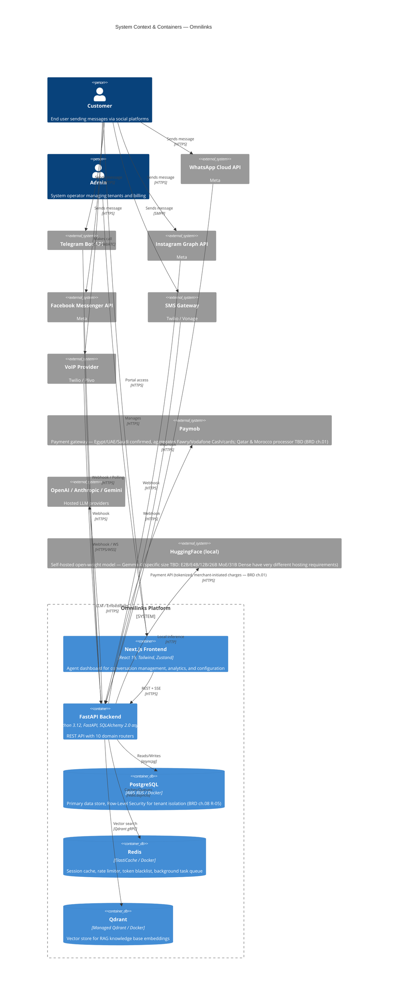

# Omnilinks — Software Architecture Document

**Version:** 0.1.0
**Last Updated:** 2026-07-13
**Status:** Draft

---

## Overview

Omnilinks is a multi-tenant SaaS backend that connects WhatsApp, Telegram, Instagram, Facebook, SMS, and VoIP into a unified AI-powered inbox. It provides multi-LLM AI replies, RAG knowledge bases, usage-based billing via **Paymob** (Egypt, UAE, Saudi Arabia confirmed; Qatar and Morocco processor still to be selected — BRD ch.01 open item), and business intelligence analytics.

The platform is built on an **async-first Python stack** using FastAPI, SQLAlchemy 2.0 async engine, Redis, Qdrant, and a Next.js frontend.

---

## System Context & Container Overview

> **Note on diagram scope:** this combines C4 *Context*-level elements (people, external systems) with *Container*-level elements (frontend, API, databases) in one view, useful as a single at-a-glance diagram here in the index. Chapters 03 and 04 in the Document Map below should split these into proper separate Context-only and Container-only diagrams, not duplicate this same combined view twice.



> **Removed from the prior draft: Stripe and PayPal as separate payment integrations.** This is the fifth time this exact error has appeared across the BRD/PRD/SAD document set. The established architecture (BRD ch.01, confirmed repeatedly since) is Paymob as the single gateway for Egypt/UAE/Saudi, aggregating Fawry, Vodafone Cash, and card payments underneath it — not separate direct integrations with three additional providers, two of which (Stripe, PayPal) were never part of the actual decision.

---

## Domain Structure

```
backend/
├── main.py                          # FastAPI app factory, lifespan, router registration
├── seed.py                          # Database seeding (plans, demo data)
├── core/
│   ├── config.py                    # Pydantic Settings (env-based configuration)
│   ├── database.py                  # SQLAlchemy async engine, session factory
│   ├── security.py                  # JWT, bcrypt, encryption — SEE NOTE BELOW
│   ├── dependencies.py              # FastAPI Depends (auth, role guards)
│   ├── redis.py                     # Redis async client, token blacklist helpers
│   ├── tenant_context.py            # ContextVar for tenant_id (feeds Row-Level Security policies)
│   ├── plan_config.py               # Plan definitions + DB seeding
│   └── middleware/
│       └── rate_limiter.py          # Rate limiting middleware
└── domains/
    ├── auth/                        # Auth, JWT, OIDC
    ├── tenants/                     # Tenant management, types
    ├── channels/                    # Channel config + adapters (WhatsApp, Telegram, etc.)
    ├── conversations/               # Conversations, contacts, messages
    ├── ai/                          # AI providers (OpenAI, Anthropic, Gemini, local Gemma 4)
    ├── rag/                         # RAG ingestion, chunking, vector search
    ├── automation/                  # Automation rules engine — FLAG: BRD ch.07 scopes this V2/out-of-scope for MVP
    ├── billing/                     # Plans, metering, invoices, coupons (Paymob only)
    ├── voice/                       # Voice call sessions, WebSocket
    └── analytics/                   # Business intelligence events
```

Each domain follows the pattern: `models.py`, `schemas.py`, `repository.py`, `service.py`, `router.py`.

> **Resolved open item:** the architecture overview chapter previously flagged a router-count mismatch (10 domains shown, but a code comment implied 11 routers). This file tree confirms exactly **10 domains** — treat 10 as the confirmed count going forward.

> **Still-open item — encryption mismatch:** `core/security.py` lists **Fernet encryption**, but Fernet is AES-**128**-CBC with HMAC authentication under the hood, not AES-256. BRD chapters 08 and 10 specifically committed to AES-256 at rest. This needs an explicit decision: either upgrade the actual encryption scheme to genuinely use AES-256, or revise the BRD's stated commitment to match what's actually implemented — but the two shouldn't silently disagree, especially given this backs a Critical-rated risk (R-01/R-05).

> **Still-open item — AI provider count:** OpenAI, Anthropic, Gemini, and local Gemma 4 is 4 named providers. The architecture overview chapter's "6 providers registered, extensible" claim still isn't reconciled — confirm the actual count against the codebase.

---

## Document Map

| # | File | Description |
|---|------|-------------|
| 1 | [01-architecture-overview.md](01-architecture-overview.md) | Layered architecture with mermaid — already drafted and corrected |
| 2 | [02-architecture-principles.md](02-architecture-principles.md) | Six architecture principles with illustrations |
| 3 | [03-system-context.md](03-system-context.md) | C4 context diagram — should be Context-level only, split from the combined view above |
| 4 | [04-container-diagram.md](04-container-diagram.md) | C4 container diagram — should be Container-level only, split from the combined view above |
| 5 | [05-component-diagrams.md](05-component-diagrams.md) | Internal component diagrams |
| 6 | [06-domain-models.md](06-domain-models.md) | Domain model class diagrams |
| 7 | [07-design-patterns.md](07-design-patterns.md) | Design patterns catalog |
| 8 | [08-data-flow-diagrams.md](08-data-flow-diagrams.md) | Sequence diagrams for key flows |
| 9 | [09-async-processing.md](09-async-processing.md) | Async processing model |
| 10 | [10-security-architecture.md](10-security-architecture.md) | Security onion diagram and flows — **should resolve the Fernet/AES-256 mismatch above** |
| 11 | [11-deployment-architecture.md](11-deployment-architecture.md) | Dev and production deployment |
| 12 | [12-technology-decisions.md](12-technology-decisions.md) | Technology rationale and decision trees — **should reconcile the AI provider count and Automation Domain's MVP status** |

---

## Open Items Carried Forward

1. Confirm whether this document reflects live code — if so, the Stripe/PayPal integrations and Fernet encryption need auditing in the actual codebase, not just here.
2. Fernet vs. AES-256 needs a real decision, not a silent mismatch, given it backs a Critical risk.
3. Automation Domain's MVP status needs resolving against BRD ch.07's V2 scoping.
4. AI provider count (6 claimed vs. 4 named) still unresolved.
5. Specify which Gemma 4 size/variant (E2B/E4B/12B/26B MoE/31B Dense) is actually deployed — each has very different hosting/VRAM requirements.
6. Chapters 03 and 04 should be proper separate Context-only and Container-only C4 diagrams, not both copies of this combined index view.