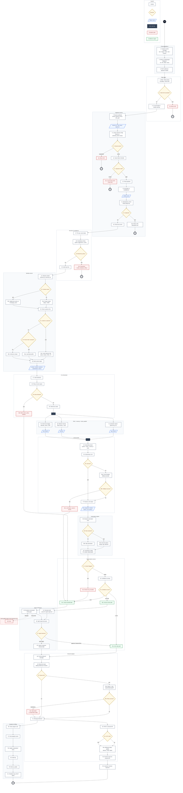

```mermaid
 flowchart TB
    classDef startNode fill:#111827,stroke:#111827,stroke-width:3px,color:#ffffff
    classDef endNode fill:#ffffff,stroke:#111827,stroke-width:5px,color:#111827
    classDef activity fill:#ffffff,stroke:#64748b,stroke-width:2px,color:#1e293b
    classDef decision fill:#fef9e7,stroke:#b7860b,stroke-width:2px,color:#78350f
    classDef objectNode fill:#eff6ff,stroke:#2563eb,stroke-width:2px,color:#1e3a8a
    classDef forkBar fill:#334155,stroke:#334155,stroke-width:10px,color:#ffffff
    classDef exception fill:#fef2f2,stroke:#b91c1c,stroke-width:2px,color:#7f1d1d
    classDef signal fill:#f0fdf4,stroke:#15803d,stroke-width:2px,color:#14532d

    N1((start)):::startNode --> S1["1. Customer sends message<br/>text / image / voice / doc / location"]:::activity

    subgraph LANE1["Channel platform"]
        direction TB
        S1 --> S2["2. Deliver via WhatsApp / Telegram /<br/>IG / FB / SMS / Voice"]:::activity
        S2 --> S3["3. POST webhook + signature header"]:::activity
    end

    subgraph LANE2["Edge layer"]
        direction TB
        S3 --> S4["4. WAF / DDoS check<br/>Cloudflare / AWS WAF"]:::activity
        S4 --> D1{"5. Rate limit exceeded?"}:::decision
        D1 -->|yes| E1["5a. Return 429"]:::exception --> X1((end)):::endNode
        D1 -->|no| S5["6. TLS termination + header parsing"]:::activity
    end

    subgraph LANE3["Ingestion service"]
        direction TB
        S5 --> S6["7. Receive webhook<br/>extract channel_id from URL path"]:::activity
        S6 --> OBJ1[/"channel_id / raw_body / signature"/]:::objectNode
        OBJ1 --> S7["8. Lookup channel config<br/>tenant_id, webhook_secret, status"]:::activity
        S7 --> D2{"9. Channel active?"}:::decision
        D2 -->|suspended| E2["9a. Return 403"]:::exception --> X2((end)):::endNode
        D2 -->|active| S8["10. Verify HMAC-SHA256"]:::activity
        S8 --> D3{"11. Signature valid?"}:::decision
        D3 -->|invalid| E3["11a. Log security event<br/>+ alert SOC"]:::exception --> X3((end)):::endNode
        D3 -->|valid| S9["12. Parse payload"]:::activity
        S9 --> S10["13. Normalize to UnifiedEvent"]:::activity
        S10 --> OBJ2[/"unified_event"/]:::objectNode
        OBJ2 --> S11["14. Idempotency check<br/>Redis dedup key"]:::activity
        S11 --> D4{"15. Duplicate?"}:::decision
        D4 -->|yes| S11a["15a. Return 200, idempotent ack"]:::activity --> X4((end)):::endNode
        D4 -->|no| S12["16. Persist raw event"]:::activity
    end

    subgraph LANE4["Security &amp; compliance"]
        direction TB
        S12 --> S13["17. PII scan, auto-redact"]:::activity
        S13 --> S14["18. Compliance check<br/>GDPR / Egypt DPL / CCPA"]:::activity
        S14 --> D5{"19. Blocked by policy?"}:::decision
        D5 -->|yes| E4["19a. Quarantine<br/>+ notify compliance officer"]:::exception --> X5((end)):::endNode
        D5 -->|no| S15["20. Audit log entry"]:::activity
    end

    subgraph LANE5["Identity service"]
        direction TB
        S15 --> S16["21. Resolve contact<br/>(channel_id, external_id)"]:::activity
        S16 --> D6{"22. Contact exists?"}:::decision
        D6 -->|no| S17a["22a. Create contact<br/>status = NEW"]:::activity
        D6 -->|yes| S17b["22b. Update last_seen_at<br/>+ message_count"]:::activity
        S17a --> S18["23. Check customer link"]:::activity
        S17b --> S18
        S18 --> D7{"24. Linked to customer?"}:::decision
        D7 -->|yes| S19a["24a. Load customer 360<br/>orders, tickets, CRM, LTV"]:::activity
        D7 -->|no| D8{"25. Known lead / prospect?"}:::decision
        D8 -->|yes| S19b["25a. Load lead profile"]:::activity
        D8 -->|no| S19c["25b. Unknown contact"]:::activity
        S19a --> S20["26. Build context object"]:::activity
        S19b --> S20
        S19c --> S20
        S20 --> OBJ3[/"context: contact, customer,<br/>classification, history"/]:::objectNode
    end

    subgraph LANE6["AI orchestrator"]
        direction TB
        OBJ3 --> S21["27. Intent detection"]:::activity
        S21 --> S22["28. Policy &amp; rules engine"]:::activity
        S22 --> D9{"29. Action blocked?"}:::decision
        D9 -->|yes| E5["29a. Block action, policy violation"]:::exception
        D9 -->|no| S23["30. Determine needs"]:::activity
        S23 --> F1[" "]:::forkBar
    end

    subgraph LANE7["RAG + memory + tools, parallel"]
        direction TB
        F1 --> S24["31. Semantic search, Qdrant top_k=5"]:::activity --> OBJ4[/"rag_chunks"/]:::objectNode
        F1 --> S25["32. Retrieve memory<br/>Redis history + facts"]:::activity --> OBJ5[/"memory"/]:::objectNode
        F1 --> S26["33. Check tool registry<br/>calendar, orders, CRM"]:::activity --> OBJ6[/"tool_results"/]:::objectNode
    end

    subgraph LANE8["LLM provider"]
        direction TB
        OBJ4 --> J1[" "]:::forkBar
        OBJ5 --> J1
        OBJ6 --> J1
        J1 --> S27["34. Assemble prompt<br/>system + RAG + memory + tools"]:::activity
        S27 --> S28["35. Call primary LLM"]:::activity
        S28 --> D10{"36. Success?"}:::decision
        D10 -->|no| S28a["36a. Circuit breaker:<br/>fallback provider"]:::activity
        S28a --> D11{"36b. Fallback success?"}:::decision
        D11 -->|fail| E6["36c. LLM failure, route to human"]:::exception
        D11 -->|ok| S29["37. Receive LLM output"]:::activity
        D10 -->|yes| S29
        S29 --> OBJ7[/"llm_response: content,<br/>tokens, cost, latency"/]:::objectNode
    end

    subgraph LANE9["Automation engine"]
        direction TB
        OBJ7 --> S30["38. Evaluate automation rules"]:::activity
        S30 --> D12{"39. Rule matched?"}:::decision
        D12 -->|yes| S30a["39a. Execute actions<br/>assign, tag, webhook"]:::activity
        D12 -->|no| S30b["39b. Skip automation"]:::activity
        S30a --> S31["40. Guardrails &amp; safety<br/>PII, toxicity, hallucination"]:::activity
        S30b --> S31
    end

    subgraph LANE10["Conversation service"]
        direction TB
        S31 --> D13{"41. Content flagged?"}:::decision
        D13 -->|yes| E7["41a. Discard, log, escalate"]:::exception
        D13 -->|clean| S32["42. Confidence scoring"]:::activity
        S32 --> D14{"43. Confidence score?"}:::decision
        D14 -->|">= 80"| S33a["43a. Auto-reply path"]:::signal
        D14 -->|"40 to 80"| S33b["43b. Human-review path"]:::signal
        D14 -->|"< 40"| S33c["43c. Human-handoff path"]:::signal
        E7 --> S33c
        E5 --> S33c
        E6 --> S33c
    end

    subgraph LANE11["Agent workspace"]
        direction TB
        S33b --> S34["44. Generate draft<br/>queue for agent approval"]:::activity
        S33c --> S35["45. Escalate conversation<br/>notify agent"]:::activity
        S34 --> S36["46. Agent approval queue"]:::activity
        S35 --> S36
        S36 --> D15{"47. Agent decision?"}:::decision
        D15 -->|"approve / timeout 5min"| S33a
        D15 -->|"edit / reject"| S37["47a. Agent composes manual reply"]:::activity
    end

    subgraph IR1["Interruptible region: first-response SLA"]
        direction TB
        S35 -.->|"SLA 2 min"| IR1A["SLA timer"]:::exception
        IR1A -.->|interrupt| S35
    end

    subgraph LANE12["Channel adapter"]
        direction TB
        S33a --> S38["48. Format outbound message"]:::activity
        S37 --> S38
        S38 --> S39["49. Rate limit check<br/>sliding window per channel"]:::activity
        S39 --> D16{"50. Queue full?"}:::decision
        D16 -->|yes| S40["50a. Queue + retry<br/>exponential backoff"]:::activity
        S40 --> D17{"50b. Retry success?"}:::decision
        D17 -->|"fail after 3x"| E8["50c. Mark failed<br/>+ compensate usage"]:::exception
        D17 -->|ok| S41["51. Message delivered"]:::activity
        D16 -->|no| S41
        E8 --> S41
        S41 --> S42["52. POST to channel API"]:::activity
        S42 --> D18{"53. HTTP 200?"}:::decision
        D18 -->|"no"| S43["53a. Webhook status update<br/>delivery / read / failed"]:::activity
        D18 -->|"yes"| S43
        S43 --> S44["54. Format &amp; send via channel API"]:::activity
    end

    S44 --> S45["55. Customer receives response"]:::activity

    subgraph LANE13["Analytics &amp; billing"]
        direction TB
        S41 --> S46["56. Track usage &amp; cost"]:::activity
        S46 --> S47["57. Emit analytics event"]:::activity
        S47 --> S48["58. Update materialized views"]:::activity
        S48 --> S49["59. Audit log"]:::activity
        S49 --> S50["60. Memory update"]:::activity
        S50 --> S51["61. Feedback loop, RLHF signal"]:::activity
    end

    S45 --> N2((end)):::endNode
    S51 --> N2

    subgraph LEGEND["Legend"]
        direction LR
        L1["Activity"]:::activity
        L2{"Decision"}:::decision
        L3[/"Object node"/]:::objectNode
        L4[" fork / join bar "]:::forkBar
        L5["Exception path"]:::exception
        L6["Confidence signal"]:::signal
    end

    style LANE1 fill:#f8fafc,stroke:#cbd5e1,stroke-width:2px
    style LANE2 fill:#ffffff,stroke:#cbd5e1,stroke-width:2px
    style LANE3 fill:#f8fafc,stroke:#cbd5e1,stroke-width:2px
    style LANE4 fill:#ffffff,stroke:#cbd5e1,stroke-width:2px
    style LANE5 fill:#f8fafc,stroke:#cbd5e1,stroke-width:2px
    style LANE6 fill:#ffffff,stroke:#cbd5e1,stroke-width:2px
    style LANE7 fill:#f8fafc,stroke:#cbd5e1,stroke-width:2px
    style LANE8 fill:#ffffff,stroke:#cbd5e1,stroke-width:2px
    style LANE9 fill:#f8fafc,stroke:#cbd5e1,stroke-width:2px
    style LANE10 fill:#ffffff,stroke:#cbd5e1,stroke-width:2px
    style LANE11 fill:#f8fafc,stroke:#cbd5e1,stroke-width:2px
    style LANE12 fill:#ffffff,stroke:#cbd5e1,stroke-width:2px
    style LANE13 fill:#f8fafc,stroke:#cbd5e1,stroke-width:2px
    style IR1 fill:#fef2f2,stroke:#b91c1c,stroke-width:2px,stroke-dasharray: 8 8
    style LEGEND fill:#ffffff,stroke:#94a3b8,stroke-width:2px,stroke-dasharray: 6 6
```