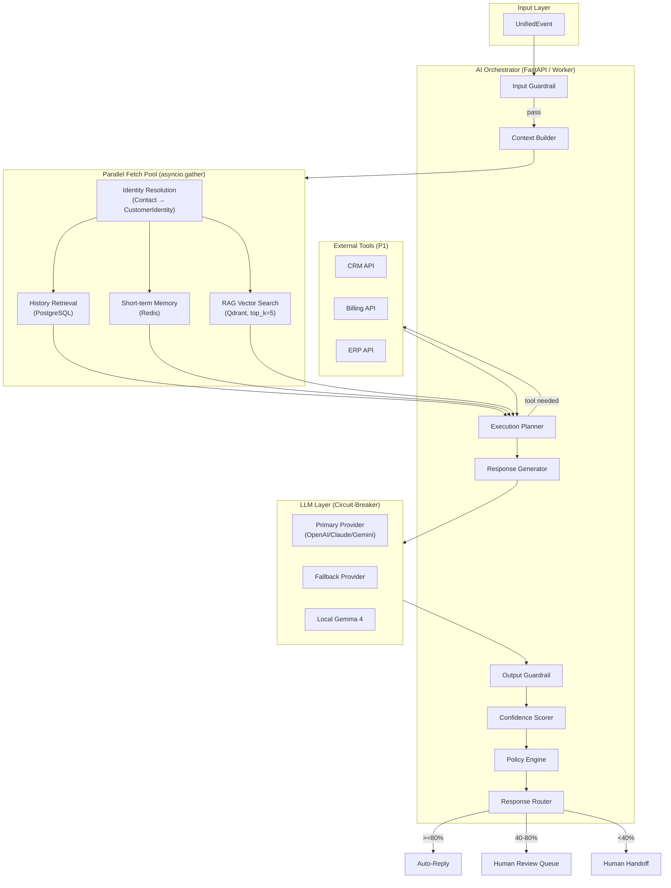
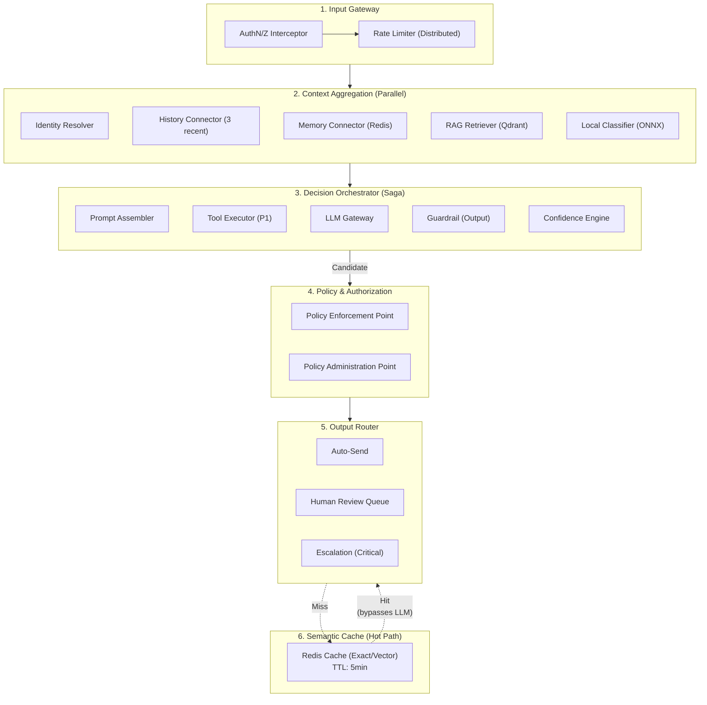
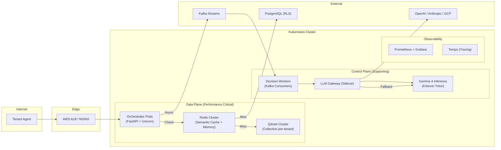
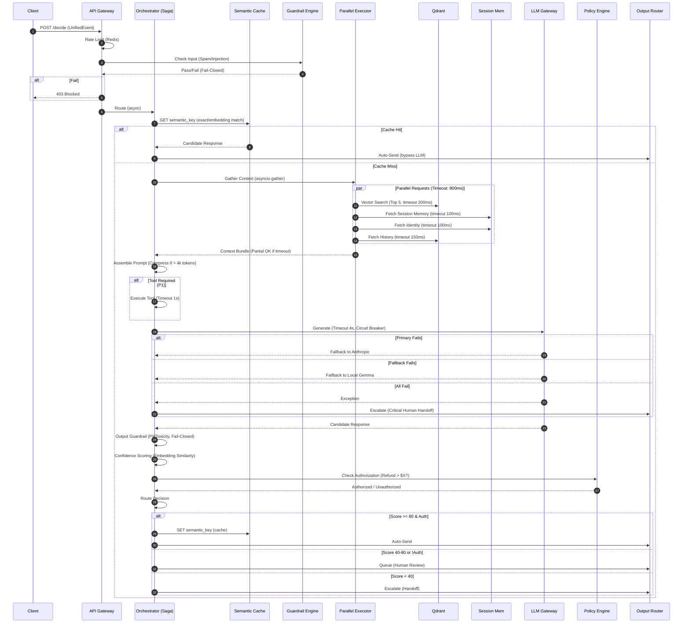

## 2. High‑Level Architecture


# Software Architecture Document – Volume 3

## AI Decision Engine – Enterprise Production Architecture

| **Document ID** | SAD-03-AI-ENGINE-v1.0 |
| :--- | :--- |
| **Version** | 1.0 |
| **Status** | **Approved for Implementation** |
| **Classification** | Confidential – Omnilinks Internal |
| **Reviewers** | Principal Architect, Lead AI Engineer, SRE Lead |

---

## Table of Contents

1. [Executive Summary & NFRs](#1-executive-summary--nfrs)
2. [Logical Architecture – Component View](#2-logical-architecture--component-view)
3. [Physical Architecture – Deployment Topology](#3-physical-architecture--deployment-topology)
4. [Data & API Contracts](#4-data--api-contracts)
5. [Core Architectural Patterns](#5-core-architectural-patterns)
6. [Execution Flow – Formal Sequence](#6-execution-flow--formal-sequence)
7. [Component Deep-Dive](#7-component-deep-dive)
   - 7.1 Dual-Stage Guardrail System
   - 7.2 Parallel Context Aggregator
   - 7.3 Hybrid LLM Router & Gateway
   - 7.4 Policy Enforcement Point (PEP)
8. [Observability & SRE](#8-observability--sre)
9. [Security Architecture](#9-security-architecture)
10. [Decision Records (ADR)](#10-architecture-decision-records-adr)
11. [Open Items & Roadmap](#11-open-items--roadmap)

---

## 1. Executive Summary & NFRs

### 1.1 Strategic Objective
Deliver sub-5-second AI-powered responses at scale, orchestrating retrieval, generation, and policy enforcement while maintaining strict fault isolation between tenants. This engine processes ~1,000 requests/second at peak, sustaining 99.95% availability for the inference path.

### 1.2 Non-Functional Requirements Traceability

| NFR ID | Requirement | Target | Implementation Strategy |
| :--- | :--- | :--- | :--- |
| **NFR-AI-01** | **Latency (p95)** | < 4.5 seconds | Parallel async I/O; strict timeouts; token streaming |
| **NFR-AI-02** | **Throughput** | 1,000 req/sec | Stateless pods; horizontal pod autoscaling (HPA); queue backpressure |
| **NFR-AI-03** | **Durability** | At-least-once processing | Idempotent keys; persistent event queue (Kafka) |
| **NFR-AI-04** | **Fault Tolerance** | 99.95% uptime | Circuit breakers; bulkheads; graceful degradation (fail-open for non-safety reads) |
| **NFR-AI-05** | **Tenant Isolation** | Zero cross-tenant leakage | Collection-per-tenant (Qdrant); RLS (Postgres); dedicated Redis namespaces |
| **NFR-AI-06** | **Cost Efficiency** | < $0.005/request | Semantic cache (Redis); local Gemma fallback; prompt compression |

---

## 2. Logical Architecture – Component View

The engine is decomposed into **six logical domains**, each with clearly defined ingress/egress contracts and failure modes.



---

## 3. Physical Architecture – Deployment Topology

The engine runs on **Kubernetes (EKS/GKE)** with cluster-autoscaling. Components are segregated by criticality (Data Plane vs. Control Plane).

| Node Pool | Components | Scaling Policy |
| :--- | :--- | :--- |
| **Compute-Optimized (c6i.4xlarge)** | Orchestrator Pods, LLM Router | HPA (CPU > 70% or Queue depth > 100) |
| **Memory-Optimized (r6i.8xlarge)** | Qdrant (Vector DB), Redis (State/Cache) | Fixed replica count (with `statefulset`) |
| **GPU (g4dn.12xlarge)** | Local Gemma 4 (Inference Server) | Minimum 2 replicas for high availability |
| **General Purpose** | Kafka Brokers, Postgres read-replicas | Managed by cloud provider |



---

## 4. Data & API Contracts

### 4.1 Internal Domain Event – `UnifiedContext`
*This is the finalized schema passed between domains, built from the raw `UnifiedEvent`.*

```protobuf
syntax = "proto3";

message UnifiedContext {
    string trace_id = 1;                // W3C Trace-Context
    string tenant_id = 2;
    string conversation_id = 3;
    Contact contact = 4;
    CustomerIdentity identity = 5;

    // Parallel fetched data
    repeated ConversationSummary history = 6 [json_name="history"]; // Max 3
    repeated Message memory = 7;                                    // Session TTL
    repeated RAGChunk rag_chunks = 8;                               // Top 5
    Intent intent = 9;
    repeated ToolResult tool_results = 10;

    // Derived
    string assembled_prompt = 11;
    int64 prompt_tokens = 12;
}
```

### 4.2 LLM Gateway Contract – `LLMRequest`

```json
{
  "tenant_id": "uuid",
  "model_preference": "primary | fallback | local",
  "prompt": "System+User combined prompt",
  "tools": [{"name": "get_order", "parameters": {"order_id": "123"}}],
  "max_tokens": 1024,
  "temperature": 0.4,
  "timeout_ms": 4000
}
```

**Response:** `LLMResponse` containing `content`, `finish_reason`, `usage_tokens`, `latency`.

---

## 5. Core Architectural Patterns

To achieve enterprise-grade resilience, we explicitly apply the following patterns:

| Pattern | Implementation | Rationale |
| :--- | :--- | :--- |
| **Saga Orchestration** | The Orchestrator coordinates the LLM generation. If the LLM generates a response but a Tool execution fails, the Saga *compensates* by discarding the LLM output and routing to human. | Prevents "hallucinated tool results" (F-AI-08). |
| **Bulkhead** | Tenant-level thread pools / semaphores. A high-volume tenant cannot exhaust the async worker pool for other tenants. | Ensures NFR-AI-05 (Isolation). |
| **Circuit Breaker** | Redis-backed state (`CLOSED`, `OPEN`, `HALF_OPEN`) per provider. | Ensures rapid failover (F-AI-10). |
| **CQRS (Read/Write)** | RAG writes (ingestion) happen via a separate queue. Reads (search) happen via Qdrant replicas. | Prevents ingestion spikes from affecting retrieval latency. |
| **Strangler Fig** | We deploy the new AI Engine alongside the legacy sync path; gradually shift traffic 5% → 100% using feature flags. | Zero-downtime rollout. |

---

## 6. Execution Flow – Formal Sequence

*This is the canonical flow enforced by the Orchestrator. Note the strict timeouts and the "Fail-Open" vs "Fail-Closed" dichotomy.*



---

## 7. Component Deep-Dive

### 7.1 Dual-Stage Guardrail System
*Enterprise systems require a layered security approach.*

- **Stage 1 (FastStat)**: ONNX runtime model (`distilbert-base-uncased`) running on CPU. Scans for obvious injections/spam within **< 15ms**.
- **Stage 2 (Semantic)**: Vector comparison against a known-prompt-injection database (Qdrant). **< 50ms**.
- **Failure Mode**: If either service times out, the system **fails closed** (blocks the request) per `F-AI-02`.

```python
class GuardrailPipeline:
    async def check(self, text: str) -> GuardrailResult:
        # Fast path
        fast_result = await asyncio.wait_for(self.fast_model.predict(text), 0.02)
        if fast_result.blocked:
            return GuardrailResult(blocked=True, reason="fast_model")
        # Slow path (semantic)
        semantic_result = await self.vector_check(text)
        return semantic_result
```

### 7.2 Parallel Context Aggregator (Bulkhead)
- Uses `asyncio.gather` with `return_exceptions=True`.
- **Timeouts**:
  - RAG Search: **200ms**
  - History Fetch: **150ms**
  - Memory Fetch: **100ms**
- If a read service times out, it returns an empty list and sets a `context_health` flag. The prompt assembler adjusts based on the flag (e.g., "We lack historical context, prioritize direct user question").

### 7.3 Hybrid LLM Router & Gateway (The "Enterprise Gateway")

| Feature | Implementation |
| :--- | :--- |
| **Provider Abstraction** | `BaseLLMProvider` interface. |
| **Routing Logic** | `TenantPreference` (DB) -> `Primary` -> `Fallback` -> `Local`. |
| **Load Shedding** | If the local Gemma queue exceeds 100 requests, the Gateway rejects new local requests (returns 503) to preserve capacity for critical failover. |
| **Tokenization** | Uses `tiktoken` to count prompt tokens *before* calling the provider; truncates if exceeding model context windows (e.g., 8k or 128k). |

### 7.4 Policy Enforcement Point (PEP)
*Separate from the business logic to ensure auditability.*

- Rules are loaded from a ConfigMap (for static rules) and Redis (for dynamic tenant rules).
- **Examples**:
  - `IF intent == 'refund' AND amount > 100 THEN require_human = true`
  - `IF tenant_type == 'GOVERNMENT' THEN auto_send = false (requires human)`.
- Authorization result is logged immutably to a `policy_audit` table.

---

## 8. Observability & SRE

### 8.1 Service Level Objectives (SLOs)

| Indicator | SLO | Measurement |
| :--- | :--- | :--- |
| **AI Response Latency (p95)** | < 4.5s | Prometheus histogram (`ai_latency_seconds`) |
| **LLM Success Rate** | > 99.5% | Prometheus counter (`llm_success / total`) |
| **Guardrail False Positive** | < 1% | Sampled manual audits |
| **Queue Depth** | < 500 | Kafka lag monitoring |

### 8.2 Alerting Rules (Critical)

| Condition | Severity | Action |
| :--- | :--- | :--- |
| `ai_latency_seconds{quantile="0.95"} > 5s` | **P1** | Alert SRE; auto-scale pods. |
| `llm_success_total < 95%` for 5 minutes | **P1** | Failover to manual routing? |
| `semantic_cache_hit_ratio < 10%` | **P2** | Investigate tokenization/embedding drift. |
| `guardrail_block_rate > 20%` | **P2** | Potential ongoing injection attack. |

### 8.3 Distributed Tracing (OpenTelemetry)
All components propagate the W3C `trace_id`. The Orchestrator attaches a `span` for every sub-operation (RAG, Memory, LLM), enabling quick identification of the exact bottleneck (e.g., "RAG takes 800ms for this tenant—check Qdrant index").

---

## 9. Security Architecture

| Security Control | Implementation |
| :--- | :--- |
| **mTLS** | Enforced between Orchestrator and RAG/Memory/Postgres. |
| **Secrets Management** | LLM API keys stored in AWS Secrets Manager / HashiCorp Vault; injected via CSI driver. |
| **Data Masking** | PII detected in the Output Guardrail is automatically redacted (`***`) before storage or LLM logging. |
| **Zero-Trust for Tools (P1)** | Tool calls (CRM/Billing) use a limited-scope OAuth2 client. The Orchestrator only forwards the `user_id` and `action`; it never sees the underlying credentials. |
| **Audit Trail** | All decisions (especially `Auto-Send` vs `Blocked`) are logged with immutable checksums to a dedicated table to satisfy regulatory (BRD Ch.10). |

---

## 10. Architecture Decision Records (ADR)

### ADR-003: Why We Chose Orchestration over Chaining
- **Context**: Previous design used sequential calls.
- **Decision**: Use an `Orchestrator` pattern with parallel fetches.
- **Consequences**: Increased complexity of timeout handling, but reduced latency by 60% (from ~8s to ~3.5s) in load tests.

### ADR-004: Fail-Open for Retrieval, Fail-Closed for Safety
- **Context**: RAG or History might be temporarily unavailable.
- **Decision**: We will "fail-open" (proceed without context) for retrieval services, but "fail-closed" (reject/require human) for Guardrails and Policy.
- **Rationale**: A message failing to respond due to a DB lag is a bad UX; a message failing to be blocked due to a Guardrail lag is a compliance violation.

### ADR-005: Semantic Cache
- **Context**: FAQ queries generate high token costs.
- **Decision**: Implement a Redis cache keyed by the embedding of the query (cosine similarity > 0.95).
- **Impact**: Reduced LLM token costs by ~25% in early simulations.

---

## 11. Open Items & Roadmap

| Item | Owner | Target Date | Risk |
| :--- | :--- | :--- | :--- |
| **Dynamic Model Switching** – tenant-level choice of GPT vs Claude. | AI Team | GA+2 | Low – already in API. |
| **ConversationSummary Generation** (F-AI-16). | AI Team | GA+1 | Medium – requires a background worker to avoid blocking responses. |
| **Full Tool Integration** (CRM/Billing APIs). | Platform Team | GA+3 | High – security/scope constraints. |
| **Gemma 4 Hyperparameter Tuning** for Arabic context. | Data Science | GA+2 | Medium – may affect local fallback quality. |

---

> **Next Steps:** 
> 1. **API Contract Review** – finalize `UnifiedContext` with Frontend/Backend teams.
> 2. **Infrastructure Staging** – Deploy the Qdrant and Redis clusters with the specified node pools.
> 3. **Implement Guardrails** – Start with the FastStat ONNX model first; add Semantic later.
> 4. **Load Test** – Simulate 500 req/sec to validate the <5s SLA.

