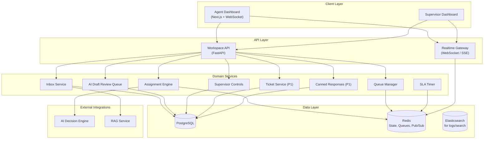
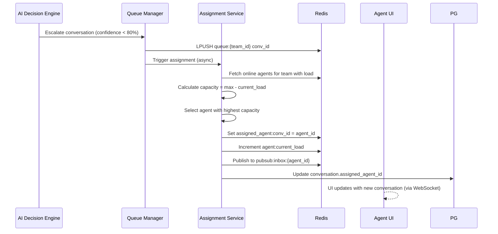
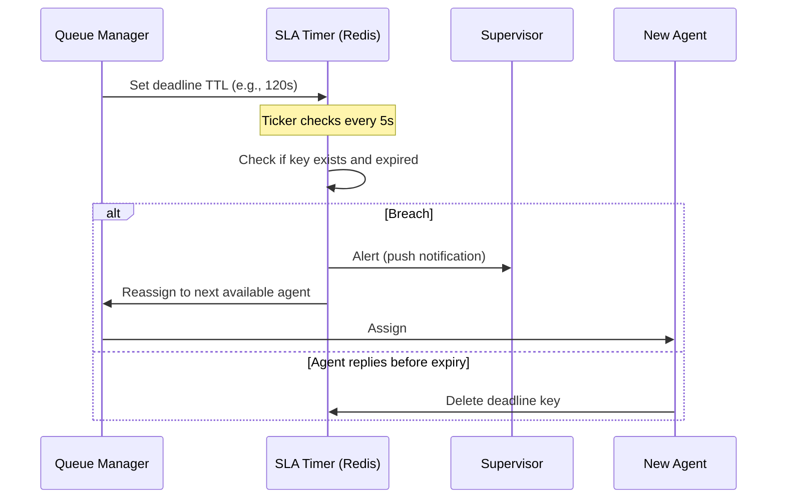

# Software Architecture Document – Volume 6

## Human Escalation & Agent Workspace – Production Architecture

| **Document ID** | SAD-06-AGENT-WORKSPACE-v1.0 |
| :--- | :--- |
| **Version** | 1.0 |
| **Status** | **Approved for Implementation** |
| **Classification** | Confidential – Omnilinks Internal |
| **Reviewers** | Principal Architect, Frontend Lead, UX Lead, SRE Lead |

---

## Table of Contents

1. [Executive Summary & NFRs](#1-executive-summary--nfrs)
2. [Logical Architecture – Component View](#2-logical-architecture--component-view)
3. [Physical Architecture – Deployment Topology](#3-physical-architecture--deployment-topology)
4. [Data Architecture – Domain Models](#4-data-architecture--domain-models)
5. [Core Component Deep‑Dive](#5-core-component-deep-dive)
   - 5.1 Agent Assignment & Load Balancing
   - 5.2 Unified Inbox & Workspace
   - 5.3 SLA Timer & Escalation
   - 5.4 AI Draft Review Queue
   - 5.5 Supervisor Controls
   - 5.6 Canned Responses & Tickets (P1)
6. [Integration with AI Decision Engine & RAG](#6-integration-with-ai-decision-engine--rag)
7. [Security & Authorization](#7-security--authorization)
8. [Observability & SRE](#8-observability--sre)
9. [Architecture Decision Records (ADR)](#9-architecture-decision-records-adr)
10. [Open Items & Roadmap](#10-open-items--roadmap)

---

## 1. Executive Summary & NFRs

### 1.1 Strategic Objective
Deliver a **real‑time, scalable human‑escalation system** that routes conversations from the AI Decision Engine (confidence < 80% or policy‑blocked) to the appropriate human agents, with full workspace capabilities, SLA monitoring, and supervisor oversight. The system must handle **10,000+ concurrent conversations**, support **500+ concurrent agents**, and provide **sub‑100 ms UI updates**.

### 1.2 Non‑Functional Requirements

| NFR ID | Category | Target | Implementation |
| :--- | :--- | :--- | :--- |
| **NFR-AGENT-01** | **Latency (p95)** | < 200 ms for UI actions | WebSocket/SSE, Redis pub/sub, async DB |
| **NFR-AGENT-02** | **Concurrent Agents** | 500 per tenant | Horizontal scaling of workspace pods |
| **NFR-AGENT-03** | **Concurrent Conversations** | 10,000+ | Queue‑backed assignment; Redis for state |
| **NFR-AGENT-04** | **SLA Breach Alert** | < 1 second | Interruptible SLA timer (Redis + cron) |
| **NFR-AGENT-05** | **Availability** | 99.95% | Multi‑AZ, circuit breakers |
| **NFR-AGENT-06** | **Real‑time Updates** | < 100 ms | WebSocket / SSE with delta compression |

---

## 2. Logical Architecture – Component View



---

## 3. Physical Architecture – Deployment Topology

| Node Pool | Instance Type | Components | Scaling Policy |
| :--- | :--- | :--- | :--- |
| **Compute‑Optimised** | Standard_D4s_v3 | Workspace API Pods | HPA: CPU > 70% |
| **Memory‑Optimised** | Standard_E8s_v3 | Realtime Gateway (WebSocket) | HPA: connections > 1000 |
| **Redis** | Premium P2 (13GB) | Redis Cluster with pub/sub | Fixed |
| **PostgreSQL** | Flexible Server (8 vCPU, 32GB) | Conversations, Agents, etc. | Zone‑redundant HA |

---

## 4. Data Architecture – Domain Models

### 4.1 Core Entities (PostgreSQL)

```sql
-- Conversations (including escalated ones)
CREATE TABLE conversations (
    id UUID PRIMARY KEY,
    tenant_id UUID NOT NULL,
    team_id UUID,
    contact_id UUID,
    status VARCHAR(20) DEFAULT 'open', -- open, escalated, assigned, closed
    assigned_agent_id UUID,
    escalated_at TIMESTAMP,
    sla_deadline TIMESTAMP,
    confidence_score FLOAT,
    resolution_summary TEXT,
    created_at TIMESTAMP DEFAULT NOW(),
    updated_at TIMESTAMP
);

-- Agent assignment state (real-time in Redis, persisted here)
CREATE TABLE agent_sessions (
    id UUID PRIMARY KEY,
    user_id UUID NOT NULL,
    tenant_id UUID NOT NULL,
    status VARCHAR(20) DEFAULT 'online', -- online, away, offline
    max_concurrent INT DEFAULT 5,
    current_load INT DEFAULT 0,
    team_ids UUID[],
    last_activity TIMESTAMP
);

-- AI draft reviews
CREATE TABLE ai_draft_reviews (
    id UUID PRIMARY KEY,
    conversation_id UUID REFERENCES conversations(id),
    drafted_response TEXT,
    confidence FLOAT,
    status VARCHAR(20) DEFAULT 'pending', -- pending, approved, rejected, edited
    reviewed_by UUID,
    reviewed_at TIMESTAMP,
    created_at TIMESTAMP
);

-- Internal notes
CREATE TABLE internal_notes (
    id UUID PRIMARY KEY,
    conversation_id UUID REFERENCES conversations(id),
    author_id UUID,
    content TEXT,
    created_at TIMESTAMP
);

-- Canned responses (team-scoped)
CREATE TABLE canned_responses (
    id UUID PRIMARY KEY,
    team_id UUID,
    title TEXT,
    content TEXT,
    usage_count INT DEFAULT 0,
    created_by UUID,
    created_at TIMESTAMP
);

-- Tickets (P1)
CREATE TABLE tickets (
    id UUID PRIMARY KEY,
    conversation_id UUID REFERENCES conversations(id),
    tenant_id UUID,
    status VARCHAR(20) DEFAULT 'open',
    priority VARCHAR(20) DEFAULT 'medium',
    assigned_agent_id UUID,
    subject TEXT,
    description TEXT,
    created_at TIMESTAMP
);
```

### 4.2 Redis Data Structures

| Key Pattern | Type | TTL | Purpose |
| :--- | :--- | :--- | :--- |
| `agent:{user_id}:state` | Hash | 5 min | Agent online/away/offline, load |
| `queue:{team_id}` | List | – | Pending conversations for team |
| `sla:{conversation_id}` | String | 10 min | SLA deadline (timestamp) |
| `assignment:lock:{conversation_id}` | String | 10s | Distributed lock for assignment |
| `pubsub:inbox:{user_id}` | Pub/Sub | – | Real‑time updates to agent |

---

## 5. Core Component Deep‑Dive

### 5.1 Agent Assignment & Load Balancing

**Algorithm:** Weighted Round‑Robin with Load‑Awareness

- Each agent has a `max_concurrent` (team‑configurable).
- `current_load` = number of active conversations assigned.
- New conversation assigned to the agent with the highest available capacity (`max - current`) within the target team.
- Fallback: if no agent available, queue remains in team queue and alerts Supervisor.

**Flow:**



**Code – Assignment Service:**

```python
class AssignmentService:
    async def assign(self, conversation_id, team_id):
        # Distributed lock to prevent double assignment
        lock_key = f"assignment:lock:{conversation_id}"
        if not await redis.set(lock_key, "1", nx=True, ex=10):
            return  # already being assigned

        try:
            # Get online agents for team
            agent_keys = await redis.smembers(f"team:{team_id}:online")
            candidates = []
            for key in agent_keys:
                state = await redis.hgetall(key)
                max_conc = int(state.get('max_concurrent', 5))
                current = int(state.get('current_load', 0))
                if current < max_conc:
                    candidates.append({
                        'id': key.split(':')[1],
                        'capacity': max_conc - current
                    })
            if not candidates:
                # No available agent; keep in queue
                return

            # Select agent with max capacity (round‑robin tie‑break)
            selected = max(candidates, key=lambda x: (x['capacity'], random.random()))
            agent_id = selected['id']

            # Atomically update
            await redis.hincrby(f"agent:{agent_id}:state", "current_load", 1)
            await redis.set(f"conv:{conversation_id}:assigned", agent_id)
            await redis.publish(f"pubsub:inbox:{agent_id}", json.dumps({
                "event": "new_conversation",
                "conversation_id": conversation_id
            }))
            # Persist to DB (async)
            await self.persist_assignment(conversation_id, agent_id)
        finally:
            await redis.delete(lock_key)
```

### 5.2 Unified Inbox & Workspace

**Frontend:** Next.js with Zustand state, WebSocket for real‑time updates.

**Backend:** Workspace API provides conversation list, message thread, customer timeline, AI suggestions, KB search.

**Customer Timeline:** Fetches last N `ConversationSummary` rows from the RAG domain’s History Retrieval Service, keyed by `CustomerIdentity`. Displayed as a sidebar panel in the agent workspace.

**Message Thread:** Uses PostgreSQL for history; new messages stream via WebSocket.

**AI Suggestions:** Calls the RAG service to generate draft responses based on the conversation context (similar to the AI Decision Engine but read‑only). Displayed as "suggested replies."

### 5.3 SLA Timer & Escalation

**Mechanism:** When a conversation is escalated, we set a deadline in Redis: `sla:{conv_id}` = now + SLA duration (tenant‑configurable). A background timer (e.g., Redis‑backed cron or Celery beat) checks expired keys and triggers breach actions.

**Interruptible:** If the agent responds before the deadline, the timer is deleted. If breached, alert Supervisor and reassign to another agent.

**Flow:**



**Code – SLA Timer (Celery Beat + Redis):**

```python
@celery.task
def check_sla_deadlines():
    # Find all SLA keys (pattern: sla:*)
    keys = redis.keys("sla:*")
    now = time.time()
    for key in keys:
        deadline = float(redis.get(key))
        if now > deadline:
            conv_id = key.split(':')[1]
            # Breach handling
            handle_sla_breach(conv_id)
            redis.delete(key)  # clean up

def handle_sla_breach(conversation_id):
    # Alert Supervisor (push notification, email)
    supervisor_alert(conversation_id)
    # Reassign to another agent
    conv = get_conversation(conversation_id)
    new_agent = find_best_agent(conv.team_id)
    assign_conversation(conversation_id, new_agent)
    # Log breach
    log_sla_breach(conversation_id)
```

### 5.4 AI Draft Review Queue

**Background:** When the AI Decision Engine returns confidence between 40% and 80%, it creates a draft and places it in a review queue.

**Agent Action:** Agents see pending drafts in their queue; they can approve (send as‑is), edit (modify and send), or reject (escalate to Supervisor).

**Data:** Stored in `ai_draft_reviews` table; linked to conversation.

**API Endpoints:**

- `GET /queues/drafts` – list pending drafts for agent
- `POST /drafts/{id}/approve` – send
- `POST /drafts/{id}/edit` – edit and send
- `POST /drafts/{id}/reject` – reject, escalate to Supervisor

### 5.5 Supervisor Controls

Supervisors have a separate dashboard with:

- **Live Queue Monitoring:** View all queues, load per agent, SLA breaches.
- **Takeover:** Force‑assign any conversation to themselves.
- **Policy Exception Approval:** Approve refunds, discounts, etc. (integrates with Policy Engine).
- **Coaching:** View agent conversations in real‑time (whisper mode) without interfering.

**Authorization:** Supervisor role has `conversation.takeover` and `ai.reply.approve` permissions (ch.13).

### 5.6 Canned Responses & Tickets (P1)

**Canned Responses:** Team‑scoped snippets stored in PostgreSQL. Agents can insert them via a shortcut. Usage count tracks popularity.

**Tickets:** When a conversation requires formal tracking, agents can create a ticket (linked to the conversation). Ticket state is separate (open, resolved, etc.). Ticket service is a simple CRUD with RBAC.

---

## 6. Integration with AI Decision Engine & RAG

- **Escalation Trigger:** The AI Decision Engine calls the Assignment Service when confidence < 80% or policy blocks.
- **AI Suggestions:** The Workspace API calls the RAG service to fetch relevant chunks and generate a suggested reply (via a lightweight LLM call) – displayed to the agent.
- **Customer Timeline:** The Workspace API uses the RAG History Retrieval Service to fetch `ConversationSummary` rows for the customer.

---

## 7. Security & Authorization

- **RBAC:** All actions enforce permissions from ch.13 (e.g., `conversation.reply`, `conversation.assign.team`, `conversation.takeover`).
- **Team Scoping:** Agents only see conversations from their team(s).
- **Tenant Isolation:** RLS on all tables.
- **Audit Logging:** All assignment, reply, and approval actions are logged to `agent_audit_log`.

---

## 8. Observability & SRE

### 8.1 Key Metrics

| Metric | Source | Alert |
| :--- | :--- | :--- |
| `assignment_queue_depth` | Redis queue length | > 50 per team for 5 min → P2 |
| `sla_breach_count` | SLA timer | > 10 per hour → P1 |
| `agent_availability` | Agent heartbeats | < 80% online → P2 |
| `workspace_api_latency` | API metrics | p95 > 500ms → P2 |
| `draft_review_turnaround` | Time from draft to action | > 5 min → P3 |

### 8.2 Real‑time Monitoring

- **Grafana dashboards** for queue depth, agent load, SLA breaches.
- **AlertManager** for SLA breaches and queue backlog.

---

## 9. Architecture Decision Records (ADR)

### ADR-014: Assignment Algorithm (Load‑Aware Round Robin)
- **Context:** Need fair distribution of conversations among agents.
- **Decision:** Weighted round‑robin with current load as capacity metric.
- **Rationale:** Simple, prevents overloading a single agent; respects `max_concurrent`.

### ADR-015: SLA Timer (Redis + Celery)
- **Context:** Need interruptible timers for SLA monitoring.
- **Decision:** Use Redis keys with TTL and a background Celery beat to check expired keys.
- **Rationale:** Scalable, low overhead; easy to implement; can handle thousands of timers.

### ADR-016: Real‑time Updates (WebSocket + Redis Pub/Sub)
- **Context:** Need low‑latency UI updates for agents.
- **Decision:** Use WebSocket with Redis pub/sub for broadcasting assignment events.
- **Rationale:** Reduces API polling; scales with Redis pub/sub; frontend updates in <100ms.

---

## 10. Open Items & Roadmap

| Item | Owner | Target Date | Risk |
| :--- | :--- | :--- | :--- |
| **Canned Responses UI** | Frontend | GA+1 | Low |
| **Ticket Integration** | Backend | GA+2 | Medium – requires separate ticket schema |
| **Whisper/Coaching feature** | Backend | GA+3 | Medium – supervisor‑agent whisper |
| **SLA duration per tenant** | Product | GA | Define configuration UI |
| **Agent presence (away/offline)** | Backend | GA | Heartbeat mechanism |

---

> **Next Steps:**
> 1. Implement the Assignment Service and Queue Manager using Redis lists.
> 2. Set up Celery Beat for SLA timer checks.
> 3. Build the Agent Workspace UI with WebSocket integration.
> 4. Integrate with AI Decision Engine for draft review queue.
> 5. Write integration tests for assignment and SLA breach scenarios.
