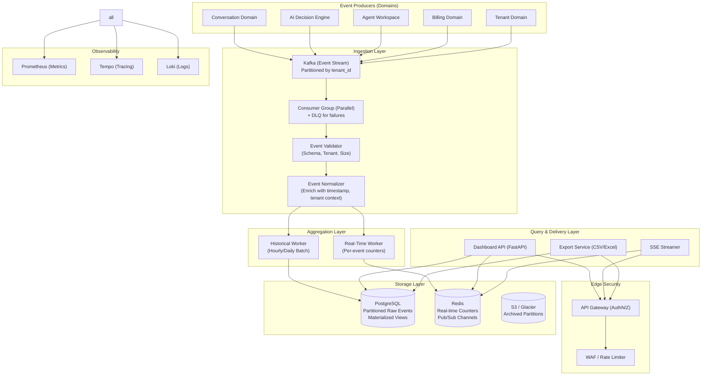

# Software Architecture Document – Volume 9 (Revised)

## BI Analytics – Enterprise Production Architecture (Definitive)

| **Document ID** | SAD-09-BI-ANALYTICS-v2.0 |
| :--- | :--- |
| **Version** | 2.0 – *Enhanced Security & Scalability* |
| **Status** | **Final – Approved for Implementation** |
| **Classification** | Confidential – Omnilinks Internal |
| **Reviewers** | Principal Architect, Data Engineering Lead, Security Lead, SRE Lead |

---

## Table of Contents

1. [Executive Summary & NFRs](#1-executive-summary--nfrs)
2. [Logical Architecture – Component View](#2-logical-architecture--component-view)
3. [Physical Architecture – Deployment Topology](#3-physical-architecture--deployment-topology)
4. [Data Architecture – Domain Models](#4-data-architecture--domain-models)
5. [Ingestion Pipeline – Secure & Scalable](#5-ingestion-pipeline--secure--scalable)
6. [Real‑Time Aggregation – Redis (Sub‑Second)](#6-realtime-aggregation--redis-subsecond)
7. [Historical Aggregation – PostgreSQL (Materialized Views)](#7-historical-aggregation--postgresql-materialized-views)
8. [Dashboard API – Unified Query Layer](#8-dashboard-api--unified-query-layer)
9. [SSE Real‑Time Updates – Event‑Driven Push](#9-sse-realtime-updates--eventdriven-push)
10. [Report Export Service – Secured Data Exfiltration](#10-report-export-service--secured-data-exfiltration)
11. [Platform‑Wide Metrics – MRR, Churn, NRR](#11-platformwide-metrics--mrr-churn-nrr)
12. [Integration with Other Domains](#12-integration-with-other-domains)
13. [Security Architecture – Defense‑in‑Depth](#13-security-architecture--defenseindepth)
14. [Observability & SRE – Full Visibility](#14-observability--sre--full-visibility)
15. [Architecture Decision Records (ADR)](#15-architecture-decision-records-adr)
16. [Open Items & Roadmap](#16-open-items--roadmap)

---

## 1. Executive Summary & NFRs

### 1.1 Strategic Objective
Deliver a **secure, real‑time, and scalable Business Intelligence (BI) layer** that ingests events from all Omnilinks domains, aggregates them at both tenant and platform levels, and presents insights through interactive dashboards with sub‑second latency. The system must support **10,000 events per second**, retain **2 years of data**, and provide **audit‑grade security** with strict tenant isolation, encryption at rest, and row‑level security.

### 1.2 Non‑Functional Requirements (Enhanced)

| NFR ID | Category | Target | Implementation Strategy |
| :--- | :--- | :--- | :--- |
| **NFR-AN-01** | **Dashboard Load Latency** | < 250ms (p95) | Redis real‑time counters; materialized view pre‑aggregation; query caching |
| **NFR-AN-02** | **SSE Update Latency** | < 150ms from event emission to UI | Redis pub/sub with dedicated subscriber channels per tenant; non‑blocking I/O |
| **NFR-AN-03** | **Historical Query Performance** | < 1s for 90‑day range | Partitioned tables; covering indexes; materialized views; read‑replica offload |
| **NFR-AN-04** | **Ingestion Throughput** | 10,000 events/sec | Kafka (partitioned by tenant); parallel consumers; batching |
| **NFR-AN-05** | **Data Retention** | 2 years online, 7 years archived | Automated partition rotation; archived to cold storage (e.g., S3 Glacier) |
| **NFR-AN-06** | **Availability** | 99.95% | Multi‑AZ PostgreSQL; Redis Sentinel; event replay from Kafka |
| **NFR-AN-07** | **Security & Compliance** | Zero data leakage; PDPL compliant | RLS on all tables; encrypted PII columns; audit logging of all exports |
| **NFR-AN-08** | **Data Freshness** | Real‑time (sub‑second) for live metrics; daily for historical aggregates | Redis counters updated per event; daily aggregates computed at 01:00 UTC |

---

## 2. Logical Architecture – Component View



---

## 3. Physical Architecture – Deployment Topology

| Node Pool | Instance Type | Components | Scaling Policy |
| :--- | :--- | :--- | :--- |
| **Compute‑Optimised (Data Plane)** | Standard_D4s_v3 (4 vCPU, 16GB) | Consumer Workers, Dashboard API, SSE, Export | HPA based on Kafka consumer lag (if lag > 1000 → scale) |
| **Memory‑Optimised** | Standard_E8s_v3 (8 vCPU, 64GB) | Redis Cache (Premium tier with persistence) | Fixed (3 replicas – Sentinel) |
| **PostgreSQL** | Flexible Server (8 vCPU, 32GB, 1TB storage) | Analytics DB with 2‑year retention | Zone‑redundant HA with one read replica for reporting |
| **Kafka (Managed)** | Confluent Cloud / Azure Event Hubs | 3 brokers, 10 partitions | Auto‑scaling (throughput‑based) |
| **Cold Storage** | Azure Blob Storage / S3 | Archived partitions (older than 2 years) | Lifecycle policies: after 730 days → archive |

---

## 4. Data Architecture – Domain Models

### 4.1 Normalised Event Schema (JSON – stored as JSONB for flexibility)

```json
{
  "event_id": "uuid",
  "tenant_id": "uuid",
  "event_type": "message_received",
  "dimension": "conversation",
  "metric_value": 1.0,
  "attributes": {
    "channel": "whatsapp",
    "agent_id": null,
    "conversation_id": "uuid",
    "confidence": null,
    "escalation_reason": null
  },
  "timestamp": "2026-07-20T10:00:00.000Z",
  "source_service": "conversation",
  "source_version": "v1.0"
}
```

### 4.2 PostgreSQL Tables (With Partitioning & Indexes)

#### 4.2.1 Raw Event Table (Range Partitioned by Month)

```sql
CREATE TABLE analytics_events (
    event_id UUID DEFAULT gen_random_uuid(),
    tenant_id UUID NOT NULL,
    event_type VARCHAR(50) NOT NULL,
    dimension VARCHAR(50) NOT NULL,
    metric_value DECIMAL(10,4),
    attributes JSONB,
    timestamp TIMESTAMPTZ NOT NULL DEFAULT NOW(),
    source_service VARCHAR(50),
    source_version VARCHAR(20)
) PARTITION BY RANGE (timestamp);

-- Monthly partitions
CREATE TABLE analytics_events_2026_07 PARTITION OF analytics_events
    FOR VALUES FROM ('2026-07-01') TO ('2026-08-01');

-- Indexes (per partition)
CREATE INDEX idx_ae_tenant_date ON analytics_events_2026_07 (tenant_id, timestamp DESC);
CREATE INDEX idx_ae_event_type ON analytics_events_2026_07 (event_type);
CREATE INDEX idx_ae_attributes_gist ON analytics_events_2026_07 USING GIN (attributes);
```

#### 4.2.2 Daily Aggregates (Pre‑joined for fast dashboards)

```sql
CREATE TABLE daily_aggregates (
    id SERIAL PRIMARY KEY,
    tenant_id UUID NOT NULL,
    date DATE NOT NULL,
    dimension VARCHAR(50) NOT NULL,        -- 'conversation', 'agent', 'channel', 'ai'
    key VARCHAR(100) NOT NULL,             -- e.g., channel name, agent_id, 'overall'
    metric_name VARCHAR(50) NOT NULL,      -- 'count', 'avg_duration', 'resolution_rate'
    metric_value DECIMAL(10,4) NOT NULL,
    sample_count INT,                     -- for averages
    created_at TIMESTAMPTZ DEFAULT NOW()
);

CREATE INDEX idx_daily_tenant_dim_date ON daily_aggregates (tenant_id, dimension, date DESC);
CREATE INDEX idx_daily_key ON daily_aggregates (key);
```

#### 4.2.3 Export Audit Log (Security)

```sql
CREATE TABLE export_audit_log (
    id UUID DEFAULT gen_random_uuid() PRIMARY KEY,
    tenant_id UUID NOT NULL,
    user_id UUID NOT NULL,
    export_type VARCHAR(20),               -- 'csv', 'excel'
    date_range_start DATE,
    date_range_end DATE,
    requested_metrics TEXT[],
    file_size_bytes BIGINT,
    downloaded_at TIMESTAMPTZ DEFAULT NOW(),
    ip_address INET,
    user_agent TEXT
);

-- RLS: only tenant's own exports
ALTER TABLE export_audit_log ENABLE ROW LEVEL SECURITY;
CREATE POLICY export_audit_tenant ON export_audit_log
    USING (tenant_id = current_setting('app.current_tenant_id')::UUID);
```

#### 4.2.4 Platform Metrics (Materialized View – refreshed hourly)

```sql
CREATE MATERIALIZED VIEW platform_mrr_mv AS
SELECT
    DATE_TRUNC('month', created_at) AS month,
    COUNT(DISTINCT tenant_id) AS active_tenants,
    SUM(CASE WHEN status = 'active' AND plan_tier != 'trial' THEN monthly_price ELSE 0 END) AS mrr,
    LAG(COUNT(DISTINCT tenant_id), 1) OVER (ORDER BY month) AS prev_tenants,
    LAG(SUM(CASE WHEN status = 'active' AND plan_tier != 'trial' THEN monthly_price ELSE 0 END), 1) OVER (ORDER BY month) AS prev_mrr
FROM tenant_subscriptions
GROUP BY month
WITH DATA;

-- Refresh every hour
REFRESH MATERIALIZED VIEW CONCURRENTLY platform_mrr_mv;
```

### 4.3 Redis Data Structures

| Key Pattern | Type | TTL | Purpose | Security |
| :--- | :--- | :--- | :--- | :--- |
| `live:tenant:{tid}:conv_count` | Hash | 24h | {total, whatsapp, telegram, ...} | None – only aggregated counts |
| `live:tenant:{tid}:ai_rate` | String | 24h | Auto‑resolution % | None |
| `live:tenant:{tid}:agent_load:{agent_id}` | Hash | 24h | {assigned, resolved, avg_response} | None |
| `live:platform:mrr` | String | 1h | Current MRR | None – internal only |
| `sse:subscribers:{tid}` | Set | Persistent | Active client IDs | None |
| `rate:export:{user_id}` | String | 60s | Export rate limit (5 per hour) | Prevents abuse |

---

## 5. Ingestion Pipeline – Secure & Scalable

### 5.1 Kafka Configuration

- **Topic:** `analytics_events`
- **Partitions:** 10 (partition by `tenant_id` hash to ensure ordering per tenant)
- **Retention:** 7 days (for replay) – enough to recover from failures.
- **Replication:** 3 brokers, min in‑sync replicas = 2.

### 5.2 Consumer Group

- **Group ID:** `analytics_consumer`
- **Parallelism:** 10 consumers (one per partition) to maximise throughput.
- **Commit Strategy:** Commit after successful processing of each event (or batch) – exactly‑once semantics via idempotent database inserts.

### 5.3 Event Validation & Normalisation

```python
class AnalyticsEventValidator:
    SCHEMA = {
        "event_id": UUID,
        "tenant_id": UUID,
        "event_type": ["message_received", "ai_reply_sent", ...],
        "dimension": ["conversation", "agent", "channel", "billing", "tenant"],
        "metric_value": (float, lambda x: x >= 0),
        "attributes": dict,
        "timestamp": datetime
    }

    async def validate(self, raw: dict) -> bool:
        # Check required fields
        for field in self.SCHEMA:
            if field not in raw:
                raise ValidationError(f"Missing {field}")
        # Validate enum values
        if raw['event_type'] not in self.SCHEMA['event_type']:
            raise ValidationError(f"Invalid event_type: {raw['event_type']}")
        # Enrich with tenant context from cache (to verify existence)
        tenant = await self.tenant_cache.get(raw['tenant_id'])
        if not tenant:
            raise ValidationError(f"Unknown tenant: {raw['tenant_id']}")
        # Add source_version if missing
        raw.setdefault('source_version', 'v1.0')
        return True
```

**Security:** Tenant validation prevents events from non‑existent tenants. Rate‑limiting per tenant is applied at the Kafka producer level (already enforced by the source domains) and at the consumer level via a Redis token bucket to prevent spamming.

### 5.4 Dead Letter Queue (DLQ)

Events that fail validation or processing more than 3 times are sent to a DLQ topic (`analytics_events_dlq`) for manual inspection. An alert is triggered when DLQ size > 100.

---

## 6. Real‑Time Aggregation – Redis (Sub‑Second)

### 6.1 Processing Worker (Per Event)

```python
class RealTimeWorker:
    def __init__(self, redis_client):
        self.redis = redis_client

    async def process(self, event: dict):
        tid = event['tenant_id']
        ev_type = event['event_type']
        attrs = event.get('attributes', {})
        metric = event.get('metric_value', 1)

        # 1. Conversation volume (per channel)
        if ev_type == 'message_received':
            key = f"live:{tid}:conv_count"
            await self.redis.hincrbyfloat(key, "total", metric)
            channel = attrs.get('channel', 'unknown')
            await self.redis.hincrbyfloat(key, channel, metric)
            await self.redis.expire(key, 86400)  # 24h

        # 2. AI auto‑resolution rate
        elif ev_type == 'ai_reply_sent':
            await self.redis.hincrby(f"live:{tid}:ai", "ai", 1)
            # Also increment total conversations for rate calculation
            total = await self.redis.hincrby(f"live:{tid}:ai", "total", 1)
            ai = await self.redis.hget(f"live:{tid}:ai", "ai")
            if total and ai:
                rate = (int(ai) / int(total)) * 100
                await self.redis.set(f"live:{tid}:ai_rate", rate, ex=86400)

        # 3. Agent performance (avg response time)
        elif ev_type == 'human_reply_sent':
            agent_id = attrs.get('agent_id')
            if agent_id:
                key = f"live:{tid}:agent:{agent_id}"
                await self.redis.hincrbyfloat(key, "response_time_sum", attrs.get('response_ms', 0))
                await self.redis.hincrby(key, "response_count", 1)
                # Store avg as derived value
                count = await self.redis.hget(key, "response_count")
                if count and int(count) > 0:
                    sum_val = await self.redis.hget(key, "response_time_sum")
                    avg = float(sum_val) / int(count)
                    await self.redis.hset(key, "avg_response_ms", avg)
                await self.redis.expire(key, 86400)

        # 4. Revenue for platform MRR (only if platform admin view)
        elif ev_type == 'charge_succeeded':
            amount = metric
            await self.redis.hincrbyfloat("live:platform:mrr", "total", amount)

        # 5. Publish to SSE subscribers of this tenant
        await self._publish_sse(tid, ev_type, event)
```

### 6.2 SSE Pub/Sub Channel

Each tenant has a dedicated Redis channel: `sse:{tenant_id}`. The worker publishes a lightweight event (e.g., `{"event": "new_message", "conversation_id": "..."}`) to this channel. The Dashboard API subscribes to this channel for each connected SSE client.

---

## 7. Historical Aggregation – PostgreSQL (Materialized Views)

### 7.1 Hourly Batch Worker (Celery Beat Task)

Every hour, an aggregator computes summaries for the past hour and inserts into `daily_aggregates` (which is actually hourly, but we can keep the naming for simplicity).

```python
@celery.task
def aggregate_hourly():
    hour_ago = datetime.utcnow() - timedelta(hours=1)
    # Compute volume per tenant, per channel, for the past hour
    sql = """
    INSERT INTO daily_aggregates (tenant_id, date, dimension, key, metric_name, metric_value)
    SELECT
        tenant_id,
        DATE_TRUNC('day', timestamp)::DATE AS date,
        'channel' AS dimension,
        attributes->>'channel' AS key,
        'count' AS metric_name,
        COUNT(*) AS metric_value
    FROM analytics_events
    WHERE timestamp >= %s AND timestamp < %s
      AND event_type = 'message_received'
    GROUP BY tenant_id, date, key
    ON CONFLICT (tenant_id, date, dimension, key, metric_name) DO UPDATE
    SET metric_value = excluded.metric_value,
        created_at = NOW()
    """
    # Similar for other event types (ai, agent, etc.)
```

**Conflict Handling:** Uses `ON CONFLICT` to update existing values, ensuring idempotency.

### 7.2 Materialized Views for Platform Metrics

Refreshed hourly (`REFRESH MATERIALIZED VIEW CONCURRENTLY platform_mrr_mv`). This view is used for platform‑level dashboards. Indexes are created on the MV for performance.

### 7.3 Data Retention & Archiving

- **Partition Rotation:** Monthly partitions older than 2 years are detached and moved to a separate archive schema (or exported to cold storage).
- **Automated Archiving:** A monthly task uses `pg_partman` to manage partition creation and removal. Detached partitions are dumped as CSV/Parquet and stored in S3; the original partition is dropped.

---

## 8. Dashboard API – Unified Query Layer

### 8.1 API Endpoints (Tenant‑Scoped)

| Endpoint | Method | Description | Security |
| :--- | :--- | :--- | :--- |
| `/api/v1/analytics/summary` | GET | Real‑time summary: conv volume, AI rate, avg response, active agents | `analytics.view.team` |
| `/api/v1/analytics/channels` | GET | Volume per channel (last 24h) | `analytics.view.team` |
| `/api/v1/analytics/agents` | GET | Agent performance (handled, avg response, satisfaction) | `analytics.view.team` |
| `/api/v1/analytics/trends` | GET | Historical trends (7d, 30d, 90d) with optional dimension filter | `analytics.view.team` |
| `/api/v1/analytics/csat` | GET | CSAT/NPS trend (if enabled) | `analytics.view.team` |
| `/api/v1/analytics/platform` | GET | Platform‑wide metrics (MRR, churn, NRR) | `analytics.view.all` (Platform Admin only) |

### 8.2 Query Logic (Example – Summary)

```python
async def get_summary(tenant_id: UUID):
    # 1. Real‑time from Redis
    conv_key = f"live:{tenant_id}:conv_count"
    conv_total = await redis.hget(conv_key, "total") or 0
    conv_channels = await redis.hgetall(conv_key)
    ai_rate = await redis.get(f"live:{tenant_id}:ai_rate") or 0

    # 2. Historical from PG for 24h trends (cached)
    cache_key = f"summary:{tenant_id}:{datetime.date.today()}"
    cached = await redis.get(cache_key)
    if cached:
        return json.loads(cached)

    async with db.acquire() as conn:
        row = await conn.fetchrow("""
            SELECT
                COUNT(*) FILTER (WHERE event_type = 'message_received') AS total_messages,
                COUNT(*) FILTER (WHERE event_type = 'ai_reply_sent') AS ai_replies,
                AVG(metric_value) FILTER (WHERE metric_name = 'response_time') AS avg_response
            FROM daily_aggregates
            WHERE tenant_id = $1 AND date >= NOW() - INTERVAL '24 hours'
        """, tenant_id)
    result = {
        "conversation_volume": int(conv_total),
        "channels": conv_channels,
        "ai_auto_resolution_rate": float(ai_rate),
        "avg_response_ms": row['avg_response'] or 0,
        "total_messages_24h": row['total_messages'] or 0,
        "ai_replies_24h": row['ai_replies'] or 0
    }
    await redis.setex(cache_key, 60, json.dumps(result))  # 1 min cache
    return result
```

### 8.3 Caching Strategy

- **Redis cache** for expensive summary queries (TTL = 1 min).
- **CDN** for static dashboards (not applicable – dynamic).

---

## 9. SSE Real‑Time Updates – Event‑Driven Push

### 9.1 SSE Endpoint

```python
@router.get("/analytics/sse")
async def sse_stream(request: Request):
    tenant_id = request.user.tenant_id
    channel = f"sse:{tenant_id}"
    client_id = str(uuid.uuid4())

    # Register client
    await redis.sadd(f"sse:subscribers:{tenant_id}", client_id)

    # Create an async generator that yields SSE events
    async def event_generator():
        async with redis.pubsub() as pubsub:
            await pubsub.subscribe(channel)
            try:
                while True:
                    message = await pubsub.get_message(ignore_subscribe_messages=True)
                    if message:
                        yield f"data: {message['data']}\n\n"
                    await asyncio.sleep(0.1)  # prevent busy loop
            except asyncio.CancelledError:
                # Cleanup on disconnect
                await redis.srem(f"sse:subscribers:{tenant_id}", client_id)
                raise

    return StreamingResponse(event_generator(), media_type="text/event-stream")
```

### 9.2 Security Considerations

- **Authentication:** The SSE endpoint requires a valid JWT with tenant context.
- **Rate Limiting:** Each tenant can have up to 10 concurrent SSE connections to prevent abuse.
- **Message Sanitization:** Events published to SSE are filtered to avoid exposing internal metadata (e.g., only high‑level aggregates are pushed).

---

## 10. Report Export Service – Secured Data Exfiltration

### 10.1 Export Request Flow

1. **User requests export** (POST `/analytics/export`) with date range, metrics, format.
2. **Authorization:** Check `analytics.export` permission.
3. **Rate Limiting:** Max 5 exports per hour per user (stored in Redis).
4. **Generate CSV/Excel** in background (Celery task) to avoid blocking.
5. **Store file** in a temporary, tenant‑scoped blob container with a short‑lived SAS token (1 hour).
6. **Audit log entry** created with download details.
7. **Notify user** via email/websocket when ready, with a one‑time download link.

### 10.2 Export Generation

```python
async def generate_export(tenant_id, start_date, end_date, metrics, format):
    # Query daily_aggregates for the period
    rows = await db.fetch_all("""
        SELECT date, dimension, key, metric_name, metric_value
        FROM daily_aggregates
        WHERE tenant_id = $1 AND date BETWEEN $2 AND $3
          AND metric_name = ANY($4)
        ORDER BY date, dimension, key
    """, tenant_id, start_date, end_date, metrics)

    # Build CSV
    output = StringIO()
    writer = csv.writer(output)
    writer.writerow(['Date', 'Dimension', 'Key', 'Metric', 'Value'])
    for row in rows:
        writer.writerow([row['date'], row['dimension'], row['key'], row['metric_name'], row['metric_value']])

    # Upload to tenant‑specific blob container
    blob_name = f"{tenant_id}/{uuid.uuid4()}.csv"
    await blob_client.upload_blob(output.getvalue(), content_type='text/csv')
    return blob_name
```

### 10.3 Security Measures

- **Row‑Level Security:** The DB query is filtered by `tenant_id`; RLS enforces it even if the query accidentally omits it.
- **Encryption:** Exported files are encrypted at rest (Azure Blob SSE‑KMS).
- **Short‑lived Access:** Download links expire after 1 hour.
- **Audit:** All exports are logged in `export_audit_log` with user, date range, and file size.
- **Data Masking:** PII is redacted from exports (e.g., phone numbers masked) unless explicitly requested and authorised.

---

## 11. Platform‑Wide Metrics – MRR, Churn, NRR

### 11.1 Calculation Logic

- **MRR (Monthly Recurring Revenue):** Sum of monthly subscription charges for all active tenants (excluding trial, excluding one‑time overages).
- **Churn Rate:** `(Churned Tenants in Month) / (Tenants at Start of Month) * 100`
- **NRR:** `(Starting MRR + Expansion MRR – Contraction MRR – Churned MRR) / Starting MRR`

### 11.2 Materialized View Refresh (Hourly)

```sql
REFRESH MATERIALIZED VIEW CONCURRENTLY platform_mrr_mv;
```

### 11.3 Dashboard Endpoint

```python
@router.get("/analytics/platform/metrics")
async def get_platform_metrics(request: Request):
    # Check if user has platform admin role
    if not request.user.has_permission("analytics.view.all"):
        raise HTTPException(403, "Insufficient permissions")

    rows = await db.fetch_all("""
        SELECT month, active_tenants, mrr, prev_mrr,
               (active_tenants - prev_tenants) / prev_tenants::float * 100 AS churn_rate
        FROM platform_mrr_mv
        ORDER BY month DESC LIMIT 12
    """)
    return rows
```

---

## 12. Integration with Other Domains

All domains emit events to the **same Kafka topic `analytics_events`**. The event schema is versioned and backward‑compatible.

| Domain | Event Types | Integration Point |
| :--- | :--- | :--- |
| **Conversation** | `message_received`, `conversation_closed`, `csat_submitted` | On message arrival, close, CSAT survey |
| **AI Decision Engine** | `ai_reply_sent`, `ai_escalation` | After each AI decision (auto‑reply or escalation) |
| **Agent Workspace** | `human_reply_sent`, `agent_login`, `agent_logout` | On agent actions |
| **Billing** | `charge_succeeded`, `charge_failed`, `subscription_started`, `subscription_cancelled` | On payment/status change |
| **Tenant** | `tenant_created`, `tenant_activated`, `tenant_suspended`, `tenant_churned` | On lifecycle events |

### 12.1 Event Emission Pattern (Example from Billing)

```python
# Billing domain after successful charge
await emit_analytics_event({
    "event_type": "charge_succeeded",
    "dimension": "billing",
    "metric_value": amount,
    "attributes": {"invoice_id": invoice_id, "plan": plan_tier},
    "tenant_id": tenant_id
})
```

---

## 13. Security Architecture – Defense‑in‑Depth

| Layer | Control | Implementation |
| :--- | :--- | :--- |
| **Network** | Private VNet; no public access to Kafka/Redis/PostgreSQL | Azure Private Link / VNet service endpoints |
| **Encryption** | TLS 1.3 for all in‑transit; AES‑256 for at‑rest | Azure managed keys (Customer‑Managed Keys for logs) |
| **Authentication** | JWT with short expiry; MFA for Platform Admin | Entra ID (Azure AD) |
| **Authorization** | RBAC with granular permissions (`analytics.view.team`, `analytics.view.all`, `analytics.export`) | Permission‑based (ch.13) |
| **Row‑Level Security (RLS)** | All analytics tables filtered by `tenant_id` | PostgreSQL RLS (see schemas) |
| **Audit** | Immutable audit logs for exports and data access | `export_audit_log` table; `access_logs` for DB queries |
| **Data Masking** | PII redaction in exports; phone numbers, emails masked | Presidio library integrated into export service |
| **Rate Limiting** | Prevent export abuse; limit SSE connections | Redis token buckets; max 5 exports/hour/user |
| **Secrets** | All DB/Redis/Kafka credentials stored in Azure Key Vault | Secrets injected via CSI driver into pods |
| **Compliance** | PDPL (Egypt, Saudi, UAE, Qatar, Morocco) – data residency, right to erasure | Geolocation‑based storage; deletion APIs |

### 13.1 Row‑Level Security (PostgreSQL)

```sql
-- Enable RLS on all analytics tables
ALTER TABLE analytics_events ENABLE ROW LEVEL SECURITY;
ALTER TABLE daily_aggregates ENABLE ROW LEVEL SECURITY;
ALTER TABLE export_audit_log ENABLE ROW LEVEL SECURITY;

-- Policy: tenant isolation
CREATE POLICY tenant_isolation_policy ON analytics_events
    USING (tenant_id = current_setting('app.current_tenant_id')::UUID);

-- Policy: platform admin can see all (uses a different context variable)
CREATE POLICY platform_admin_policy ON analytics_events
    USING (current_setting('app.is_platform_admin') = 'true');
```

### 13.2 Data Retention & Deletion (Right to Erasure)

When a tenant requests data deletion (per PDPL), a process runs that:
1. Deletes all rows with that `tenant_id` from `analytics_events` and `daily_aggregates`.
2. Archives a deletion certificate.
3. Removes all Redis keys for that tenant.
4. Logs the action in an immutable deletion log.

---

## 14. Observability & SRE – Full Visibility

### 14.1 Prometheus Metrics

| Metric | Type | Labels | Purpose |
| :--- | :--- | :--- | :--- |
| `analytics_events_ingested_total` | Counter | `event_type`, `status` | Volume per event type and success/failure |
| `analytics_ingestion_latency_seconds` | Histogram | – | Time from event production to consumption |
| `analytics_kafka_consumer_lag` | Gauge | `partition` | Lag per partition (alert if > 10000) |
| `analytics_dashboard_latency_seconds` | Histogram | `endpoint` | API response time |
| `analytics_sse_connections_total` | Gauge | `tenant` | Concurrent SSE connections |
| `analytics_exports_total` | Counter | `format`, `status` | Export requests and success/failure |
| `analytics_export_file_size_bytes` | Histogram | – | Size of exported files |
| `analytics_rls_error_count` | Counter | – | RLS policy violations (security incident) |

### 14.2 Alerting Rules (Critical)

| Condition | Severity | Action |
| :--- | :--- | :--- |
| `analytics_kafka_consumer_lag > 10000` for 5 min | **P1** | Scale up consumer pods immediately |
| `analytics_events_ingested_total{status="failure"} > 50` in 5 min | **P1** | Check DLQ; investigate Kafka connectivity |
| `analytics_dashboard_latency_seconds{quantile="0.95"} > 2s` | **P2** | Optimise query, increase cache TTL |
| `analytics_exports_total{status="failure"} > 5` in 1 hour | **P2** | Check export service; storage permissions |
| `analytics_rls_error_count > 0` | **P1** | Immediate security investigation |

### 14.3 Distributed Tracing (OpenTelemetry)

All components (Kafka producer, consumer, DB queries, Redis operations) propagate a `trace_id`. This enables end‑to‑end tracing from event emission to dashboard rendering. Instrumentation is added using OpenTelemetry SDKs.

### 14.4 Structured Logging

All logs are JSON with `tenant_id`, `event_id`, `trace_id`, and `level`. Centralised log aggregation (Loki) is used for correlation with traces and metrics.

---

## 15. Architecture Decision Records (ADR)

### ADR-025: Event‑Driven Analytics with Kafka
- **Context:** Need to collect data from multiple domains without synchronous coupling.
- **Decision:** Use Kafka as the central event bus. Partition by `tenant_id` to ensure order per tenant.
- **Rationale:** High throughput, durability, replayability; partitions per tenant allow isolation; consumer groups enable parallel processing.

### ADR-026: Redis for Real‑Time, PostgreSQL for Historical
- **Context:** Need sub‑second dashboards and complex historical querying.
- **Decision:** Use Redis for live counters (volatile) and PostgreSQL with materialised views for historical data.
- **Rationale:** Redis provides low latency; PostgreSQL provides ACID, complex joins, and long‑term retention.

### ADR-027: SSE for Real‑Time Updates (vs WebSocket)
- **Context:** Need to push near‑real‑time updates to web clients.
- **Decision:** Use Server‑Sent Events (SSE) over WebSocket.
- **Rationale:** Simpler to implement (HTTP/2), automatic reconnection, lower overhead for one‑way streaming; WebSocket would be overkill.

### ADR-028: Row‑Level Security (RLS) as Primary Data Isolation
- **Context:** Critical to prevent cross‑tenant data leakage.
- **Decision:** Enforce tenant isolation at the database layer using PostgreSQL RLS.
- **Rationale:** Defence‑in‑depth; even if application query omits tenant filter, RLS blocks access.

### ADR-029: Partitioned Tables with Automated Rotation
- **Context:** 2 years of high‑volume event data requires efficient management.
- **Decision:** Use range partitioning by month; automate partition creation and archiving.
- **Rationale:** Improves query performance (partition pruning); simplifies retention and archival.

### ADR-030: Export Auditing & Rate Limiting
- **Context:** Exports can expose sensitive data; need to prevent abuse.
- **Decision:** Rate‑limit exports (5/hour/user); audit every export; short‑lived download links.
- **Rationale:** Balances usability with security; meets compliance requirements for data access logging.

---

## 16. Open Items & Roadmap

| Item | Owner | Target Date | Risk/Impact |
| :--- | :--- | :--- | :--- |
| **CSAT/NPS data integration** | Product/Backend | GA+2 | Define survey flow and metrics; schema for satisfaction scores |
| **Custom dashboard widgets (save views)** | Frontend | GA+3 | User‑defined dashboards; requires UI persistence |
| **Anomaly detection** | Data Science | GA+4 | Automated alerts on metric deviations (e.g., sudden churn) |
| **Multi‑currency in platform MRR** | Backend | GA+2 | Currently assumes single currency (EGP); need exchange rate handling |
| **Embedded analytics in agent workspace** | Frontend | GA+2 | Show metrics directly within agent UI |
| **Data archival automation** | DevOps | GA | Fully automate partition archival to cold storage |

---

> **Next Steps:**
> 1. **Provision Kafka cluster** (Confluent Cloud / Azure Event Hubs) with `analytics_events` topic (10 partitions).
> 2. **Deploy PostgreSQL** with partitioning schema and RLS policies; create initial partitions.
> 3. **Implement the Event Validator** and Normalizer as a Kafka consumer service.
> 4. **Implement Real‑Time Worker** (Redis) and **Historical Worker** (Celery) as separate services.
> 5. **Build Dashboard API** endpoints with caching and RLS.
> 6. **Deploy SSE endpoint** and integrate with frontend.
> 7. **Implement Export Service** with rate limiting, audit, and SAS token generation.
> 8. **Set up Prometheus** metrics and alerting rules.
> 9. **Implement OpenTelemetry** instrumentation across all services.
> 10. **Write integration tests** for event flow, RLS, and export audit.
