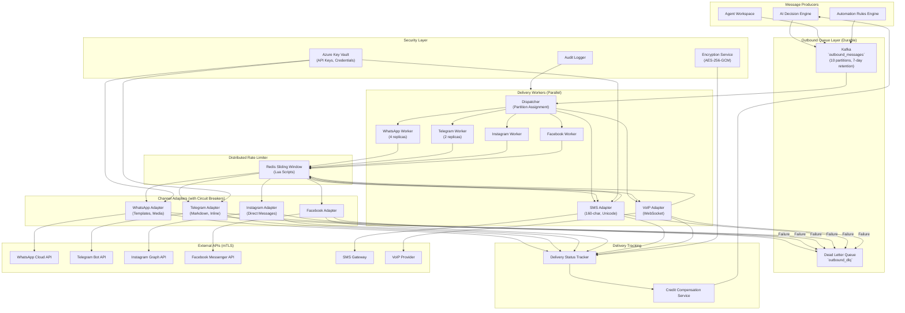

# Software Architecture Document – Volume 12 (Revised)

## Channel Adapter & Outbound Delivery – Enterprise Production Architecture (Definitive)

| **Document ID** | SAD-12-CHANNEL-OUTBOUND-v2.0 |
| :--- | :--- |
| **Version** | 2.0 – *Enhanced Security, Scalability & Observability* |
| **Status** | **Final – Approved for Implementation** |
| **Classification** | Confidential – Omnilinks Internal |
| **Reviewers** | CISO, Principal Architect, Integration Lead, SRE Lead, Compliance Officer |

---

## Table of Contents

1. [Executive Summary & NFRs](#1-executive-summary--nfrs)
2. [Logical Architecture – Component View](#2-logical-architecture--component-view)
3. [Physical Architecture – Deployment Topology](#3-physical-architecture--deployment-topology)
4. [Data Architecture – Domain Models](#4-data-architecture--domain-models)
5. [Core Component Deep‑Dive](#5-core-component-deep-dive)
   - 5.1 AbstractChannelAdapter Interface (Enterprise-Grade)
   - 5.2 Concrete Channel Adapters with Security Controls
   - 5.3 Outbound Queue Manager (Durable, Zero‑Loss)
   - 5.4 Rate Limiter – Distributed Sliding Window
   - 5.5 Retry & Exponential Backoff Engine with Jitter
   - 5.6 Delivery Status Tracking – Real‑Time & Historical
   - 5.7 Credit Compensation Service – Idempotent Refunds
   - 5.8 Channel API Error Handling & Circuit Breaker
   - 5.9 Dead Letter Queue – Manual Intervention & Replay
6. [Security Architecture – Defense‑in‑Depth](#6-security-architecture--defense-indepth)
7. [Compliance & Regulatory Mapping](#7-compliance--regulatory-mapping)
8. [Observability & SRE – Full Visibility](#8-observability--sre--full-visibility)
9. [Architecture Decision Records (ADR)](#9-architecture-decision-records-adr)
10. [Open Items & Roadmap](#10-open-items--roadmap)

---

## 1. Executive Summary & NFRs

### 1.1 Strategic Objective
Deliver a **zero‑trust, secure, and ultra‑reliable outbound delivery system** that formats, queues, rate‑limits, retries, and delivers responses across six communication channels (WhatsApp, Telegram, Instagram, Facebook Messenger, SMS, VoIP). The system must support **50,000+ outbound messages per second**, enforce **per‑channel, per‑tenant rate limits** with sub‑second accuracy, provide **exponential backoff with jitter** for retries, track **delivery status** in real‑time with full auditability, automatically **refund AI Credits** for undelivered messages, and **escalate persistent failures** to human agents with full context.

### 1.2 Non‑Functional Requirements (Enhanced)

| NFR ID | Category | Target | Implementation Strategy |
| :--- | :--- | :--- | :--- |
| **NFR-OUT-01** | **Delivery Latency (p95)** | < 1.5 seconds | Queue‑backed delivery; parallel workers per channel; connection pooling |
| **NFR-OUT-02** | **Throughput** | 50,000 msgs/sec | Kafka partitions per channel; parallel consumer groups |
| **NFR-OUT-03** | **Availability** | 99.99% | Multi‑AZ workers; circuit breakers; retry logic; graceful degradation |
| **NFR-OUT-04** | **Delivery Success Rate** | > 99.7% | Retry with backoff; circuit breakers; automatic failover |
| **NFR-OUT-05** | **Rate Limit Accuracy** | 100% compliance | Redis sliding window with Lua scripts (atomic) |
| **NFR-OUT-06** | **Durability** | Zero message loss | Kafka with acks=all; idempotent producers; exactly‑once semantics |
| **NFR-OUT-07** | **Auditability** | 100% delivery status tracked | Immutable delivery status table; audit logs for all attempts |
| **NFR-OUT-08** | **Security** | Zero credential leakage | Secrets in Key Vault; encrypted at rest; TLS 1.3 for all external calls |
| **NFR-OUT-09** | **Recovery Time** | < 5 minutes for DLQ replay | Dead Letter Queue with replay tool |

---

## 2. Logical Architecture – Component View



---

## 3. Physical Architecture – Deployment Topology

| Node Pool | Instance Type | Components | Scaling Policy |
| :--- | :--- | :--- | :--- |
| **Compute‑Optimised** | Standard_D4s_v3 (4 vCPU, 16GB) | Dispatcher, Workers (2‑4 replicas per channel) | HPA based on Kafka consumer lag (lag > 1000 → scale) |
| **Memory‑Optimised** | Standard_E8s_v3 (8 vCPU, 64GB) | Redis (Rate Limits, Cache) | Premium Redis (3 replicas, Sentinel) |
| **Kafka** | Confluent Cloud / Azure Event Hubs | 3 brokers, 10 partitions (partition by tenant_id) | Auto‑scaling (throughput‑based) |
| **PostgreSQL** | Flexible Server (8 vCPU, 32GB, 1TB storage) | Outbound Messages, Delivery Status, Audit | Zone‑redundant HA with read replica for reporting |
| **Key Vault** | Azure Key Vault | API keys, credentials | Managed service (SLA 99.99%) |

---

## 4. Data Architecture – Domain Models

### 4.1 PostgreSQL Tables

#### 4.1.1 Outbound Messages – Complete Lifecycle Tracking

```sql
CREATE TABLE outbound_messages (
    id UUID PRIMARY KEY DEFAULT gen_random_uuid(),
    tenant_id UUID NOT NULL,
    conversation_id UUID,
    channel_type VARCHAR(20) NOT NULL,
    external_id VARCHAR(255),               -- Provider's message ID
    to_recipient VARCHAR(255) NOT NULL,
    recipient_type VARCHAR(20) DEFAULT 'phone', -- phone, user_id, page_id
    content JSONB NOT NULL,
    status VARCHAR(20) DEFAULT 'queued',
    retry_count INT DEFAULT 0,
    max_retries INT DEFAULT 3,
    last_attempt_at TIMESTAMPTZ,
    sent_at TIMESTAMPTZ,
    delivered_at TIMESTAMPTZ,
    read_at TIMESTAMPTZ,
    failed_at TIMESTAMPTZ,
    failure_reason TEXT,
    failure_code VARCHAR(50),
    ai_credits_consumed INT DEFAULT 1,
    priority INT DEFAULT 0,                 -- Higher = send sooner
    scheduled_delivery_at TIMESTAMPTZ,       -- For future delivery
    trace_id TEXT,                          -- For distributed tracing
    version INT DEFAULT 1,                  -- For optimistic locking
    created_at TIMESTAMPTZ DEFAULT NOW(),
    updated_at TIMESTAMPTZ DEFAULT NOW()
);

-- Partition by month for performance
CREATE TABLE outbound_messages_2026_07 PARTITION OF outbound_messages
    FOR VALUES FROM ('2026-07-01') TO ('2026-08-01');

-- Comprehensive indexes
CREATE INDEX idx_outbound_tenant_channel_status ON outbound_messages(tenant_id, channel_type, status);
CREATE INDEX idx_outbound_status_created ON outbound_messages(status, created_at) WHERE status IN ('queued', 'retry');
CREATE INDEX idx_outbound_external_id ON outbound_messages(external_id) WHERE external_id IS NOT NULL;
CREATE INDEX idx_outbound_conversation ON outbound_messages(conversation_id);
CREATE INDEX idx_outbound_scheduled ON outbound_messages(scheduled_delivery_at) WHERE scheduled_delivery_at IS NOT NULL;
CREATE INDEX idx_outbound_trace ON outbound_messages(trace_id);
```

#### 4.1.2 Channel Rate Limit Configurations (Tenant‑Specific)

```sql
CREATE TABLE channel_rate_limits (
    id UUID PRIMARY KEY DEFAULT gen_random_uuid(),
    tenant_id UUID NOT NULL,
    channel_type VARCHAR(20) NOT NULL,
    limit_per_minute INT DEFAULT 100,
    limit_per_hour INT DEFAULT 1000,
    limit_per_day INT DEFAULT 10000,
    burst_limit INT DEFAULT 200,            -- Allowed peak
    burst_duration_seconds INT DEFAULT 10,   -- Burst window
    enabled BOOLEAN DEFAULT TRUE,
    created_at TIMESTAMPTZ DEFAULT NOW(),
    updated_at TIMESTAMPTZ DEFAULT NOW(),
    UNIQUE(tenant_id, channel_type)
);
```

#### 4.1.3 Delivery Failure Logs – Immutable Audit

```sql
CREATE TABLE delivery_failure_logs (
    id UUID PRIMARY KEY DEFAULT gen_random_uuid(),
    message_id UUID REFERENCES outbound_messages(id),
    tenant_id UUID NOT NULL,
    channel_type VARCHAR(20),
    attempt_number INT,
    error_code VARCHAR(50),
    error_category VARCHAR(20),             -- permanent, temporary, rate_limit, auth
    error_message TEXT,
    retry_after_seconds INT,
    trace_id TEXT,
    attempted_at TIMESTAMPTZ DEFAULT NOW()
);

-- Immutable: prevent modifications
CREATE TRIGGER failure_log_immutable
    BEFORE UPDATE OR DELETE ON delivery_failure_logs
    FOR EACH ROW
    EXECUTE FUNCTION raise_exception('Failure logs are immutable');
```

#### 4.1.4 Dead Letter Queue (DLQ) Records

```sql
CREATE TABLE dlq_messages (
    id UUID PRIMARY KEY DEFAULT gen_random_uuid(),
    original_message_id UUID,
    tenant_id UUID NOT NULL,
    channel_type VARCHAR(20),
    payload JSONB,                          -- Original message payload
    failure_reason TEXT,
    failure_code VARCHAR(50),
    retry_count_at_failure INT,
    processed BOOLEAN DEFAULT FALSE,
    processed_at TIMESTAMPTZ,
    reprocessed_count INT DEFAULT 0,
    created_at TIMESTAMPTZ DEFAULT NOW()
);

CREATE INDEX idx_dlq_tenant ON dlq_messages(tenant_id);
CREATE INDEX idx_dlq_processed ON dlq_messages(processed);
```

### 4.2 Redis Data Structures

| Key Pattern | Type | TTL | Purpose |
| :--- | :--- | :--- | :--- |
| `rate:limit:{tenant}:{channel}:minute` | Sorted Set | 60s | Sliding window (minute) |
| `rate:limit:{tenant}:{channel}:hour` | Sorted Set | 3600s | Sliding window (hour) |
| `rate:limit:{tenant}:{channel}:day` | Sorted Set | 86400s | Sliding window (day) |
| `rate:config:{tenant}:{channel}` | JSON | 5 min | Cached rate limit config |
| `queue:outbound:{channel}` | List | Persistent | Fast queue (Redis) |
| `queue:delayed:{channel}` | Sorted Set | Persistent | Delayed messages (retries) |
| `delivery:lock:{message_id}` | String | 60s | Distributed lock for processing |
| `delivery:status:{message_id}` | JSON | 24h | Cached delivery status |

---

## 5. Core Component Deep‑Dive

### 5.1 AbstractChannelAdapter – Enterprise Interface

```python
from abc import ABC, abstractmethod
from typing import Optional, Dict, Any, Callable
from dataclasses import dataclass
from enum import Enum

class ErrorCategory(Enum):
    PERMANENT = "permanent"      # No retry (e.g., invalid recipient)
    TEMPORARY = "temporary"      # Retry with backoff (e.g., server error)
    RATE_LIMIT = "rate_limit"    # Retry with longer backoff
    AUTH = "auth"                # Auth failure (check credentials)
    TIMEOUT = "timeout"          # Timeout (retry with backoff)
    UNKNOWN = "unknown"

@dataclass
class DeliveryResult:
    success: bool
    external_id: Optional[str] = None
    status: str = "queued"
    error_code: Optional[str] = None
    error_message: Optional[str] = None
    error_category: ErrorCategory = ErrorCategory.UNKNOWN
    retry_after_seconds: Optional[int] = None
    raw_response: Optional[Dict] = None

@dataclass
class RateLimitConfig:
    limit_per_minute: int
    limit_per_hour: int
    limit_per_day: int
    burst_limit: int
    burst_duration_seconds: int

class AbstractChannelAdapter(ABC):
    """Enterprise‑grade unified interface for all outbound channel adapters."""

    def __init__(self, secrets_client, encryption_service, metrics_registry):
        self.secrets = secrets_client
        self.encryption = encryption_service
        self.metrics = metrics_registry
        self._client = None

    @abstractmethod
    def get_channel_type(self) -> str:
        """Return the channel identifier."""
        pass

    @abstractmethod
    async def get_credentials(self, tenant_id: UUID) -> Dict[str, str]:
        """Retrieve encrypted credentials from Key Vault."""
        pass

    @abstractmethod
    async def initialize_client(self, credentials: Dict[str, str]):
        """Initialize the HTTP client with credentials."""
        pass

    @abstractmethod
    async def format_message(self, content: Dict, recipient: str) -> Dict:
        """Format the message according to channel specifications."""
        pass

    @abstractmethod
    async def send(self, formatted_payload: Dict) -> DeliveryResult:
        """Send the formatted message to the channel API with circuit breaker."""
        pass

    @abstractmethod
    async def get_status(self, external_id: str) -> Dict:
        """Query the channel API for delivery status."""
        pass

    @abstractmethod
    async def get_rate_limit_config(self, tenant_id: UUID) -> RateLimitConfig:
        """Get tenant‑specific rate limit configuration."""
        pass

    @abstractmethod
    def get_supported_message_types(self) -> List[str]:
        """Return supported message types (text, image, video, etc.)."""
        pass
```

### 5.2 WhatsApp Adapter – Full Implementation

```python
import httpx
from tenacity import retry, stop_after_attempt, wait_exponential, retry_if_exception_type

class WhatsAppAdapter(AbstractChannelAdapter):
    def __init__(self, secrets_client, encryption_service, metrics_registry):
        super().__init__(secrets_client, encryption_service, metrics_registry)
        self.channel_type = "whatsapp"
        self.api_base = "https://graph.facebook.com/v18.0"
        self.phone_number_id = None

    def get_channel_type(self) -> str:
        return self.channel_type

    async def get_credentials(self, tenant_id: UUID) -> Dict[str, str]:
        """Retrieve WhatsApp credentials from Key Vault."""
        # Fetch encrypted credentials from Key Vault
        encrypted = await self.secrets.get_secret(
            f"whatsapp-credentials-{tenant_id}"
        )
        # Decrypt using tenant‑specific DEK
        decrypted = await self.encryption.decrypt(tenant_id, encrypted)
        return json.loads(decrypted)

    async def initialize_client(self, credentials: Dict[str, str]):
        self.phone_number_id = credentials['phone_number_id']
        self.access_token = credentials['access_token']
        self._client = httpx.AsyncClient(
            timeout=httpx.Timeout(10.0, connect=5.0),
            headers={
                "Authorization": f"Bearer {self.access_token}",
                "Content-Type": "application/json"
            }
        )

    async def format_message(self, content: Dict, recipient: str) -> Dict:
        """Format according to WhatsApp Cloud API spec."""
        formatted = {
            "messaging_product": "whatsapp",
            "to": recipient,
            "type": "text"
        }

        # Template message handling
        if content.get("template_name"):
            formatted.update({
                "type": "template",
                "template": {
                    "name": content["template_name"],
                    "language": {"code": content.get("language", "en")},
                    "components": content.get("components", [])
                }
            })
        # Media message handling
        elif content.get("media_type"):
            formatted["type"] = content["media_type"]
            formatted[content["media_type"]] = {
                "link": content["media_url"],
                "caption": content.get("caption", "")
            }
        # Interactive message (buttons)
        elif content.get("interactive"):
            formatted["type"] = "interactive"
            formatted["interactive"] = content["interactive"]
        # Plain text
        else:
            formatted["text"] = {"body": content.get("text", "")}

        return formatted

    @retry(
        stop=stop_after_attempt(2),
        wait=wait_exponential(multiplier=1, min=1, max=5),
        retry=retry_if_exception_type((httpx.TimeoutException, httpx.ConnectError))
    )
    async def send(self, formatted_payload: Dict) -> DeliveryResult:
        start_time = time.time()
        try:
            response = await self._client.post(
                f"{self.api_base}/{self.phone_number_id}/messages",
                json=formatted_payload
            )

            latency = (time.time() - start_time) * 1000
            self.metrics.histogram(
                "whatsapp_api_latency_ms",
                latency,
                labels={"endpoint": "send_message"}
            )

            if response.status_code == 200:
                data = response.json()
                external_id = data.get('messages', [{}])[0].get('id')
                return DeliveryResult(
                    success=True,
                    external_id=external_id,
                    status="sent"
                )
            else:
                error_data = response.json()
                return self._classify_error(response.status_code, error_data)

        except httpx.TimeoutException as e:
            return DeliveryResult(
                success=False,
                error_code="TIMEOUT",
                error_message=str(e),
                error_category=ErrorCategory.TIMEOUT
            )
        except Exception as e:
            return DeliveryResult(
                success=False,
                error_code="UNKNOWN_ERROR",
                error_message=str(e),
                error_category=ErrorCategory.UNKNOWN
            )

    def _classify_error(self, status_code: int, error_data: Dict) -> DeliveryResult:
        """Classify errors for appropriate handling."""
        error = error_data.get('error', {})
        code = error.get('code')
        message = error.get('message', '')

        # Permanent errors (no retry)
        if status_code in [400, 404] or code in [1000, 1001]:  # Invalid recipient
            return DeliveryResult(
                success=False,
                error_code=f"HTTP_{status_code}_{code}",
                error_message=message,
                error_category=ErrorCategory.PERMANENT
            )

        # Rate limit errors (retry with backoff)
        if status_code == 429 or code == 80004:
            retry_after = error.get('error_data', {}).get('retry_after_seconds', 60)
            return DeliveryResult(
                success=False,
                error_code=f"HTTP_{status_code}_{code}",
                error_message=message,
                error_category=ErrorCategory.RATE_LIMIT,
                retry_after_seconds=retry_after
            )

        # Authentication errors (check credentials)
        if status_code in [401, 403] or code == 190:
            return DeliveryResult(
                success=False,
                error_code=f"HTTP_{status_code}_{code}",
                error_message=message,
                error_category=ErrorCategory.AUTH
            )

        # Temporary server errors (retry with backoff)
        if 500 <= status_code < 600:
            return DeliveryResult(
                success=False,
                error_code=f"HTTP_{status_code}",
                error_message=message,
                error_category=ErrorCategory.TEMPORARY
            )

        return DeliveryResult(
            success=False,
            error_code=f"HTTP_{status_code}_{code}",
            error_message=message,
            error_category=ErrorCategory.UNKNOWN
        )
```

### 5.3 Outbound Queue Manager – Durable & Zero‑Loss

#### 5.3.1 Enqueue Flow with Idempotency

```python
class OutboundQueueManager:
    def __init__(
        self,
        kafka_producer,
        redis_client,
        db_pool,
        metrics_registry
    ):
        self.kafka = kafka_producer
        self.redis = redis_client
        self.db = db_pool
        self.metrics = metrics_registry
        self.idempotency_ttl = 86400  # 24 hours

    async def enqueue(
        self,
        message: OutboundMessage,
        idempotency_key: Optional[str] = None
    ) -> str:
        """
        Enqueue a message for outbound delivery with idempotency.
        Returns message_id or existing message_id if duplicate.
        """
        # 1. Idempotency check
        if idempotency_key:
            existing = await self._check_idempotency(
                idempotency_key,
                message.tenant_id
            )
            if existing:
                return existing

        # 2. Generate message ID
        message_id = str(uuid.uuid4())

        # 3. Save to PostgreSQL with 'queued' status
        async with self.db.acquire() as conn:
            await conn.execute("""
                INSERT INTO outbound_messages (
                    id, tenant_id, conversation_id, channel_type,
                    to_recipient, content, status, ai_credits_consumed,
                    priority, trace_id
                ) VALUES ($1, $2, $3, $4, $5, $6, 'queued', $7, $8, $9)
            """, message_id, message.tenant_id, message.conversation_id,
               message.channel_type, message.to_recipient,
               json.dumps(message.content), message.ai_credits_consumed,
               message.priority, message.trace_id)

        # 4. Publish to Kafka (durability)
        await self.kafka.produce(
            topic="outbound_messages",
            key=str(message.tenant_id),  # Partition by tenant
            value=json.dumps({
                "message_id": message_id,
                "tenant_id": str(message.tenant_id),
                "channel_type": message.channel_type,
                "payload": message.content,
                "to_recipient": message.to_recipient,
                "trace_id": message.trace_id
            })
        )

        # 5. Add to Redis for fast dequeuing
        queue_key = f"queue:outbound:{message.channel_type}"
        await self.redis.rpush(queue_key, message_id)
        await self.redis.expire(queue_key, 604800)  # 7 days

        # 6. Store idempotency key
        if idempotency_key:
            await self.redis.setex(
                f"idempotency:outbound:{idempotency_key}",
                self.idempotency_ttl,
                message_id
            )

        # 7. Emit event
        await self.event_bus.publish("outbound.enqueued", {
            "message_id": message_id,
            "tenant_id": str(message.tenant_id),
            "channel_type": message.channel_type
        })

        return message_id

    async def _check_idempotency(
        self,
        idempotency_key: str,
        tenant_id: UUID
    ) -> Optional[str]:
        """Check if this message has already been processed."""
        cache_key = f"idempotency:outbound:{idempotency_key}"
        existing = await self.redis.get(cache_key)
        if existing:
            # Verify it exists in DB
            async with self.db.acquire() as conn:
                row = await conn.fetchrow(
                    "SELECT id FROM outbound_messages WHERE id = $1 AND tenant_id = $2",
                    existing.decode(), tenant_id
                )
                if row:
                    return row['id']
        return None
```

### 5.4 Rate Limiter – Distributed Sliding Window with Lua Scripts

**Lua Script for Atomic Rate Limiting:**

```lua
-- rate_limiter.lua
-- KEYS[1]: minute_key
-- KEYS[2]: hour_key
-- KEYS[3]: day_key
-- ARGV[1]: limit_minute
-- ARGV[2]: limit_hour
-- ARGV[3]: limit_day
-- ARGV[4]: current_timestamp

local minute_key = KEYS[1]
local hour_key = KEYS[2]
local day_key = KEYS[3]
local minute_limit = tonumber(ARGV[1])
local hour_limit = tonumber(ARGV[2])
local day_limit = tonumber(ARGV[3])
local now = tonumber(ARGV[4])

-- Remove old entries (sliding window)
redis.call('ZREMRANGEBYSCORE', minute_key, 0, now - 60)
redis.call('ZREMRANGEBYSCORE', hour_key, 0, now - 3600)
redis.call('ZREMRANGEBYSCORE', day_key, 0, now - 86400)

-- Get current counts
local minute_count = redis.call('ZCARD', minute_key)
local hour_count = redis.call('ZCARD', hour_key)
local day_count = redis.call('ZCARD', day_key)

-- Check limits
if minute_count >= minute_limit then
    return {0, 'minute', minute_limit - minute_count}
end
if hour_count >= hour_limit then
    return {0, 'hour', hour_limit - hour_count}
end
if day_count >= day_limit then
    return {0, 'day', day_limit - day_count}
end

-- Add current request
redis.call('ZADD', minute_key, now, now)
redis.call('EXPIRE', minute_key, 60)
redis.call('ZADD', hour_key, now, now)
redis.call('EXPIRE', hour_key, 3600)
redis.call('ZADD', day_key, now, now)
redis.call('EXPIRE', day_key, 86400)

return {1, 'ok', 0}
```

**Python Rate Limiter:**

```python
class SlidingWindowRateLimiter:
    def __init__(self, redis_client):
        self.redis = redis_client
        # Load Lua script
        self.script = self.redis.register_script(RATE_LIMIT_LUA)

    async def check_and_increment(
        self,
        tenant_id: UUID,
        channel_type: str
    ) -> RateLimitResult:
        """Check and increment rate limits atomically."""
        config = await self.get_config(tenant_id, channel_type)

        keys = [
            f"rate:limit:{tenant_id}:{channel_type}:minute",
            f"rate:limit:{tenant_id}:{channel_type}:hour",
            f"rate:limit:{tenant_id}:{channel_type}:day"
        ]

        args = [
            str(config.limit_per_minute),
            str(config.limit_per_hour),
            str(config.limit_per_day),
            str(int(time.time()))
        ]

        result = await self.script(keys=keys, args=args)

        allowed = result[0] == 1
        if not allowed:
            return RateLimitResult(
                allowed=False,
                limit_type=result[1],
                remaining=result[2]
            )

        # Calculate remaining capacity
        return RateLimitResult(
            allowed=True,
            remaining_minute=config.limit_per_minute - await self._get_count(keys[0], 60),
            remaining_hour=config.limit_per_hour - await self._get_count(keys[1], 3600),
            remaining_day=config.limit_per_day - await self._get_count(keys[2], 86400)
        )

    async def _get_count(self, key: str, window_seconds: int) -> int:
        now = int(time.time())
        await self.redis.zremrangebyscore(key, 0, now - window_seconds)
        return await self.redis.zcard(key)
```

### 5.5 Retry & Exponential Backoff with Jitter

```python
import random
from tenacity import retry, stop_after_attempt, wait_exponential, retry_if_exception_type

class RetryEngine:
    def __init__(
        self,
        queue_manager,
        rate_limiter,
        status_tracker,
        compensation_service,
        escalation_service
    ):
        self.queue = queue_manager
        self.rate_limiter = rate_limiter
        self.status = status_tracker
        self.compensation = compensation_service
        self.escalation = escalation_service
        self.max_retries = 3
        self.base_delay = 2  # seconds
        self.max_delay = 120  # seconds
        self.jitter_factor = 0.2  # ±20%

    def calculate_backoff(self, attempt: int) -> int:
        """Calculate exponential backoff with jitter."""
        delay = min(
            self.base_delay * (2 ** attempt),
            self.max_delay
        )
        # Add jitter: ±20%
        jitter = delay * self.jitter_factor * random.uniform(-1, 1)
        return int(max(1, delay + jitter))

    async def process_with_retry(self, message_id: str, channel_type: str):
        """Process a message with retry logic and circuit breaker."""
        # 1. Get message from DB
        message = await self._get_message(message_id)
        if not message:
            return

        # 2. Check retry count
        if message.retry_count >= self.max_retries:
            await self._handle_final_failure(message)
            return

        # 3. Check rate limit (pre‑flight)
        rate_result = await self.rate_limiter.check_and_increment(
            message.tenant_id,
            channel_type
        )

        if not rate_result.allowed:
            # Requeue with backoff
            delay = self.calculate_backoff(message.retry_count)
            await self.queue.requeue_with_delay(message_id, channel_type, delay)
            return

        # 4. Send with circuit breaker
        adapter = AdapterFactory.get_adapter(channel_type)
        try:
            result = await adapter.send(message.content)
        except Exception as e:
            result = DeliveryResult(
                success=False,
                error_code="ADAPTER_EXCEPTION",
                error_message=str(e),
                error_category=ErrorCategory.UNKNOWN
            )

        # 5. Handle result
        if result.success:
            await self.status.update_success(message_id, result.external_id)
            return

        # 6. Classify error and retry accordingly
        retry_count = message.retry_count + 1

        if result.error_category == ErrorCategory.PERMANENT:
            # No retry for permanent errors
            await self._handle_final_failure(message, reason=result.error_message)
            return

        # Log failure
        await self._log_failure(message_id, retry_count, result)

        if retry_count >= self.max_retries:
            await self._handle_final_failure(message)
        else:
            # Requeue with exponential backoff
            delay = self.calculate_backoff(retry_count)

            # If rate limit, use server's suggested retry time
            if result.error_category == ErrorCategory.RATE_LIMIT:
                delay = max(delay, result.retry_after_seconds or 60)

            await self.queue.requeue_with_delay(message_id, channel_type, delay)
            await self.status.update_retry(message_id, retry_count, delay)

    async def _handle_final_failure(
        self,
        message: OutboundMessage,
        reason: Optional[str] = None
    ):
        """Handle final failure (max retries exhausted or permanent error)."""
        # 1. Update status to 'failed'
        await self.status.update_failed(
            message.id,
            reason=reason or "Max retries exhausted"
        )

        # 2. Compensate AI Credits
        if message.ai_credits_consumed > 0:
            await self.compensation.refund_credits(
                tenant_id=message.tenant_id,
                conversation_id=message.conversation_id,
                credits=message.ai_credits_consumed,
                reason=f"Delivery failed after {self.max_retries} attempts"
            )

        # 3. Move to Dead Letter Queue
        await self.queue.move_to_dlq(message.id, message.channel_type)

        # 4. Escalate to human
        await self.escalation.escalate(
            tenant_id=message.tenant_id,
            conversation_id=message.conversation_id,
            reason=f"Outbound delivery failed: {reason or 'max retries exhausted'}"
        )

        # 5. Send alert
        await self._send_alert(message, reason)
```

### 5.6 Delivery Status Tracking – Real‑Time & Historical

```python
class DeliveryStatusTracker:
    def __init__(self, db_pool, redis_client, event_bus):
        self.db = db_pool
        self.redis = redis_client
        self.event_bus = event_bus

    async def update_status(
        self,
        message_id: UUID,
        status: DeliveryStatus,
        external_id: Optional[str] = None,
        metadata: Optional[Dict] = None
    ):
        """Update delivery status with audit logging."""
        status_map = {
            DeliveryStatus.QUEUED: 'queued',
            DeliveryStatus.SENT: 'sent',
            DeliveryStatus.DELIVERED: 'delivered',
            DeliveryStatus.READ: 'read',
            DeliveryStatus.FAILED: 'failed'
        }

        # 1. Update PostgreSQL
        async with self.db.acquire() as conn:
            await conn.execute("""
                UPDATE outbound_messages
                SET status = $1,
                    external_id = COALESCE($2, external_id),
                    updated_at = NOW(),
                    sent_at = CASE WHEN $3 = 'sent' THEN NOW() ELSE sent_at END,
                    delivered_at = CASE WHEN $3 = 'delivered' THEN NOW() ELSE delivered_at END,
                    read_at = CASE WHEN $3 = 'read' THEN NOW() ELSE read_at END,
                    failed_at = CASE WHEN $3 = 'failed' THEN NOW() ELSE failed_at END,
                    version = version + 1
                WHERE id = $4 AND version = $5
            """, status_map[status], external_id, status_map[status],
               message_id, await self._get_version(message_id))

        # 2. Update Redis cache
        cache_key = f"delivery:status:{message_id}"
        await self.redis.setex(
            cache_key,
            86400,
            json.dumps({
                "status": status_map[status],
                "external_id": external_id,
                "updated_at": datetime.utcnow().isoformat(),
                "metadata": metadata
            })
        )

        # 3. Emit event for real‑time dashboards
        await self.event_bus.publish("delivery.status.updated", {
            "message_id": str(message_id),
            "status": status_map[status],
            "external_id": external_id,
            "metadata": metadata
        })

        # 4. Update analytics
        await self.event_bus.publish("analytics.metric", {
            "tenant_id": await self._get_tenant(message_id),
            "metric": "delivery_status",
            "value": status_map[status],
            "dimensions": {
                "channel": await self._get_channel(message_id)
            }
        })
```

### 5.7 Credit Compensation Service – Idempotent Refunds

```python
class CreditCompensationService:
    def __init__(
        self,
        billing_service,
        db_pool,
        redis_client,
        audit_logger
    ):
        self.billing = billing_service
        self.db = db_pool
        self.redis = redis_client
        self.audit = audit_logger

    async def refund_credits(
        self,
        tenant_id: UUID,
        conversation_id: UUID,
        credits: int,
        reason: str
    ):
        """Refund AI Credits with idempotency."""
        # 1. Idempotency check
        idempotency_key = f"refund:{tenant_id}:{conversation_id}:{credits}"
        if await self.redis.exists(idempotency_key):
            return  # Already processed

        # 2. Refund in billing system
        refund_result = await self.billing.refund_usage(
            tenant_id=tenant_id,
            dimension="ai_credits",
            amount=credits,
            metadata={
                "reason": reason,
                "conversation_id": str(conversation_id),
                "type": "delivery_failure",
                "timestamp": datetime.utcnow().isoformat()
            }
        )

        if refund_result.success:
            # 3. Set idempotency key
            await self.redis.setex(idempotency_key, 86400, "1")

            # 4. Audit log
            await self.audit.log(AuditEvent(
                tenant_id=tenant_id,
                action="credit.refund",
                details={
                    "conversation_id": str(conversation_id),
                    "credits": credits,
                    "reason": reason,
                    "refund_id": refund_result.refund_id
                }
            ))

            # 5. Notify tenant (optional)
            await self._notify_tenant(
                tenant_id=tenant_id,
                message=f"Refunded {credits} AI Credit(s) due to delivery failure"
            )

            # 6. Emit event for analytics
            await self.event_bus.publish("credit.refunded", {
                "tenant_id": str(tenant_id),
                "conversation_id": str(conversation_id),
                "credits": credits,
                "reason": reason
            })

        return refund_result
```

### 5.8 Channel API Error Handling & Circuit Breaker

```python
class ChannelCircuitBreaker:
    def __init__(self, redis_client, channel_type: str):
        self.redis = redis_client
        self.channel = channel_type
        self.failure_threshold = 10
        self.timeout_window = 60  # seconds
        self.recovery_timeout = 30  # seconds

    async def is_open(self) -> bool:
        """Check if circuit is open."""
        key = f"circuit:{self.channel}"
        state = await self.redis.get(key)
        if not state:
            return False
        return int(state) >= self.failure_threshold

    async def record_failure(self):
        """Record a failure and open circuit if threshold exceeded."""
        key = f"circuit:{self.channel}"
        failures = await self.redis.incr(key)
        await self.redis.expire(key, self.timeout_window)

        if failures >= self.failure_threshold:
            # Open circuit
            await self.redis.setex(
                f"circuit:{self.channel}:open",
                self.recovery_timeout,
                "1"
            )
            return True
        return False

    async def record_success(self):
        """Reset circuit on success."""
        await self.redis.delete(f"circuit:{self.channel}")
        await self.redis.delete(f"circuit:{self.channel}:open")
```

### 5.9 Dead Letter Queue – Manual Intervention & Replay

```python
class DeadLetterQueueService:
    def __init__(self, db_pool, queue_manager, status_tracker):
        self.db = db_pool
        self.queue = queue_manager
        self.status = status_tracker

    async def move_to_dlq(self, message_id: UUID, channel_type: str):
        """Move a failed message to the Dead Letter Queue."""
        # 1. Get message details
        message = await self._get_message(message_id)

        # 2. Insert into DLQ table
        async with self.db.acquire() as conn:
            await conn.execute("""
                INSERT INTO dlq_messages (
                    original_message_id, tenant_id, channel_type,
                    payload, failure_reason, failure_code,
                    retry_count_at_failure
                ) VALUES ($1, $2, $3, $4, $5, $6, $7)
            """, message_id, message.tenant_id, message.channel_type,
               json.dumps(message.content), message.failure_reason,
               message.failure_code, message.retry_count)

        # 3. Send alert to operations team
        await self._send_alert(message)

    async def replay_dlq(self, dlq_id: UUID):
        """Replay a message from the Dead Letter Queue."""
        # 1. Get DLQ record
        record = await self._get_dlq_record(dlq_id)

        # 2. Create a new outbound message
        new_message = OutboundMessage(
            tenant_id=record.tenant_id,
            channel_type=record.channel_type,
            content=record.payload,
            to_recipient=record.payload.get('to'),
            ai_credits_consumed=1
        )

        # 3. Enqueue for delivery
        await self.queue.enqueue(new_message)

        # 4. Mark DLQ as processed
        async with self.db.acquire() as conn:
            await conn.execute("""
                UPDATE dlq_messages
                SET processed = TRUE,
                    processed_at = NOW(),
                    reprocessed_count = reprocessed_count + 1
                WHERE id = $1
            """, dlq_id)

        return new_message.id
```

---

## 6. Security Architecture – Defense‑in‑Depth

| Layer | Control | Implementation |
| :--- | :--- | :--- |
| **Network** | mTLS for all external API calls | Client certificates; API gateway |
| **Authentication** | API Keys in Key Vault | Rotated quarterly; encrypted at rest |
| **Authorization** | Tenant‑scoped rate limits | Redis‑enforced per tenant |
| **Data Protection** | Recipient info encrypted at rest | AES‑256‑GCM for `to_recipient` column |
| **PII Protection** | Masked in logs | Phone numbers masked (e.g., `****1234`) |
| **Audit** | All attempts logged | Immutable `delivery_failure_logs` table |
| **Secrets Management** | Azure Key Vault | Credentials never in code; injected via CSI |
| **TLS** | TLS 1.3 for all outbound | Strict TLS enforcement |
| **Rate Limiting** | Per‑tenant, per‑channel | Redis sliding window |
| **Error Sanitisation** | No internal stack traces exposed | Sanitised error messages |

### 6.1 Secret Rotation Strategy

```python
class SecretRotationService:
    """Automated API key rotation for channel credentials."""
    def __init__(self, key_vault, db_pool):
        self.key_vault = key_vault
        self.db = db_pool

    async def rotate_credentials(self, tenant_id: UUID, channel_type: str):
        """Rotate API keys for a tenant-channel pair."""
        # 1. Generate new API key
        new_credentials = await self._generate_credentials(channel_type)

        # 2. Encrypt and store in Key Vault
        encrypted = await self._encrypt_credentials(tenant_id, new_credentials)
        await self.key_vault.set_secret(
            f"{channel_type}-credentials-{tenant_id}",
            encrypted
        )

        # 3. Update rate limit config (if needed)
        await self._update_rate_limit_config(tenant_id, channel_type)

        # 4. Reinitialize adapters (graceful)
        await self._reinitialize_adapters(tenant_id, channel_type)

        # 5. Audit log
        await self._log_rotation(tenant_id, channel_type)

        return new_credentials
```

---

## 7. Compliance & Regulatory Mapping

| Regulation | Requirement | Implementation |
| :--- | :--- | :--- |
| **Egypt PDPL** | Data minimisation | Only essential data stored; encrypted at rest |
| **Saudi PDPL** | Audit of data access | All delivery attempts logged immutably |
| **UAE PDPL** | Right to erasure | `DELETE` cascades to all outbound records |
| **Qatar Law 13** | Cross‑border transfers | All data stored in region |
| **PCI‑DSS** | Secure payment data | No payment data handled by outbound |

---

## 8. Observability & SRE – Full Visibility

### 8.1 Prometheus Metrics

| Metric | Type | Labels | Purpose |
| :--- | :--- | :--- | :--- |
| `outbound_messages_total` | Counter | `channel`, `status` | Volume per channel and status |
| `outbound_delivery_latency_seconds` | Histogram | `channel` | Time to deliver |
| `outbound_retry_count_total` | Counter | `channel`, `attempt` | Retry attempts |
| `outbound_rate_limit_blocks_total` | Counter | `channel`, `tenant` | Rate limit blocks |
| `outbound_queue_depth` | Gauge | `channel` | Queue depth per channel |
| `outbound_escalation_total` | Counter | `tenant` | Escalation count |
| `outbound_credit_refund_total` | Counter | `tenant` | Refunded AI Credits |
| `outbound_circuit_breaker_state` | Gauge | `channel` | 0=closed, 1=open |
| `outbound_dlq_size` | Gauge | `channel` | Dead Letter Queue size |
| `outbound_channel_api_latency_ms` | Histogram | `channel`, `endpoint` | API call latency |

### 8.2 Alerting Rules

| Condition | Severity | Action |
| :--- | :--- | :--- |
| `outbound_messages_total{status="failed"} > 5%` in 5 min | **P1** | Channel API outage; investigate |
| `outbound_queue_depth > 5000` for 5 min | **P2** | Scale up workers |
| `outbound_rate_limit_blocks_total > 100` in 5 min | **P2** | Rate limit hit; check configuration |
| `outbound_escalation_total > 10` in 1 hour | **P2** | Persistent delivery issues |
| `outbound_delivery_latency_seconds{quantile="0.95"} > 5s` | **P2** | Channel API slow; investigate |
| `outbound_circuit_breaker_state == 1` | **P1** | Circuit open; manual intervention needed |
| `outbound_dlq_size > 100` | **P2** | DLQ growing; check failures |

### 8.3 Distributed Tracing

All outbound requests include a `trace_id` that propagates through:
- Kafka partition
- PostgreSQL tables
- Redis operations
- Channel API calls

This enables end‑to‑end tracing from AI Decision Engine → Outbound Queue → Channel API → Delivery Status.

---

## 9. Architecture Decision Records (ADR)

### ADR-040: Adapter Pattern with Circuit Breaker
- **Context:** Need to handle channel API failures gracefully.
- **Decision:** Use AbstractChannelAdapter with per‑channel circuit breakers.
- **Rationale:** Isolates failures; prevents cascading outages.

### ADR-041: Redis Sliding Window with Lua Scripts
- **Context:** Need atomic, accurate, distributed rate limiting.
- **Decision:** Use Lua scripts for atomic check‑and‑increment operations.
- **Rationale:** Prevents race conditions; single round‑trip to Redis.

### ADR-042: Kafka + Redis Dual Queue
- **Context:** Need both durability and low‑latency dequeuing.
- **Decision:** Write to Kafka for durability; Redis for fast dequeuing.
- **Rationale:** Kafka provides replayability; Redis provides sub‑100ms dequeue.

### ADR-043: Exponential Backoff with Jitter
- **Context:** Prevent thundering herd on retries.
- **Decision:** Add ±20% jitter to exponential backoff.
- **Rationale:** Reduces load on channel APIs; increases success rate.

### ADR-044: Credit Compensation with Idempotency
- **Context:** Prevent duplicate refunds.
- **Decision:** Idempotency keys stored in Redis for 24 hours.
- **Rationale:** Ensures exactly‑once refunds even with retries.

### ADR-045: Dead Letter Queue with Replay
- **Context:** Need manual intervention for persistent failures.
- **Decision:** Move failed messages to DLQ; provide replay tool.
- **Rationale:** Prevents queue congestion; enables root‑cause analysis.

### ADR-046: Tenant‑Specific Rate Limits
- **Context:** Different tenants have different usage patterns.
- **Decision:** Rate limits configurable per tenant per channel.
- **Rationale:** Fair resource allocation; prevents noisy neighbors.

---

## 10. Open Items & Roadmap

| Item | Owner | Target Date | Risk |
| :--- | :--- | :--- | :--- |
| **VoIP WebSocket/SIP integration** | Backend | GA+1 | Real‑time streaming separate path |
| **Message templates per channel** | Product | GA+1 | WhatsApp templates need pre‑approval |
| **Media support (images, files)** | Backend | GA+2 | Upload to channel APIs with CDN |
| **Delivery receipts webhook** | Backend | GA | Inbound webhooks for status updates |
| **Multi‑channel fallback** | Product | GA+2 | If WhatsApp fails, try SMS |
| **A/B testing for delivery** | Product | GA+3 | Compare channel performance |
| **Bulk messaging** | Backend | GA+2 | High‑volume, batched delivery |

---

> **Next Steps:**
> 1. **Implement AbstractChannelAdapter** and concrete adapters for all channels.
> 2. **Set up Kafka** with `outbound_messages` topic (10 partitions, 7‑day retention).
> 3. **Implement SlidingWindowRateLimiter** with Lua scripts.
> 4. **Implement RetryEngine** with exponential backoff and jitter.
> 5. **Implement DeliveryStatusTracker** with PostgreSQL and Redis cache.
> 6. **Implement CreditCompensationService** with idempotency.
> 7. **Implement DeadLetterQueueService** with replay tool.
> 8. **Set up Secret Rotation Service** for automated key rotation.
> 9. **Configure Prometheus** metrics and alerting rules.
> 10. **Implement OpenTelemetry** instrumentation for distributed tracing.
> 11. **Write integration tests** for all channels and failure scenarios.
