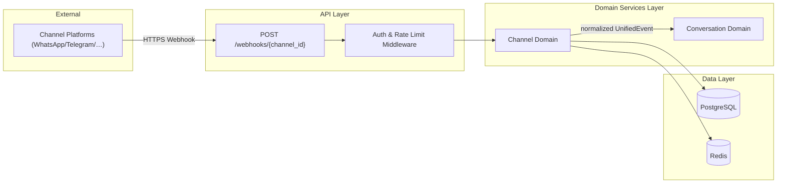
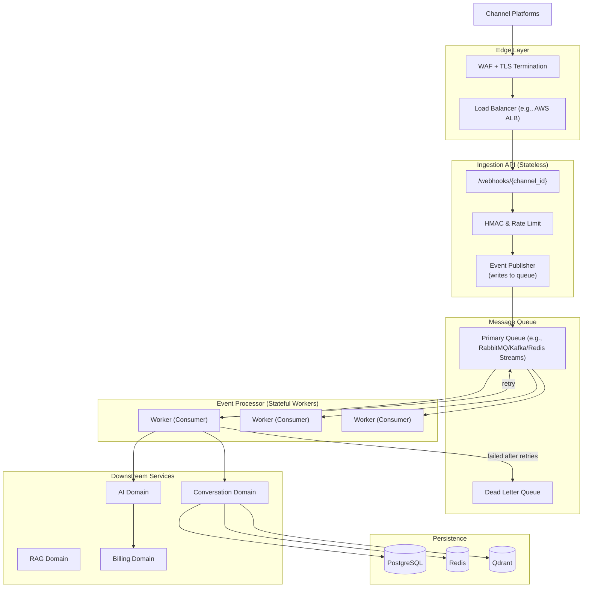
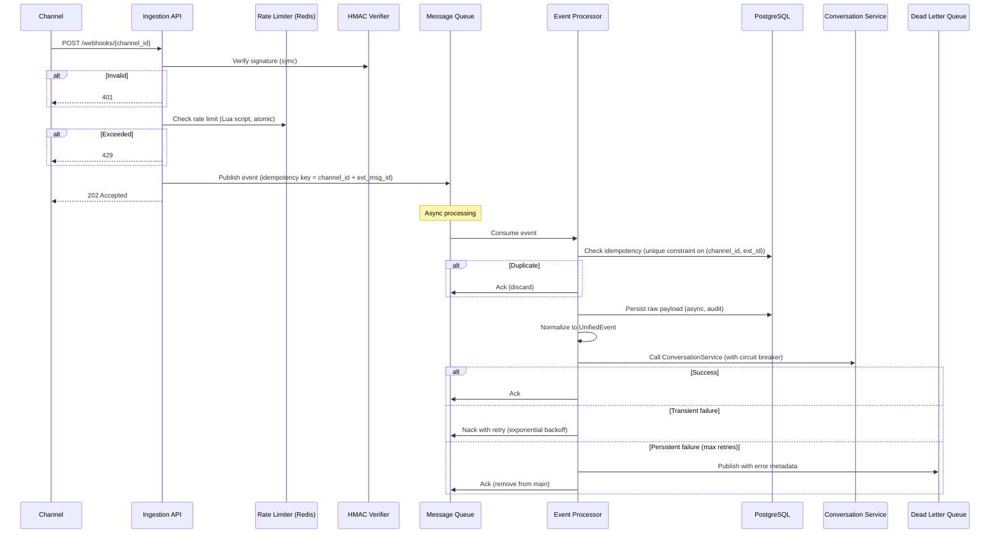

# SAD — Chapter 35 (Revised): Multi‑Channel Message Ingestion – Production Architecture

**Version:** 0.2.0  
**Status:** Draft – addresses scalability and professional patterns  

---

## 1. Design Goals (What Was Missing)

| Problem | Solution |
|---------|----------|
| **Synchronous blocking** – HTTP request waited for DB writes, normalisation, and downstream calls. | **Async decoupling** – ingestion writes to a durable queue and returns `202 Accepted` immediately. |
| **Single point of failure** – the FastAPI worker did everything. | **Separate micro‑services** – ingestion API, event processor, and workers, each scaled independently. |
| **No retry/backoff** – failures lost messages. | **Retry with exponential backoff + Dead Letter Queue (DLQ)**. |
| **No monitoring/observability** – hard to debug. | **Structured logs, metrics (Prometheus), distributed tracing (OpenTelemetry)**. |
| **Rate limiting per‑instance** – not distributed. | **Centralised rate limiting via Redis + Lua scripts**. |
| **Idempotency using Redis only** – not durable. | **PostgreSQL unique constraint + Redis cache** for fast lookups. |
| **No circuit breakers** – downstream failures cascaded. | **Circuit breaker pattern** for external calls (LLM, channel APIs). |

---
# SAD — Chapter 35: Multi-Channel Message Ingestion Design

**Document:** Software Architecture Document  
**Section:** Multi-Channel Message Ingestion  
**Version:** 0.1.0  
**Status:** Draft  
**Last Updated:** 2026-07-19  

---

## 2. Architectural Context

The Ingestion Service resides at the **API Layer** and delegates to the **Channel Domain** and **Conversation Domain** services. It interacts with:

- **PostgreSQL** for channel configuration, raw event persistence, and audit logs.
- **Redis** for idempotency keys, rate limiting counters, and token blacklist.

The diagram below shows the placement:




## 3. High‑Level Architecture



---

## 4. Component Breakdown (Production‑Ready)

| Component | Responsibility | Scalability Notes |
|-----------|----------------|-------------------|
| **Ingestion API** | Exposes webhook endpoint; validates HMAC; enforces rate limit; publishes event to queue. | Stateless → scale horizontally. No DB writes during request. |
| **Message Queue** | Durable, ordered, replayable. | Use **Kafka** (high throughput, retention) or **RabbitMQ** (low latency). Redis Streams can work for moderate scale. |
| **Event Processor (Workers)** | Consumes events; normalises; persists raw payload; calls conversation service. | Scale workers independently. Use **consumer groups** for parallelism. |
| **Circuit Breaker** | Wraps external calls (LLM, channel outbound). | Prevents cascading failures; fallback to DLQ or human escalation. |
| **DLQ** | Stores events that failed after max retries. | Alert on DLQ; manual replay or dead‑letter analysis. |
| **Monitoring** | Prometheus metrics: ingestion rate, latency, error counts, queue depth. | Grafana dashboards; alerts on high DLQ or queue backlog. |
| **Distributed Tracing** | OpenTelemetry to trace a message from ingestion to reply. | Helps debug performance bottlenecks. |

---

## 5. Detailed Flow (Sequence with Async Decoupling)



---

## 6. Code Guides (Production‑Grade)

### 6.1 Ingestion API – FastAPI with Background Publisher

```python
from fastapi import FastAPI, Request, HTTPException, BackgroundTasks
from .services import publish_event, verify_hmac, check_rate_limit

app = FastAPI()

@app.post("/webhooks/{channel_id}")
async def ingest(
    channel_id: UUID,
    request: Request,
    background_tasks: BackgroundTasks,
):
    # 1. Read raw body
    raw_body = await request.body()
    signature = request.headers.get("X-Hub-Signature-256", "")

    # 2. Load channel config (from Redis cache)
    config = await get_channel_config(channel_id)
    if not config:
        raise HTTPException(404, "Channel not found")
    if config.status != "active":
        raise HTTPException(403, "Channel suspended")

    # 3. Verify HMAC
    if not verify_hmac(raw_body, config.webhook_secret, signature):
        # Log security event
        raise HTTPException(401, "Invalid signature")

    # 4. Rate limit (distributed)
    allowed = await check_rate_limit(config.tenant_id, channel_id, config.rate_limit)
    if not allowed:
        raise HTTPException(429, "Rate limit exceeded")

    # 5. Extract external_id from payload (light parsing)
    payload = json.loads(raw_body)
    ext_id = extract_external_id(payload, config.channel_type)

    # 6. Publish to queue (fire-and-forget with BackgroundTasks)
    background_tasks.add_task(
        publish_event,
        channel_id=channel_id,
        tenant_id=config.tenant_id,
        raw_body=raw_body,
        ext_id=ext_id,
        channel_type=config.channel_type,
    )

    # 7. Return 202 Accepted immediately
    return {"status": "accepted", "message_id": ext_id}
```

### 6.2 Event Publisher (BackgroundTask → Async Producer)

```python
import aiokafka  # or aio_pika for RabbitMQ

async def publish_event(channel_id, tenant_id, raw_body, ext_id, channel_type):
    # Build event payload
    event = {
        "channel_id": str(channel_id),
        "tenant_id": str(tenant_id),
        "raw_payload": raw_body.decode("utf-8"),  # or bytes
        "external_id": ext_id,
        "channel_type": channel_type,
        "received_at": datetime.utcnow().isoformat(),
    }
    # Produce to Kafka topic "ingestion_events" with key = ext_id (for ordering)
    await producer.send_and_wait("ingestion_events", value=event, key=ext_id.encode())
```

### 6.3 Event Processor (Kafka Consumer)

```python
from aiokafka import AIOKafkaConsumer
import asyncio
from tenacity import retry, stop_after_attempt, wait_exponential

@retry(stop=stop_after_attempt(3), wait=wait_exponential(multiplier=1, min=2, max=10))
async def process_event(event):
    # 1. Idempotency check using DB (unique constraint)
    async with async_session() as session:
        exists = await session.execute(
            select(RawWebhook).where(
                RawWebhook.channel_id == event["channel_id"],
                RawWebhook.external_id == event["external_id"]
            )
        )
        if exists.scalar():
            return  # duplicate, ack and skip

        # 2. Persist raw payload
        raw = RawWebhook(
            channel_id=event["channel_id"],
            tenant_id=event["tenant_id"],
            payload=event["raw_payload"],
            external_id=event["external_id"],
        )
        session.add(raw)
        await session.commit()

    # 3. Normalize using factory
    normalizer = NormalizerFactory.get(event["channel_type"])
    unified = normalizer.normalize(event["raw_payload"], ...)

    # 4. Call Conversation Service (with circuit breaker)
    async with CircuitBreaker("conversation_service") as cb:
        await cb.call(conversation_service.handle_unified_event, unified)

    # 5. Ack implicitly on success

async def consume_loop():
    consumer = AIOKafkaConsumer(
        "ingestion_events",
        bootstrap_servers="localhost:9092",
        group_id="ingestion_processor",
        enable_auto_commit=False,  # manual commit after processing
    )
    await consumer.start()
    try:
        async for msg in consumer:
            try:
                await process_event(json.loads(msg.value))
                await consumer.commit()
            except Exception as e:
                # Log error; message will be retried because we don't commit
                # After max retries, send to DLQ (implement via a separate topic)
                if msg.offset % 3 == 0:  # simple demo
                    await producer.send("ingestion_dlq", msg.value)
                else:
                    # Re-raise to trigger retry (but we need a retry mechanism)
                    # Better to use a retry decorator with exponential backoff
                    pass
    finally:
        await consumer.stop()
```

### 6.4 Circuit Breaker Pattern

```python
from circuitbreaker import CircuitBreaker

class ConversationCircuitBreaker(CircuitBreaker):
    def __init__(self):
        super().__init__(failure_threshold=5, recovery_timeout=30)

    def call(self, func, *args, **kwargs):
        try:
            return func(*args, **kwargs)
        except Exception:
            self.record_failure()
            raise

# Usage
cb = ConversationCircuitBreaker()
await cb.call(conversation_service.handle_unified_event, unified)
```

### 56.5 Distributed Rate Limiter (Redis + Lua)

```lua
-- rate_limiter.lua
local key = KEYS[1]
local limit = tonumber(ARGV[1])
local window = tonumber(ARGV[2])
local current = redis.call('INCR', key)
if current == 1 then
    redis.call('EXPIRE', key, window)
end
if current > limit then
    return 0
end
return 1
```

```python
async def check_rate_limit(tenant_id, channel_id, limit):
    key = f"rate:{tenant_id}:{channel_id}"
    result = await redis.eval(rate_limiter_script, keys=[key], args=[limit, 60])
    return result == 1
```

---

## 7. Scalability & Professionalism Checklist

| Aspect | Implementation |
|--------|----------------|
| **Async decoupling** | Ingestion returns `202` before any heavy processing. Workers scale independently. |
| **Message durability** | Queue persists messages; consumer commits only after successful processing. |
| **Idempotency** | Database unique constraint on `(channel_id, external_id)` ensures exactly‑once semantics. |
| **Retry with backoff** | Tenacity / custom logic with exponential backoff; configurable max attempts. |
| **Dead Letter Queue** | Failed messages go to DLQ for manual inspection/replay. |
| **Distributed rate limiting** | Redis Lua script ensures atomicity and fairness across instances. |
| **Observability** | Prometheus metrics (rate, latency, errors); OpenTelemetry for tracing; structured logs with correlation IDs. |
| **Circuit breakers** | Prevent cascading failures to downstream services. |
| **Graceful shutdown** | Workers wait for in‑flight tasks to finish. |
| **Health checks** | `/health` endpoint for load balancer, `/ready` for queue connectivity. |
| **Configuration** | All limits (rate, retry) are environment‑tuned, not hardcoded. |
| **Security** | HMAC verification; secrets encrypted at rest; RLS on all DB tables. |

---

## 8. Migration from Synchronous to Async

If the codebase already has a sync ingestion, we can incrementally adopt:

1. **Phase 1** – Keep sync flow but add a queue for offloading raw persistence and normalisation.
2. **Phase 2** – Move the entire processing to workers; the API only publishes.
3. **Phase 3** – Introduce retry/DLQ and circuit breakers.

---

## 9. Open Items (Now Minimal)

| Item | Resolution |
|------|------------|
| **Queue choice** | Evaluate throughput vs latency. Kafka for high volume, RabbitMQ for low latency. Redis Streams for simpler ops. |
| **Monitoring & alerting** | Define SLOs (e.g., p95 ingestion latency < 200ms, DLQ size < 10). |
| **DLQ replay tool** | Build a simple admin tool to republish DLQ messages after fixing the cause. |

