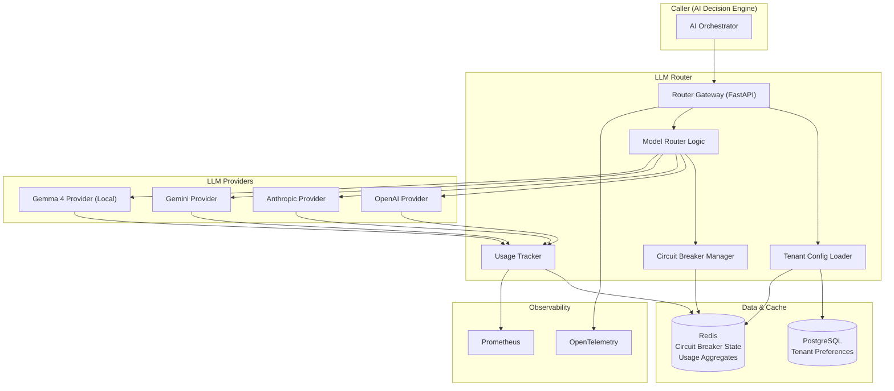

# Software Architecture Document – Volume 7

## Multi-LLM Provider Routing – Production Architecture

| **Document ID** | SAD-07-LLM-ROUTER-v1.0 |
| :--- | :--- |
| **Version** | 1.0 |
| **Status** | **Approved for Implementation** |
| **Classification** | Confidential – Omnilinks Internal |
| **Reviewers** | Principal Architect, AI/ML Lead, SRE Lead |

---

## Table of Contents

1. [Executive Summary & NFRs](#1-executive-summary--nfrs)
2. [Logical Architecture – Component View](#2-logical-architecture--component-view)
3. [Physical Architecture – Deployment Topology](#3-physical-architecture--deployment-topology)
4. [Data Architecture – Domain Models](#4-data-architecture--domain-models)
5. [Core Component Deep‑Dive](#5-core-component-deep-dive)
   - 5.1 AbstractLLMProvider Interface
   - 5.2 Concrete Provider Implementations
   - 5.3 Model Router with Circuit Breaker
   - 5.4 Tenant Configuration & Preference
   - 5.5 Usage Tracking & Cost Metering
6. [Integration with AI Decision Engine](#6-integration-with-ai-decision-engine)
7. [Security Architecture](#7-security-architecture)
8. [Observability & SRE](#8-observability--sre)
9. [Architecture Decision Records (ADR)](#9-architecture-decision-records-adr)
10. [Open Items & Roadmap](#10-open-items--roadmap)

---

## 1. Executive Summary & NFRs

### 1.1 Strategic Objective
Deliver a **resilient, cost‑aware, and tenant‑configurable LLM routing layer** that abstracts multiple foundation model providers behind a unified interface. The system must provide automatic failover (circuit breaker), per‑tenant model preferences, detailed usage tracking (tokens, latency, cost), and full observability – all while maintaining sub‑4‑second p95 latency for inference.

### 1.2 Non‑Functional Requirements

| NFR ID | Category | Target | Implementation |
| :--- | :--- | :--- | :--- |
| **NFR-LLM-01** | **Latency (p95)** | < 4.0 s | Connection pooling, request timeouts, streaming |
| **NFR-LLM-02** | **Availability** | 99.95% | Circuit breaker + fallback chain (primary → fallback → local) |
| **NFR-LLM-03** | **Failover Time** | < 2 s | Circuit breaker state in Redis (shared across pods) |
| **NFR-LLM-04** | **Throughput** | 500 req/sec | Stateless router pods; HPA based on CPU/queue |
| **NFR-LLM-05** | **Cost Tracking** | Per‑request | Token counting + cost per provider |
| **NFR-LLM-06** | **Tenant Isolation** | Separate config per tenant | Config stored in PostgreSQL, cached in Redis |

---

## 2. Logical Architecture – Component View



---

## 3. Physical Architecture – Deployment Topology

| Node Pool | Instance Type | Components | Scaling Policy |
| :--- | :--- | :--- | :--- |
| **Compute‑Optimised** | Standard_D4s_v3 | Router Gateway Pods | HPA: CPU > 70% |
| **Memory‑Optimised** | Standard_E8s_v3 | Redis (Circuit Breaker, Cache) | Managed Redis Premium |
| **GPU** | Standard_NC6s_v3 | Gemma 4 Inference Server | Fixed 2 replicas (HA) |

---

## 4. Data Architecture – Domain Models

### 4.1 PostgreSQL Tables

```sql
-- Tenant LLM preferences
CREATE TABLE tenant_llm_preferences (
    tenant_id UUID PRIMARY KEY REFERENCES tenants(id),
    primary_provider VARCHAR(50) DEFAULT 'openai',
    fallback_provider VARCHAR(50) DEFAULT 'anthropic',
    model_config JSONB NOT NULL DEFAULT '{}',  -- temperature, max_tokens, etc.
    updated_at TIMESTAMP DEFAULT NOW()
);

-- Provider API keys (encrypted)
CREATE TABLE provider_credentials (
    id UUID PRIMARY KEY,
    tenant_id UUID NOT NULL,
    provider VARCHAR(50) NOT NULL,
    api_key_encrypted TEXT NOT NULL,  -- AES-256-GCM encrypted
    created_at TIMESTAMP DEFAULT NOW()
);

-- Usage logs (aggregated later)
CREATE TABLE llm_usage_logs (
    id UUID PRIMARY KEY,
    tenant_id UUID NOT NULL,
    provider VARCHAR(50),
    model VARCHAR(100),
    request_id UUID,
    prompt_tokens INT,
    completion_tokens INT,
    total_tokens INT,
    latency_ms INT,
    cost NUMERIC(10,6),  -- in USD
    success BOOLEAN,
    error_code VARCHAR(50),
    created_at TIMESTAMP DEFAULT NOW()
);
```

### 4.2 Redis Data Structures

| Key Pattern | Type | TTL | Purpose |
| :--- | :--- | :--- | :--- |
| `cb:{provider}` | String (count) | 60s | Failure counter for circuit breaker |
| `cb:{provider}:recovery` | String | 30s | Recovery timeout (half‑open) |
| `tenant:llm:{tenant_id}` | JSON | 5 min | Cached tenant preferences |
| `usage:agg:{tenant_id}:{provider}:{hour}` | Hash | 24h | Hourly usage aggregates |

---

## 5. Core Component Deep‑Dive

### 5.1 AbstractLLMProvider Interface

```python
from abc import ABC, abstractmethod
from typing import Optional, Dict, Any

class AbstractLLMProvider(ABC):
    """Unified interface for all LLM providers."""
    
    @abstractmethod
    async def generate(
        self,
        prompt: str,
        context: Optional[Dict[str, Any]] = None,
        temperature: float = 0.7,
        max_tokens: int = 1024,
        **kwargs
    ) -> LLMResponse:
        """
        Generate a response from the LLM.
        Returns an LLMResponse with content, usage, latency, etc.
        """
        pass
    
    @abstractmethod
    def get_model_name(self) -> str:
        """Return the human‑readable model name."""
        pass
    
    @abstractmethod
    def get_provider_name(self) -> str:
        """Return the provider identifier (e.g., 'openai')."""
        pass
```

**LLMResponse DTO:**

```python
@dataclass
class LLMResponse:
    content: str
    model: str
    provider: str
    prompt_tokens: int
    completion_tokens: int
    total_tokens: int
    latency_ms: float
    cost: float
    finish_reason: Optional[str] = None
    raw_response: Optional[Dict] = None  # for debugging
```

### 5.2 Concrete Provider Implementations

#### 5.2.1 OpenAIProvider

```python
import openai
from tenacity import retry, stop_after_attempt, wait_exponential

class OpenAIProvider(AbstractLLMProvider):
    def __init__(self, api_key: str, model: str = "gpt-4o"):
        self.api_key = api_key
        self.model = model
        self.client = openai.AsyncOpenAI(api_key=api_key)
    
    @retry(stop=stop_after_attempt(2), wait=wait_exponential(multiplier=1, min=1, max=5))
    async def generate(self, prompt: str, context: Optional[Dict] = None, 
                       temperature: float = 0.7, max_tokens: int = 1024, **kwargs) -> LLMResponse:
        start = time.time()
        try:
            response = await self.client.chat.completions.create(
                model=self.model,
                messages=[
                    {"role": "system", "content": "You are a helpful assistant."},
                    {"role": "user", "content": prompt}
                ],
                temperature=temperature,
                max_tokens=max_tokens,
                **kwargs
            )
            latency = (time.time() - start) * 1000
            usage = response.usage
            return LLMResponse(
                content=response.choices[0].message.content,
                model=self.model,
                provider="openai",
                prompt_tokens=usage.prompt_tokens,
                completion_tokens=usage.completion_tokens,
                total_tokens=usage.total_tokens,
                latency_ms=latency,
                cost=self._calculate_cost(usage),
                finish_reason=response.choices[0].finish_reason
            )
        except Exception as e:
            raise LLMProviderError(provider="openai", error=str(e))
    
    def _calculate_cost(self, usage):
        # Pricing: GPT-4o: $5/1M input, $15/1M output (simplified)
        return (usage.prompt_tokens * 5 + usage.completion_tokens * 15) / 1_000_000
    
    def get_model_name(self) -> str:
        return self.model
    
    def get_provider_name(self) -> str:
        return "openai"
```

Other providers (Anthropic, Gemini, Local) follow the same pattern with their respective SDKs.

### 5.3 Model Router with Circuit Breaker

**Key Features:**
- **Tenant‑specific** primary/fallback provider.
- **Circuit Breaker** state shared via Redis (distributed).
- **Failover chain:** primary → fallback → local → human escalation.

#### 5.3.1 Router Logic

```python
class ModelRouter:
    def __init__(self, redis_client, tenant_config_loader):
        self.redis = redis_client
        self.config_loader = tenant_config_loader
        self.providers = {}  # populated on demand
    
    async def generate(self, tenant_id: UUID, prompt: str, **kwargs) -> LLMResponse:
        # 1. Get tenant preferences
        pref = await self.config_loader.get_preferences(tenant_id)
        primary = pref.get('primary_provider', 'openai')
        fallback = pref.get('fallback_provider', 'anthropic')
        local = 'gemma'  # always available
        
        # 2. Build provider chain
        provider_order = [primary, fallback, local]
        last_error = None
        
        for provider_name in provider_order:
            # Check circuit breaker
            if await self.circuit_breaker.is_open(provider_name):
                continue
            
            try:
                provider = await self._get_provider(tenant_id, provider_name, pref)
                response = await provider.generate(prompt, **kwargs)
                # Record success
                await self.circuit_breaker.record_success(provider_name)
                await self.usage_tracker.track(tenant_id, provider_name, response)
                return response
            except LLMProviderError as e:
                last_error = e
                await self.circuit_breaker.record_failure(provider_name)
                continue
            except Exception as e:
                # Unexpected error
                await self.circuit_breaker.record_failure(provider_name)
                raise
        
        # All providers failed or circuit open
        raise AllProvidersFailedError(
            primary=primary,
            fallback=fallback,
            last_error=str(last_error)
        )
```

#### 5.3.2 Circuit Breaker (Redis-backed)

```python
class CircuitBreaker:
    def __init__(self, redis_client):
        self.redis = redis_client
        self.failure_threshold = 5  # consecutive failures
        self.timeout = 30  # seconds to wait before half-open
    
    async def is_open(self, provider: str) -> bool:
        key = f"cb:{provider}"
        failures = await self.redis.get(key)
        if failures is None:
            return False
        if int(failures) < self.failure_threshold:
            return False
        
        # Check if recovery timer exists
        recovery_key = f"cb:{provider}:recovery"
        if await self.redis.exists(recovery_key):
            return True  # still in recovery period
        else:
            # Enter half-open: allow one request
            await self.redis.setex(recovery_key, self.timeout, "1")
            return False  # allow a single request to test
    
    async def record_success(self, provider: str):
        # Reset counters
        await self.redis.delete(f"cb:{provider}")
        await self.redis.delete(f"cb:{provider}:recovery")
    
    async def record_failure(self, provider: str):
        key = f"cb:{provider}"
        failures = await self.redis.incr(key)
        await self.redis.expire(key, 60)  # reset after 60s
        return failures
```

### 5.4 Tenant Configuration & Preference

The `TenantConfigLoader` caches preferences in Redis (TTL 5 min) to avoid DB hits.

```python
class TenantConfigLoader:
    async def get_preferences(self, tenant_id: UUID) -> Dict:
        cache_key = f"tenant:llm:{tenant_id}"
        cached = await self.redis.get(cache_key)
        if cached:
            return json.loads(cached)
        
        # Load from DB
        row = await db.fetch_one(
            "SELECT primary_provider, fallback_provider, model_config FROM tenant_llm_preferences WHERE tenant_id = $1",
            tenant_id
        )
        if not row:
            # Defaults
            row = {"primary_provider": "openai", "fallback_provider": "anthropic", "model_config": {}}
        
        await self.redis.setex(cache_key, 300, json.dumps(row))
        return row
    
    async def update_preference(self, tenant_id: UUID, pref: Dict):
        await db.execute("""
            INSERT INTO tenant_llm_preferences (tenant_id, primary_provider, fallback_provider, model_config)
            VALUES ($1, $2, $3, $4)
            ON CONFLICT (tenant_id) DO UPDATE SET
                primary_provider = EXCLUDED.primary_provider,
                fallback_provider = EXCLUDED.fallback_provider,
                model_config = EXCLUDED.model_config,
                updated_at = NOW()
        """, tenant_id, pref['primary_provider'], pref['fallback_provider'], json.dumps(pref['model_config']))
        await self.redis.delete(f"tenant:llm:{tenant_id}")  # invalidate cache
```

### 5.5 Usage Tracking & Cost Metering

**Tracker** records each request to PostgreSQL and aggregates for billing.

```python
class UsageTracker:
    async def track(self, tenant_id: UUID, provider: str, response: LLMResponse):
        # Write to usage_logs (async insert)
        await db.execute("""
            INSERT INTO llm_usage_logs (tenant_id, provider, model, prompt_tokens, completion_tokens,
                                       total_tokens, latency_ms, cost, success)
            VALUES ($1, $2, $3, $4, $5, $6, $7, $8, true)
        """, tenant_id, provider, response.model, response.prompt_tokens,
           response.completion_tokens, response.total_tokens,
           response.latency_ms, response.cost)
        
        # Update Redis aggregate (for fast dashboards)
        hour_key = f"usage:agg:{tenant_id}:{provider}:{datetime.utcnow().strftime('%Y%m%d%H')}"
        await self.redis.hincrbyfloat(hour_key, "cost", response.cost)
        await self.redis.hincrby(hour_key, "tokens", response.total_tokens)
        await self.redis.expire(hour_key, 3600 * 24 * 7)  # keep for 7 days
```

---

## 6. Integration with AI Decision Engine

The Model Router is invoked by the AI Decision Engine (Volume 3) during the response generation phase. The AI Orchestrator calls the router with the assembled prompt and tenant context. If the router throws `AllProvidersFailedError`, the orchestrator routes to human handoff (F-AI-10).

---

## 7. Security Architecture

- **API Keys:** Encrypted at rest (AES-256-GCM) in PostgreSQL using KMS‑managed keys.
- **mTLS:** Between router and local Gemma server.
- **Audit Logging:** All generation attempts are logged (provider, result, error).
- **Rate Limiting:** Per‑tenant token‑based rate limiting (implemented at the router gateway) to prevent abuse.

---

## 8. Observability & SRE

### 8.1 Metrics (Prometheus)

| Metric | Type | Labels | Purpose |
| :--- | :--- | :--- | :--- |
| `llm_requests_total` | Counter | `provider`, `tenant`, `status` | Request volume and success rates |
| `llm_latency_seconds` | Histogram | `provider` | Latency per provider |
| `llm_usage_tokens_total` | Counter | `provider`, `type` (prompt/completion) | Token consumption |
| `llm_cost_total` | Counter | `provider`, `tenant` | Cost per tenant/provider |
| `circuit_breaker_state` | Gauge | `provider` | 0=closed, 1=open, 2=half‑open |

### 8.2 Alerting

| Condition | Severity | Action |
| :--- | :--- | :--- |
| `llm_requests_total{status="failure"} > 10%` for 5 min | **P1** | Investigate provider outages |
| `circuit_breaker_state{provider="openai"} == 1` | **P2** | OpenAI circuit open; using fallback |
| `llm_latency_seconds{quantile="0.95"} > 6s` | **P2** | Investigate slow provider or network |
| `llm_usage_tokens_total` spikes > 2x baseline | **P3** | Potential abuse or high traffic |

### 8.3 Distributed Tracing

Each LLM request carries the parent trace ID from the AI Orchestrator, allowing end‑to‑end tracking of a user query through retrieval, LLM generation, and guardrails.

---

## 9. Architecture Decision Records (ADR)

### ADR-017: Provider Abstraction Interface
- **Context:** Need to support multiple LLM providers with different APIs.
- **Decision:** Define a clean `AbstractLLMProvider` with `generate()` and `get_model_name()`.
- **Rationale:** Allows swapping providers without touching business logic; enables unit testing.

### ADR-018: Circuit Breaker in Redis
- **Context:** Circuit breaker state must be shared across multiple router pods.
- **Decision:** Store failure counters and recovery timers in Redis.
- **Rationale:** Distributed state; low latency; atomic operations.

### ADR-019: Tenant Preference Caching
- **Context:** Tenant config is read on every request (high volume).
- **Decision:** Cache preferences in Redis with TTL 5 min.
- **Rationale:** Reduces DB load; acceptable staleness (5 min) for config changes.

### ADR-020: Fallback to Local Gemma
- **Context:** Need a cost‑effective fallback when cloud providers fail.
- **Decision:** Include a local Gemma 4 inference server as the final fallback.
- **Rationale:** Avoids total outage; cost‑controlled (only used when cloud providers are unavailable).

---

## 10. Open Items & Roadmap

| Item | Owner | Target Date | Risk |
| :--- | :--- | :--- | :--- |
| **Local Gemma 4 hosting** | MLOps | GA | Needs GPU provisioning and model deployment |
| **Dynamic model selection per tenant** | Product | GA+1 | UI for Team Admin to choose primary/fallback |
| **Advanced cost controls** | Product | GA+2 | Budget caps, alerts at threshold |
| **Model version pinning** | AI Team | GA+2 | Allow tenants to pin a specific model version |

---

> **Next Steps:**
> 1. Implement the `AbstractLLMProvider` interface and concrete providers.
> 2. Set up Redis for circuit breaker state.
> 3. Implement the `ModelRouter` with failover chain.
> 4. Write unit tests for each provider and the router.
> 5. Deploy Gemma 4 on GPU nodes and integrate.

