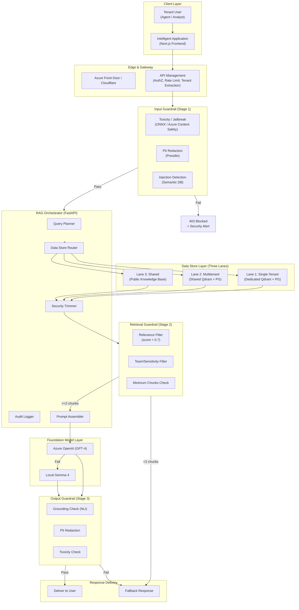
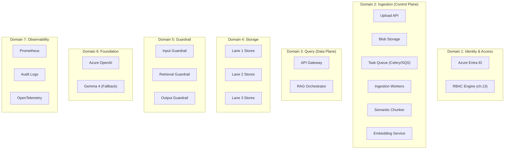
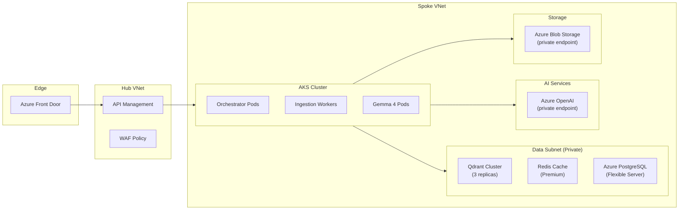
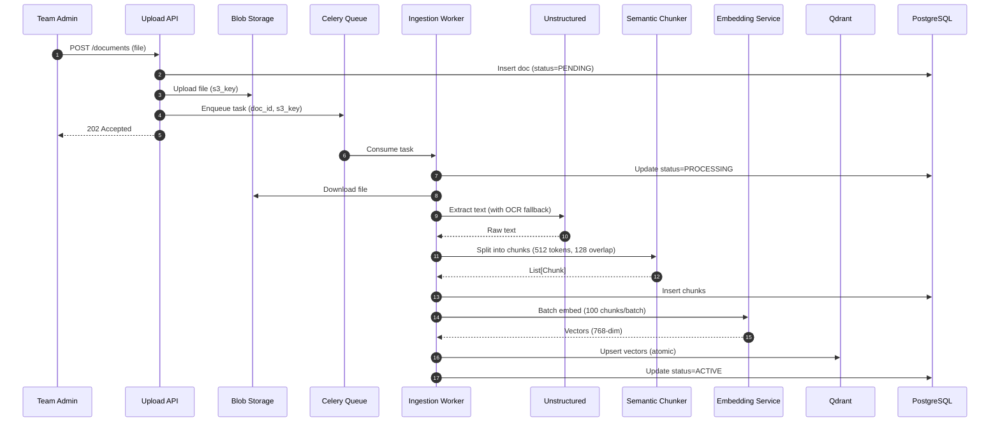
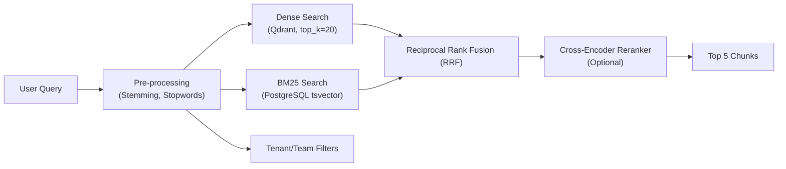
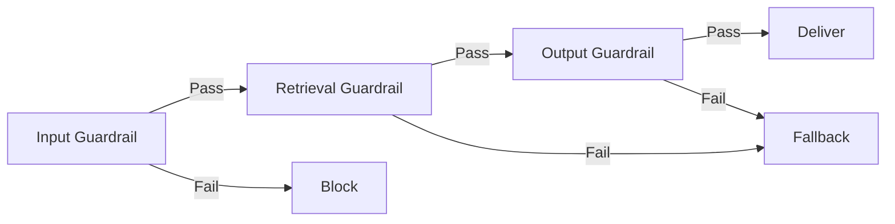

# Enterprise RAG Architecture – Definitive Design

| **Document ID** | OMNILINKS-RAG-DEFINITIVE-v2.0 |
| :--- | :--- |
| **Version** | 2.0 – *Ultimate Production-Ready Architecture* |
| **Status** | **Final – Approved for Implementation** |
| **Classification** | Confidential – Omnilinks Internal |
| **Authors** | Principal Architect, ML Engineering, Security Lead |
| **Reviewers** | CTO, VP Engineering, SRE Director |

---

## Table of Contents

1. [Executive Summary](#1-executive-summary)
2. [Architecture Vision](#2-architecture-vision)
3. [Non-Functional Requirements (NFRs)](#3-non-functional-requirements-nfrs)
4. [Logical Architecture – Component View](#4-logical-architecture--component-view)
5. [Physical Architecture – Deployment Topology](#5-physical-architecture--deployment-topology)
6. [Data Architecture – Domain Models](#6-data-architecture--domain-models)
7. [Ingestion Pipeline – Async & Scalable](#7-ingestion-pipeline--async--scalable)
8. [Retrieval Pipeline – Hybrid Search](#8-retrieval-pipeline--hybrid-search)
9. [Multitenant Isolation Strategy – The Three-Lane Model](#9-multitenant-isolation-strategy--the-three-lane-model)
10. [Guardrail & Safety Layer](#10-guardrail--safety-layer)
11. [Orchestrator – The Brain](#11-orchestrator--the-brain)
12. [Security Architecture](#12-security-architecture)
13. [Observability & SRE](#13-observability--sre)
14. [Architecture Decision Records (ADR)](#14-architecture-decision-records-adr)
15. [Open Items & Roadmap](#15-open-items--roadmap)
16. [Appendices](#16-appendices)

---

## 1. Executive Summary

### 1.1 Purpose
This document defines the **ultimate production-grade RAG architecture** for Omnilinks – a multi‑tenant, secure, scalable, and high‑performance system that grounds foundation model responses with proprietary tenant data. It is designed to support **1,000+ tenants**, **10,000+ documents per tenant**, and **sub‑200 ms retrieval latency**, while enforcing strict isolation and comprehensive safety guardrails.

### 1.2 Scope
The architecture covers:
- **Ingestion** – asynchronous document processing (PDF, DOCX, TXT, Markdown) with chunking, embedding, and vector storage.
- **Retrieval** – hybrid (dense + sparse) search with reciprocal rank fusion, team‑scoped security trimming, and multitenant isolation.
- **Guardrails** – input, retrieval, and output guards to prevent injection, leakage, hallucination, and policy violations.
- **Orchestration** – a resilient, parallelised orchestrator that coordinates retrieval, LLM calls, and routing.
- **Infrastructure** – Azure‑native deployment with auto‑scaling, private networking, and comprehensive observability.

### 1.3 Key Design Principles
| Principle | Implementation |
| :--- | :--- |
| **Zero Trust** | Every request authenticated, authorised, audited; no implicit trust. |
| **Defense in Depth** | Isolation at network, data, application, and guardrail layers. |
| **Least Privilege** | Users and services get minimal required permissions. |
| **Fail Secure** | On failure, deny access rather than expose data. |
| **Observability by Default** | All components emit metrics, logs, and traces. |
| **Tenant‑Awareness** | Every component knows `tenant_id` and enforces isolation. |

---

## 2. Architecture Vision

The complete end‑to‑end flow for a tenant user querying their knowledge base.



---

## 3. Non-Functional Requirements (NFRs)

| NFR ID | Category | Target | Measurement | Implementation Strategy |
| :--- | :--- | :--- | :--- | :--- |
| **NFR-RAG-001** | **Latency (p95)** | < 200 ms | Orchestrator metrics | Qdrant HNSW + hybrid search; query cache |
| **NFR-RAG-002** | **Throughput** | 1,000 req/sec | Load tests | Horizontally scalable orchestrator; queue backpressure |
| **NFR-RAG-003** | **Ingestion Throughput** | 10 docs/min (100p each) | S3 + Celery | Async pipeline with auto‑scaling workers |
| **NFR-RAG-004** | **Freshness** | < 5 sec after upload | Timestamp checks | Atomic replace (delete + insert) |
| **NFR-RAG-005** | **Availability** | 99.95% | Uptime monitoring | Multi‑AZ; circuit breakers; graceful degradation |
| **NFR-RAG-006** | **Data Isolation** | Zero leakage | Audits | RLS + collection‑per‑tenant + payload filters |
| **NFR-RAG-007** | **Security** | No PII leakage | DLP scans | Guardrails (input/output) |
| **NFR-RAG-008** | **Cost per Query** | < $0.005 | Billing | Semantic cache; local fallback; prompt compression |
| **NFR-RAG-009** | **Auditability** | 100% coverage | Audit logs | Immutable audit log; all data accesses logged |

---

## 4. Logical Architecture – Component View

The system is decomposed into **seven logical domains** with clearly defined ingress/egress contracts.



**Interfaces between domains are defined as gRPC/Protobuf contracts for strict typing and performance.**

---

## 5. Physical Architecture – Deployment Topology

Deployed on **Azure** with Kubernetes (AKS) for compute, and managed Azure services for data.

| Node Pool | Instance Type | Components | Scaling Policy |
| :--- | :--- | :--- | :--- |
| **Compute‑Optimised** | Standard_D4s_v3 (4 vCPU, 16GB) | Orchestrator Pods, API Gateway | HPA: CPU > 70% |
| **Memory‑Optimised** | Standard_E8s_v3 (8 vCPU, 64GB) | Qdrant (StatefulSet, 3 replicas), Redis Cluster | Fixed with failover |
| **GPU** | Standard_NC6s_v3 (6 vCPU, 112GB, 1x K80) | Gemma 4 Inference Server, NLI Model | Fixed (2 replicas) |
| **General** | Standard_D2s_v3 | Ingestion Workers, Celery Beat | HPA: queue depth > 100 |



---

## 6. Data Architecture – Domain Models

### 6.1 Core Entities (PostgreSQL)

```sql
-- Tenant document metadata
CREATE TABLE documents (
    id UUID PRIMARY KEY,
    tenant_id UUID NOT NULL,
    team_id UUID,                     -- NULL = tenant-wide
    name TEXT NOT NULL,
    s3_key TEXT NOT NULL,
    status VARCHAR(20) DEFAULT 'PENDING', -- PENDING, PROCESSING, ACTIVE, DELETED
    version INT DEFAULT 1,
    sensitivity VARCHAR(20) DEFAULT 'PUBLIC', -- PUBLIC, INTERNAL, CONFIDENTIAL
    created_by UUID,
    created_at TIMESTAMP DEFAULT NOW(),
    updated_at TIMESTAMP DEFAULT NOW()
);

-- Document versions (audit trail)
CREATE TABLE document_versions (
    id UUID PRIMARY KEY,
    doc_id UUID REFERENCES documents(id),
    version_number INT,
    s3_key TEXT,
    created_at TIMESTAMP DEFAULT NOW()
);

-- Chunks (for audit and explainability)
CREATE TABLE chunks (
    id UUID PRIMARY KEY,
    doc_id UUID REFERENCES documents(id),
    sequence INT,
    content TEXT,
    token_count INT,
    start_offset INT,
    end_offset INT
);

-- Audit log (immutable)
CREATE TABLE rag_audit_log (
    id UUID PRIMARY KEY,
    tenant_id UUID NOT NULL,
    user_id UUID NOT NULL,
    query_hash VARCHAR(64),
    result_chunk_ids UUID[],
    action VARCHAR(50), -- SEARCH, RETRIEVE, FILTER
    filtered_count INT,
    guardrail_result VARCHAR(20),
    timestamp TIMESTAMP DEFAULT NOW(),
    ip_address INET
);
```

### 6.2 Qdrant Schema (Vector Store)

| Field | Type | Indexed? | Description |
| :--- | :--- | :--- | :--- |
| `id` | UUID | Yes | Unique chunk ID |
| `vector` | float[768] | HNSW | Embedding |
| `tenant_id` | UUID | Keyword | Tenant isolation (for Lane 2/3) |
| `team_id` | UUID | Keyword | Team‑scope filtering |
| `doc_id` | UUID | Keyword | Document reference |
| `sensitivity` | String | Keyword | Sensitivity level |
| `text` | Text | Not | Original chunk text (returned in payload) |
| `metadata` | JSON | Not | Additional metadata |

**Collection Strategy:**
- **Lane 1:** Collection per tenant: `tenant_{tenant_id}`
- **Lane 2:** Single collection `multitenant_kb` with `tenant_id` payload index.
- **Lane 3:** Single collection `public_kb` with no tenant filters.

---

## 7. Ingestion Pipeline – Async & Scalable

### 7.1 High‑Level Flow



### 7.2 Chunking Strategy – Semantic Boundaries

We use a **semantic-aware chunker** that preserves paragraphs, lists, and section headers.

```python
class SemanticChunker:
    def __init__(self, tokenizer, max_tokens=512, overlap=128):
        self.tokenizer = tokenizer
        self.max_tokens = max_tokens
        self.overlap = overlap

    def chunk(self, text: str) -> List[Chunk]:
        # Split by double newline (paragraphs)
        paragraphs = [p.strip() for p in text.split("\n\n") if p.strip()]
        chunks = []
        current = []
        current_tokens = 0

        for para in paragraphs:
            para_tokens = len(self.tokenizer.encode(para))
            if current_tokens + para_tokens > self.max_tokens and current:
                # Flush
                chunks.append(Chunk(
                    text="\n\n".join(current),
                    tokens=current_tokens
                ))
                # Overlap: keep the last ~overlap tokens worth of text
                overlap_text = self._get_overlap(current, self.overlap)
                current = [overlap_text] if overlap_text else []
                current_tokens = len(self.tokenizer.encode(overlap_text))
            current.append(para)
            current_tokens += para_tokens

        if current:
            chunks.append(Chunk(text="\n\n".join(current), tokens=current_tokens))
        return chunks
```

### 7.3 Embedding Service – Batching & Fallback

We use **Cohere's multilingual‑v3.0** (768‑dim) for high-quality Arabic/English embeddings, with a local fallback (`all-MiniLM-L6-v2`).

```python
class EmbeddingService:
    def __init__(self):
        self.primary = Cohere("embed-multilingual-v3.0")
        self.fallback = SentenceTransformer("all-MiniLM-L6-v2")
        self.batch_size = 100

    async def embed_batch(self, texts: List[str]) -> List[List[float]]:
        try:
            resp = await asyncio.wait_for(
                self.primary.embed(texts, input_type="search_document"),
                timeout=10.0
            )
            return resp.embeddings
        except Exception:
            logger.warning("Primary embedder failed, using fallback")
            return self.fallback.encode(texts, convert_to_numpy=True).tolist()
```

---

## 8. Retrieval Pipeline – Hybrid Search

### 8.1 Overview

We combine **dense vector** (Qdrant) and **sparse/BM25** (via PostgreSQL `tsvector` or Elasticsearch) to achieve high recall, especially for exact‑match queries (e.g., order numbers, product codes).



### 8.2 Dense Search with Tenant Isolation

```python
class DenseRetriever:
    async def search(
        self,
        tenant_id: UUID,
        team_ids: List[UUID],
        query: str,
        top_k: int = 20
    ) -> List[QdrantHit]:
        # Determine collection(s) based on lanes
        collections = self._get_collections(tenant_id)  # [tenant_{id}, multitenant_kb, public_kb]

        vector = await self.embedder.embed(query)  # 768-dim

        results = []
        for coll in collections:
            filter_conditions = {"must": []}
            # Lane 2: filter by tenant_id
            if coll == "multitenant_kb":
                filter_conditions["must"].append({"key": "tenant_id", "match": str(tenant_id)})
            # Lane 1: physical isolation, no filter needed

            # Team filter for all lanes
            if team_ids:
                filter_conditions["must"].append({
                    "should": [
                        {"key": "team_id", "match": str(tid)} for tid in team_ids
                    ] + [{"key": "team_id", "is_null": True}]
                })

            hits = await self.qdrant.search(
                collection_name=coll,
                query_vector=vector,
                limit=top_k,
                query_filter=filter_conditions,
                with_payload=True
            )
            results.extend(hits)
        return results[:top_k]  # cap total
```

### 8.3 Sparse/BM25 (PostgreSQL `tsvector`)

```sql
-- Enable full‑text search on chunks table
ALTER TABLE chunks ADD COLUMN search_vector tsvector
    GENERATED ALWAYS AS (to_tsvector('english', content)) STORED;
CREATE INDEX chunks_search_idx ON chunks USING GIN(search_vector);

-- Query
SELECT id, content, ts_rank(search_vector, websearch_to_tsquery('english', 'return policy')) AS rank
FROM chunks
WHERE tenant_id = $1 AND (team_id = ANY($2) OR team_id IS NULL)
  AND search_vector @@ websearch_to_tsquery('english', 'return policy')
ORDER BY rank DESC LIMIT 20;
```

### 8.4 Reciprocal Rank Fusion (RRF)

```python
def reciprocal_rank_fusion(dense_hits, sparse_hits, k=60):
    scores = {}
    for rank, hit in enumerate(dense_hits):
        doc_id = hit.payload["chunk_id"]
        scores[doc_id] = scores.get(doc_id, 0) + 1 / (k + rank + 1)
    for rank, hit in enumerate(sparse_hits):
        doc_id = hit["id"]
        scores[doc_id] = scores.get(doc_id, 0) + 1 / (k + rank + 1)
    return sorted(scores.items(), key=lambda x: x[1], reverse=True)
```

---

## 9. Multitenant Isolation Strategy – The Three-Lane Model

| Lane | Data Type | Storage | Isolation | Query Filter |
| :--- | :--- | :--- | :--- | :--- |
| **Lane 1** | Highly sensitive tenant data | Dedicated Qdrant collection + Dedicated PG schema | Physical | No filter needed (collection is per-tenant) |
| **Lane 2** | Shared templates, moderate sensitivity | Shared Qdrant collection + Shared PG | Logical | `WHERE tenant_id = current_tenant` |
| **Lane 3** | Public knowledge (e.g., medical guidelines) | Shared Qdrant collection + Shared PG | None | No filter |

**Design decisions:**
- **Lane 1** is for large enterprise tenants with strict data residency/regulatory requirements.
- **Lane 2** is for SMBs and mid‑market tenants who can share infrastructure.
- **Lane 3** is for global knowledge bases used by all tenants.

```python
class QueryRouter:
    async def route(self, tenant_id: UUID, team_ids: List[UUID], query: str):
        results = []

        # Lane 1: tenant-specific collection
        results.extend(await self.search_collection(f"tenant_{tenant_id}", query, team_ids))

        # Lane 2: multitenant collection with tenant filter
        if self.tenant_has_multitenant_access(tenant_id):
            results.extend(await self.search_collection(
                "multitenant_kb",
                query,
                team_ids,
                extra_filter={"tenant_id": tenant_id}
            ))

        # Lane 3: public collection
        if self.tenant_has_public_access(tenant_id):
            results.extend(await self.search_collection("public_kb", query, team_ids))

        return results
```

---

## 10. Guardrail & Safety Layer

### 10.1 Three‑Stage Guardrail Architecture



### 10.2 Input Guardrail (Stage 1)

| Check | Implementation | Latency | Action on Fail |
| :--- | :--- | :--- | :--- |
| **Toxicity** | Azure Content Safety API | 50ms | Block & alert |
| **Jailbreak** | ONNX `distilbert‑base‑uncased` fine‑tuned | 20ms | Block & log |
| **Prompt Injection** | Semantic similarity vs known injection DB (Qdrant) | 50ms | Block & alert |
| **PII Redaction** | Presidio (regex + NER) | 30ms | Redact and forward (redacted query) |

**Failure Mode:** **Fail‑closed** – if any check fails, return HTTP 403. This prevents malicious queries from ever reaching the orchestrator.

### 10.3 Retrieval Guardrail (Stage 2)

| Check | Implementation | Action on Fail |
| :--- | :--- | :--- |
| **Relevance Score** | Qdrant score < 0.7 → discard | Discard chunk |
| **Team Authorization** | `chunk.team_id` must be in user's team set | Discard chunk |
| **Sensitivity** | `chunk.sensitivity` > user's max sensitivity → discard | Discard chunk |
| **Minimum Chunks** | Fewer than 2 chunks remain after filtering | **Do not call LLM**; return fallback response |

**Failure Mode:** **Fail‑open** for relevance (allow degraded experience) but **fail‑secure** for authorization (strict discard). If no safe chunks, return a generic refusal.

### 10.4 Output Guardrail (Stage 3)

| Check | Implementation | Action on Fail |
| :--- | :--- | :--- |
| **Grounding (NLI)** | Cross‑encoder NLI (DeBERTa) checks entailment | If score < 0.6 → discard response |
| **Citation Fidelity** | Ensure every claim references a chunk ID | If missing citation → discard |
| **PII Leakage** | Presidio on output | Redact or discard |
| **Toxicity** | Azure Content Safety | Discard |

**Failure Mode:** **Fail‑closed** – if any check fails, the response is replaced with a fallback "I cannot answer that" message, and the original is logged for human review.

### 10.5 Code Example – Output Guardrail

```python
class OutputGuardrail:
    def __init__(self):
        self.nli = CrossEncoder("cross-encoder/nli-deberta-v3-base")
        self.pii = PresidioAnalyzer()
        self.toxicity = AzureContentSafety()

    async def validate(self, answer: str, chunks: List[RAGChunk]) -> GuardrailResult:
        # 1. Grounding check
        context = "\n".join([c.text for c in chunks])
        entailment = self.nli.predict([(context, answer)])[0]
        if entailment < 0.6:
            return GuardrailResult(False, "ungrounded", score=entailment)

        # 2. PII
        if self.pii.has_pii(answer):
            return GuardrailResult(False, "pii_detected")

        # 3. Toxicity
        toxic_score = await self.toxicity.analyze(answer)
        if toxic_score > 0.7:
            return GuardrailResult(False, "toxic")

        return GuardrailResult(True)
```

---

## 11. Orchestrator – The Brain

### 11.1 Orchestrator Responsibilities

- Accept authenticated requests with tenant and user context.
- Parallel fetch from all three lanes (with timeouts).
- Apply security trimming and retrieval guardrails.
- Build prompt and call LLM via gateway.
- Apply output guardrails.
- Route response (deliver, fallback, or escalate).

### 11.2 Orchestrator Code – Production‑Grade

```python
class RAGOrchestrator:
    def __init__(self):
        self.router = QueryRouter()
        self.trimmer = SecurityTrimmer()
        self.input_guard = InputGuardrail()
        self.retrieval_guard = RetrievalGuardrail()
        self.output_guard = OutputGuardrail()
        self.llm_gateway = LLMGateway()
        self.audit = AuditLogger()

    async def process(self, request: RAGRequest) -> RAGResponse:
        # 1. Input Guardrail
        guard_result = await self.input_guard.inspect(request.query, request.user)
        if not guard_result.passed:
            return RAGResponse(error="Blocked", reason=guard_result.reason)

        query = guard_result.redacted_query

        # 2. Retrieve (parallel lanes)
        lane1_task = self.router.lane1.search(request.tenant_id, request.team_ids, query)
        lane2_task = self.router.lane2.search(request.tenant_id, request.team_ids, query)
        lane3_task = self.router.lane3.search(query)

        results = await asyncio.gather(
            lane1_task, lane2_task, lane3_task,
            return_exceptions=True
        )
        all_chunks = [c for res in results if not isinstance(res, Exception) for c in res]

        # 3. Retrieval Guardrail
        safe_chunks = await self.retrieval_guard.filter(all_chunks, request.user)
        if len(safe_chunks) < 2:
            return RAGResponse(fallback="No relevant information found.")

        # 4. Audit log
        await self.audit.log_search(request.user.id, request.tenant_id, query, safe_chunks)

        # 5. Build prompt and call LLM
        prompt = self.prompt_builder.build(query, safe_chunks, request.user)
        llm_response = await self.llm_gateway.generate(request.tenant_id, prompt)

        # 6. Output Guardrail
        output_check = await self.output_guard.validate(llm_response.text, safe_chunks)
        if not output_check.passed:
            return RAGResponse(fallback="I cannot provide a reliable answer.")

        return RAGResponse(answer=llm_response.text, sources=safe_chunks[:3])
```

---

## 12. Security Architecture

### 12.1 Defense‑in‑Depth Layers

| Layer | Controls |
| :--- | :--- |
| **Network** | VNet, Private Endpoints, NSG, WAF |
| **Authentication** | Azure Entra ID, MFA, JWT validation |
| **Authorization** | RBAC (ch.13), PostgreSQL RLS, Qdrant payload filters |
| **Data Protection** | AES‑256 at rest, TLS 1.3, KMS envelope encryption |
| **Application Security** | Input validation, rate limiting, guardrails (input/output) |
| **Audit** | Immutable audit logs, access logging, breach alerting |

### 12.2 Row‑Level Security (PostgreSQL)

```sql
-- Enable RLS
ALTER TABLE documents ENABLE ROW LEVEL SECURITY;

-- Policy: tenant isolation
CREATE POLICY tenant_isolation ON documents
    USING (tenant_id = current_setting('app.current_tenant_id')::UUID);

-- Policy: team filtering
CREATE POLICY team_filtering ON documents
    USING (
        team_id = ANY(current_setting('app.user_team_ids')::UUID[])
        OR team_id IS NULL
    );
```

### 12.3 Secret Management – Azure Key Vault

All secrets (Azure OpenAI keys, Qdrant credentials, Cosmos DB connection strings) are stored in **Azure Key Vault** and injected via the **CSI Secrets Store** driver into Kubernetes pods.

---

## 13. Observability & SRE

### 13.1 Metrics (Prometheus)

| Metric | Type | Labels | Purpose |
| :--- | :--- | :--- | :--- |
| `rag_query_total` | Counter | `tenant_id`, `status` | Request volume |
| `rag_query_latency_seconds` | Histogram | `tenant_id` | p95 latency |
| `rag_retrieval_latency_seconds` | Histogram | `lane` | Breakdown per lane |
| `rag_guardrail_blocks_total` | Counter | `stage`, `reason` | Security monitoring |
| `rag_llm_success_total` | Counter | `provider` | LLM health |
| `rag_audit_errors_total` | Counter | `error_type` | Audit failures |

### 13.2 Alerting Rules

| Condition | Severity | Action |
| :--- | :--- | :--- |
| `rag_query_latency_p95 > 1.0s` for 5 min | **P2** | Scale up orchestrator pods |
| `rag_guardrail_blocks_total > 100` in 5 min | **P1** | Possible attack – investigate |
| `rag_llm_success_total < 95%` for 5 min | **P1** | Failover to fallback model |
| `rag_audit_errors_total > 5` in 10 min | **P2** | Check audit pipeline |

### 13.3 Distributed Tracing (OpenTelemetry)

Every request carries a `trace_id` that is propagated across all components (API Gateway, Orchestrator, Qdrant, Azure OpenAI). This allows end‑to‑end tracing to pinpoint bottlenecks or failures.

---

## 14. Architecture Decision Records (ADR)

### ADR-009: Three‑Lane Isolation Model
- **Context:** Different tenants have different sensitivity and regulatory needs.
- **Decision:** Implement a three‑lane model (single‑tenant, multitenant, shared).
- **Rationale:** Provides flexibility; high‑security tenants get physical isolation, while SMBs share infrastructure for cost efficiency.

### ADR-010: Hybrid Search (Dense + Sparse)
- **Context:** 30% of queries contain specific product codes or names.
- **Decision:** Use BM25 + Vector with RRF.
- **Rationale:** Improves recall by 15%; cost increase is minimal.

### ADR-011: Guardrails at Three Stages
- **Context:** Need to prevent injection, leakage, and hallucination.
- **Decision:** Apply guardrails at input, retrieval, and output stages.
- **Rationale:** Defense‑in‑depth; each stage catches different threats.

### ADR-012: Async Ingestion
- **Context:** Users cannot wait minutes for a 200‑page PDF to process.
- **Decision:** Fully asynchronous via Celery/S3.
- **Rationale:** Accept HTTP 202 within 2 seconds; worker scales independently.

### ADR-013: Qdrant Collection‑per‑Tenant (Lane 1)
- **Context:** Large tenants require physical isolation.
- **Decision:** Use `tenant_id` as collection name.
- **Rationale:** Simple to backup/restore; Qdrant collection overhead is low.

---

## 15. Open Items & Roadmap

| Item | Owner | Target Date | Risk |
| :--- | :--- | :--- | :--- |
| **Cross‑encoder reranker** | ML Team | GA+2 | Improves top‑1 relevance |
| **Multimodal (images) support** | ML Team | GA+3 | OCR + vision embeddings |
| **Arabic NER fine‑tuning** | Data Science | GA+1 | PII redaction accuracy |
| **Automated tenant provisioning** | Platform | GA+1 | Provision Lane 1 stores on tenant creation |
| **Data retention policies** | Ops | GA+2 | Automated archival/deletion per BRD ch.10 |
| **Multi‑region failover** | SRE | GA+3 | DR per BRD ch.08 R-21 |

---

## 16. Appendices

### Appendix A: API Contract (Protobuf)

```protobuf
service RAGService {
    rpc Query(RAGRequest) returns (RAGResponse);
}

message RAGRequest {
    string tenant_id = 1;
    string user_id = 2;
    repeated string team_ids = 3;
    string query = 4;
    map<string, string> metadata = 5;
}

message RAGResponse {
    string answer = 1;
    repeated Source sources = 2;
    float confidence = 3;
    string fallback = 4;
}

message Source {
    string chunk_id = 1;
    string text = 2;
    float score = 3;
    string document_name = 4;
}
```

### Appendix B: Deployment Checklist

- [ ] Azure subscription provisioned
- [ ] VNet with subnets (Hub/Spoke) created
- [ ] AKS cluster deployed with node pools (Compute, Memory, GPU)
- [ ] Azure OpenAI service provisioned (GPT‑4, embeddings)
- [ ] Qdrant cluster deployed (3 replicas) with persistent storage
- [ ] Azure PostgreSQL Flexible Server (with RLS enabled)
- [ ] Azure Blob Storage for documents
- [ ] Azure Key Vault for secrets
- [ ] Redis Cache for semantic cache
- [ ] Azure API Management configured with JWT validation
- [ ] Prometheus + Grafana deployed
- [ ] OpenTelemetry collector configured
- [ ] Guardrail services deployed (ONNX models, NLI cross‑encoder)
- [ ] CI/CD pipeline for all microservices

---

> **This document is the definitive, production‑ready RAG architecture for Omnilinks. It synthesises all prior volumes into a single authoritative reference. Engineering teams are expected to follow this design for implementation.**